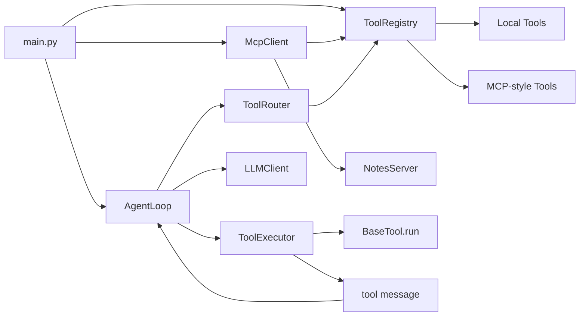

# Week 4 学习指南：Tool Registry、Tool Routing 与 MCP 接入

> 本文档讲解 `Phase 2/week4` 项目如何在 Week 3 的 Minimal Agent 基础上，把“固定工具列表”升级为“可扩展的工具编排层”。重点不在 memory 和 planning，而在 Tool Registry、Tool Router、Tool Executor，以及一个轻量 MCP 风格接入示例。

---

## 目录

1. [项目定位](#1-项目定位)
2. [Week 3 → Week 4：演进总览](#2-week-3--week-4演进总览)
3. [Week 4 学习主题与检查点](#3-week-4-学习主题与检查点)
4. [总架构图](#4-总架构图)
5. [逐模块精讲](#5-逐模块精讲)
   - [5.1 Tool 基类升级 `tools/base.py`](#51-tool-基类升级-toolsbasepy)
   - [5.2 Tool Registry `tools/registry.py`](#52-tool-registry-toolsregistrypy)
   - [5.3 Tool Router `tools/router.py`](#53-tool-router-toolsrouterpy)
   - [5.4 Tool Executor `tools/executor.py`](#54-tool-executor-toolsexecutorpy)
   - [5.5 MCP 风格接入 `mcp_integration/`](#55-mcp-风格接入-mcp_integration)
   - [5.6 Agent Loop 如何消费工具编排层](#56-agent-loop-如何消费工具编排层)
   - [5.7 程序入口与 Demo](#57-程序入口与-demo)
6. [关键设计决策](#6-关键设计决策)
7. [完整数据流：一次 Week 4 执行会发生什么](#7-完整数据流一次-week-4-执行会发生什么)
8. [Week 3 vs Week 4 对比表](#8-week-3-vs-week-4-对比表)
9. [动手实践建议](#9-动手实践建议)
10. [常见误区](#10-常见误区)
11. [与后续 Week 的关联](#11-与后续-week-的关联)

---

## 1. 项目定位

Week 4 是 Phase 2 的起点。它承接 Week 3 已经具备的配置加载、日志和流式输出能力，但这周的主线已经不是“把 loop 工程化”，而是把 agent 的工具系统抽象成一层独立的 **Tool Orchestration Layer**。

这周的核心问题是：当工具数量开始增长时，如何避免“所有工具硬编码塞给模型”这种方式失控。

| 维度 | Week 3 状态 | Week 4 目标 |
|------|-------------|-------------|
| Tool 管理 | `list[BaseTool]` 硬编码传入 loop | 用 `ToolRegistry` 统一注册、注销、查询、搜索 |
| Tool 选择 | 模型直接面对全部工具 | 用 `ToolRouter` 先缩小候选集，再让模型选择 |
| Tool 执行 | loop 内直接执行 | 抽出 `ToolExecutor` 统一处理执行结果和错误 |
| 外部工具接入 | 只有本地 tools | 通过 `McpClient` 自动把外部能力注册进 registry |

一句话概括：Week 3 解决“agent 能稳定跑”，Week 4 开始解决“agent 的工具层能扩展”。

---

## 2. Week 3 → Week 4：演进总览

```text
Week 3                                      Week 4
═══════                                      ═══════
tools = [Calculator(), Weather(), ...]  ──→  registry = ToolRegistry(...)
LLM 面对全部工具                         ──→  router.select_for_task() 先筛选候选工具
loop 直接执行 tool.run()                ──→  executor.execute() 统一执行与错误归一化
只有本地工具                             ──→  McpClient.register_tools() 接入外部工具
工具只有 name/description/schema         ──→  增加 category/permission_level/tags
```

Week 4 刻意保持不变的部分：

- ReAct 风格主循环仍然存在
- LLM response parser 仍然负责把 assistant message 解析成 `tool_call` 或 `final_answer`
- Agent 的终止条件仍然是 `max_steps` 和 `max_time_seconds`
- 这周暂时不引入 memory、context budget、planner

这样做的目的是把学习焦点限制在“工具编排”这一个主题上，不把 Phase 2 其他模块混在一起。

---

## 3. Week 4 学习主题与检查点

| 维度 | 内容 |
|------|------|
| 学习主题 | Tool Registry 设计、Tool Routing 策略、MCP 基础接入 |
| 输入材料 | ① MCP Introduction 与 Architecture 文档 ② MCP Python SDK 文档 ③ SWE-agent 的 tool 定义方式 ④ 官方 MCP reference servers |
| 实践任务 | ① 升级 `BaseTool` 元数据 ② 实现 registry ③ 实现混合路由 ④ 实现统一 executor ⑤ 接入一个本地 MCP 风格 server |
| 预期产出 | ✅ 动态工具注册系统 ✅ 工具候选筛选逻辑 ✅ MCP 工具自动注册 ✅ loop 不再依赖硬编码工具列表 |

本周建议重点验证以下检查点：

- □ Tool registry 能动态注册和注销工具
- □ 注册时会做 schema 合法性检查
- □ Tool router 能把 15+ 个工具缩小到一个合理候选集
- □ MCP client 能发现 server 暴露的工具，并注册到 registry
- □ Agent loop 能在本地 tool 与 MCP tool 之间统一处理

### 必须掌握

- 为什么 registry 只负责“管理和发现”，不负责执行重试
- 为什么 router 要先做规则预筛选，而不是把所有工具直接交给模型
- 为什么 executor 要把成功结果和错误结果都归一化为 observation
- MCP 在本周的最低掌握范围：tool listing + tool calling

### 了解即可

- 更复杂的 tool ranking 策略，例如 embedding 检索或学习型路由
- 真正的 MCP transport，如 stdio 和 SSE
- registry 的版本管理、权限系统、依赖管理

### 这周不展开

- Memory 分层
- Context Window 管理
- Planning / Re-planning
- Retry / Fallback / Circuit Breaker

---

## 4. 总架构图

### 目录结构视角

```text
week4/
├── main.py
├── README.md
├── config.yaml
├── data/
│   ├── sample_note.txt
│   └── notes/
│       └── phase2.md
├── docs/
│   ├── architecture.md
│   ├── execution_loop.md
│   ├── harness_components.md
│   ├── mcp_notes.md
│   ├── tool_orchestration.md
│   └── learning_guide.md
└── minimal_agent/
    ├── agent/
    │   └── loop.py
    ├── mcp_integration/
    │   ├── client.py
    │   └── servers/
    │       └── notes_server.py
    └── tools/
        ├── __init__.py
        ├── base.py
        ├── executor.py
        ├── registry.py
        └── router.py
```

### 模块依赖关系图



这里最关键的变化不是多了多少文件，而是出现了一条清晰的责任链：

`AgentLoop → ToolRouter → ToolRegistry → ToolExecutor → Observation`

Loop 不再自己决定工具管理策略，也不再自己承担执行细节。

---

## 5. 逐模块精讲

### 5.1 Tool 基类升级 `tools/base.py`

**文件**：`minimal_agent/tools/base.py`

Week 4 的 `BaseTool` 仍然是所有工具的统一抽象，但它不再只提供 `name`、`description` 和 `args_model`，还增加了三类元数据：

- `category`：工具所属分类，例如 `math`、`weather`、`file`
- `permission_level`：工具权限级别，例如 `safe`、`external`
- `tags`：更细粒度的能力标签，供搜索和路由使用

核心接口如下：

```python
class BaseTool(ABC):
    name: str
    description: str
    args_model: type[BaseModel]
    category: str = "general"
    permission_level: str = "safe"
    tags: tuple[str, ...] = ()
```

这里有两个 Week 4 非常关键的方法：

1. `to_openai_tool()`
   - 从 Pydantic `args_model` 生成 OpenAI function calling 所需的 JSON Schema
   - 强制加上 `additionalProperties = False`
   - 目的不是做本地校验，而是把“正确的工具 schema”暴露给模型

2. `validate_schema()`
   - 在工具注册时提前验证 schema 是否是合法 JSON object
   - 如果 schema 结构不对，就在 `register()` 阶段直接拒绝

这体现了一个很重要的工程原则：**错误越早暴露越便宜**。

### 5.2 Tool Registry `tools/registry.py`

**文件**：`minimal_agent/tools/registry.py`

`ToolRegistry` 是 Week 4 的核心数据结构。它把工具管理问题从 loop 里抽了出来，形成一个独立运行时组件。

#### registry 提供的 5 个核心能力

| 方法                     | 作用                    |
| ---------------------- | --------------------- |
| `register(tool)`       | 注册工具，并在写入前做 schema 校验 |
| `unregister(name)`     | 移除一个已注册工具             |
| `get(name)`            | 按名称获取工具               |
| `list_all()`           | 返回全部工具实例              |
| `search(query, limit)` | 按名称、描述、分类、标签做简单关键词检索  |


此外还有一个非常适合 UI、日志和调试的接口：

- `list_info()`：把工具实例投影为轻量 `ToolInfo`，便于展示工具清单

#### 为什么 registry 只做“存”和“找”

`ToolRegistry` 不负责：

- 重试
- 执行
- 权限拦截
- 错误恢复

它只负责一件事：**维护一个合法、可查询、可枚举的工具集合**。

这意味着 registry 的角色非常像运行时“工具目录”。它不决定如何执行，也不决定应该选哪一个。

#### search 的实现思路

当前实现是一个非常轻量的关键词匹配：

- 把查询拆成词项 `terms`
- 把每个工具的 `name + description + category + tags` 拼成 `haystack`
- 统计匹配词数作为分数
- 按分数降序返回前 `limit` 个

这是一个教学上合适的第一版，因为它足够简单，也足够展示“工具发现”这个抽象的价值。

### 5.3 Tool Router `tools/router.py`

**文件**：`minimal_agent/tools/router.py`

`ToolRouter` 实现了本周最重要的策略：**混合路由**。

它的逻辑不是“直接帮模型选定工具”，而是先把候选集缩小，再让模型在更小的集合里做 function calling。

#### 第一步：规则预筛选

`select_for_task(text)` 会先扫描用户输入里的关键词：

- 涉及 `calculate / 计算 / math / + - * /` → 分类 `math`
- 涉及 `weather / 天气` → 分类 `weather`
- 涉及 `file / 文件 / read / 读取` → 分类 `file`
- 涉及 `search / 研究 / web / 搜索` → 分类 `web`
- 涉及 `shell / command / 命令` → 分类 `shell`

如果识别出了分类，router 就只保留这些分类相关的工具，并记录原因：

```text
reason = "rule categories=['file']"
```

#### 第二步：无规则命中时退回搜索

如果没有明显分类线索，router 就调用 registry 的 `search()` 做关键词召回：

```text
reason = "keyword search"
```

#### 第三步：兜底为全部工具

如果连搜索都没有召回结果，就回退为全部工具：

```text
reason = "fallback all tools"
```

#### `resolve_requested_tool()` 的作用

当模型真正返回一个 `tool_call` 时，router 还会再做一次解析：

- 先在候选集里找同名工具
- 如果候选集里没有，再去 registry 全局查找

这相当于给 function call 提供了一层柔性容错。

### 5.4 Tool Executor `tools/executor.py`

**文件**：`minimal_agent/tools/executor.py`

`ToolExecutor` 解决的是一个常被初学者忽视的问题：工具执行结果不应该直接裸露给 loop。

Week 4 的做法是把执行结果统一封装为 `ToolExecutionResult`：

| 字段 | 含义 |
|------|------|
| `ok` | 是否执行成功 |
| `tool_name` | 实际执行的工具名 |
| `content` | 结果文本或错误文本 |
| `error` | 错误详情，成功时为空 |

`execute(tool, raw_args, requested_name)` 的逻辑也非常清晰：

1. 如果 `tool is None`，直接返回统一的 unknown tool 错误
2. 如果有 tool，就调用 `tool.run(raw_args)`
3. 如果执行异常，捕获异常并转成失败 observation

这一步的重点不是“隐藏错误”，而是把错误变成模型下一步可消费的上下文。对 agent 而言，工具失败也是 observation。

### 5.5 MCP 风格接入 `mcp_integration/`

**文件**：`minimal_agent/mcp_integration/client.py` 与 `minimal_agent/mcp_integration/servers/notes_server.py`

Week 4 没有直接接入完整 MCP SDK，而是实现了一个 **MCP-shaped** 的学习版本。这样可以先学清“发现工具、注册工具、调用工具”的核心流程，再进入更复杂的 transport 和协议细节。

#### `NotesServer`

`NotesServer` 暴露一个很小的能力面：

- `list`：列出 notes 目录下的 Markdown 文件
- `read`：读取指定 note
- `write`：写入指定 note

它通过 `list_tools()` 暴露一份工具清单，通过 `call_tool(operation, payload)` 响应调用。

#### `McpClient`

`McpClient` 提供两个关键动作：

1. `list_tools()`
   - 读取 server 暴露的工具定义

2. `register_tools(registry)`
   - 把 server 工具包装成 `LocalMcpTool`
   - 自动注册到 `ToolRegistry`

注册后，这个工具会带有：

- `category = "mcp"`
- `permission_level = "external"`
- `tags = ("mcp", info["name"])`

这意味着从 agent 视角看，MCP 工具和本地工具已经进入同一套统一抽象。loop 不需要区分“它是本地 tool 还是 server tool”。

#### `LocalMcpTool` 的意义

`LocalMcpTool` 继承 `BaseTool`，但它的执行逻辑不是直接完成业务，而是转发给 server：

```python
def execute(self, args: McpToolArgs) -> str:
    return self.server.call_tool(args.operation, args.payload)
```

这就是 Week 4 的关键收获之一：**外部能力只要能被包装成统一 tool interface，就能并入 agent 的执行循环。**

### 5.6 Agent Loop 如何消费工具编排层

**文件**：`minimal_agent/agent/loop.py`

Week 4 的 loop 核心变化不在“while 循环怎么写”，而在 loop 已经开始依赖抽象层，而不是依赖具体工具集合。

#### 初始化阶段

```python
self._registry = registry or ToolRegistry(tools or [])
self._router = ToolRouter(self._registry)
self._executor = ToolExecutor()
```

这说明：

- loop 只需要一个 registry
- router 和 executor 围绕 registry 运行
- 如果没有显式传 registry，仍然兼容直接传工具列表

#### 每一步执行的关键变化

在 `run()` 中，Week 4 每一步的核心流程已经变成：

1. `route_decision = self._router.select_for_task(...)`
2. `llm_response = self._call_llm_with_retry(..., route_decision.selected_tools)`
3. 模型只看到候选工具，而不是所有工具
4. 如果返回 tool calls，交给 `_handle_tool_calls()`
5. `_handle_tool_calls()` 通过 router 解析目标工具，再通过 executor 执行
6. 执行结果被编码为 `role = tool` 的 observation message，追加回 `state.messages`

换句话说，Week 4 的 loop 只是 orchestration flow 的总调度者，而不再自己承担每一个细节职责。

### 5.7 程序入口与 Demo

**文件**：`main.py`

Week 4 提供了 5 个 demo：

| Demo | 作用 |
|------|------|
| `math` | 验证 calculator 工具路由与调用 |
| `weather` | 验证 weather 工具调用 |
| `file` | 验证 file_reader 工具调用 |
| `stream` | 保留 Week 3 的流式输出演示 |
| `mcp_notes` | 验证 `NotesServer → McpClient → ToolRegistry → AgentLoop` 这条链路 |

运行方式：

```bash
python "Phase 2/week4/main.py" math
python "Phase 2/week4/main.py" weather
python "Phase 2/week4/main.py" file
python "Phase 2/week4/main.py" stream
python "Phase 2/week4/main.py" mcp_notes
```

其中 `mcp_notes` 是最能体现 Week 4 新能力的 demo，因为它证明了外部风格的工具可以被自动注册并参与 agent 执行。

---

## 6. 关键设计决策

### 决策 1：用 registry 替代硬编码工具列表

原因：工具数量一多，硬编码列表难以维护，也无法支持运行时动态注册。

结果：工具管理从 loop 中解耦出来，后续接入 MCP tool、权限系统、统计信息都更自然。

### 决策 2：用混合路由，而不是把全部工具直接发给模型

原因：模型面对过多 tool schema 时，选错工具的概率会上升。

结果：先用规则缩小范围，再让模型在子集里做 function calling，兼顾准确率与灵活性。

### 决策 3：把执行封装成 executor

原因：如果 loop 直接执行业务逻辑，就会把“工具管理”和“工具运行结果处理”耦合在一起。

结果：无论成功还是失败，都会产出统一 observation payload，便于模型继续推理。

### 决策 4：MCP 先学核心流程，不先追完整协议

原因：完整 MCP spec 涉及 transport、stateful session、resources、prompts，直接全上会把学习重心打散。

结果：Week 4 先掌握 list tools 与 call tool 两个核心动作，足够为后续正式 MCP 接入打基础。

---

## 7. 完整数据流：一次 Week 4 执行会发生什么

下面以 `mcp_notes` demo 为例说明完整控制流。

```text
用户 prompt
  ↓
AgentLoop.run()
  ↓
ToolRouter.select_for_task() 根据用户文本缩小候选工具集
  ↓
LLMClient.chat(messages, tools=candidate_tools)
  ↓
模型返回 tool_call，例如 mcp_notes
  ↓
ToolRouter.resolve_requested_tool() 解析出目标工具实例
  ↓
ToolExecutor.execute(tool, args, requested_name)
  ↓
LocalMcpTool.execute()
  ↓
NotesServer.call_tool(operation, payload)
  ↓
返回结果并封装为 ToolExecutionResult
  ↓
loop 把结果追加为 role=tool 的 observation message
  ↓
模型继续下一步，直到给出 final answer
```

这里最值得注意的是：

- 模型看到的是“候选工具集”，而不是“全量工具全集”
- loop 处理的是统一抽象，不必关心实际工具来自哪里
- tool 的成功和失败都会回流到对话上下文里

这三点组合起来，才构成 Week 4 所说的 tool orchestration。

---

## 8. Week 3 vs Week 4 对比表

| 维度 | Week 3 | Week 4 |
|------|--------|--------|
| 项目主线 | 配置、日志、流式输出 | 工具编排层抽象 |
| Tool 组织方式 | 本地 list | Registry |
| Tool 选择方式 | 全量直接给模型 | Router 先筛选 |
| Tool 执行 | loop 内直接处理 | Executor 统一处理 |
| 外部能力接入 | 无 | MCP 风格 server 接入 |
| 元数据 | 基础 schema | category + permission + tags |
| loop 的角色 | 既管流程也管细节 | 更偏 orchestration coordinator |

如果 Week 3 的关键词是“工程化基础设施”，那 Week 4 的关键词就是“工具系统抽象”。

---

## 9. 动手实践建议

### 建议阅读顺序

1. 先读 `README.md`，了解 week4 做了什么
2. 再读本文档，建立模块关系图
3. 然后按下面顺序追代码：
   - `minimal_agent/tools/base.py`
   - `minimal_agent/tools/registry.py`
   - `minimal_agent/tools/router.py`
   - `minimal_agent/tools/executor.py`
   - `minimal_agent/mcp_integration/client.py`
   - `minimal_agent/mcp_integration/servers/notes_server.py`
   - `minimal_agent/agent/loop.py`

### 建议运行顺序

1. 先跑 `math`，验证基础 registry + router + executor 链路
2. 再跑 `file`，观察分类路由如何缩小候选工具集
3. 最后跑 `mcp_notes`，验证外部风格工具接入是否成立

### 建议自己动手改的三个点

1. 给现有某个 tool 新增 `tags`，观察 `search()` 的召回变化
2. 在 `ToolRouter` 中增加一条新分类规则，例如 `note` 或 `markdown`
3. 在 `NotesServer` 中新增一个操作，例如 `delete`，再通过 `McpClient` 暴露给 agent

---

## 10. 常见误区

### 误区 1：把 registry 写成“万能工具中心”

错误方向：在 registry 中混入重试、权限判断、执行日志、错误恢复。

更合理的做法：registry 只负责注册、注销、发现、展示。

### 误区 2：router 直接替模型做最终决策

错误方向：router 用一堆 if/else 直接确定唯一工具。

更合理的做法：router 优先做候选集缩小，把最终 tool call 留给模型完成。

### 误区 3：工具失败就中断 loop

错误方向：某个 tool 抛错后直接让 agent 整体崩掉。

更合理的做法：把失败也包装成 observation，让模型有机会纠正参数或换工具。

### 误区 4：把这个 week 的 MCP 示例当成完整协议实现

错误方向：以为当前实现已经覆盖了 MCP 的 server/client/transport 全部特性。

更合理的理解：本项目只是用一个最小可运行模型，帮助你先吃透“工具发现 + 工具调用”的主流程。

---

## 11. 与后续 Week 的关联

Week 4 的输出，会直接成为后续模块的基础设施：

- Week 5 的 memory 系统，需要知道哪些工具结果应该进入长期存储
- Week 5 的 context manager，需要决定哪些工具描述应该放进当前上下文
- Week 6 的 planner，需要根据任务阶段影响 router 提供的候选工具集
- 更后面的 reliability 机制，也会依赖 executor 这一层插入 retry、fallback、观测点

所以 Week 4 虽然表面只是在“整理工具层”，但实际上它是在给后续的 memory、planning、reliability 留扩展接口。

如果你学完这周之后，能清楚回答下面三个问题，就说明已经抓住主线：

1. 为什么不能一直把所有工具硬编码进 loop？
2. 为什么 router 的价值是缩小候选集，而不是代替模型？
3. 为什么外部能力只要包装成统一 tool interface，就能进入同一条 agent 执行链？

---

## 延伸阅读

- `docs/tool_orchestration.md`：查看更短的工具编排总览图
- `docs/mcp_notes.md`：查看 notes server 的配套说明
- `docs/execution_loop.md`：对照 loop 在 week4 里的执行方式
- `docs/harness_components.md`：从组件视角看 harness 拆分

读完本文档之后，最推荐的下一步不是继续看概念，而是直接跑一次 `mcp_notes` demo，然后从 `main.py` 单步追到 `NotesServer.call_tool()`。