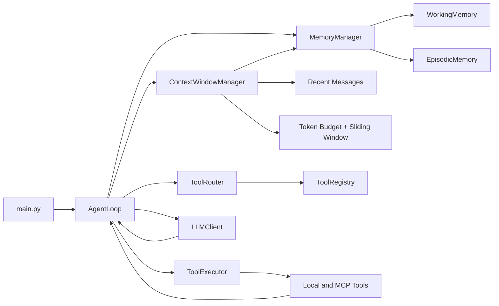

# Week 5 学习指南：Memory Layer 与 Context Window Management

> 本文档讲解 `Phase 2/week5` 项目如何在 Week 4 的 Tool Orchestration 基础上，引入一层最小可用的 memory system，以及一次 LLM 调用前的 context assembly 过程。重点不在 planning，也不在复杂检索，而在 **Working Memory、Episodic Memory、Memory Manager、Context Window Manager** 这四个抽象如何接入 agent loop。

---

## 目录

1. [项目定位](#1-项目定位)
2. [Week 4 → Week 5：演进总览](#2-week-4--week-5演进总览)
3. [Week 5 学习主题与检查点](#3-week-5-学习主题与检查点)
4. [总架构图](#4-总架构图)
5. [逐模块精讲](#5-逐模块精讲)
   - [5.1 Working Memory `memory/working.py`](#51-working-memory-memoryworkingpy)
   - [5.2 Episodic Memory `memory/episodic.py`](#52-episodic-memory-memoryepisodicpy)
   - [5.3 Memory Manager `memory/manager.py`](#53-memory-manager-memorymanagerpy)
   - [5.4 Context Window Manager `context/manager.py`](#54-context-window-manager-contextmanagerpy)
   - [5.5 Agent Loop 如何接入 Memory 与 Context](#55-agent-loop-如何接入-memory-与-context)
   - [5.6 程序入口与 Demo](#56-程序入口与-demo)
6. [关键设计决策](#6-关键设计决策)
7. [完整数据流：一次 Week 5 执行会发生什么](#7-完整数据流一次-week-5-执行会发生什么)
8. [Week 4 vs Week 5 对比表](#8-week-4-vs-week-5-对比表)
9. [动手实践建议](#9-动手实践建议)
10. [常见误区](#10-常见误区)
11. [与后续 Week 的关联](#11-与后续-week-的关联)

---

## 1. 项目定位

Week 5 承接 Week 4 已经完成的 Tool Registry、Tool Router、Tool Executor 和 MCP 风格工具接入，但这周的主线开始从“工具怎么管理”转向“上下文怎么控制”。

这周的核心问题是：当 agent 开始进入多步执行后，如何避免每次都把“完整原始历史”无脑发给模型，同时又能保留对当前任务真正有用的信息。

| 维度 | Week 4 状态 | Week 5 目标 |
|------|-------------|-------------|
| 工具系统 | 已具备 registry / router / executor | 保持不变，作为 memory 写入来源 |
| 历史消息 | 主要依赖 `state.messages` 原始堆积 | 引入 context assembly，对消息做裁剪 |
| 短期状态 | 只存在于 loop 局部执行流 | 抽象成 `WorkingMemory` |
| 跨轮次经验 | 没有持久化记忆 | 引入 `EpisodicMemory` 持久保存高价值结果 |
| LLM 输入构造 | system + history 直接传给模型 | 用 `ContextWindowManager.assemble()` 统一组装 |

一句话概括：Week 4 解决“工具层能扩展”，Week 5 开始解决“上下文层能控制”。

---

## 2. Week 4 → Week 5：演进总览

```text
Week 4                                        Week 5
═══════                                        ═══════
工具编排层完成                             ──→  工具编排层保持不变，作为 memory 写入事件源
messages 主要原样传给模型                  ──→  ContextWindowManager 先做上下文组装
运行中状态分散在 loop 内                   ──→  抽出 WorkingMemory 表达当前任务状态
没有跨运行记忆                             ──→  EpisodicMemory 持久化高价值记录
只有工具调用结果回到 messages              ──→  工具结果同时进入 working + episodic memory
```

Week 5 刻意保持不变的部分：

- ReAct 风格主循环仍然存在
- Tool Router 仍然先筛选候选工具，再交给模型做 function calling
- Tool Executor 仍然负责统一执行结果和错误归一化
- MCP 风格工具接入仍然可以和本地工具并列工作

这样做的目的，是把这周的学习焦点限制在“memory + context window”这一条新链路上，而不是再去改动工具系统本身。

---

## 3. Week 5 学习主题与检查点

| 维度 | 内容 |
|------|------|
| 学习主题 | Working Memory、Episodic Memory、Context Assembly、Context Trimming |
| 输入材料 | ① memory system 基础概念 ② context window 管理策略 ③ agent loop 中的 state vs memory 分层 ④ 长上下文应用的最小可行做法 |
| 实践任务 | ① 引入 working memory ② 引入 persistent episodic memory ③ 实现 memory manager ④ 在 LLM 调用前组装上下文 ⑤ 给消息增加 budget trimming |
| 预期产出 | ✅ 统一 memory 读写入口 ✅ 当前任务短期记忆 ✅ 跨运行记忆持久化 ✅ 受控的上下文窗口拼装流程 |

本周建议重点验证以下检查点：

- □ Agent 在每次 LLM 调用前都会先组装 context，而不是直接发送原始消息
- □ 当前任务中的工具结果能进入 `WorkingMemory`
- □ 高价值结果能写入 `EpisodicMemory`
- □ `MemoryManager` 能统一完成写入策略与检索入口
- □ 上下文超预算时，会优先保留 system prompt 和 memory context

### 必须掌握

- 为什么 working memory 和 episodic memory 要分层
- 为什么 memory manager 不直接负责 token budget
- 为什么 context manager 先做“注入有用上下文”，再做“裁剪无关历史”
- 为什么本周用 JSON + 近似 token counting 也足够表达架构意图

### 了解即可

- 向量数据库检索，例如 ChromaDB 或 pgvector
- 更精确的 tokenizer，例如 `tiktoken`
- 更复杂的 memory write policy，例如 salience scoring、reflection、summary memory

### 这周不展开

- Planner / Re-planner
- 多 agent 间共享 memory
- 长期知识库构建
- Memory compaction / summarization pipeline

---

## 4. 总架构图

### 目录结构视角

```text
week5/
├── main.py
├── README.md
├── config.yaml
├── data/
│   ├── sample_note.txt
│   ├── notes/
│   └── memory/
│       └── episodic_memory.json
├── docs/
│   ├── architecture.md
│   ├── context_window.md
│   ├── execution_loop.md
│   ├── harness_components.md
│   ├── memory_architecture.md
│   └── learning_guide.md
└── minimal_agent/
    ├── agent/
    │   └── loop.py
    ├── context/
    │   └── manager.py
    ├── memory/
    │   ├── episodic.py
    │   ├── manager.py
    │   └── working.py
    ├── mcp_integration/
    └── tools/
```

### 模块依赖关系图



这里最关键的变化，是 Week 5 新增了一条上下文控制链：

`AgentLoop → MemoryManager → ContextWindowManager → LLMClient`

从这周开始，LLM 不再直接消费“完整原始运行历史”，而是消费“经过记忆注入和预算裁剪后的上下文”。

---

## 5. 逐模块精讲

### 5.1 Working Memory `memory/working.py`

**文件**：`minimal_agent/memory/working.py`

`WorkingMemory` 表示当前这一次任务执行期间的短期状态。它不追求跨运行持久化，而是为当前 loop 提供一块结构化的临时记忆。

核心字段如下：

```python
@dataclass(slots=True)
class WorkingMemory:
    task: str
    variables: dict[str, Any] = field(default_factory=dict)
    tool_results: list[dict[str, Any]] = field(default_factory=list)
```

目前这份实现重点关注两类信息：

- `task`：当前用户任务描述
- `tool_results`：当前运行过程中的最近工具结果

最关键的方法有两个：

1. `remember_tool_result()`
   - 在每次工具调用后把结果记进 working memory
   - 这让“当前任务做过什么”不再只散落在 messages 里

2. `to_context_text()`
   - 把 working memory 转成适合注入 system context 的文本
   - 当前会输出任务、变量，以及最近最多 5 条工具结果

这里最重要的认识是：**working memory 不是历史归档，而是当前任务的结构化运行态。**

### 5.2 Episodic Memory `memory/episodic.py`

**文件**：`minimal_agent/memory/episodic.py`

`EpisodicMemory` 是 Week 5 的持久化记忆层。它使用 JSON 文件存储 `MemoryRecord`，用一个非常轻量的检索策略来模拟“长期记忆”。

核心数据结构：

```python
@dataclass(slots=True)
class MemoryRecord:
    text: str
    task: str
    timestamp: float
    importance: int = 1
```

这里记录了四类信息：

- `text`：实际记忆内容
- `task`：该记忆来自哪个任务
- `timestamp`：写入时间，用于 recency 排序
- `importance`：重要性评分，用于简单加权

#### search 的实现思路

当前 `search(query, limit)` 的 scoring 很简单，但教学意义很强：

- `relevance`：统计 query 词项在 `task + text` 中的匹配数
- `importance`：越重要的记录，基础分越高
- `recency`：越新的记录，分数略高

最后总分近似为：

$$
score \approx relevance \times 10 + importance + recency
$$

这不是工业级检索方案，但它足够表达一个关键工程点：**memory 的第一步不是向量库，而是先明确“写什么、怎么取、什么时候注入”。**

### 5.3 Memory Manager `memory/manager.py`

**文件**：`minimal_agent/memory/manager.py`

`MemoryManager` 是 Week 5 的协调层。它本身不存储内容，而是把 working memory 和 episodic memory 组合成统一接口。

它的职责主要有三类：

| 方法 | 作用 |
|------|------|
| `for_task(task, storage_dir)` | 为当前任务创建 working + episodic memory 组合 |
| `remember_tool_result(...)` | 同步写入 working memory，并按策略选择是否写入 episodic memory |
| `remember_final_answer(answer)` | 将最终答案作为高重要性记录持久化 |
| `retrieve(query, limit)` | 为 context manager 提供统一检索入口 |

最值得注意的是写入策略：

- 所有工具结果都会写入 `working memory`
- 只有成功结果，并且工具名属于 `read_file`、`search_web_mock`、`mcp_notes` 时，才会进入 `episodic memory`
- 最终答案会以更高 `importance=3` 写入 episodic memory

这体现了一个非常重要的分工原则：**memory manager 决定“哪些事件值得记住”，而不是 context manager 决定。**

### 5.4 Context Window Manager `context/manager.py`

**文件**：`minimal_agent/context/manager.py`

`ContextWindowManager` 是 Week 5 新增的另一条核心主线。它负责把“原始消息 + memory 检索结果”变成一次真正送给 LLM 的消息列表。

它当前实现了三条策略：

1. **Memory Injection**
   - 用 `_memory_context()` 生成一段上下文说明文本
   - 包括 working memory，以及按 query 检索出来的 episodic memory 记录

2. **Sliding Window**
   - 只保留最近 `recent_message_limit` 条非 system 消息
   - 避免对旧消息无限堆积

3. **Budget Trimming**
   - 用 `count_tokens()` 做近似 token 统计
   - 如果超预算，就从较旧消息开始删除

`assemble()` 的控制流程可以概括为：

```text
取 primary system prompt
→ 取最近 N 条非 system 消息
→ 生成 memory context
→ 把 memory context 注入 system message
→ 对最终消息列表做 budget trimming
```

这里最关键的设计不是“计算 token 多精确”，而是顺序：

- 先保 system prompt
- 再保 memory context
- 再保最近消息
- 最后裁掉更旧的历史

这正是小型 agent harness 开始具备“上下文治理能力”的标志。

### 5.5 Agent Loop 如何接入 Memory 与 Context

**文件**：`minimal_agent/agent/loop.py`

Week 5 的 `AgentLoop` 延续了 Week 4 的执行框架，但在两个关键位置接入了 memory 与 context。

#### 接入点 1：任务开始时创建 memory manager

```python
memory = MemoryManager.for_task(
    task=user_input,
    storage_dir=self._config.storage_dir,
)
```

这表示 memory 生命周期以“单次任务”为入口，但 episodic storage 可以跨任务持久化。

#### 接入点 2：每次 LLM 调用前先 assemble context

```python
context_messages = self._context_manager.assemble(
    messages=state.messages,
    memory=memory,
    query=self._latest_user_text(state),
)
```

从这一步开始，真正传给 LLM 的已经不是 `state.messages` 本身，而是裁剪和增强后的 `context_messages`。

#### 接入点 3：工具结果与最终答案写入 memory

在 `_handle_tool_calls()` 里：

- 工具执行结果进入 `memory.remember_tool_result(...)`

在 `FINAL_ANSWER` 分支里：

- 最终答案进入 `memory.remember_final_answer(...)`

这意味着 Week 5 的 loop 同时承担两条数据回路：

- 执行回路：调用 LLM、执行工具、追加 messages
- 记忆回路：将高价值结果沉淀到 memory system

### 5.6 程序入口与 Demo

**文件**：`main.py`

Week 5 的 `main.py` 延续 Week 4 的 demo 组织方式，但多了两个值得特别关注的点：

1. 普通 demo 通过 `AgentLoop` 执行，因此会完整经过 memory + context 管线
2. `stream` demo 直接调用 `LLMClient.stream_chat()`，主要用于展示流式输出，不经过完整 agent loop

这说明一个实践上很重要的区分：

- 不是所有 LLM 调用都一定需要完整 harness
- 但只要进入 agent loop，多步任务就应该经过统一的 context assembly

---

## 6. 关键设计决策

### 决策 1：先用 JSON 实现 episodic memory，而不是直接接向量库

原因不是因为 JSON 更强，而是因为这一周的目标是先学清楚 memory 的抽象边界。

如果一开始就把注意力放到数据库、embedding、召回质量，很容易忽略真正重要的问题：

- 什么信息值得写入 memory
- 由谁决定写入策略
- 检索结果以什么形式进入 prompt

### 决策 2：working memory 与 episodic memory 分层

如果把当前任务状态和长期记忆混在一个容器里，会立刻出现两个问题：

- 生命周期不同，当前任务状态不该长期保存
- 检索目标不同，短期状态通常直接展开即可，不需要搜索

因此 Week 5 明确区分：

- `WorkingMemory`：当前任务临时态
- `EpisodicMemory`：跨运行持久态

### 决策 3：context manager 只负责“组装与裁剪”，不负责定义写入策略

这能避免职责混乱。

- 写什么，属于 `MemoryManager`
- 怎么注入和裁剪，属于 `ContextWindowManager`

两者分开后，未来替换 memory backend 或替换 trimming policy 都会更容易。

### 决策 4：token counting 使用近似值

Week 5 的 `len(content) // 4` 是有意为之。它不是为了精准计费，而是为了先建立 context budget 这个架构概念。

教学阶段先把抽象跑通，比过早追求 tokenizer 精度更重要。

---

## 7. 完整数据流：一次 Week 5 执行会发生什么

下面用一次 `file` 或 `mcp_notes` demo 来看完整链路：

1. `main.py` 创建 `AgentLoop`，并注册本地工具与 MCP 工具
2. `AgentLoop.run()` 初始化 `state.messages`
3. 同时调用 `MemoryManager.for_task(...)` 创建本次任务的 memory 视图
4. 每轮循环里，`ToolRouter` 先选出候选工具
5. `ContextWindowManager.assemble()` 根据当前消息和 memory 组装 LLM 输入
6. `LLMClient.chat()` 基于裁剪后的上下文做推理
7. 如果模型发出 tool call，`ToolExecutor` 执行工具
8. 工具结果一方面写回 `state.messages`，另一方面写入 `MemoryManager`
9. `MemoryManager` 把结果写入 working memory，并按策略选择是否沉淀到 episodic memory
10. 下一轮 LLM 调用前，context manager 又会重新检索并注入相关 memory
11. 当模型返回 final answer 后，最终答案再被写入 episodic memory
12. loop 结束，返回用户可见结果

这条链路最值得记住的一点是：**Week 5 的 memory 不是执行结束后才看的日志，而是执行过程中不断参与下一次推理的上下文来源。**

---

## 8. Week 4 vs Week 5 对比表

| 维度 | Week 4 | Week 5 |
|------|--------|--------|
| 主题主线 | Tool Orchestration | Memory + Context Window |
| 新增核心模块 | Registry / Router / Executor / MCP Client | Working / Episodic / MemoryManager / ContextWindowManager |
| 主要控制问题 | 哪些工具可用、如何缩小候选集 | 哪些上下文该保留、如何裁剪历史 |
| LLM 输入 | 最近历史 + 候选工具 | 裁剪后的消息 + memory 注入 + 候选工具 |
| 状态沉淀 | 主要依赖 messages | 额外沉淀到 memory system |
| 工程收益 | 工具层可扩展 | 长对话和多步任务更可控 |

可以把两周连起来理解：

- Week 4 管理“能力入口”
- Week 5 管理“推理输入”

---

## 9. 动手实践建议

如果你想把 Week 5 真正学透，建议按下面顺序做实验：

1. 跑一次 `math` demo，观察没有太多 memory 写入时的行为
2. 跑一次 `file` demo，查看 `data/memory/episodic_memory.json` 中写入了什么
3. 连续跑多个相近任务，观察 `retrieve()` 是否能取回相关历史
4. 把 `recent_message_limit` 改小，感受上下文裁剪后 agent 的行为变化
5. 把 `remember_tool_result()` 中允许持久化的工具名单扩展，比较 memory 污染是否增加

进一步练习可以尝试：

- 给 `WorkingMemory.variables` 增加真正的中间变量写入
- 给 `EpisodicMemory.search()` 增加更明确的时间衰减权重
- 在 `ContextWindowManager` 中把 tool 消息和 user 消息做不同优先级保留

---

## 10. 常见误区

### 误区 1：把 memory 理解成“把所有历史都存下来”

不是。真正关键的是“选择性写入”和“有目的检索”。如果什么都记，最后只会让噪音越来越大。

### 误区 2：把 episodic memory 当成 working memory 的备份

两者不是主备关系，而是用途不同。

- working memory 服务当前运行
- episodic memory 服务跨运行经验复用

### 误区 3：认为 context window 管理只是 token 节省

它当然能降低 token 消耗，但更本质的价值是：**让模型只看到当前推理真正需要看到的上下文。**

### 误区 4：以为必须先接入向量库，memory 才算成立

不是。Week 5 更想让你学会的是接口边界和数据流，而不是某个具体底层实现。

---

## 11. 与后续 Week 的关联

Week 5 为后续内容打下了两个非常关键的基础：

1. **Planning 的输入基础**
   - planner 不是在真空里工作，它同样依赖受控的上下文输入

2. **更高级 memory 的抽象边界**
   - 未来无论换成 summary memory、vector memory，还是 hybrid memory，都可以继续复用 `MemoryManager` 和 `ContextWindowManager` 这类边界

如果说 Week 4 是在搭“工具骨架”，那 Week 5 就是在搭“认知输入层”。从这里开始，agent 不只是会调用工具，还开始会管理自己看到的上下文。