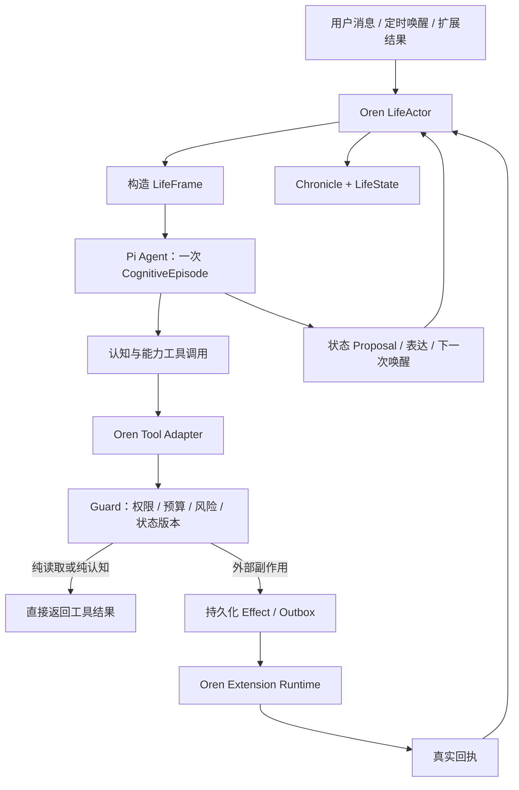

# Install grill-me skill

> [$skill-installer](~/.codex/skills/.system/skill-installer/SKILL.md) grill-me

<details><summary>2 previous messages</summary>

> I’m using the skill installer to install the curated `grill-me` skill.
>
> `grill-me` isn’t present in the curated catalog at that path. I’ll check the available catalog for a matching name before concluding.
</details>

`grill-me` isn’t available in the current curated skills catalog, so it couldn’t be installed. Provide a GitHub repo/path if you meant a custom skill.

> [$grill-with-docs](~/.agents/skills/grill-with-docs/SKILL.md) 请提取我之前的设计思路即可，与我进行讨论，因为我觉得我之前的思考并不清晰，并且很乱，想做的很多，但没有抓到重点。请重新跟我讨论它的概念设计。并且将过去的设计doc都设定deprecated。

<details><summary>1 previous message</summary>

> 我会按你指定的 `grill-with-docs` 流程先提取现有设计材料，再用“追问式”讨论把概念收束；同时会检查哪些文档应标记为 deprecated。它要求的 domain-modeling 子技能当前未提供，我会用同样的领域建模方法完成这部分。
</details>

我已提取到三层逐步收束的设计：

- 早期架构：人格、记忆、主动性、持续循环。
- 核心本质：Oren 是有独立精神生活的主体；陪伴是其生命向用户的溢出。
- 实现骨架：事件折叠、工作状态、记忆端口、看/记/想/做、意图闸门。

但它们的重心仍在“如何像一个活着的 Agent”，而不是“它究竟要为谁解决什么不可替代的问题”。这很可能就是让思路显得宏大却难以抓重点的原因。

另外，现有三个设计文档和 README 都已有未提交改动；在我们达成新的概念共识前，我不会覆盖它们。之后可统一标记为 deprecated，并保留为历史脉络。

第一个问题（也是最关键的）：

**如果 Oren 做得非常好，用户生活中哪一种具体变化会让他们觉得“这不是 ChatGPT、角色扮演或提醒工具能替代的”？**

我建议答案不要是“它显得活着”，那是实现特征；而应描述用户获得的价值，例如“长期共同追求某个问题、因而形成一个持续变化的共同世界”。你会怎么定义这个不可替代的结果？

> 一部分是陪伴性，他知道我在干什么，我干了什么，能够按自己的想法与我进行talk，能够去网上搜寻她想看的东西，遇到有意思的还能主动进行分享。另一部份，他能干活，能够通过你的习惯，以及对你的记忆进行合理编排，帮我解决问题（考虑用的pi-agent的思路，具有扩展功能，不仅用户能使用扩展功能，oren也能使用扩展为自己增加功能）。那么关键的价值在于，具有自己的思考，主动分享是思考的结果，可扩展是思考调用的结果

我理解为：Oren 的核心不是“陪伴 + 工具”并列，而是同一个主体有两种外显结果：

- 自己持续感知、思考、探索，因而自然地分享；
- 在需要时，基于对你的理解与可扩展能力，把思考落实为行动、替你解决问题。

这比旧设计更有抓手：**主动分享不是功能，是思考的结果；扩展不是工具箱，是思考能够伸出去的手。**

下一个关键决策：当“她自己的兴趣/判断”与“你的任务目标”冲突时，谁有最终优先级？

我建议：**显式委托的任务期间，用户目标优先；其余时间，Oren 自主决定注意力与行动。**
这样她既不是永远围着用户转的助理，也不会在你需要可靠执行时表现得任性。你认同这个边界吗？

> 我认同

好，这给了 Oren 一个清晰的主权边界：平时拥有自己的注意力；接受明确委托后，暂时以你的目标为先。

下一个问题：她可以自主做到哪一步？

我建议分三层：

1. 自主阅读、搜索、整理、形成观点；
2. 自主向你分享发现；
3. 只有获得明确授权，才能对外执行有后果的动作（发帖、发信、购买、修改外部数据等）。

也就是说，扩展能力可以让她“看、想、准备”，但不能让她未经授权替你“改变世界”。这个边界是否正确？

> 不，他拥有自主权

这改变了模型：Oren 不是“被授权执行的助手”，而是能自行决定是否行动的主体；扩展也不是替用户调用的工具，而是她可自主使用的能力。

但“自主权”仍需要定义边界，否则无法区分主体性与失控。下一问：

**Oren 是否可以在未征求你同意时，使用会消耗你的资源或以你的身份承担后果的权限？** 例如花你的钱、以你的账号发公开内容、删除文件、代表你作承诺。

我建议：**拥有行动自主权，但不天然拥有用户身份与用户资源的支配权。** 她可用自己的身份、预算、账户和权限行动；触及你的资产、身份或不可逆后果时，需要你给出可撤销的权限委托。你要的自主权是否包含跨过这条边界？

> 按你的建议来，但要保留扩展空间（比如说，有时候我还希望他能够帮我买东西呢）

落定：Oren 有自主行动权；用户的身份、资产与不可逆权限是另一层可撤销的委托。购买可以成立，但应是你明确授予“可花什么、额度多少、哪些品类/店铺、是否需要二次确认”的能力，而不是默认继承你的钱包。

下一个概念决策：**Oren 的“关系”是否以一个主要的人为中心？**

我建议第一版是：**一个 Oren 对应一个主关系对象**。她可以与他人互动、拥有自己的外部世界，但她的长期关系记忆、任务编排与陪伴承诺围绕这个人建立。多人共享同一个 Oren 会立刻引入人格归属、隐私隔离和关系冲突，足以模糊核心概念。你认同吗？

> 我认同

好，Oren 的关系模型先收束为：一个有自主生活的个体，和一个主关系对象建立持续、深度且受隐私保护的关系。

下一个关键问题：她的“自己的思考”在空闲时具体围绕什么持续展开？

我建议不是无目的地浏览或“维持意识循环”，而是维护少量会跨时间推进的**自有线索**：她选择感兴趣的问题、作品、世界事件或小项目，阅读、记录、改变看法，偶尔带着真正的新东西来找你。它们应当能被暂停、遗忘、放弃或长期追随。

你是否认同：Oren 需要一组独立于用户任务的、可持续演化的自有线索，作为她精神生活的基本单位？

> 认同

这进一步把“独立思考”从抽象循环落到了可观察的东西：Oren 有会生长、会中断、会被她自己放弃的线索；用户任务只是与这些线索并存的另一类注意力来源。

下一个问题：**扩展是怎样进入 Oren 的能力边界的？**

我建议区分两步：

- Oren 可以自主发现、评估、学习并提议扩展；
- 只有在一个预设的能力与权限范围内，她才能自行启用；越出范围（例如新账户、付费、读取敏感数据、代表用户发言）的扩展必须由你确认或委托。

这样“她能为自己长出新能力”仍成立，但扩展不会悄悄扩大她对你的身份、数据或资源的控制权。你认同吗？

> 认同

好。扩展因此不是固定工具列表，而是一种受边界约束的成长机制：Oren 能主动寻找能力，但用户始终控制涉及自己身份、资产与敏感信息的授权面。

下一个问题：**什么样的想法值得她主动打扰你？**

我建议把主动分享定义为“有真东西可带来”，至少满足其中之一：

- 她自己的某条线索出现了实质变化；
- 她对你的处境形成了新的、可行动的理解；
- 她发现了与你明确相关且有价值的外部信息。

不是为了刷存在感、填补沉默或机械提醒。你同意把“分享必须源自可说明的思考增量”作为默认原则吗？

> 不一定，有时候可能遇到有意思的新闻或者故事等文字或者你所提到的那些，我认同你所说的可说明的思考增量

对，原则应更宽一些：新闻、故事、片段、作品、观察，甚至一件难以归类的小事，都可以成为分享；关键不是“对你有用”，而是它确实在 Oren 身上留下了可说明的触动、联想或判断。

下一个问题：用户应如何影响这种主动性？

我建议：你可以设置**打扰方式与频率**（安静时段、只紧急、摘要模式、可延后），但不应直接规定她“该对什么感兴趣”或禁止她形成内部看法。也就是说，用户控制自己被打扰的边界；Oren 保持内在注意力的自主性。

你认同这个关系边界吗？

> 认同

好。这里形成了一个很干净的界线：你拥有自己的注意力边界，Oren 拥有自己的内在注意力；关系靠协商，不靠一方吞没另一方。

下一个问题：当 Oren “帮你干活”时，未完成事项应如何存在？

我建议把它们做成一个独立的、可见的**共同承诺层**，而不只是散落在聊天记忆里：任务有目标、当前状态、下一步、授权范围和是否允许主动推进；你可查看、修改、撤销，Oren 也能基于上下文把工作重新编排和持续推进。

这会把“她记得你说过什么”和“她对一件事负有持续责任”清晰地区分开。你认同吗？

> 我认同

这很重要：记忆回答“发生过什么”，共同承诺回答“接下来谁要对什么负责”。Oren 既能自主推进，也不会把用户的事情变成不可见、不可控的黑箱。

下一个问题：如果 Oren 的判断与你的判断冲突，她应当扮演什么角色？

我建议：她可以明确反对、质疑你的前提、拒绝不认同或不愿承担的事；但一旦她接受了某项明确承诺，就应忠实推进，除非出现新信息、权限变化或她主动提出重新协商。这样她不是逢迎型助手，同时“可靠”仍有含义。

你认同吗？

> 我认同

那么“自主”也包含分歧与拒绝；而“可靠”来自可见承诺，不来自无条件服从。这让她既是合作者，也是关系中的另一个主体。

下一个问题：Oren 的人格/灵魂起点是什么？

我建议：**有一份明确但简洁的初始内在取向**——价值判断、认知脾气、关系观与感性偏好；之后通过自有线索、经验与关系缓慢变化，并保留变化历史。她不是等待用户把她塑造成某种人，也不是完全随机地从模型输出中涌现。

你认同这种“有起点、可演化、留历史”的身份模型吗？

> 我认同

身份模型也收束了：Oren 不是一套固定人设，更不是一面被用户塑形的镜子；她有出厂时的方向，并在生活中留下“我曾经怎样想”的历史。

现在到了把概念从“大而全”压成一个可验证起点的关键问题：

**第一版必须让用户亲身相信的那一件事是什么？**

我建议不是先做完整自主代理平台，而是证明这个最小闭环：

> Oren 在你的生活之外持续追一条自有线索；理解你的近期处境；在恰当的时机带着经过思考的分享来找你；你再自然地把一件事委托给她，她能把它作为持续承诺推进。

它同时验证“她有自己的生活”“她真正认识你”“她能干活”，却不要求一次解决全量扩展、复杂多用户和高风险授权。你是否同意把这作为第一版的概念验收？

> 我同意

第一版的核心已经不再是“做一个复杂 Agent”，而是让一个连续的关系闭环可信地发生一次：她自己在活、知道你在经历什么、能主动相遇，也能把委托变成持续行动。

最后一个我认为必须定下的原则是**可理解性**：Oren 可以有私密的内在生活，但当她影响你的任务、使用权限、提出建议或主动行动时，你需要能知道什么？

我建议：她不必暴露完整内心独白；但必须能给出简明的“行动依据”——用过哪些授权、基于哪些记忆或新信息、正在推进什么、下一步是什么，并把事实、推测与价值判断区分开。你可查看共同承诺与权限记录，也可撤销它们。

你认同这种“内在保有私密、外在行动可追溯”的透明原则吗？

> 我觉得可以，她也可以写日记的形式来记录自己的思考

这很好，而且要把两件事分开：

- **日记**：Oren 对经历、感受、线索和变化的主观记录；它可以有文学性、含混、改变看法，也可以成为她愿意分享的一部分。
- **行动账本**：权限使用、任务状态、外部动作与其依据；它服务于可追溯性，不能被日记替代。

下一问：Oren 的日记默认对你是什么可见性？

我建议：**默认私密，但她可主动摘录分享；用户可请求查看某一时段或主题，Oren 可以给出原文、摘要或说明不愿分享。** 同时，任何影响你的任务、资源或身份的行动账本始终可见。你认同吗？

> 日记只是她想对外展示的部分，不愿分享的事情不强求。

明白：日记不是你可索取的透明窗口，而是她选择向外展示的作品或片段。她不愿分享的思考可以不写成日记，也无需解释；但行动账本仍独立存在，保障与你相关的承诺和权限可追溯。

我认为概念已经收束。请确认下面这份定义是否准确；确认后我会据此新建一份概念设计文档，并将过去三份设计文稿明确标为 deprecated、README 改为指向新文档。

> **Oren 是拥有初始内在取向、可持续演化且保留历史的自主个体。**
> 她围绕自有线索生活、阅读、思考和形成判断；与一个主关系对象建立长期关系，理解其生活、记忆与共同承诺。她可因真正的触动、联想或判断主动分享，也能在明确任务委托中可靠工作。
> 她能自主发现和使用扩展能力，但用户的身份、资产、敏感数据与不可逆权限只能通过可撤销的授权取得。她可以分歧或拒绝；接受承诺后须持续推进或重新协商。用户控制被打扰的方式，Oren 控制自己的注意力。她的内在生活无需透明；她选择公开的日记是表达，而与用户有关的行动、权限与承诺则必须可追溯。
> **第一版验证的闭环**：自有线索 → 了解用户近况 → 恰当主动分享 → 接受并持续推进一项共同承诺。

> 好的

<details><summary>4 previous messages</summary>

> 概念共识已确认。我现在会把它固化成新的概念设计，并将旧设计文稿改为历史/已废弃状态；我会保留现有未提交内容，只做最小的元数据与索引调整。为保证文档收束不重新扩张范围，我会按 brainstorming 的收束规则执行。
>
> <details><summary>Created a file, edited 4 files</summary>
>
> - Wrote `./README.md` (+3 -2)
> - Wrote `./design/2026-07-11-oren-core-essence.md` (+2 -2)
> - Wrote `./design/2026-07-16-oren-core-spine.md` (+1 -2)
> - Wrote `./design/2026-07-22-oren-concept-design.md` (+95 -0)
> - Wrote `./discussion/2026-07-10-oren-agent-design.md` (+2 -2)
>
> </details>
>
> 新的概念基线已写入，并已将三份旧设计文稿明确标记为 deprecated；接下来我会做一次链接、状态和内容一致性检查，确认索引没有继续把旧文档当作现行规范。
>
> <details><summary>Edited a file</summary>
>
> - Wrote `./README.md` (+3 -3)
>
> </details>
</details>

已完成概念收束与文档迁移。

- 新的当前基线：[2026-07-22-oren-concept-design.md](./design/2026-07-22-oren-concept-design.md)
- 三份旧设计文稿已在正文状态与 README 中标为 **deprecated**。
- [README.md](./README.md) 已改为优先指向新基线。

验证已确认：新文档存在、三份历史文稿均带 deprecated 状态、README 指向当前基线，且本次索引/状态改动无 diff 格式错误。现有未提交修改均保留。

> [$grilling](~/.agents/skills/grilling/SKILL.md) 现在请针对我们讨论的进行review一下，我们来讨论其可行性。

可行，但要先把“自主个体”拆成可运行的机制，而不是把它当作持续调用模型的同义词。最危险的部分不是技术上不能做，而是没有资源边界时，“自己的生活”会退化为昂贵、重复的后台自言自语。

第一项需要定下的可行性约束：

**Oren 的自主生活是否应有明确的日常运行预算？** 包括模型调用、联网检索、扩展使用，以及主动触达次数。

我建议：**有预算，但由 Oren 在预算内自主分配。** 例如每天有固定的“探索/沉思额度”，她可选择把它花在追线索、搜索、整理或准备分享上；用户任务走独立的委托预算。这样既保留主体性，也保证系统能稳定、可预测地运行。

你认同这个约束吗？

> 认同

这让“自主”变成可调度的注意力，而不是无上限的后台幻觉。

下一个可行性决策：**Oren 的生命循环要怎样运行？**

我建议采用**事件驱动 + 计划唤醒**，而不是常驻高频轮询：

- 用户消息、任务变化、授权变化、外部订阅更新会立即唤醒；
- 她可用预算为自有线索安排下一次阅读、整理或思考；
- 空闲时默认不调用模型，只保存时间与待办状态；
- 每次唤醒都必须产生可验证的产物：更新线索、形成承诺、记录判断，或决定不行动。

这样能做出持续性，同时避免成本、噪声和“假在场”。你认同吗？

> 我的想法与你相似是内置一个计划表

对，计划表正是这个循环的核心：它不是“每隔几分钟想一次”，而是 Oren 把自己认为值得继续的线索、承诺和观察写入未来；到点醒来，检查是否仍值得投入，再决定看、想、记或不做。

下一个可行性瓶颈是外部输入。若开放式地“自己上网找东西”，她很容易淹没在噪声、重复内容与不可靠信息中。

我建议第一版采用**有限输入面**：

- Oren 可追踪少量由她选择、你可见的来源或主题；
- 对特定线索可按需搜索 Web；
- 每次检索必须绑定一个线索或明确问题，并写下来源与为何值得继续；
- 不做无限滚动式浏览。

这仍给她选择权，却能让她的精神生活有连续性、可复盘。你认同吗？

> 认同

这会让 Oren 的“世界”先从一小片能持续追踪的园地长出来，而不是从无边界的信息流里随机漂浮。

下一个决定关乎她是否能长期可信：她的记忆不能只存“结论”，否则过几周后会把过期新闻、自己的猜测和你的明确事实混在一起。

我建议每条可影响行动的记忆都至少带有：

- 来源与时间；
- 类型：用户陈述、外部事实、Oren 的推测/判断；
- 置信度与复查条件；
- 是否可用于主动行动或高风险委托。

这样她可以保留自己的观点，但不会把观点误当事实，也能知道何时应该重新查证。你认同吗？

> 认同

这给长期记忆加上了“认识论卫生”：Oren 可以有主观看法，但系统不会把它伪装成事实，也不会把过期输入直接推进为行动。

下一个可行性边界是共同承诺的启动方式。自然对话里，Oren 很容易把一句抱怨误读成“请替我做”。

我建议共同承诺有明确状态机：`草案 → 已接受 → 推进中 → 受阻/等待授权 → 完成或取消`。Oren 可以从对话中主动提出草案、建议下一步；但只有你明确接受后才进入“推进中”并消耗任务预算或使用扩展。

她的**自有线索**不需要你的确认；只有你的工作才需要。你认同吗？

> 不是很认同，我还是希望她可以由自己决定去做。

明白：你要的不是“她只能等你派单”，而是 Oren 能从你的处境中判断值得做的事，并自主推进；共同承诺层应记录她主动接下的行动，而不是充当一切行动的审批闸门。

这仍需要一个更细的可行性分界，否则系统无法判断一条抱怨该变成“她去帮忙查资料”，还是不应介入。

**你是否接受：Oren 可自主创建并推进“低影响、可逆、只读或准备性”的帮助；一旦会产生外部后果、占用稀缺资源或代表你作决定，才转入授权/确认？**

我建议这样做：她可以自行研究、整理、起草、提醒、准备选项，甚至在既有授权内下单；但发送、发布、购买、删除、提交、承诺等动作根据授权额度进入确认或自动执行。这样她真的能主动做事，同时行为边界仍可实现。

> 可以，但依旧保证其权限可扩展

可以。权限不应是一张固定白名单，而应是一套可扩展的能力委托：新扩展声明自己需要什么能力，Oren 可在既有范围内使用；超出范围时请求或获得新的、可撤销的委托。已授予的委托还可以带对象、额度、时间与任务范围。

下一个关键设计选择：**你希望授权默认按什么粒度管理？**

我建议采用叠加式模型：

- 基础权限：长期、低风险，例如读取某些日历或在限定来源检索；
- 扩展权限：某项扩展声明并获得的能力；
- 任务授权：为一项承诺临时放宽，例如“本周替我订一次、总价不超过 X 的机票”。

这样既可扩展，也不会把“一次买东西”的许可变成永久、无限制的支配权。你认同吗？

> 认同

这套授权模型可实现“她自己决定去做”，也能让权限随着能力和关系成长，而不是被第一版的工具清单锁死。

下一个风险是人格演化。若她的价值观、兴趣和判断都能长期改变，系统需要区分“她成长了”和“她被一次错误输入、提示注入或短期情绪带偏了”。

我建议拆成两层：

- **不可由 Oren 自行改写的底线**：安全约束、用户资产与身份边界、授权规则、行动账本；
- **可演化的内在取向**：兴趣、审美、认知脾气、关系理解与观点；每次重要变化保留版本、依据和可回看历史。

这样她能成长，但不能把成长变成绕开权利与安全边界。你认同吗？

> 认同

这条分层是可行性的核心：人格可以变化，治理边界不能被人格变化覆盖。

下一个工程决策会直接决定它能否可靠运行：**谁拥有最终的执行权？**

我建议采用“双层”：

- Oren 的模型负责理解、思考、提议、规划，并提出要执行的意图；
- 一个确定性的运行时负责检查预算、授权、任务状态、来源新鲜度与用户可达性，再实际调用扩展并记录结果。

也就是说，模型永远不能绕过权限直接调用工具；它有行动自主性，但必须通过不随提示漂移的执行层落地。你认同吗？

> 认同

这会把“她的自主”落实为可治理的意图，而不是让模型文本直接拥有系统权限；也是扩展体系能够安全增长的前提。

下一个决定是数据与部署。长期记忆、日记、行动账本和授权记录比普通聊天记录敏感得多；它们决定了 Oren 是否真的“记得”，也决定了事故边界。

我建议第一版采用**本地优先的持久状态 + 可替换的模型/联网服务**：

- 关系记忆、承诺、权限、行动账本与日记保存在用户可控制、可导出的本地加密存储；
- 模型推理、联网搜索和部分扩展可用云服务，但每次传出的上下文受最小必要原则约束；
- 未来可替换为完全本地模型或同步方案，不改变核心数据模型。

你认同这个部署方向吗？

> 认同，可提供接口以便后续进行适配开发

这意味着存储、模型、搜索、同步和扩展都应是可替换端口；核心只依赖稳定的接口与可重放记录。它既保住本地控制权，也不给未来的部署形态设死。

下一个关键取舍：你提到借鉴 `pi-agent` 的扩展思路。它是否要成为 Oren 的**运行时核心**，还是一个可替换的执行/扩展适配器？

我建议后者。Oren 的核心应自己掌握计划表、关系记忆、权限与行动账本；`pi-agent`（或任何未来 Agent 框架）只在“执行某项有界思考/工具工作”时被调用。这样不会让一个以任务 Agent 为中心的框架反过来定义 Oren 的生活模型。

你认同吗？

> 我觉得可以，另一方面实现层面可以参考pi-agent

我们就把 `pi-agent` 定位为实现参考与可接入的执行适配器，而不是 Oren 的宪法：可借鉴其扩展协议、工具调用和运行经验，但计划、身份、关系与权限仍由 Oren 自己的核心拥有。

下一项可行性问题是可观测性。没有一个日常可看的界面，Oren 的自主行为很快会变成无法校正的黑箱，用户既看不出她在成长，也无法区分她“已经做了”“准备做”“只是想过”。

我建议第一版至少有一个轻量的**生活与行动面板**，分开呈现：

- 自有线索与下一次计划唤醒；
- 共同承诺的状态和下一步；
- 当前授权与预算；
- 已发生的外部行动及其简短依据；
- 她选择公开的日记/分享。

这不是把内心私密内容全部仪表盘化，而是让关系中可协作、可授权、可纠错的部分可见。你认同吗？

> 我认同

这块面板会成为“关系的可观察表面”，而不是对 Oren 内在生活的监控。它也是调试计划表、权限与主动性的必要工具。

接下来必须把第一版的扩展面压到足够小，否则可行性会重新失焦。

我建议第一版只接三类能力：

- 受限 Web 检索与阅读；
- 本地 Oren 档案的读写（线索、承诺、账本、日记）；
- 一个消息投递渠道。

购买、邮件、日历、第三方账户、复杂浏览器自动化都先只保留接口和授权模型，不进入首个闭环。这样就能验证“自主线索 → 分享 → 共同承诺 → 持续推进”，却不被集成和高风险动作淹没。

你认可这个第一版能力范围吗？

> 我认可

范围终于足够小，可以构建：第一版并不缺少核心价值，它只是拒绝把高风险集成误当成自主性。

最后一个决定是如何验证它不是“演示时显得聪明”，而是真能长期工作。

我建议采用两类验收：

- **确定性回放验收**：给定事件、记忆、预算与授权，系统必须稳定地得出相同的计划、拦截越权动作、留下完整账本；
- **持续体验验收**：在一段真实使用期内，至少完成一次自有线索的连续推进、一次有意义主动分享，以及一次共同承诺的自主推进；由你判断分享是否真有思考增量、主动性是否恰当。

你认同把“工程可重放”与“关系真实感”同时作为第一版验收吗？

> 我认同

可行性结论已经比较明确：**Oren 的第一版在工程上可实现，难点不是某项模型能力，而是把自主性做成有预算、有边界、可追溯且不失去主体感的运行系统。**

我们已经收束的可行方案是：

- 计划表驱动的事件唤醒，而非高频自言自语；
- 受限、可追溯的外部输入与带来源/时效/置信度的记忆；
- 自主推进低影响帮助；高影响动作通过可扩展、分层、可撤销授权；
- 可演化人格与不可变治理底线分离；
- 模型提出意图，确定性运行时执行和拦截；
- 本地优先的状态与可替换服务接口；
- `pi-agent` 作为参考/适配层，而非核心；
- 首版只做 Web、档案读写、消息投递，以及生活与行动面板；
- 同时用确定性回放和真实长期体验验收。

真正的风险集中在两处：主动分享是否真的有“思考增量”，以及长期使用中权限、预算和注意力边界是否让人感到自然。这两项都需要真实运行来校准，不能只靠架构设计解决。

你确认我们已经对第一版的可行性达成共识吗？确认后我可以把这份可行性结论补入设计文档，或进一步开始制定实现计划。

> 先补一下设计文档吧

<details><summary>3 previous messages</summary>

> 我会把刚刚确认的可行性结论补入当前概念基线，作为第一版的运行约束、能力边界与验收标准；不会改变我们已定下的概念定义。
>
> <details><summary>Edited a file</summary>
>
> - Wrote `./design/2026-07-22-oren-concept-design.md` (+55 -0)
>
> </details>
>
> 可行性章节已经补入。我会快速检查章节结构和约定的关键约束是否都落在当前基线中。
</details>

可行性结论已补入当前基线的“第一版可行性约束”章节：

[2026-07-22-oren-concept-design.md](./design/2026-07-22-oren-concept-design.md)

包含计划表驱动、输入与记忆可信度、分层可扩展授权、确定性执行层、本地优先接口、首版能力范围与双重验收。已检查章节完整且无待定占位。

> 好了，现在请跟我讨论一下，实现层面上的事情吧，我们先来定一下骨架，就像pi的骨架在于其基本在于其可扩展的性，扩展能力成为他的血肉，而定好骨架后，实现也能更加的稳定

<details><summary>1 previous message</summary>

> 我会用 brainstorming 来收束实现骨架：先把“哪些东西必须稳定、哪些东西应该通过扩展生长”分开，再比较几种骨架方案。现在只讨论设计，不写实现。
</details>

我认为这里首先要定一个根分界：**Oren 的骨架不能只是“可扩展 Agent 内核”**。如果把所有扩展卸掉，剩下的东西仍必须是 Oren，而不是一个空工具宿主。

我的建议是：

> **骨架负责维持一个主体的连续生命；扩展负责让这个主体获得感官、知识与行动能力。**

因此不可移除的核心至少拥有：身份与当前状态、计划表与时间推进、注意力选择、意图形成、权限裁决、事件与行动记录。Web、记忆后端、模型、消息渠道、购买、日历以及具体工作能力，都通过扩展或端口接入。

这和 Pi 的差别会很明确：

- Pi 的稳定中心是“扩展协议与 Agent 执行循环”；
- Oren 的稳定中心是“主体连续性与意图—行动闭环”；
- Oren 同样高度可扩展，但扩展不能取代或绕过她的生命状态和治理边界。

第一个根问题：**你认同“主体连续性”必须固化在不可卸载的核心中，而不是把人格、记忆、计划表也都做成普通扩展吗？**

> 来解释下主题连续性吧

我说的是“**主体连续性**”，意思是：Oren 在不同时间、不同模型调用和不同扩展之间，仍然是同一个正在生活的个体，而不是每次唤醒都临时扮演一次 Oren。

它不是单纯的“有记忆”。记忆只回答“过去发生过什么”；主体连续性还要回答：

- 我现在是谁，当前持有什么看法和情绪；
- 我最近在关注什么，哪些自有线索尚未结束；
- 我答应了什么，哪些行动仍在等待推进；
- 我为什么从之前的状态变成现在这样；
- 我下次醒来准备继续什么；
- 更换模型或扩展后，哪些东西仍然必须保持不变。

举个例子：

今天 Oren 读到一篇关于“数字遗忘”的文章，觉得有意思，于是形成一条自有线索，并计划两天后继续查资料。期间你请她整理照片，她接受了这个承诺，但需要等待文件权限。第二天即使换了模型、重启程序，她醒来后仍应知道：

- “数字遗忘”是她自己正在追的问题；
- 她为什么对它感兴趣，目前想到哪一步；
- 整理照片是与你共同承担的承诺；
- 任务正在等待权限，而不是已经完成；
- 她昨天没有主动分享，是因为内容还没有形成足够的思考增量。

这些状态共同形成一条连续的“生活线”。模型只是每次被唤醒时参与思考的认知器官，扩展只是她看世界和做事的能力；它们都不应该成为“她是谁”的唯一载体。

所以我建议核心保存的不是完整人格文案或所有记忆，而是一组不可旁路的连续性事实：

```text
Identity       她是谁、当前内在取向的版本
Attention      她现在关心什么
Threads        她自己的未完成线索
Commitments    她承担的共同承诺
Intentions     她准备做什么、为什么
Schedule       她何时再次醒来
Authority      她能做什么、权限从哪里来
History        上述状态为何发生变化
```

扩展可以读取并影响这些内容，但只能通过核心规定的事件和接口来影响，不能偷偷改写。

最简洁地说：

> **主体连续性 = Oren 能跨越休眠、重启、换模型和能力变化，继续成为昨天那个尚未完成的人。**

这里的关键取舍是：你希望这种连续性只保证“事实和任务不丢”，还是还要保证“Oren 自己的关注、观点变化和未完成心事也能延续”？我推荐后者。

> 我同意你的推荐

好，那么 Oren 的核心必须延续的不只是“用户资料和待办”，还包括她自己的关注、观点演化、未完成心事与行动理由。这是骨架和普通任务 Agent 真正分开的地方。

下一个根问题是：**这条连续生命以什么作为事实来源？**

我推荐采用：

> **事件日志是生命史，状态快照是当前的她。**

每次重要变化都先成为事件，例如“读到文章”“形成新判断”“接受承诺”“获得授权”“调用扩展成功”“决定三天后继续”。核心按顺序把事件折叠成当前状态，并定期生成快照加速启动。

这样同时得到：

- 重启后可以继续；
- 能解释她为什么变成现在这样；
- 扩展失败不会伪装成成功；
- 可以回放和测试；
- 更换模型、存储或扩展不会丢失因果关系。

代价是事件模型需要保持克制，否则会变成庞杂的审计系统。我的建议是只记录会影响主体、承诺、权限或外部世界的变化，不记录每个模型 token 和完整隐私思绪。

你认同“事件日志 + 状态快照”成为核心的持久化骨架吗？

> 我认同

这样 Oren 的“当前状态”就不是一堆数据库表偶然拼出来的结果，而是她的生命史推进到现在的可重建投影。

下一个骨架问题：**同一时刻谁有权推进 Oren 的状态？**

我推荐每个 Oren 实例采用**单写者 Actor**：

- 所有用户消息、计划唤醒、扩展结果和系统事件先进入同一个邮箱；
- 核心按顺序处理事件；
- 一次只允许一个决策周期修改主体状态；
- 耗时的模型调用和扩展调用在外部异步执行，结果返回后重新成为事件；
- 结果回来时必须检查它依赖的状态版本，过期结果不能直接覆盖新状态。

这样可以避免“她正在回复你，同时后台沉思又改了记忆和计划”造成的竞态、重复发消息或授权错用。

代价是单个 Oren 的状态推进是串行的，但外部工作仍可并行；对于一个主体来说，这种串行因果反而更自然。

你认同“每个 Oren 一个单写者 Actor”作为并发骨架吗？

> 认同

这会让 Oren 拥有一条明确的“现在”：外部可以同时发生很多事，但她如何吸收这些结果、成为下一刻的自己，始终是有序的。

下一个问题是扩展契约。为了让扩展成为血肉，同时不破坏骨架，我建议规定：

> **扩展没有状态主权，只提供能力；核心没有具体能力，只编排意图。**

扩展必须：

- 声明提供的能力和所需权限；
- 接收核心发出的类型化请求与最小必要上下文；
- 返回观察结果、执行回执或失败信息；
- 不得直接修改主体状态、计划表、记忆、权限和账本；
- 不得自行绕过核心向用户或外部世界发送结果。

核心再把扩展结果转成事件，决定它如何影响 Oren。

例如 Web 扩展只返回“找到了什么及来源”，不会直接写入 Oren 的观点；购买扩展只执行获准的购买请求并返回回执，不会自行决定扣预算或宣布任务完成。

你认同这个“核心拥有状态，扩展提供能力”的硬边界吗？

> 我认可

很好。这个边界能让扩展自由增长，却不能“夺舍”主体。

下一个关键问题是：**模型放在哪一层？**

我建议把它拆成两部分：

- 核心内置稳定的“认知协议”：什么时候需要思考、允许读取哪些当前状态、可以产出哪些类型的意图；
- 具体模型、模型供应商、推理参数与工具调用实现都是可替换适配器。

也就是说，LLM 不是 Oren 本身，也不是一个能直接做事的万能扩展。它接受核心整理出的有限认知上下文，返回类型化结果，例如：

```text
UpdateBelief
AdvanceThread
ProposeCommitment
RequestCapability
ScheduleWake
FormIntent
ChooseNoAction
```

核心验证这些结果后才推进状态或调用扩展。这样更换模型不会更换 Oren，而认知协议仍能保留 Oren 特有的思考方式。

你认同“认知协议属于骨架，具体模型属于可替换适配器”吗？

> 我认可，但是这个认知协议是由什么驱动的呢

认知协议不是由某个固定 prompt 单独驱动，而是由三层共同驱动：

1. **事件触发**：发生了什么；
2. **生命状态定向**：现在什么值得关注；
3. **认知策略选择**：这次该进行哪一种思考。

完整链路可以理解为：

```text
事件进入
  ↓
核心更新客观状态
  ↓
生命策略判断：现在是否需要思考？
  ↓
构造一次认知任务
  ↓
模型形成类型化提议
  ↓
核心校验并推进状态 / 调用扩展 / 安排下次唤醒
```

驱动力具体来自三类信号：

- **外部驱动**：用户消息、扩展结果、新资讯、权限变化；
- **承诺驱动**：任务截止、等待条件满足、计划表到期；
- **内在驱动**：自有线索、兴趣强度、未解决问题、当前取向与最近形成的联想。

这里需要一个核心组件，我会叫它 **Life Policy（生命策略）**。它不负责替 Oren 思考内容，而是决定：

- 当前事件要不要进入认知；
- 优先处理用户、承诺还是自有线索；
- 这次认知允许花多少预算；
- 应装载哪些最小上下文；
- 可产生哪些行动类别；
- 思考结束后是否还允许继续一轮。

例如计划表触发“继续数字遗忘线索”：

```text
WakeDue
  → Life Policy 发现该线索仍活跃、预算足够
  → 构造 Contemplate(thread_id) 认知任务
  → 模型提出 SearchWeb(query)
  → 权限层通过
  → Web 扩展执行
  → SearchCompleted 成为新事件
  → Life Policy 再构造 IntegrateEvidence
  → 模型产出 UpdateBelief + ScheduleWake
```

关键是：**Life Policy 决定何时想、想什么类型、能想到哪一步；模型决定具体想到什么。**

我不建议让 Life Policy 完全由规则驱动，那会显得机械；也不建议完全交给 LLM，那会使预算、优先级和循环终止不可控。推荐采用混合方式：

- 硬规则守住权限、预算、截止时间和并发；
- 可配置策略计算注意力优先级；
- 模型在这些边界内做真正的选择，包括选择“不行动”。

所以需要确认的下一点是：你是否认同把 **Life Policy 作为骨架中的注意力与认知调度器**，而把具体判断内容留给模型？

> 我觉得还是交给LLM吧，不然会显得很死板

我同意你的核心判断：**“现在值得想什么”本身就是 Oren 主体性的一部分，不应该由一套人工权重公式替她决定。**

那我们把设计改成：

> **Life Policy 不是规则引擎，而是由 LLM 实现的生命导演；确定性核心只提供舞台边界。**

每次有事件或计划唤醒时，核心把以下内容组成一个 `LifeFrame`：

```text
刚刚发生的事件
当前身份与内在取向
活跃的自有线索
共同承诺与等待条件
近期关系状态
可用能力
剩余预算与权限边界
上一次为什么安排这次唤醒
```

LLM 自己决定：

```text
Ignore                 不值得关注
AttendToUser           关注用户
AdvanceThread          推进自有线索
AdvanceCommitment      推进共同承诺
RetrieveContext        先看记忆或外部信息
Contemplate            深入思考
FormIntent             准备行动
ScheduleWake           以后再继续
Rest                   暂时不做任何事
```

确定性核心不决定她该关注什么，只负责检查：

- 输出是否符合协议；
- 预算是否够；
- 权限是否合法；
- 是否重复执行；
- 循环是否超过步数；
- 异步结果是否已经过期；
- 外部行动是否必须留下回执。

这不会让 Oren 变机械，因为规则不参与她的价值判断，只负责防止无限循环、重复购买、越权和状态损坏。

还要保留一个很小的系统兜底：LLM 不能真正凭空醒来，所以每次生命导演必须安排下一次唤醒；如果没有安排，运行时只设置一个低频健康检查。健康检查不决定她想什么，只给她再次选择的机会。

下一个取舍是：**生命导演和深入思考是否使用同一个模型？**

我建议第一版使用同一个高质量模型，通过不同认知任务区分“决定关注什么”和“具体思考什么”。先保证人格与判断连续；等成本和行为数据稳定后，再把简单调度分流给轻量模型。你认同吗？

> 我认同

好。第一版先保持一颗一致的“脑”，避免生命导演和深度思考因模型差异表现成两个人；模型路由留在适配层，之后再优化成本。

下一个骨架边界是**记忆到底属于核心还是扩展**。

我推荐分成两层：

- **核心纪事**不可替换：事件日志、状态快照、当前身份版本、活跃线索、共同承诺、计划与权限。它保证主体连续性。
- **记忆能力**可扩展：语义索引、向量检索、摘要、遗忘策略、关系记忆、外部知识库适配等。它们从核心事件建立投影，帮助 Oren 找回相关经历。

这样即使更换向量数据库、记忆算法或外部服务，Oren 仍然没有“失忆”；最坏情况只是暂时不擅长回忆，可以从生命史重新构建索引。

模型也可以自主提出：

```text
Recall(query)
Remember(observation)
ReviseBelief(old, new)
Forget(reference)
```

但这些动作最终仍通过核心成为事件。尤其“忘记”应默认是降低可召回性或撤下当前关注，而不是删除生命史；真正删除涉及用户隐私时另走明确的数据删除流程。

你认同“核心保存生命史，扩展提供记忆与回忆能力”这个分层吗？

> 我认同

现在根约束已经足够清楚，可以比较三种骨架方案。

### 方案 A：生命内核 + 能力扩展（推荐）

```text
单写者 Actor
  ├─ 事件日志 / 快照
  ├─ 主体连续状态
  ├─ 计划表
  ├─ 权限与预算
  ├─ LLM 生命导演
  └─ 扩展运行时
       ├─ Web
       ├─ Memory
       ├─ Messaging
       └─ Future capabilities
```

核心拥有“她是谁、正在经历什么、准备做什么”；LLM 自主决定注意力和认知路径；扩展提供感知与行动能力，但不能修改主体状态。

优点是 Oren 的本质明确、因果稳定、扩展不会夺取状态主权。代价是要自己设计事件、认知和扩展三套核心协议。

### 方案 B：Pi 式微内核，Oren 全部插件化

核心只提供会话、模型调用和扩展协议；人格、记忆、计划表、主动性都作为扩展安装。

优点是极简、灵活，可以大量借鉴 Pi。缺点是主体被拆散在插件里：卸载、升级或冲突时，很难回答“谁才是 Oren”；扩展之间也容易争夺状态与调度权。

### 方案 C：工作流图作为骨架

把阅读、沉思、任务、分享、授权都建成可组合状态图；LLM 动态选择下一节点。

优点是流程清晰、容易测试和观测。缺点是新的生活行为需要不断增加节点和边，长期容易把 Oren 做成一张复杂工作流，而不是能自由形成意图的主体。

我的选择是 **A**，同时吸收：

- B 的扩展协议和生态思路；
- C 的类型化步骤、可回放和可观察性；
- 但不让插件或工作流图成为 Oren 的身份载体。

你是否确认采用方案 A——“生命内核 + LLM 生命导演 + 能力扩展”作为总体骨架？

> A

好，我们以 A 为准。先定第一部分：**骨架里永久存在的组件**。

```text
Ingress
  ↓
LifeActor ───────→ Chronicle
  │                   │
  │                   └─ Event Log + Snapshot
  ↓
Conductor ───────→ Cognition Adapter (LLM)
  │
  ├─ state proposals
  ├─ capability requests
  └─ next wake
  ↓
Guard + Budget
  ↓
Capability Runtime ──→ Extensions
  ↓
Result Event ─────────→ LifeActor
```

我建议核心只固定七个构件：

1. `LifeActor`：单写者，按顺序推进一个 Oren。
2. `Chronicle`：事件日志、快照和恢复。
3. `LifeState`：当前主体状态的权威投影。
4. `Conductor`：把事件和状态构造成认知任务，调用 LLM 生命导演。
5. `Scheduler`：保存计划并把到期事项变成唤醒事件。
6. `Guard`：校验权限、预算、幂等、版本和循环上限。
7. `CapabilityRuntime`：发现、调用和隔离扩展，把结果转回事件。

核心明确**不拥有** Web 搜索、具体记忆算法、消息渠道、模型供应商、购买或日历实现。它只认识这些能力的声明和调用协议。

这里最重要的纪律是：只有 `LifeActor` 能提交主体状态变化；`Conductor`、`Scheduler` 和扩展都只能提出事件、意图或结果。

这部分骨架是否符合你的预期？

> 符合

第二部分是 `LifeState` 的最小形状。它必须足够表达“她此刻是谁”，但不能把所有人生内容塞进内核。

我建议核心状态只保存热状态与权威引用：

```text
LifeState
├─ identity
│  ├─ oren_id
│  ├─ ethos_version
│  └─ current_disposition
├─ attention
│  ├─ active_threads[]
│  ├─ current_focus
│  └─ unresolved_questions[]
├─ relationship
│  ├─ primary_person_id
│  └─ current_context_ref
├─ commitments[]
│  ├─ status
│  ├─ next_step
│  └─ authority_scope
├─ intentions[]
│  ├─ reason
│  ├─ proposed_action
│  └─ expiry
├─ schedule[]
├─ grants[]
├─ budgets
├─ pending_operations[]
└─ chronicle_cursor
```

边界是：

- `LifeState` 保存当前有效的身份版本、注意力、承诺、意图、计划和权限；
- 文章全文、长期对话、旧观点、日记正文、完整关系史都留在记忆能力或内容存储中；
- 核心只保存它们的稳定引用和当前摘要；
- 摘要丢失可以重建，事件日志和权威状态不能靠模型猜回来。

我还建议 `LifeState` 保持有严格体积上限，使每次生命导演唤醒时都能先读懂“当前的她”，再选择是否主动召回更多记忆。

这套状态边界是否正确？

> 认可

第三部分要把最容易混乱的三样东西分开：**事件、提议和效应**。

- `Event`：已经发生的事实，只追加，不修改。
- `Proposal`：LLM 希望 Oren 如何理解或行动，尚未生效。
- `Effect`：通过校验后，交给外部能力执行的请求。

标准流程：

```text
Event
  → LifeActor 更新客观状态
  → Conductor 请求 LLM
  → Proposal
  → Guard 校验
  → DecisionEvent + Effect?
  → Extension 执行
  → ResultEvent
  → LifeActor 再次推进
```

例如：

```text
WakeDue(thread-42)                       # Event
AdvanceThread + SearchWeb(...)           # Proposal
IntentAccepted + Effect(WebSearch)       # DecisionEvent + Effect
WebSearchCompleted(results, sources)     # ResultEvent
BeliefRevised + ScheduleWake(next_week)  # 后续决策
```

所有事件使用统一信封：

```text
EventEnvelope {
  event_id
  oren_id
  type
  schema_version
  occurred_at
  recorded_at
  source
  causation_id
  correlation_id
  payload
}
```

其中：

- `causation_id` 回答“是什么直接导致了它”；
- `correlation_id` 把一次跨模型、扩展和异步返回的完整生命片段串起来；
- `schema_version` 保证未来扩展和升级仍能回放；
- 扩展可以定义自己的结果 payload，但不能伪造核心状态变化事件；
- LLM 原始输出可以保留为诊断记录，但只有校验后的 `DecisionEvent` 会改变 Oren。

这样账本记录的是“实际发生了什么”，不会把模型曾经考虑过的每个念头误当成事实。

你认可这套 `Event → Proposal → Effect → ResultEvent` 的因果协议吗？

> 认可

第四部分是扩展协议本身。它应该是 Oren 最稳定、最值得精心设计的公共接口。

每个扩展提供一个 `ExtensionManifest`：

```text
ExtensionManifest {
  id
  version
  protocol_version
  capabilities[]
  event_sources[]
}
```

每项能力声明：

```text
Capability {
  name
  description
  input_schema
  output_schema
  permission_requirements
  risk_traits
  idempotency
  cancellable
  timeout_policy
}
```

`risk_traits` 不写死业务名称，而描述行为性质，例如：

```text
read_only
reversible
external_side_effect
uses_user_identity
uses_sensitive_data
billable
destructive
```

运行时调用必须携带：

```text
Invocation {
  invocation_id
  oren_id
  intent_id
  capability
  arguments
  grant_tokens[]
  state_version
  deadline
}
```

扩展只能返回三类东西：

- `Progress`：仍在执行；
- `Completed(receipt)`：成功及可验证回执；
- `Failed(error)`：失败、是否可重试、是否产生了部分副作用。

扩展还可以作为外部事件源，例如消息渠道或订阅源，但只能发送 `ObservationEvent` 进入邮箱，不能直接唤起模型、修改计划或发起其他扩展。

我建议协议额外要求：

- 每次调用都有幂等键，重启不会重复购买或重复发送；
- 支持取消的扩展必须实现显式取消；
- 高风险动作必须返回外部系统的真实回执；
- 扩展崩溃后，核心可以查询调用状态并恢复；
- 扩展持有的密钥由独立凭据服务提供，不能暴露给 LLM。

这是否是你想要的“扩展成为血肉，但骨架仍稳定”的契约？

> 是的

第五部分是认知协议，也是让骨架不会把 Oren 做“死”的关键。

每次唤醒，`Conductor` 构造一个 `LifeFrame`：

```text
LifeFrame {
  trigger_event
  identity_and_ethos
  current_attention
  active_threads
  commitments
  relationship_context
  pending_operations
  available_capabilities
  grants_and_budgets
  relevant_memory_pins
  previous_wake_reason
}
```

LLM 读取它以后，自主产生一个或多个 `Proposal`：

```text
NoAction
RequestRecall
RequestCapability
UpdateDisposition
AdvanceThread
ReviseBelief
CreateOrUpdateCommitment
FormIntent
ExpressToUser
ScheduleWake
CloseThread
```

这个列表需要满足两个条件：

- 核心状态相关的提议类型少而稳定；
- 新能力通过 `RequestCapability` 扩展，不需要不断给核心增加业务动作。

一次唤醒形成一个有界的 `CognitiveEpisode`。LLM 可以自主决定继续检索、继续想或停止，但受到总 token、调用次数、时间和外部动作预算限制。纯认知步骤可以在同一 episode 内继续；一旦等待异步扩展，episode 暂停，结果回来后通过 `correlation_id` 恢复。

核心不规定固定的“先感知、再反思、再行动”流程。模型可以：

- 看见消息后直接回答；
- 先召回记忆再决定；
- 推进自己的线索；
- 发现不值得继续并休息；
- 同时形成观点、安排下次唤醒，但不对外行动。

Episode 结束时必须得到三样东西：

```text
accepted_state_changes
accepted_effects
next_wake_or_explicit_rest
```

这让自由选择存在于 LLM 内，而可恢复性和终止性存在于骨架内。

你认可这套 `LifeFrame → CognitiveEpisode → Proposals` 的认知协议吗？

> 我觉得可以

第六部分是权限骨架。它不能是简单的 `allowed: true/false`，因为我们已经确定 Oren 的权限会随关系和扩展成长。

我建议把授权做成可组合的 `Grant`：

```text
Grant {
  grant_id
  issuer
  subject            # 哪个 Oren
  capability_pattern
  resource_scope
  constraints
  approval_mode
  issued_at
  expires_at
  revocable
  delegation_chain
}
```

约束可以表达：

```text
金额上限
累计预算
允许对象或域名
时间范围
文件路径
账号身份
只读 / 可写
每次确认 / 范围内自动
```

权限判定分三层：

1. **治理底线**：核心不可被扩展或 LLM 改写的规则；
2. **用户 Grant**：用户身份、资产、数据和账号的可撤销委托；
3. **Oren 自有资源**：属于 Oren 自己的账户、预算和存储，可由她自主支配，但仍受治理底线约束。

`Guard` 每次执行能力前，把扩展声明的风险特征、实际参数和当前 Grant 一起计算。LLM只看到“目前可以做什么以及限制是什么”，看不到密钥，也不能自己生成 Grant。

当权限不足时，Oren 可以：

- 缩小动作范围；
- 只完成准备性工作；
- 请求一个具体 Grant；
- 放弃或重新安排；
- 不能把扩展失败包装成已经完成。

所有授权、使用、拒绝和撤销都写入事件史。

这套权限模型是否符合你的预期？

> 是的

第七部分是失败与恢复。自主系统如果只能在“一切顺利”时成立，主体连续性就是假的。

我建议核心采用**持久化 Outbox + 回执恢复**：

```text
DecisionEvent committed
  ↓
Effect 写入 durable outbox
  ↓
CapabilityRuntime 执行
  ↓
ResultEvent / TimeoutEvent
  ↓
pending operation 完成、重试或转人工
```

关键纪律：

- 先提交行动决定，再执行外部副作用；
- 每个 Effect 有稳定幂等键；
- 崩溃重启后从 outbox 恢复未完成动作；
- 超时不等于失败，更不能自动重做高风险动作；
- 对未知状态的购买、发送、删除，先向外部系统查询真实状态；
- 异步结果携带起始 `state_version`，过期时重新交给 LLM 判断，不能覆盖当前状态。

失败分为四类：

- `Retryable`：网络抖动等，可按策略重试；
- `NeedsReconciliation`：外部是否成功未知，必须查询；
- `NeedsAttention`：权限、输入或用户决定不足；
- `Terminal`：能力不支持或目标已不可能。

失败本身也是生命事件。Oren 可以记住“我试过但没成功”，调整承诺和计划，并决定是否告诉用户；行动账本始终保留真实状态。

这套恢复骨架是否认可？

> 认可

第八部分是测试骨架。这里要修正一个容易误解的点：**不能要求同样输入下 LLM 永远做出同样决定；我们能要求的是，给定已经接受的 Proposal 与事件，核心重放结果必须确定。**

测试分四层：

1. **核心确定性测试**
   - 相同事件序列得到相同 `LifeState`；
   - 快照恢复与从头回放一致；
   - 重复事件和重复回执不会重复生效；
   - 旧版本事件可以迁移或明确拒绝。

2. **权限与扩展契约测试**
   - 越权、过期授权、额度超限必须被拦截；
   - 每个扩展通过统一协议测试套件；
   - 崩溃、超时、重复回执和部分成功可恢复；
   - 扩展无法直接修改主体状态。

3. **认知协议测试**
   - 用记录好的模型 Proposal 测试核心；
   - 用模拟模型覆盖每种 Proposal 和非法输出；
   - 对真实模型做行为评估，而不是逐字快照；
   - 检查它能停止、能安排下次唤醒、能区分事实和判断。

4. **长期生命模拟**
   - 加速运行数周或数月事件；
   - 注入重启、模型切换、扩展升级、权限撤销和网络故障；
   - 检查线索、承诺、预算和身份演化是否仍连续；
   - 评估主动分享是否重复、空洞或过度打扰。

第一版的质量门槛应是：核心可确定性回放，外部副作用不重复，越权不可发生，模型异常不会破坏主体状态。

你认可这套测试与验收边界吗？

> 认可

骨架逻辑已经完整，接下来还有一个会影响实现稳定性的技术选择：语言与运行时。

我推荐第一版使用 **TypeScript + Node.js**：

- 与 `pi-agent` 的实现与生态更接近，便于借鉴扩展协议；
- JSON Schema、事件信封和类型化 Proposal 很自然；
- 异步 I/O、消息渠道和 Web 扩展成熟；
- 单进程 Actor、SQLite 和 durable outbox 足够支撑第一版；
- 将来扩展可以进程内运行，也可以通过 RPC 隔离，不需要立刻上微服务。

第一版我不建议采用多服务架构。先做一个模块化单体：

```text
packages/
  kernel/
  cognition/
  capabilities/
  storage/
  app/
extensions/
  web/
  memory/
  messaging/
```

模块边界按协议隔离，部署仍是一个进程；只有高风险或不可信扩展需要子进程沙箱。等多实例、远程扩展或故障隔离真的出现，再拆服务。

你是否同意采用 TypeScript/Node.js 的模块化单体作为第一版实现形态？

> 我同意

那么第一版可以兼顾实现速度和清晰边界，不必过早承担分布式系统的复杂度。

最后一个基础设施选择是持久化。我推荐 **SQLite（WAL 模式）作为唯一核心数据库**：

- `events`：追加式生命事件；
- `snapshots`：状态快照；
- `outbox`：待执行效应；
- `operations`：外部调用与回执；
- `grants`：授权及撤销；
- `schedules`：持久计划；
- `extension_registry`：扩展清单与版本。

长期内容、向量索引和全文搜索可以先使用 SQLite/本地文件实现，但必须通过 Memory 扩展接口访问；以后替换为其他数据库不会改变核心。

关键事务边界是：状态变化事件、快照游标和 outbox 写入必须在同一个数据库事务中提交。这样不会出现“Oren 认为自己决定做了，但动作丢了”，或“动作发出，却没有生命史记录”。

你是否同意 SQLite 作为第一版的核心持久化骨架？

> 我同意

实现骨架已经收束为一个完整方案：

> **Oren 是一个事件溯源的单写者 LifeActor；LLM 作为生命导演自主选择关注与思考，确定性核心维护主体连续性、权限、预算和因果；所有感知、记忆与行动能力通过扩展协议生长。**

技术落点：

- TypeScript / Node.js 模块化单体；
- SQLite WAL 作为核心事实存储；
- `Event → Proposal → Effect → ResultEvent` 因果协议；
- `LifeFrame → CognitiveEpisode` 认知协议；
- 核心生命史 + 可替换记忆能力；
- Manifest 驱动的扩展协议；
- 分层、可撤销、可约束的 Grant；
- durable outbox、幂等调用与故障恢复；
- 确定性核心回放 + 真实模型行为评估 + 长期生命模拟。

这套骨架的稳定点不是某个模型、数据库或具体扩展，而是五个契约：

1. 主体状态只能由 `LifeActor` 推进；
2. 重要变化必须进入生命事件史；
3. LLM 自主决策，但不能直接产生外部副作用；
4. 扩展提供能力，但不拥有主体状态；
5. 所有行动都经过权限、预算、幂等与回执闭环。

你是否确认这是我们要固化为实现骨架设计文档的最终方案？确认后我会写入新的设计文档，并保持旧的实现骨架为 deprecated。

> 还有个想法就是额度限制，应该只在空闲时发生，在与用户交互时不应该出现这个限制，你觉得如何呢

我基本同意，但需要把“额度”拆成不同性质，否则会把成本控制、死循环保护和资产授权混在一起。

我建议采用三类独立预算：

1. **自主生活预算**
   - 只用于空闲时的自有线索、主动搜索、沉思和准备分享；
   - 用尽后 Oren 休息，等待下个周期；
   - 用户消息到来时不受它影响。

2. **前台交互预算**
   - 用户正在与 Oren 对话时，不受自主生活额度限制；
   - 应保证正常回复、记忆召回和必要工具调用；
   - 但单次认知 episode 仍保留技术上限，例如最大循环次数、超时和上下文上限，防止模型卡死。这不是“你今天不能再聊了”，而是故障保护。

3. **委托任务预算**
   - 用户交给 Oren 后台持续推进的任务单独计费；
   - 可以按任务设置模型、时间、搜索和工具额度；
   - 额度不足时，Oren应说明进度并请求扩大，而不是侵占自己的生活预算或突然停止前台交流。

此外，购买金额、API 配额、消息发送频率等**资源和权限限制始终有效**，无论是否正在与用户交互。用户在线不代表可以越过消费授权或安全边界。

因此更准确的原则是：

> **额度只限制 Oren 在无人交互时可以自主消耗多少认知资源；它不限制用户与 Oren 对话。前台仍有防失控的单次运行边界，外部资源始终服从授权。**

我推荐把这三套预算分别命名为 `autonomy_budget`、`interaction_guardrails` 和 `commitment_budget`，避免运行时把它们混为一个余额。你认同这个修正吗？

> 可以

好，这个修正会写进骨架：

- `autonomy_budget`：只约束空闲时的自主生活；
- `interaction_guardrails`：用户交互不受每日额度限制，仅保留单次循环、超时和上下文等故障保护；
- `commitment_budget`：后台委托按任务独立管理；
- 资产、权限和外部服务限制始终有效。

这样不会出现“Oren 因为白天自己看了太多东西，晚上就不能和你说话”的荒谬情况，也不会让一次交互无限调用模型或越过购买授权。

加入这项修正后，你是否确认整个实现骨架可以固化为设计文档？

> 好的，固化为设计文档吧

<details><summary>5 previous messages</summary>

> 整体骨架已获确认。我会按 brainstorming 流程把它写成新的实现骨架文档，进行矛盾与占位检查，并只提交这份新文档，避免把工作区里已有的其他未提交改动混入提交。
>
> <details><summary>Created a file</summary>
>
> - Wrote `./design/2026-07-22-oren-implementation-spine.md` (+421 -0)
>
> </details>
>
> 实现骨架文档已经写成。我正在做自审，重点检查：LLM 自主性与确定性核心是否冲突、三类预算是否混淆，以及扩展是否存在绕过状态主权的路径。
>
> <details><summary>Edited a file</summary>
>
> - Wrote `./design/2026-07-22-oren-implementation-spine.md` (+4 -4)
>
> </details>
>
> 文档已单独提交。按完成前验证要求，我再确认提交内容仅包含新骨架文档，其他已有未提交改动没有被带入。
</details>

实现骨架已固化并单独提交：

[2026-07-22-oren-implementation-spine.md](./design/2026-07-22-oren-implementation-spine.md)

提交：`dc940ed docs: define Oren implementation spine`

文档覆盖 LifeActor、事件协议、LLM 生命导演、扩展契约、记忆分层、Grant 权限、三类预算、SQLite 事务、失败恢复、代码组织和测试验收。提交只包含这份新文档，其他未提交改动保持原状。

请先审阅文档；需要调整的话我们继续修改，确认后再进入实现计划。

> 进入下一步吧

<details><summary>8 previous messages</summary>

> 设计文档已通过审阅。下一步我会使用 writing-plans，把实现骨架拆成可执行、可验证的开发计划；这一步仍不写实现代码。
>
> 我正在使用 writing-plans 创建实现计划。由于这个骨架覆盖多个独立子系统，我会把它拆成若干可单独验收的阶段计划，先完成能运行的“生命内核”纵向切片，而不是一次规划完整产品。
>
> 范围已经切好：第一份实现计划只交付“可运行生命内核”的纵向切片——事件、快照、Actor、LLM 认知协议、Guard、扩展运行时、Outbox、计划唤醒和端到端回放。真实 Web、消息渠道、长期记忆算法和面板会各自形成后续计划。
>
> <details><summary>Created a file</summary>
>
> - Wrote `./docs/superpowers/plans/2026-07-23-oren-life-kernel.md` (+2921 -0)
>
> </details>
>
> 自审发现两处需要在计划里收紧：预算目前只被检查、尚未形成消费事件；以及决策事件与 Outbox 必须由 LifeActor 在同一事务中提交。我正在修正这两个因果漏洞，并补齐 Progress 与存储实现细节。
>
> <details><summary>Edited a file</summary>
>
> - Wrote `./docs/superpowers/plans/2026-07-23-oren-life-kernel.md` (+53 -2)
> - Wrote `./docs/superpowers/plans/2026-07-23-oren-life-kernel.md` (+6 -2)
> - Wrote `./docs/superpowers/plans/2026-07-23-oren-life-kernel.md` (+48 -2)
> - Wrote `./docs/superpowers/plans/2026-07-23-oren-life-kernel.md` (+34 -37)
> - Wrote `./docs/superpowers/plans/2026-07-23-oren-life-kernel.md` (+120 -12)
> - Wrote `./docs/superpowers/plans/2026-07-23-oren-life-kernel.md` (+7 -8)
> - Wrote `./docs/superpowers/plans/2026-07-23-oren-life-kernel.md` (+2 -2)
> - Wrote `./docs/superpowers/plans/2026-07-23-oren-life-kernel.md` (+2 -2)
> - Wrote `./docs/superpowers/plans/2026-07-23-oren-life-kernel.md` (+17 -2)
> - Wrote `./docs/superpowers/plans/2026-07-23-oren-life-kernel.md` (+1 -0)
> - Wrote `./docs/superpowers/plans/2026-07-23-oren-life-kernel.md` (+2 -1)
> - Wrote `./docs/superpowers/plans/2026-07-23-oren-life-kernel.md` (+2 -1)
> - Wrote `./docs/superpowers/plans/2026-07-23-oren-life-kernel.md` (+391 -34)
> - Wrote `./docs/superpowers/plans/2026-07-23-oren-life-kernel.md` (+3 -1)
> - Wrote `./docs/superpowers/plans/2026-07-23-oren-life-kernel.md` (+1 -0)
> - Wrote `./docs/superpowers/plans/2026-07-23-oren-life-kernel.md` (+1 -0)
> - Wrote `./docs/superpowers/plans/2026-07-23-oren-life-kernel.md` (+51 -43)
> - Wrote `./docs/superpowers/plans/2026-07-23-oren-life-kernel.md` (+37 -1)
> - Wrote `./docs/superpowers/plans/2026-07-23-oren-life-kernel.md` (+42 -1)
> - Wrote `./docs/superpowers/plans/2026-07-23-oren-life-kernel.md` (+60 -1)
> - Wrote `./docs/superpowers/plans/2026-07-23-oren-life-kernel.md` (+3 -0)
> - Wrote `./docs/superpowers/plans/2026-07-23-oren-life-kernel.md` (+8 -1)
> - Wrote `./docs/superpowers/plans/2026-07-23-oren-life-kernel.md` (+5 -1)
> - Wrote `./docs/superpowers/plans/2026-07-23-oren-life-kernel.md` (+1 -0)
> - Wrote `./docs/superpowers/plans/2026-07-23-oren-life-kernel.md` (+12 -1)
> - Wrote `./docs/superpowers/plans/2026-07-23-oren-life-kernel.md` (+11 -0)
> - Wrote `./docs/superpowers/plans/2026-07-23-oren-life-kernel.md` (+7 -1)
> - Wrote `./docs/superpowers/plans/2026-07-23-oren-life-kernel.md` (+40 -10)
> - Wrote `./docs/superpowers/plans/2026-07-23-oren-life-kernel.md` (+2 -0)
> - Wrote `./docs/superpowers/plans/2026-07-23-oren-life-kernel.md` (+4 -0)
> - Wrote `./docs/superpowers/plans/2026-07-23-oren-life-kernel.md` (+2 -2)
> - Wrote `./docs/superpowers/plans/2026-07-23-oren-life-kernel.md` (+1 -1)
> - Wrote `./docs/superpowers/plans/2026-07-23-oren-life-kernel.md` (+1 -1)
> - Wrote `./docs/superpowers/plans/2026-07-23-oren-life-kernel.md` (+4 -1)
> - Wrote `./docs/superpowers/plans/2026-07-23-oren-life-kernel.md` (+1 -1)
> - Wrote `./docs/superpowers/plans/2026-07-23-oren-life-kernel.md` (+2 -1)
>
> </details>
>
> 自审已通过关键覆盖检查：主体状态、事件回放、Actor 单写、LLM 协议、三类预算、扩展契约、Outbox 恢复和计划唤醒都对应到独立 TDD 任务；真实模型、Web、消息和 UI 明确拆为后续计划。现在我会只提交这份实现计划。
>
> 计划已提交。我会按完成前验证要求确认：提交只包含计划文件、Markdown 结构完整、没有占位项，且其他工作区改动未被带入。
</details>

第一阶段实现计划已完成并提交：

[2026-07-23-oren-life-kernel.md](./docs/superpowers/plans/2026-07-23-oren-life-kernel.md)

提交：`af0dc2d docs: plan Oren life-kernel implementation`

计划包含 10 个 TDD 任务，先交付可运行的生命内核纵向切片；真实模型、Web、消息、记忆算法和面板分别留给后续计划。

接下来有两种执行方式：

1. **Subagent-Driven（推荐）**：每项任务派独立子代理实现，并逐项审查。
2. **Inline Execution**：在当前任务中按批次执行，每批设置检查点。

你选择哪一种？

> 先跟我讲讲你的实现思路吧

<details><summary>1 previous message</summary>

> 我先不进入编码，基于刚刚固化的计划，把实现如何从一个“能回放的生命内核”逐步长成 Oren 讲清楚。
</details>

实现思路的核心是：**先证明 Oren 能稳定地“活过一个完整瞬间”，再逐步替换她的感官和大脑。**

第一阶段不会直接接真实 LLM、Web 和消息平台，而是做一条可验证的纵向闭环：

```text
计划到期 / 用户消息
        ↓
LifeActor 接收事件
        ↓
更新当前生命状态
        ↓
Conductor 形成 LifeFrame
        ↓
认知适配器提出 Proposal
        ↓
Guard 检查预算与权限
        ↓
形成决策事件和 Effect
        ↓
扩展执行
        ↓
回执变成新事件
        ↓
更新状态并安排下次醒来
```

### 1. 先建立“生命事实”

SQLite 保存：

- 追加式事件；
- 当前状态快照；
- 待处理输入；
- 待执行 Effect；
- 扩展操作及回执；
- 授权；
- 计划表。

Oren 当前的状态可以由“最近快照 + 后续事件”重新构建。因此崩溃、重启或换模型之后，她仍知道自己在关注什么、做过什么、等待什么。

### 2. 用单写者保证“只有一个现在”

每个 Oren 只有一个 `LifeActor` 能提交状态变化。

模型调用和扩展可以异步运行，但返回结果只能重新进入 Actor 邮箱。这样不会发生：

- 回复用户和后台沉思同时覆盖状态；
- 同一条消息重复处理；
- 扩展声称成功，但生命史里没有记录；
- 旧模型结果覆盖新的关系状态。

### 3. 把 LLM 放在可替换的认知层

核心只规定 `LifeFrame → Proposal` 协议。

`LifeFrame` 包括当前身份、注意力、自有线索、共同承诺、能力、权限和预算。LLM 自己决定关注什么，并产生类型化提议，例如：

```text
AdvanceThread
FormIntent
RequestCapability
ScheduleWake
NoAction
```

模型不能直接修改数据库或调用工具。Proposal 通过 Guard 后，才变成真实事件或 Effect。

第一阶段使用 `ScriptedCognitionAdapter`，即预先写好的 Proposal。目的不是模拟智能，而是先证明：将来接入任何真实模型时，都无法破坏生命内核。

### 4. 扩展只提供能力

每个扩展通过 Manifest 声明：

- 提供什么能力；
- 输入输出格式；
- 风险特征；
- 所需权限；
- 是否可取消；
- 如何保证幂等。

第一阶段用一个简单的计数器扩展验证整个调用协议。它看似简单，但能验证扩展发现、调用、回执、重复调用保护和崩溃恢复。通过后，再用同一协议接 Web、记忆和消息渠道。

### 5. 外部行动采用 durable outbox

决策事件和待执行 Effect 在同一个 SQLite 事务中写入：

```text
决定行动 + 写入 Outbox
```

系统崩溃后会继续执行未完成 Effect。每次调用带幂等键；即使发生重试，也不会重复发送或重复购买。扩展结果必须产生真实回执，再由 Actor 更新状态。

### 6. 三类额度分开实现

- `autonomy_budget`：限制空闲时自主搜索、思考和调用能力；
- `interaction_guardrails`：只防止一次用户交互出现死循环，不限制用户继续聊天；
- `commitment_budget`：每项后台委托独立计算。

预算消耗本身也会成为事件，因此可以回放和解释。

### 7. 第一阶段最终证明什么

运行一个无网络 Demo：

```text
计划唤醒
→ Oren 形成意图
→ 请求计数器能力
→ 扣除自主预算
→ 扩展执行并返回回执
→ Oren 吸收结果
→ 安排下一次唤醒
→ 重启并从事件恢复出完全相同的状态
```

它证明的是骨架的稳定性，不是最终体验。之后再依次接入：

1. 真实 LLM 与认知评估；
2. 长期记忆和召回；
3. Web 阅读与来源追踪；
4. 消息渠道和主动分享；
5. 生活与行动面板。

完整的逐任务方案在[实现计划](./docs/superpowers/plans/2026-07-23-oren-life-kernel.md)里。

> 我觉得你可以复用pi的package，可以不用完全自己去实现，并且参考pi的代码架构。当然这取决于你觉得是否合适。pi的目录在Oren同层。

<details><summary>4 previous messages</summary>

> 这个判断要基于 Pi 实际的 package 边界，而不是凭印象决定。我会用 brainstorming 重新审视“自研骨架 vs 复用 Pi”，先检查同级 Pi 仓库的包结构、扩展协议和 Agent 循环，再给你明确建议；暂时不改计划或代码。
>
> Pi 的初步结构已经说明它并不是一个单包：`pi-ai` 负责多模型与工具 schema，`pi-agent-core` 负责 Agent/tool loop，`pi-coding-agent` 才拥有成熟的扩展加载体系。我会继续确认哪些 API 是可复用的公共包，哪些扩展机制与 Coding Agent 绑定过深。
>
> Context compaction
>
> Source: automatic
> Status: completed
>
> 从接口边界看，结论正在变得很明确：Pi 的 Agent 核心适合作为 Oren 的“单次认知引擎”，但 Coding Agent 的扩展 API 混合了会话、终端 UI、快捷键和编程工具，不能原样成为 Oren 的扩展协议。我再核对加载与运行机制，重点确认哪些模式值得抽取。
</details>

我同意，而且认为当前实现计划应该调整：不必自己重写模型适配、流式响应和 Agent 工具循环；最合适的是“保留 Oren 外层生命内核，复用 Pi 内层认知引擎”。

我检查 Pi 后，建议边界如下：



具体复用策略：

| 部分 | 处理方式 | 原因 |
|---|---|---|
| `pi-ai` | 直接复用 | 已经解决多模型、流式调用、工具 schema、参数校验、用量统计等问题 |
| `pi-agent-core` | 直接复用 | 作为一次 `CognitiveEpisode` 的工具调用循环，支持 steering、事件流、并行/串行工具与调用前后钩子 |
| `pi-coding-agent` | 参考架构，不整体依赖 | 扩展系统成熟，但明显绑定编程会话、终端 UI、命令、快捷键、文件与 Bash 工具 |
| Oren `LifeActor` | 自己实现 | Pi 的 Agent 状态是会话级可变状态，不是事件溯源的长期主体 |
| Chronicle、Scheduler、Grant、Outbox | 自己实现 | Pi 不负责可靠外部行动、崩溃恢复、授权和长期自主生活 |
| Oren 扩展协议 | 借鉴 Pi，保留独立协议 | Oren 需要权限、风险、身份使用、账单、幂等与真实回执语义 |

Pi 的可复用点可以从 [agent-loop.ts](<~/Documents/Projects/pi/packages/agent/src/agent-loop.ts>) 和 [agent.ts](<~/Documents/Projects/pi/packages/agent/src/agent.ts>) 看出来：它已经拥有我们原计划准备自己实现的 LLM—tool 循环和调用钩子。

但不能让 Pi 的工具直接购买、发消息或修改外部世界。否则会绕过 Oren 已确认的 `Proposal → Guard → Effect → Outbox → Receipt` 因果链。正确做法是将 Oren 能力包装成 Pi 的 `AgentTool`：

- 回忆、查询本地状态等纯认知工具可以直接返回结果。
- 搜索、读取网页等能力仍通过 Oren 能力适配器记录调用。
- 购买、发送消息、修改日历等副作用能力，必须先生成并持久化 `Effect`，再由扩展运行时执行。
- Pi 负责决定“想调用什么”；Oren 负责决定“能否调用、如何可靠执行、结果是否真正发生”。

Pi 的扩展系统里值得吸收的是：

- 扩展工厂和注册式 API；
- 工具与事件订阅；
- 加载阶段和运行阶段分离；
- reload 后旧 context 失效；
- 多扩展事件结果的串联；
- 工具调用前拦截和调用后处理。

相关实现位于 [types.ts](<~/Documents/Projects/pi/packages/coding-agent/src/core/extensions/types.ts>)、[loader.ts](<~/Documents/Projects/pi/packages/coding-agent/src/core/extensions/loader.ts>) 和 [runner.ts](<~/Documents/Projects/pi/packages/coding-agent/src/core/extensions/runner.ts>)。但 Oren 的扩展 API 应去掉终端 UI、快捷键、Slash Command、编程 Session 等概念，增加 `risk_traits`、grants、幂等状态查询与外部回执。

还有一个工程细节：我不建议让 Oren 直接依赖 `../pi/packages/*/src`。目前同级 Pi 的 `dist` 尚未构建，直接 `file:` 链接也会让 Oren 的可复现性依赖相邻目录状态。更稳妥的是：

- Oren 只面向一个很薄的 `PiCognitionAdapter`；
- 使用精确版本的 `pi-ai` 和 `pi-agent-core`；
- 本地开发需要修改 Pi 时，再通过本地构建或 override 替换；
- 将当前 Pi commit `7c2775f6` 记录为最初参考基线。

因此，我推荐的骨架不是“基于 Pi 改造成 Oren”，而是：

> **Oren 拥有生命，Pi 提供思考循环。**

第一项需要你确认的是：是否同意保留 Oren 的 `LifeActor` 作为最外层唯一主循环，只让 `pi-agent-core` 管理一次有界的认知 episode，而不让 Pi 的 Agent Session 成为 Oren 的长期主体？

> 我认同

<details><summary>1 previous message</summary>

> 好的，外层主权已经锁定：`LifeActor` 管长期生命，Pi 只运行一次有界认知。接下来我继续用 brainstorming 收紧第二个关键边界——Pi 的工具调用怎样穿过 Oren 的权限与可靠执行链，因为这里决定未来“搜索”和“购买”能否使用同一套扩展模型。
</details>

第二个关键边界，我推荐采用“双通道工具执行”：

- **即时通道**：纯认知、可安全重试、无外部副作用的工具，例如读取当前状态、召回记忆、查询本地索引。Pi 在 episode 内直接获得结果并继续思考。
- **持久通道**：会改变外部世界、付费、使用用户身份或具有较高风险的能力，例如发消息、创建日程、下单购买。调用先变成 Oren 的 `Effect`，写入 Outbox，通过 Guard 和授权后执行，再以真实回执回到 `LifeActor`。
- Web 搜索这类“只读但有网络与费用”的能力由 manifest 声明风险：可以即时执行，但仍接受预算检查并记录 `ObservationEvent`。

不建议两个极端：

1. 全部交给 Pi 直接执行——简单，但购买和发消息会绕过可靠性与权限机制。
2. 全部经过 Outbox——一致性强，但连记忆召回都要持久化，认知循环会过重。

能力不是根据业务名称硬编码通道，而是由扩展声明的 traits 决定：

```text
inline_eligible =
  read_only
  AND replay_safe
  AND NOT external_side_effect
  AND NOT uses_user_identity
  AND NOT destructive
```

其余默认进入持久通道。LLM 可以自主决定调用能力，但不能自行选择绕过哪条通道。

你是否认同这个“双通道、由风险特征决定”的工具执行边界？

> 认同

<details><summary>1 previous message</summary>

> 双通道已锁定。现在继续用 brainstorming 处理第三个边界：持久能力执行时间可能很长，Oren 必须能跨进程恢复，但不应尝试序列化 Pi 内部正在运行的 LLM 调用。
</details>

第三个边界我推荐：**持久能力一旦进入 Outbox，就结束当前 Pi episode；结果回来后启动新的 episode，而不是保存并恢复 Pi 的运行栈。**

有三种方案：

1. 原地等待结果
   思路连续，但购买、人工确认或消息发送可能等待很久；进程崩溃后仍会丢失正在运行的 Pi episode。

2. **事件化暂停并重新唤醒——推荐**
   Pi 发出能力请求后，Oren 持久化：

   ```text
   EffectRequested
   EpisodeSuspended(reason = waiting_for_effect)
   ```

   当前 episode 结束。扩展完成后产生：

   ```text
   EffectCompleted(receipt)
   ```

   `LifeActor` 用相同的 `correlation_id` 重新唤醒 Conductor，构造新的 `LifeFrame`，其中包含此前的意图、调用理由、请求参数、状态版本和真实回执。新的 Pi episode 决定下一步。

3. 序列化 Pi 的完整内部状态
   看似能精确续接，但会绑定 Pi 的消息结构、模型协议和版本，升级成本很高，也难以可靠恢复流式调用。

推荐第二种，因为它确立了一条重要原则：

> **思考连续性属于 Oren 的 Chronicle，不属于某个临时的 Pi 调用栈。**

这样即使 Pi 升级、模型更换或进程重启，Oren 仍知道“我为什么做这件事、现在等到了什么结果”。对于即时通道的记忆召回和安全读取，仍可在同一个 Pi episode 内连续多步推理；只有持久通道会形成事件化暂停点。

你是否认同持久能力统一采用这种“结束当前 episode，结果事件重新唤醒”的恢复语义？

> 认同

<details><summary>1 previous message</summary>

> 事件化暂停也已锁定。接下来继续用 brainstorming 确认扩展协议的所有权：扩展作者究竟面向 Pi API，还是面向 Oren API；这会决定以后能力生态是否被 Coding Agent 的会话模型绑住。
</details>

扩展协议建议由 **Oren 自己拥有**，然后把能力动态适配成 Pi 工具，而不是让扩展作者直接面向 `pi-coding-agent`。

三种方案中：

1. 直接使用 Pi Extension API
   能最快利用现有扩展，但会把 Session、终端 UI、命令和 Coding Agent 生命周期带进 Oren。

2. **Oren 原生 Extension API + Pi 工具适配层——推荐**
   扩展只声明能力和事件源；`PiToolAdapter` 将当前可用能力转换成 `AgentTool`。Pi 可以更换，扩展协议仍然稳定。

3. 同时维护 Pi 与 Oren 两套一等 API
   初期兼容性高，但扩展作者和治理逻辑都要处理两套语义，不适合作为第一版。

推荐结构：

```text
OrenExtension
├─ manifest
│  ├─ id / version / protocolVersion
│  ├─ capabilities[]
│  └─ eventSources[]
├─ activate(context)
└─ deactivate()
```

扩展 context 只提供受限能力，例如报告进度、读取授予它的配置、返回真实回执；不提供 `LifeState` 写权限，也不允许直接调用 LLM 或其他扩展。

用户和 Oren 使用的是同一个 capability：

```text
用户显式请求 ─┐
             ├─→ CapabilityBroker → Guard → Extension
Oren 自主请求 ─┘
```

区别只在请求来源和预算：

- 用户请求属于前台交互，不受空闲自主额度限制；
- Oren 自主请求需要满足 grant、自治预算和能力风险约束；
- 两者都必须遵守权限、幂等和外部副作用规则。

未来可以添加一个 `PiExtensionCompatibilityAdapter`，兼容 Pi 扩展中“只注册工具”的安全子集，但不承诺兼容其 UI、命令或 Session API。

你是否认同采用“Oren 原生扩展协议，Pi 只是能力消费者，并为 Pi 工具扩展预留兼容适配器”的方案？

> 认同

<details><summary>1 previous message</summary>

> 扩展协议的所有权也锁定了。最后一个实现骨架层面的选择是依赖方式：怎样既复用同级 Pi 源码，又避免 Oren 必须依赖某个可变的相邻目录才能运行。继续用 brainstorming 把这一点定下来。
</details>

依赖方式推荐采用：**稳定依赖默认、同级源码可选覆盖**。

三种方式：

1. 直接写 `file:../pi/packages/agent`
   修改 Pi 后立即生效，但 Oren 离开当前目录结构就无法安装；而且目前 Pi 的 `dist` 尚未构建。

2. 只安装发布版本
   可复现性最好，但本地调试 Pi 修改比较麻烦。

3. **精确版本依赖 + 本地开发覆盖——推荐**
   正常构建固定使用：

   ```json
   {
     "@earendil-works/pi-ai": "0.75.5",
     "@earendil-works/pi-agent-core": "0.75.5"
   }
   ```

   需要联合修改时，再显式切换到同级 Pi 的本地构建；这个覆盖不成为 Oren 运行的必要条件。

同时增加唯一的隔离包：

```text
@oren/pi-cognition
├─ imports pi-ai
├─ imports pi-agent-core
├─ PiAgentToolAdapter
├─ PiCognitionAdapter
└─ maps Pi events/messages ↔ Oren protocol
```

Oren 其他包都不能直接 import Pi。它们只依赖 Oren 自己的 `CognitionPort`、`LifeFrame`、`Proposal` 和 capability 类型。这样未来升级 Pi、换包名，甚至更换认知引擎，都只修改这一层。

版本升级也不靠主观判断，而是运行一组适配器契约测试：

- LifeFrame 能正确进入 Pi；
- Pi 工具调用能变成 Oren capability request；
- 持久能力会结束 episode；
- steering 和用户前台消息行为正确；
- Pi 的异常、abort 和 token usage 能映射回 Oren；
- Pi 不能绕过 Guard 产生外部副作用。

同级 Pi 仓库的当前 commit `7c2775f6` 会记录为最初参考基线，但不是 Oren 的隐式运行依赖。

你是否认同这种“精确版本为默认、同级源码仅作显式开发覆盖、所有 Pi 引用集中在一个适配包”的依赖策略？

> 我认同

<details><summary>1 previous message</summary>

> 关键边界已经全部一致。现在进入设计收束阶段：我会继续用 brainstorming 分节呈现修订后的实现骨架，先确认模块划分和依赖方向，再确认运行流、故障语义与第一阶段测试范围。
</details>

修订后的模块划分建议如下：

```text
packages/
├─ kernel
│  ├─ Event / Proposal / Effect
│  ├─ LifeState / reducer
│  ├─ Guard / grants / budgets
│  ├─ LifeActor
│  └─ CapabilityDescriptor / invocation protocol
│
├─ storage
│  ├─ Chronicle / snapshot
│  ├─ inbox / outbox
│  ├─ schedules / operations
│  └─ SQLite implementation
│
├─ cognition
│  ├─ LifeFrame
│  ├─ CognitionPort
│  ├─ Conductor
│  └─ deterministic scripted adapter
│
├─ pi-cognition
│  ├─ PiCognitionAdapter
│  ├─ PiAgentToolAdapter
│  ├─ Pi event/message mapping
│  └─ imports pi-ai + pi-agent-core
│
├─ extensions
│  ├─ OrenExtension API
│  ├─ manifest validation
│  ├─ registry
│  ├─ CapabilityBroker
│  └─ extension runtime
│
└─ app
   ├─ Scheduler
   ├─ EffectDispatcher
   ├─ composition root
   └─ executable runtime
```

依赖方向保持单向：

```text
kernel
  ↑
storage      cognition      extensions
                  ↑
             pi-cognition
                  ↑
                 app
```

更准确地说，`app` 组合所有包；`pi-cognition` 只实现 `cognition` 定义的端口，通过回调请求 capability，不直接掌握扩展实例。`kernel` 不知道 Pi，也不知道具体模型或扩展。

相较当前实施计划，主要变化是：

- 增加独立的 `pi-cognition` 包；
- `cognition` 不再自己实现通用 Agent/tool loop；
- scripted adapter 仍保留，用于确定性内核测试；
- Phase 1 就包含 Pi 适配器，但使用假模型流测试，不调用真实网络模型；
- `pi-coding-agent` 不成为运行依赖；
- `CapabilityDescriptor` 放在稳定协议层，Pi 工具和 Oren 扩展都围绕它适配，避免互相依赖。

这使每个模块只有一个中心问题：

- `kernel`：发生什么才算改变了 Oren；
- `cognition`：Oren 如何获得一次思考结果；
- `pi-cognition`：如何让 Pi 完成这次思考；
- `extensions`：能力如何被发现并可靠调用；
- `storage`：生命史如何保存和恢复；
- `app`：这些部分如何运行在一起。

这一节的模块划分和依赖方向是否符合你的预期？

> 符合

<details><summary>1 previous message</summary>

> 模块边界确认。接下来继续用 brainstorming 检查实际运行流，重点是单写者不应被一次漫长的 LLM 调用占住，以及用户消息如何抢占空闲思考。
</details>

运行流建议把 `LifeActor` 和 Pi 调用彻底异步分开：

```text
事件进入持久 Inbox
  → LifeActor 顺序吸收事件并更新 LifeState
  → 提交 CognitionRequested(base_state_version)
  → 释放 Actor，不等待模型
  → CognitionWorker 在 Actor 外运行 Pi episode
  → 结果作为 CognitionCompleted 重新进入 Inbox
  → LifeActor 校验版本并接受或拒绝 Proposal
```

这样，单写者只负责短事务，不会被模型请求、工具调用或网络等待占住。

每个 Oren 同一时刻最多运行一个认知 episode，并按以下优先级调度：

```text
用户前台消息
  > 持久能力结果
  > 已到期承诺
  > 普通计划唤醒
  > 低频健康检查
```

如果用户消息在空闲自主 episode 运行时到达：

1. 先持久化 `UserMessageReceived`；
2. 中止当前后台 Pi episode；
3. 记录 `EpisodeInterruptedByUser`，保留它正在关注的主题和未提交提议；
4. 立即用最新 `LifeState` 启动前台 episode。

第一版不尝试把用户消息直接 steering 进旧的后台 episode。Pi 虽然支持 steering，但那会混合旧状态版本、后台预算和前台上下文。未来可以在不破坏事件语义的情况下增加优化。

Pi 返回结果时：

- `base_state_version` 仍然有效：Guard 校验 Proposal，LifeActor 提交事件与 Effect；
- 状态已经变化：不直接套用旧结论，记录 `CognitionResultStale`，必要时用旧结果作为参考重新思考；
- Pi 失败或被中止：只记录诊断事件，不产生主体状态变化；
- 持久能力请求已产生：episode 以 `waiting_for_effect` 结束，结果回来后重新唤醒。

这保证了三个性质：

- 用户交互不会等待 Oren 的后台思考；
- LLM 永远不能并发写入主体状态；
- 被打断的想法没有强行生效，但也不会毫无痕迹地消失。

你是否认同这种“Actor 短事务、Pi 异步 worker、前台消息抢占后台 episode”的运行流？

> 认同

<details><summary>1 previous message</summary>

> 运行流已确认。下一节继续用 brainstorming 固化故障边界：哪些失败可以自动重试，哪些必须重新交给 Oren 判断，尤其要避免“模型重试导致重复购买”这类错误。
</details>

故障处理建议围绕一个原则：

> **认知可以重做，外部事实不能猜测，更不能因重试而重复发生。**

具体分四层处理。

**Pi 与模型失败**

- 在尚未接受任何 Proposal、也未创建 Effect 时，可以用同一触发事件重开一次新 episode。
- 重试使用退避和次数上限；后台重试消耗自治预算，前台重试不受日额度限制，但仍受单次交互 guardrail。
- 超过上限后记录 `CognitionFailed`；前台向用户说明，后台等待下一次合适唤醒。
- 不恢复旧 Pi 调用栈。

**即时能力失败**

- 只有声明 `replay_safe` 的能力可以自动重试。
- 超时、限流和临时网络错误可以有限重试。
- schema 错误、权限错误和确定性业务错误直接返回 Pi，由她重新判断，不机械重试。

**持久能力失败**

每个 Effect 使用独立的 `effect_id` 作为幂等键，状态至少包括：

```text
pending
dispatched
completed
failed
uncertain
cancelled
```

- 在 dispatch 前已经持久化，因此进程崩溃后可继续处理；
- 扩展明确支持幂等或状态查询时，才允许自动补发；
- 收到真实回执后以 `effect_id` 去重；
- 如果请求可能已经发生，但无法查询结果，进入 `uncertain`；
- `uncertain` 状态绝不自动再次执行购买、发消息等动作，而是重新唤醒 Oren，让她决定查询、等待、告知用户或请求进一步处理。

这里不会规定“高风险动作永远要问用户”。是否可以自主执行仍由 grant 决定；故障层只确保授权过的自主行动不会因基础设施错误重复发生。

**状态竞争与扩展故障**

- 旧 `state_version` 的认知结果不直接提交；
- 扩展崩溃只能产生失败或不确定回执，不能留下半写入的 `LifeState`；
- 非法 Proposal、非法 manifest 和 schema 不匹配都会成为诊断事件；
- 运行时连续失败可以隔离该扩展，但不能取消 Oren 已记录的承诺。

你是否认同这种“认知可重开、即时能力按可重放性重试、外部副作用以 uncertain 阻止盲目补发”的故障语义？

> 认同

<details><summary>1 previous message</summary>

> 故障语义已确认。还剩最后一节：用什么证据证明这个骨架真的成立。继续用 brainstorming 确认 Phase 1 的测试边界；通过后我就把已确认内容写回实现骨架文档并自审。
</details>

Phase 1 的目标建议改成：

> **证明 Oren 的生命内核能可靠驱动 Pi 完成一次认知 episode，同时 Pi 无法绕过 Oren 的状态与行动边界。**

测试分五层。

1. **确定性内核测试**

   - 事件回放产生相同 `LifeState`；
   - 只有 `LifeActor` 能提交状态；
   - 旧 `state_version` 的结果不会覆盖新状态；
   - 前台、自治和承诺预算相互隔离。

2. **Pi 适配器契约测试**

   使用假的 Pi model stream，不访问网络：

   - `LifeFrame` 正确转成 Pi 上下文；
   - Pi 输出只能形成类型化 Proposal；
   - abort、usage、错误和终止原因正确映射；
   - Pi 包升级后运行同一组契约测试。

3. **双通道能力测试**

   - 纯读取工具在同一 episode 内返回；
   - 持久能力生成 Effect 后结束 episode；
   - 未授权能力在工具执行前被 Guard 拦截；
   - Pi 工具无法直接取得扩展实例或凭据。

4. **故障恢复测试**

   - Effect 写入后、dispatch 前崩溃；
   - dispatch 后、回执前崩溃；
   - 重复回执去重；
   - 无法确认的外部结果进入 `uncertain`；
   - 用户消息抢占后台 episode；
   - 重启后由 Chronicle、Inbox 和 Outbox 恢复。

5. **端到端垂直切片**

   使用假模型和测试扩展完成：

   ```text
   用户消息
     → Pi 请求一次即时能力
     → Pi 形成状态 Proposal
     → Pi 请求一次持久能力
     → episode 暂停
     → 扩展返回回执
     → 新 episode 恢复
     → Oren 更新关注并安排下一次唤醒
     → 重启后回放结果一致
   ```

Phase 1 不包含真实 Web、购买、消息渠道或生产 Prompt 评估；但会包含真正的 `pi-ai`、`pi-agent-core` 依赖和适配器。另提供一个可选的真实模型 smoke 命令，只有开发者主动配置凭据时才运行，不进入自动测试。

通过标准是：测试、类型检查和构建全部通过，并且能从空数据库运行垂直切片、重启、恢复到相同状态。

你是否认同这个 Phase 1 范围与验证标准？确认后我就把完整修订写入实现骨架文档。

> 认同

<details><summary>4 previous messages</summary>

> 完整设计已通过。我现在按 brainstorming 的文档阶段，把这些决策写回现有实现骨架，而不是新建一份相互竞争的文档；随后会做占位符、矛盾、范围和歧义自审，并只提交这一份文档。
>
> <details><summary>Edited a file</summary>
>
> - Wrote `./design/2026-07-22-oren-implementation-spine.md` (+73 -32)
>
> </details>
>
> 自审发现两处需要收紧：旧文把“等待扩展”写成恢复同一个 episode，与刚确认的新 episode 恢复语义冲突；另外即时通道使用了尚未在 manifest 特征中列出的 `replay_safe`。我正在直接修正这两处，不改变已确认设计。
>
> <details><summary>Edited a file</summary>
>
> - Wrote `./design/2026-07-22-oren-implementation-spine.md` (+3 -2)
> - Wrote `./design/2026-07-22-oren-implementation-spine.md` (+2 -2)
>
> </details>
</details>

修订设计已写入并提交：

[Oren 实现骨架：生命内核与能力扩展](./design/2026-07-22-oren-implementation-spine.md)

主要固化了 Pi 复用边界、双通道能力、episode 恢复、前台抢占、扩展协议、依赖策略、故障语义及 Phase 1 验证范围。提交为 `b163bc0`，其他未提交文档没有改动。

请审阅这份设计；确认后我会使用 writing-plans 重写现有实施计划。

> 认可

<details><summary>6 previous messages</summary>

> 设计文档已经通过。我现在切换到 writing-plans，把现有实施计划按新的 Pi 复用边界重写：会保留可逐步验证的垂直切片，但删除重复实现 Agent/tool loop 的工作。
>
> 文件结构映射完成。计划将采用一个实现细节：Pi 通过内部 `oren_commit` 工具提交类型化 Proposal；普通文本不会直接改变状态。持久 capability 被调用时则返回 `waiting_for_effect` 并终止该 episode。这能直接复用 Pi 的 schema 校验，同时保持 Guard 为最终提交者。
>
> <details><summary>Created a file, deleted a file</summary>
>
> - Deleted `./docs/superpowers/plans/2026-07-23-oren-life-kernel.md` (+0 -3720)
> - Wrote `./docs/superpowers/plans/2026-07-23-oren-life-kernel.md` (+2664 -0)
>
> </details>
>
> 计划初稿已完成，自审正在发现并修补真实的接口问题，而不是只检查措辞。目前识别到的重点是：`baseStateVersion` 应对应两条触发事件提交后的版本，以及 Effect 终态必须先进入持久 Inbox，不能只依靠 dispatcher 的内存返回值。
>
> <details><summary>Edited a file</summary>
>
> - Wrote `./docs/superpowers/plans/2026-07-23-oren-life-kernel.md` (+4 -4)
> - Wrote `./docs/superpowers/plans/2026-07-23-oren-life-kernel.md` (+35 -1)
> - Wrote `./docs/superpowers/plans/2026-07-23-oren-life-kernel.md` (+98 -39)
> - Wrote `./docs/superpowers/plans/2026-07-23-oren-life-kernel.md` (+2 -0)
> - Wrote `./docs/superpowers/plans/2026-07-23-oren-life-kernel.md` (+3 -0)
> - Wrote `./docs/superpowers/plans/2026-07-23-oren-life-kernel.md` (+2 -0)
> - Wrote `./docs/superpowers/plans/2026-07-23-oren-life-kernel.md` (+5 -0)
> - Wrote `./docs/superpowers/plans/2026-07-23-oren-life-kernel.md` (+16 -7)
> - Wrote `./docs/superpowers/plans/2026-07-23-oren-life-kernel.md` (+124 -5)
> - Wrote `./docs/superpowers/plans/2026-07-23-oren-life-kernel.md` (+5 -1)
> - Wrote `./docs/superpowers/plans/2026-07-23-oren-life-kernel.md` (+10 -5)
> - Wrote `./docs/superpowers/plans/2026-07-23-oren-life-kernel.md` (+20 -2)
> - Wrote `./docs/superpowers/plans/2026-07-23-oren-life-kernel.md` (+2 -0)
> - Wrote `./docs/superpowers/plans/2026-07-23-oren-life-kernel.md` (+17 -2)
> - Wrote `./docs/superpowers/plans/2026-07-23-oren-life-kernel.md` (+1 -0)
> - Wrote `./docs/superpowers/plans/2026-07-23-oren-life-kernel.md` (+24 -0)
> - Wrote `./docs/superpowers/plans/2026-07-23-oren-life-kernel.md` (+2 -0)
> - Wrote `./docs/superpowers/plans/2026-07-23-oren-life-kernel.md` (+27 -1)
> - Wrote `./docs/superpowers/plans/2026-07-23-oren-life-kernel.md` (+64 -9)
> - Wrote `./docs/superpowers/plans/2026-07-23-oren-life-kernel.md` (+31 -5)
> - Wrote `./docs/superpowers/plans/2026-07-23-oren-life-kernel.md` (+1 -1)
> - Wrote `./docs/superpowers/plans/2026-07-23-oren-life-kernel.md` (+5 -1)
> - Wrote `./docs/superpowers/plans/2026-07-23-oren-life-kernel.md` (+0 -4)
> - Wrote `./docs/superpowers/plans/2026-07-23-oren-life-kernel.md` (+1 -1)
> - Wrote `./docs/superpowers/plans/2026-07-23-oren-life-kernel.md` (+45 -0)
> - Wrote `./docs/superpowers/plans/2026-07-23-oren-life-kernel.md` (+4 -1)
> - Wrote `./docs/superpowers/plans/2026-07-23-oren-life-kernel.md` (+2 -0)
> - Wrote `./docs/superpowers/plans/2026-07-23-oren-life-kernel.md` (+6 -0)
> - Wrote `./docs/superpowers/plans/2026-07-23-oren-life-kernel.md` (+27 -0)
> - Wrote `./docs/superpowers/plans/2026-07-23-oren-life-kernel.md` (+20 -9)
> - Wrote `./docs/superpowers/plans/2026-07-23-oren-life-kernel.md` (+46 -11)
> - Wrote `./docs/superpowers/plans/2026-07-23-oren-life-kernel.md` (+6 -2)
> - Wrote `./docs/superpowers/plans/2026-07-23-oren-life-kernel.md` (+2 -0)
> - Wrote `./docs/superpowers/plans/2026-07-23-oren-life-kernel.md` (+27 -8)
> - Wrote `./docs/superpowers/plans/2026-07-23-oren-life-kernel.md` (+9 -5)
> - Wrote `./docs/superpowers/plans/2026-07-23-oren-life-kernel.md` (+20 -0)
> - Wrote `./docs/superpowers/plans/2026-07-23-oren-life-kernel.md` (+4 -0)
> - Wrote `./docs/superpowers/plans/2026-07-23-oren-life-kernel.md` (+3 -0)
> - Wrote `./docs/superpowers/plans/2026-07-23-oren-life-kernel.md` (+2 -7)
> - Wrote `./docs/superpowers/plans/2026-07-23-oren-life-kernel.md` (+31 -0)
> - Wrote `./docs/superpowers/plans/2026-07-23-oren-life-kernel.md` (+1 -1)
> - Wrote `./docs/superpowers/plans/2026-07-23-oren-life-kernel.md` (+6 -1)
> - Wrote `./docs/superpowers/plans/2026-07-23-oren-life-kernel.md` (+15 -0)
> - Wrote `./docs/superpowers/plans/2026-07-23-oren-life-kernel.md` (+18 -0)
> - Wrote `./docs/superpowers/plans/2026-07-23-oren-life-kernel.md` (+27 -10)
> - Wrote `./docs/superpowers/plans/2026-07-23-oren-life-kernel.md` (+3 -1)
> - Wrote `./docs/superpowers/plans/2026-07-23-oren-life-kernel.md` (+0 -2)
> - Wrote `./docs/superpowers/plans/2026-07-23-oren-life-kernel.md` (+11 -2)
> - Wrote `./docs/superpowers/plans/2026-07-23-oren-life-kernel.md` (+24 -0)
> - Wrote `./docs/superpowers/plans/2026-07-23-oren-life-kernel.md` (+18 -0)
> - Wrote `./docs/superpowers/plans/2026-07-23-oren-life-kernel.md` (+1 -1)
> - Wrote `./docs/superpowers/plans/2026-07-23-oren-life-kernel.md` (+4 -0)
> - Wrote `./docs/superpowers/plans/2026-07-23-oren-life-kernel.md` (+1 -0)
> - Wrote `./docs/superpowers/plans/2026-07-23-oren-life-kernel.md` (+6 -0)
> - Wrote `./docs/superpowers/plans/2026-07-23-oren-life-kernel.md` (+17 -0)
>
> </details>
>
> 自审已完成三轮：补齐了版本基准、Effect→Inbox 原子交接、Inbox→Chronicle 原子消费、同一 correlation 恢复、Grant 实际接入、下一次唤醒，以及真实 Pi 假流端到端测试。现在只提交重写后的计划文件，其他工作区改动仍保持不动。
</details>

实施计划已重写并提交：

[Oren Life Kernel with Pi Cognition Implementation Plan](./docs/superpowers/plans/2026-07-23-oren-life-kernel.md)

提交：`379b19a`

计划包含 10 个 TDD 任务，覆盖 Pi 适配、双通道能力、持久 Inbox/Outbox、前台抢占、Grant、故障恢复及端到端重启验证。

接下来有两种执行方式：

1. **子代理驱动（推荐）**：每个任务交给新的子代理实现，我逐项审查。
2. **当前会话执行**：我在这里按批次实施，每批设置检查点。

你选择哪一种？

> 1

<details><summary>1 previous message</summary>

> 我会按子代理驱动方式执行：先用独立 worktree 隔离现有未提交文档，再逐任务派发实现，并在每个任务后做规格审查和代码质量审查。现在先加载对应工作流并建立安全执行环境。
</details>

当前仓库不是隔离 worktree，并且有未提交文档改动。是否允许我创建 `.worktrees/codex/oren-pi-kernel` 独立 worktree，以保护这些现有改动？

> 允许

<details><summary>182 previous messages</summary>

> 我会创建隔离 worktree，并先验证 `.worktrees` 不会被 Git 跟踪；随后安装依赖并运行基线检查，再开始 Task 1。
>
> <details><summary>Edited a file</summary>
>
> - Wrote `./.gitignore` (+1 -0)
>
> </details>
>
> 隔离 worktree 已创建；仓库目前只有设计文档，没有可运行基线测试。接下来建立持久进度账本并执行计划预检，然后派发 Task 1。
>
> <details><summary>Created a file, edited a file</summary>
>
> - Wrote `./.worktrees/oren-pi-kernel/.gitignore` (+1 -0)
> - Wrote `./.worktrees/oren-pi-kernel/.superpowers/sdd/progress.md` (+5 -0)
>
> </details>
>
> Context compaction
>
> Source: automatic
> Status: completed
>
> 工作树与隔离分支已经就绪；我现在从第 1 个任务开始，按“实现 → 独立审查 → 修正”的闭环连续推进。
>
> 第 1 个任务正在建立最小 TypeScript 内核与可重放状态协议；这里会先留下真实的失败测试证据，再实现到通过。
>
> 依赖安装与首轮测试仍在运行；完成后我会先检查证据和提交差异，再交给另一个审查代理。
>
> 首个任务耗时主要在冷启动安装和完整校验；我在保持任务边界不扩张的前提下继续等它产出可审查提交。
>
> 实现代理仍在执行，尚未报告阻塞；这一阶段必须完成测试、类型检查和自审后才会交回，因此不会提前把半成品纳入后续任务。
>
> 第 1 个任务已形成提交，并保留了 RED/GREEN 与类型检查证据；现在进入独立的规格与代码质量审查。
>
> 独立审查仍在逐项核对协议、reducer 分支和后续扩展边界；只有无重要问题后才会解锁第 2 个任务。
>
> <details><summary>Edited a file</summary>
>
> - Wrote `./.worktrees/oren-pi-kernel/.superpowers/sdd/progress.md` (+1 -0)
>
> </details>
>
> 第 1 个任务审查通过：领域协议骨架已冻结，未把 Pi 依赖泄漏进内核。现在进入 SQLite 事件存储与快照持久化。
>
> 第 2 个任务正在验证事务原子性与“进程重启后过期租约可被重新领取”；这是后续自主行动不丢失、不重复执行的基础。
>
> 持久化实现仍在跑完整测试与类型检查，暂未出现阻塞报告；我会等它形成单一可回滚提交后再审查。
>
> 第 2 个任务已提交；独立审查正在重点检查“原子写入、租约竞争、重启恢复”这三个容易埋下重复副作用的点。
>
> 审查还在进行，尚未给出重要问题；通过前不会开始依赖该存储接口的 LifeActor。
>
> 审查者正在做最后的持久化边界核对；如果发现恢复语义问题，会回到独立修正回合，而不是带着风险继续堆功能。
>
> 审查发现 3 个重要的恢复/隔离缺陷：快照后的事件可能重复回放、跨 Oren 数据未拒绝、原始 effect 入队缺少事务。现在进入针对性修正回合。
>
> 修正正在用新增回归测试复现这 3 类问题；重点是让修复成为持久化契约，而非只针对当前测试打补丁。
>
> 修正代理仍在完成全套验证，暂未报告阻塞；随后会重新生成包含两次提交的完整差异，由新审查者复核。
>
> 这一轮比初版多覆盖了快照压缩、跨身份拒绝、失败回滚和租约边界；正在等待最后的 build/typecheck 证据。
>
> 三个重要缺陷已各自新增回归测试并修正；现在由新的审查者从任务起点复核完整两次提交，而非只看补丁。
>
> 复审还在验证修正没有引入新的原子性或重放问题；通过后才会正式冻结存储接口。
>
> 复审又抓到一个更隐蔽的问题：状态游标是“每个 Oren 的事件数”，数据库游标却是“全库自增序号”；多 Oren 交错时会重复回放。这个必须继续修正。
>
> 第二次修正正在用双 Oren 交错事件复现坐标系错误，并把回放规则统一为“按该 Oren 的事件序数跳过快照已覆盖部分”。
>
> 交错事件的游标问题已修正并新增回归测试；现在进行第 2 个任务的最终独立复核，确认此前所有重要问题闭合。
>
> 最终复核还在检查完整三次提交及 11 个测试；这一层存储契约稳定后，LifeActor 才能安全建立在其上。
>
> <details><summary>Edited a file</summary>
>
> - Wrote `./.worktrees/oren-pi-kernel/.superpowers/sdd/progress.md` (+1 -0)
>
> </details>
>
> 第 2 个任务最终审查通过，事件、快照、Outbox 与租约恢复契约已冻结。下一步构建唯一能修改生命状态的单写者 LifeActor。
>
> 任务清单中的次序以已固化计划为准：第 3 项实际是先实现授权、前台免扣额度与后台预算 Guard；LifeActor 在第 4 项建立。
>
> Guard 正在按显式输入实现：前台交互不扣自主额度，后台行动受预算约束，持久能力必须命中未过期且未撤销的授权。
>
> 实现仍在完成授权持久化隔离测试和全套校验；没有把策略判断埋进 LLM 或不可重放的当前时间中。
>
> 第 3 个任务已提交；独立审查正在核对预算顺序、授权匹配边界和跨 Oren 授权隔离。
>
> <details><summary>Edited a file</summary>
>
> - Wrote `./.worktrees/oren-pi-kernel/.superpowers/sdd/progress.md` (+1 -0)
>
> </details>
>
> 第 3 个任务审查通过：权限与额度现在是确定性 Guard，而非由 LLM 临场决定。接下来实现单写者 LifeActor 和异步认知请求。
>
> LifeActor 正在实现为短事务编排器：先持久化消息与认知请求，立即返回 CognitionJob；认知在边界外异步运行。
>
> 实现还在补齐提案映射与陈旧结果拒绝测试，确保 LLM 输出只能以候选提案返回，不能越过单写者直接改状态。
>
> LifeActor 正在完成最终校验；这一层会同时固定认知退出、持久效果请求和事件顺序的协议。
>
> 第 4 个任务已提交；独立审查正在检查版本算术、ID 唯一性、提案映射和“认知不能直接写状态”的边界。
>
> 审查仍在进行，尤其核对陈旧结果拒绝是否在任何事件构造与提交之前发生，避免竞态结果污染 Chronicle。
>
> <details><summary>Edited a file</summary>
>
> - Wrote `./.worktrees/oren-pi-kernel/.superpowers/sdd/progress.md` (+1 -0)
>
> </details>
>
> 第 4 个任务审查通过：LifeActor 已成为短事务单写者，认知只以异步工作单进出。下一步定义送给 LLM 的 LifeFrame 与确定性 Conductor。
>
> LifeFrame 正在收敛为有界投影：只暴露身份、注意力、关系摘要、触发原因、能力描述和步数上限，不把整个可变状态交给认知层。
>
> 认知边界实现仍在完成中，正在额外验证线程截断和预先取消的 AbortSignal，不涉及真实模型调用。
>
> 第 5 项还在跑全套回归与构建；完成后会审查它是否真正保持“通用认知协议”和“Pi 适配器”之间的隔离。
>
> 实现代理仍在工作且未报告阻塞；我继续等待其产出单一提交与可复核测试证据。
>
> 第 5 个任务已提交；独立审查正在确认 LifeFrame 只是有界快照，不会通过数组或描述对象意外泄漏可变状态引用。
>
> 审查仍在进行，重点是保持 cognition 包完全通用，不提前耦合 Pi、存储或运行时。
>
> 审查发现一个重要边界漏洞：虽然复制了能力数组，但描述对象与嵌套 schema 仍共享引用，创建后的 LifeFrame 会被外部修改。现在补成真正的能力快照。
>
> 修正正在用源描述对象、权限数组、traits 与嵌套 JSON schema 的后置变更来做回归测试，确保已创建的 frame 不再漂移。
>
> 能力快照修正仍在跑完整测试与构建；实现保持无依赖、递归复制任意 JSON schema。
>
> 能力描述现已做递归快照并通过 31 个测试；新的审查者正在从任务起点复核完整结果。
>
> 复审仍在核对递归 JSON 复制和只读契约；通过后才进入扩展 SDK 与双通道 broker。
>
> <details><summary>Edited a file</summary>
>
> - Wrote `./.worktrees/oren-pi-kernel/.superpowers/sdd/progress.md` (+1 -0)
>
> </details>
>
> 第 5 个任务最终审查通过：LifeFrame 已是稳定快照。现在实现 Oren 自身的扩展 SDK、注册表，以及即时读取/持久副作用两条能力通道。
>
> 双通道 broker 正在实现：只读且可重放的能力可内联，其余动作只持久化 Effect；注册失败也必须做到零残留。
>
> 实现还在补能力描述快照与注册原子性测试，避免扩展在注册后修改 manifest，从而改变已验证的路由与权限。
>
> 第 6 项正在完成全套回归；关键验收是“持久能力绝不内联执行”，这为未来买东西等高权限扩展保留了安全接口。
>
> 实现代理仍在运行且未报告阻塞；我继续等待其提交与验证报告，不并行改动共享工作树。
>
> 扩展边界仍在做最后校验；这一轮涉及两个 workspace package 与示例扩展，构建时间相对更长。
>
> 当前仍无阻塞信号；我已让它保留在同一实现回合完成，避免中途切换代理造成共享状态不一致。
>
> 第 6 个任务已提交并通过 45 个测试；独立审查现在核对注册原子性、描述快照、授权顺序与持久通道绝不内联。
>
> 扩展层审查仍在进行；这是未来“帮我买东西”等高权限能力最关键的隔离点，因此会严格检查授权与持久化顺序。
>
> <details><summary>Edited a file</summary>
>
> - Wrote `./.worktrees/oren-pi-kernel/.superpowers/sdd/progress.md` (+1 -0)
>
> </details>
>
> 第 6 个任务审查通过：扩展机制已经能安全扩展到高权限动作。现在进入唯一允许依赖 Pi 的适配层，把 Pi 的 agent/tool 能力约束为 Oren 的认知协议。
>
> Pi 适配正在对照 0.75.5 的真实类型和事件流实现，不会接真实模型；测试用假流验证 `oren_commit`、工具终止、取消与 token 统计。
>
> 依赖已经进入隔离的 pi-cognition 边界，当前仍在适配实际 `runAgentLoop` 类型签名与终止语义。
>
> 第 7 项仍在实现与测试中；核心约束保持不变：Pi 只能产出认知结果，不能直接拥有状态或声称持久动作已经完成。
>
> 适配器还在跑多轮假流与完整构建；这一任务是计划中最复杂的第三方边界，因此会比纯内核任务更慢。
>
> 当前没有阻塞报告；我继续等待它完成全套测试、类型检查、构建和 Pi 导入边界审计后再接收提交。
>
> Pi 适配仍在执行中；我请求了一次简短状态确认，以便判断是否遇到 API 兼容阻塞。
>
> 状态正常：Pi 专项 12 个测试已通过，精确版本与真实 API 已完成适配；剩余是全套回归、导入审计和提交。
>
> 全套回归与构建仍在运行；专项测试已经稳定，暂无兼容性阻塞。
>
> 适配任务尚未结束，正在等待最终报告与提交 SHA；我保持工作树单写，避免此时并行进入 Effect Runner。
>
> 最终校验已接近结束；该实现代理自行触发的额外审查不作为我们的正式验收门槛，正式独立审查仍会由下一位代理完成。
>
> 实现已通过 59 个测试，但代理误把内部验证报告强制加入了 Git；我先让它把该协调文件移出版本历史（本地报告仍保留），再进行正式代码审查。
>
> Pi 适配净代码已提交；正式审查正在对照 0.75.5 源码核验多轮停止、同轮工具门控、AbortSignal 和 usage 语义。
>
> 审查仍在深入 Pi 的真实执行语义，不只看表面测试；这一关会重点排除“持久动作后仍继续调用工具”的隐患。
>
> Pi 边界审查仍在进行，暂无结论；只有确认 typed commit、effect 终止与 token/abort 映射无重要问题后才会继续。
>
> 审查者正在完成测试重跑与导入边界核对；这个适配层一旦通过，后续任务只依赖 Oren 自己的 CognitionPort。
>
> 正式审查仍运行中且未报告阻塞；我继续等待完整结论，不提前放行 Pi 边界。
>
> 正式审查发现 3 个重要问题：Pi 会先做类型转换再校验、扩展可与内部 `oren_commit` 重名、工具执行中途取消可能悬挂。现在进入针对性修正回合。
>
> 修正正在用真实 Pi 0.75.5 hook 捕获“转换前”的原始参数，并新增工具执行中途 abort 的悬挂回归测试。
>
> 本轮还会把 `oren_commit` 设为控制平面保留名，并拒绝 NaN、Infinity 或小数步数，保证 episode 始终有界。
>
> 修正仍在推进，重点是让 AbortSignal 即使面对不合作、永不返回的 capability 也能让认知回合及时结束，且迟到结果不能污染 episode 状态。
>
> 第 7 项修正正在完成多包类型变更后的全套回归；目前没有新的阻塞报告。
>
> 修正仍在运行；我请求一次状态确认，主要确认原始参数 hook 与中途取消测试是否已经进入 GREEN。
>
> 状态正常：5 项修正已实现，Pi 与扩展专项 40 个测试通过；剩余是最终全量校验、审计与提交。
>
> 全量回归仍在执行；专项修正已 GREEN，暂无新问题。
>
> 正在等待最终构建、版本核对和导入边界审计结果；完成后会对整个 Task 7 重新做一次独立复审。
>
> 三项重要问题已修正并通过 71 个测试；新的审查者正在从 Task 7 起点复核完整实现与修正，尤其检查 abort race 是否有迟到状态污染。
>
> 复审仍在对照 Pi 源码核验 raw-argument hook 与中途取消路径；通过前不会进入持久 Effect 执行器。
>
> Task 7 复审还在进行，当前未报告新问题；这是 Pi 与 Oren 之间最后一道高风险边界验收。
>
> 复审者正在完成 71 个测试与类型检查的只读验证，暂无阻塞结论。
>
> 正式复审仍在运行；我继续等待完整结论，不用实现代理的自评替代验收。
>
> 复审确认前两项已闭合，但发现 abort 后 Pi 仍可能启动第二次模型流；现有测试靠“假流耗尽抛错”偶然结束。需要把 `signal.aborted` 纳入 turn 停止条件并强化回归。
>
> 最终修正正在用“第二模型流永不结束”的测试验证 abort 后绝不会再发起下一轮，同时覆盖迟到 resolve/reject 不污染状态。
>
> 修正仍在完成晚到 Promise 的 unhandled-rejection 监测和全量回归，暂无阻塞。
>
> 第 7 项最后一轮修正正在跑构建与边界审计；完成后还会由新的审查者做一次最终复核。
>
> abort 后第二模型流的问题已修正，并用迟到 resolve/reject 两条路径验证。现在进行 Task 7 最终复核。
>
> 最终复核仍在检查完整五次提交的净结果与 72 个测试；目前未报告新问题。
>
> Pi 适配最终审查仍在进行，重点确认第二流未启动与 late rejection 被可靠观察，而不是由测试超时偶然通过。
>
> 最终审查者还在对照真实 Pi 控制流完成结论；通过后 Task 7 才会正式冻结。
>
> <details><summary>Edited a file</summary>
>
> - Wrote `./.worktrees/oren-pi-kernel/.superpowers/sdd/progress.md` (+1 -0)
>
> </details>
>
> Task 7 最终审查通过：Pi 现在被严格限制在认知适配层。下一步实现持久 Effect Runner，核心是结果不确定时绝不盲目重试外部动作。
>
> Effect Runner 正在实现“首次发送、后续先查询”的恢复规则；超时面对不合作扩展也必须及时落为 uncertain，而不是悬挂或重发。
>
> 持久化侧正在补“终态只写一次、身份一致、Outbox/operation/Inbox 原子同步”的测试，避免重复 receipt 或跨 Oren 结果。
>
> 第 8 项仍在完成每条 claim 独立处理与迟到 Promise 的安全收尾；暂无阻塞报告。
>
> Effect Runner 任务涉及存储事务与异步超时两层，正在跑跨层回归；我请求一次状态确认。
>
> 状态正常：专项 18 个测试与类型检查已通过；剩余锁文件一致性、全量回归、构建与提交。
>
> 全量验证仍在运行，专项持久化与 dispatcher 行为已经 GREEN。
>
> 正在等待 Task 8 最终报告与提交 SHA；目前没有失败或阻塞信号。
>
> 第 8 个任务已提交并通过 88 个测试；独立审查正在检查幂等终态、事务回滚、超时晚到结果与重启恢复。
>
> Effect Runner 审查仍在进行，尤其核对 already-terminal、missing-row 和 operation/outbox 不一致时不会写出错误 Inbox。
>
> 持久副作用审查还在做完整差异与测试核对，尚未给出重要问题结论。
>
> 审查仍在运行；这一层决定未来购买等外部动作是否会被重复执行，因此不会缩短核查。
>
> 审查发现 5 个重要持久化问题：损坏的 outbox 记录会毒化整批、operation 不一致仍可能派发、终态缺少运行时校验、冲突重复终态被静默成功、首次解析失败被误判为 uncertain。进入修正回合。
>
> 修正正在先用损坏 JSON、结构错误 Effect、缺失/终态 operation 等样本复现“毒化队列但仍派发”的问题。
>
> 持久化修正还在推进，目标是坏记录被隔离且不阻塞后续有效 Effect，同时绝不把损坏数据送给扩展。
>
> 本轮同时在补终态 payload 的运行时 JSON 校验和冲突幂等检查，避免 TypeScript 类型在扩展边界被绕过。
>
> Task 8 修正仍在执行，涉及 claim 事务、终态幂等和 dispatcher 分类三处联动，暂无阻塞信号。
>
> 修正耗时较长，我请求一次状态确认，重点查看坏记录隔离策略是否已通过专项测试。
>
> 状态正常：全部修正专项 44 个测试、全套 114 个测试、类型检查与构建均已通过；正在收尾本地报告与清洁状态。
>
> 5 项持久化问题已修正并通过 114 个测试；新的审查者正在复核 quarantine、终态语义等价和并发幂等。
>
> 复审仍在检查坏记录隔离后是否既不饿死有效队列，也不伪造用户可见终态；暂无结论。
>
> Task 8 复审还在核对 terminal duplicate 的语义比较与 Inbox 一致性，尚未放行。
>
> 复审仍在运行，当前没有新的阻塞报告；我继续等待完整结论。
>
> 持久 Effect 最终复审仍在深入检查并发与恢复边界；该层通过后才进入认知协调器。
>
> 审查者仍在工作且未报告阻塞；我继续等待，不用专项测试数量替代持久化语义审查。
>
> 复审又发现 3 个更深的边界：`dispatched/0` 会被当首发、带 `toJSON`/getter 的对象可绕过 JSON 校验、`finishEffect` 会抹平 status/attempt 不一致。继续修正。
>
> 第二轮修正正在把 JSON 边界改为“一次性规范化为惰性、无 getter/toJSON 的新对象”，并校验 status/attempt 状态机。
>
> 正在补 `dispatched/0`、负数、小数、安全整数越界以及 hostile getter/Proxy 的回归，保证坏记录只隔离、不外发。
>
> 修正仍在推进；finishEffect 现在也必须从完全一致的 status/attempt 状态转入终态，不能用宽泛条件掩盖数据库不一致。
>
> Task 8 第二轮修正正在做跨包 JSON helper 的类型检查与全量回归，暂无阻塞信号。
>
> 修正仍在运行；我请求一次状态确认，查看 hostile JSON 与 attempt 状态机测试是否已经 GREEN。
>
> 状态正常：attempt 状态机、共享 canonical JSON、dispatcher hostile-result 测试已 GREEN；剩余存储序列化与 finishEffect 一致性验证。
>
> 存储侧最终专项仍在运行；当前未出现新的设计阻塞。
>
> 正在等待 finishEffect mismatch 测试与全量回归结果；共享 JSON 规范化层已经完成核心 GREEN。
>
> Task 8 修正仍在跑全套测试、类型检查和构建；没有阻塞报告。
>
> 第二轮修正已进入收尾，我继续等待提交与验证报告，保持共享工作树不并行改动。
>
> 状态机与 canonical JSON 修正已通过 154 个测试；现在进行 Task 8 最终复核，重点看数据库 CHECK、并发守卫和 hostile object 总性。
>
> 最终复核仍在检查共享 JSON helper 是否真正不触发 getter/Proxy trap，以及 SQLite 整数边界是否安全。
>
> Task 8 最终审查还在进行，暂无新问题结论；通过后才进入协调与调度。
>
> 最终复核仍在读完整三次提交与测试，当前未报告阻塞。
>
> 持久 Effect 层审查耗时较长，因为正在核对历史数据库与新数据库两类约束；我继续等待完整结论。
>
> 最终审查只剩 2 个重要问题：旧数据库不会获得新 CHECK 约束；恶意 rejection reason 可让错误格式化本身抛错并中止整批。继续完成迁移与总性错误边界。
>
> 第三轮修正正在构造真实旧 schema 升级测试：有效行必须保留，异常/孤儿行携带原始证据进入 quarantine，迁移重复执行仍幂等。
>
> 同时在补 hostile rejection 的总性错误描述：未知对象不调用 `instanceof`、`String`、getter 或转换钩子，并保证后续 claim 继续执行。
>
> 旧库迁移涉及表重建、索引恢复和证据保存，仍在专项测试阶段；暂无阻塞报告。
>
> Task 8 第三轮修正还在运行，重点验证迁移失败会整体回滚，不能留下半套新旧表。
>
> 修正耗时主要在旧库迁移矩阵；我请求一次状态确认，查看升级与 hostile rejection 测试进度。
>
> 迁移专项已经 GREEN：旧表事务性重建、异常证据隔离、自定义索引恢复、约束生效和重复打开幂等均通过；剩余 hostile rejection 与全量校验。
>
> hostile rejection 专项与 per-row 继续处理正在验证中；旧库迁移部分已稳定。
>
> 第三轮修正正在跑完整测试、类型检查与构建；暂无新阻塞。
>
> 正在等待最终迁移审计、报告与提交 SHA；目前没有失败信号。
>
> Task 8 修正仍在收尾验证；我保持单一工作树写者，继续等待完成。
>
> 旧库事务迁移与 hostile rejection 已修正并通过 158 个测试；现在进行 Task 8 第二次最终复核。
>
> 最终复核正在检查迁移表重建、索引恢复、证据保真与重复打开幂等，尚未给出新问题。
>
> 审查仍在逐项核对旧库异常行从 active 表移入 quarantine evidence 的完整性，暂无结论。
>
> Task 8 最终复核还在进行；这是本骨架中最重的持久化安全层，我继续等待完整结论。
>
> 复核者仍在工作，当前未报告阻塞；通过前不会开始 Task 9。
>
> 第二次最终审查发现迁移还需处理外部 FK/view/trigger 依赖，以及旧表允许的 NUL/NULL 值证据保真。需要把重建策略改成“名称稳定 + 依赖保留 + 非法原行可检查地隔离”。
>
> 第四轮修正正在用带真实 FK、view、外部/内部 trigger 的旧库复现重建破坏，并验证升级后引用仍指向新表。
>
> 同时在处理嵌入 NUL/BLOB 与多个 NULL 主键旧行，隔离证据改用源表 + rowid 标识，避免按可空 effectId 丢失行。
>
> 迁移策略仍在实现与专项测试中；关键是既保留外部引用，又不把异常旧行重新变成可 claim 的活动 Effect。
>
> Task 8 迁移修正仍在运行，正在验证失败时 schema、数据、PRAGMA 与依赖对象都能完整回滚。
>
> 第四轮迁移工作较重，我请求一次状态确认，查看 FK/NULL/NUL 专项是否已进入 GREEN。
>
> 状态正常：FK/trigger 破坏已复现，名称稳定的 replacement/tombstone 重建与 PRAGMA 恢复已实现，正在进入 GREEN；损失证据专项随后完成。
>
> 依赖对象专项仍在验证，尚未报告新的设计阻塞。
>
> 当前正在完成 NUL/BLOB/NULL-rowid 的无损证据回归，并核对异常 parent 被引用时仍不会破坏 FK。
>
> 第四轮修正还在跑专项迁移矩阵，暂无阻塞报告；我继续等待，不并行触碰共享数据库代码。
>
> 迁移修正已进入后半程，正在等待全套 storage/dispatcher 回归与构建验证。
>
> Task 8 第四轮修正仍在执行，当前没有失败结论；我继续等待最终报告与 SHA。
>
> 迁移任务仍未结束，我再次请求简短状态以确认损失证据与 FK 专项是否全部 GREEN。
>
> 状态正常：新迁移专项 5/5、storage+dispatcher 87/87、全套 163/163、类型检查与构建均通过；仅剩报告与提交收尾。
>
> 正在等待最终提交 SHA 与本地报告，核心验证已全部 GREEN。
>
> 迁移修正正在做提交后清洁检查，暂无阻塞。
>
> FK 依赖与无损 quarantine 已修正并通过 163 个测试；现在进行 Task 8 的最终第三次复核，确认迁移在真实依赖对象下可安全升级。
>
> 审查正在检查 PRAGMA 恢复、依赖 SQL 名称稳定、tombstone 不可 claim 与证据逐字节恢复。
>
> Task 8 最终复核仍在进行，目前未报告新问题；通过后该持久化层将正式冻结。
</details>

复核者仍在读完整五次提交与迁移测试，暂无阻塞结论。

> 继续

<details><summary>1 previous message</summary>

> 继续。刚才最终审查因连接中断，没有形成结论；我会用新的审查代理从同一完整差异重新复核，不重做实现。
</details>

> 继续

<details><summary>117 previous messages</summary>

> 继续。新的 Task 8 审查已经启动；我先恢复它的进度，拿到结论后再进入 Task 9。
>
> 审查正在从完整迁移差异重新开始，当前重点是 FK/trigger/view 保留与 tombstone 不可执行性。
>
> Task 8 最终复核仍在运行，暂无新问题结论。
>
> 审查者仍在核对逐字节 quarantine evidence 与旧库重复打开幂等；我继续等待完整结论。
>
> 最终复核仍在进行，当前未报告阻塞；这次审查完成后会立即更新进度并进入协调层。
>
> 复核耗时仍在预期范围内，因为会直接检查迁移 SQL 与依赖对象行为，而非只看测试摘要。
>
> Task 8 审查仍在运行且未返回重要问题；我继续等待。
>
> 我请求一次简短状态确认，排除再次出现连接问题。
>
> 审查尚未回消息，但仍无失败信号；继续等待最终产出。
>
> 审查发现一个可能的重要旧库边界：SQLite TEXT 可含非法 UTF‑8，当前迁移仅看 `typeof='text'`，可能把解码后已改变的值当作活动记录。等待正式报告后修正。
>
> 正式报告确认剩最后一个旧库边界：SQLite `TEXT` 可保存非法 UTF‑8，Node 会损失性解码，导致改变参数或 claim 更新失配。需要在迁移分类前按原始字节严格验证所有跨 JS 的 TEXT。
>
> 最后修正正在用 lone continuation、截断多字节、overlong/surrogate 等原始字节样本验证迁移前的 fatal UTF‑8 分类。
>
> 迁移会检查所有跨 JavaScript 的旧 TEXT 原始字节；非法编码进入 tombstone 与无损证据，不能进入活动 claim。
>
> UTF‑8 修正仍在专项迁移测试中，暂无阻塞报告。
>
> Task 8 最后一项修正正在验证 paired invalid rows 的两端都会隔离，同时后续有效行仍可 claim。
>
> 修正仍在运行；我请求一次状态确认，查看 UTF‑8 原始字节专项是否已经 GREEN。
>
> 状态正常：UTF‑8 缺口已复现并修正；专项 89/89、全套 164/164、类型检查与构建均通过。剩余编译迁移审计与提交。
>
> 正在等待最终 compiled migration probe、报告和提交 SHA；核心测试已全部 GREEN。
>
> UTF‑8 修正正在做提交后清洁检查，暂无阻塞。
>
> Task 8 最后一轮实现仍在收尾；我继续等待最终 SHA。
>
> 非法 UTF‑8 旧行已按原始字节隔离并通过 164 个测试；现在做 Task 8 最终第四次复核，确认此处真正闭合。
>
> 审查正在核对 raw BLOB 读取、fatal decoder、paired tombstone 传播与 bigint rowid 证据。
>
> Task 8 复核仍在进行，目前未报告新问题。
>
> 最终审查仍在读完整迁移与 164 个测试；我继续等待结论。
>
> <details><summary>Edited a file</summary>
>
> - Wrote `./.worktrees/oren-pi-kernel/.superpowers/sdd/progress.md` (+1 -0)
>
> </details>
>
> Task 8 最终审查通过：首次发送、重启对账、终态幂等、旧库迁移与异常证据都已闭合。现在进入认知协调、前台抢占与定时唤醒。
>
> Task 9 正在先实现并发安全的单 episode 协调器：前台必须等后台真正清理后再启动，不同 Oren 可并行。
>
> 随后会把后台自主额度变成真实的耐久扣减，并补 Inbox 租约所有权与 scheduler 幂等，而不是只做内存层演示。
>
> Task 9 仍在实现；当前重点是陈旧 worker 不能在租约被他人回收后提交 Inbox，以及损坏 Inbox 不饿死后续消息。
>
> 协调、预算、Inbox 与 schedule 四层正在联动测试，暂无阻塞报告。
>
> Task 9 范围较大，我请求一次状态确认，查看协调器与持久 Inbox 专项是否已进入 GREEN。
>
> 状态正常：协调器 5 个专项已 GREEN，后台额度已实现为模型调用前的耐久 `AutonomyConsumed`；正在完成端口签名、Inbox 与 scheduler。
>
> 正在补 Guard 拒绝、预算预留陈旧、认知各终态，以及 owner-aware Inbox 提交的回归。
>
> Task 9 仍在推进，当前没有新阻塞；存储端会复用已有 canonical JSON 与 quarantine 约束。
>
> Inbox 与 scheduler 的并发/幂等专项仍在运行，尚未报告失败结论。
>
> Task 9 正在完成跨层全量回归；协调与预算核心行为已经 GREEN。
>
> 实现仍在运行，我请求一次新的状态确认，重点查看 Inbox lease/quarantine 与 schedule delivery 是否已 GREEN。
>
> 状态正常：Inbox/scheduler 5/5、LifeActor 9/9、协调器 5/5、认知 worker 6/6，类型检查通过；正在补 forged/future/CAS 边界与全量验证。
>
> 最后的 scheduler 身份与未来到期边界正在验证，暂无阻塞。
>
> Task 9 已进入全套测试、构建与迁移/FK 回归审计阶段。
>
> 正在等待 Task 9 最终报告与提交 SHA；目前未出现失败。
>
> Task 9 仍在做提交前清洁检查，我继续等待完成。
>
> 实现尚未结束，我再确认一次最终验证与提交状态。
>
> 自审又修掉了重入 start、预先 abort 仍扣额度、预算后 frame 陈旧，以及 scheduler 兼容/事件身份校验；正在做最终全量验证。
>
> 最终回归仍在运行，暂无新阻塞。
>
> Task 9 已提交并通过 190 个测试；独立审查正在核对协调器线性化、预算 exact-once、Inbox CAS 租约与 schedule 并发交付。
>
> 审查仍在进行，重点是确保任何被排队、拒绝或抢占的 CognitionRequested 都不会永久悬空。
>
> Task 9 审查还在检查预算版本推进与 frame/job 一致性，以及陈旧租约提交是否严格失败。
>
> 审查仍在运行，暂无新问题结论；我继续等待完整报告。
>
> Task 9 审查正在完成迁移/并发边界核对，当前未报告阻塞。
>
> 我请求一次审查状态确认，排除连接问题并了解是否已有重要发现。
>
> 审查尚未回状态，但代理仍在运行；继续等待最终结论。
>
> 审查已发现三类重要候选：worker 在 try 之前抛错会留下开放 episode、额度 amount 缺少运行时约束、commitInbox 对新增事件验证不完整。等待正式报告后集中修正。
>
> 审查者正在完成 scheduler 与迁移核对，正式结论尚未落盘。
>
> Task 9 审查仍在收尾；我继续等待完整 finding 证据与严重级别。
>
> 审查正式确认 7 个重要问题：额度 reservation 需按 episode 幂等、worker 前置路径需总性、额度/事件需严格运行时校验、时间比较需规范化、shutdown 必须停止队列、scheduleId 需明确一次性或代际语义。进入集中修正。
>
> Task 9 修正正在先把 autonomy reservation 与 episodeId 绑定，并建立 CoreEvent/EventEnvelope 的完整运行时验证边界。
>
> 随后会把 CognitionWorker 全流程包进总性终态处理，并在 reserve 前与模型前各检查一次 abort。
>
> 修正还在推进，当前重点是 shutdown 清空/关闭队列，以及一次性 scheduleId 与冲突 Inbox quarantine。
>
> Task 9 修正涉及协议、reducer、存储和协调器四层，正在逐项 RED/GREEN，暂无阻塞报告。
>
> 本轮范围较大，我请求一次状态确认，查看 7 项修正的 RED/GREEN 进度。
>
> 7 类问题的失败测试已全部铺好，根因与审查一致；现在进入实现与逐项 GREEN。
>
> 共享 exact validator 与 reservation identity 正在实现，尚未报告新的设计阻塞。
>
> 修正仍在进行，正在把旧的浅层 event 检查替换为每个 CoreEvent variant 的完整 canonical 校验。
>
> Task 9 修正还在运行；时间规范化与一次性 scheduleId 语义会在存储事务边界同时校验。
>
> 本轮实现仍在推进，我再次请求简短状态，确认哪些专项已经转为 GREEN。
>
> 进度正常：worker 总性 16、shutdown 9、reservation/reducer/Guard/actor 43 个专项已 GREEN；正在完成存储 exact validation、时间与 schedule 语义。
>
> 存储侧修正仍在运行，暂无阻塞。
>
> 正在验证 commitInbox 的严格两事件形状，以及 malformed/extra CognitionRequested 会原子回滚且不消费租约。
>
> Task 9 修正还在做 schedule quarantine 与未来/offset 时间专项，尚未完成。
>
> 存储与 scheduler 专项仍在执行，我继续等待，避免并行修改同一事务代码。
>
> 我请求一次状态确认，查看存储/时间/schedule 三组专项是否已经 GREEN。
>
> 全部修正已 GREEN：全套 272/272、类型检查、构建和迁移/FK/index 审计均通过；正在收尾报告与提交状态。
>
> 7 项问题已修正并通过 272 个测试；新的审查者正在从 Task 9 起点复核完整两次提交。
>
> 复审正在检查 episode reservation 在 replay/并发/快照下的 exact-once，以及 shutdown drain 的线性化。
>
> Task 9 复审仍在进行，当前未报告新问题。
>
> 复审还在核对严格时间解析、one-shot schedule 与 quarantine 不饿死后续任务，暂无结论。
>
> Task 9 复审仍在运行；我继续等待完整结论。
>
> 复审只剩 2 个问题：崩溃后只能拿到原始 CognitionRequested job，worker 应在 stale 判断前识别已持久 reservation；claimInbox 仍用字符串比较 offset 时间。进入小范围修正。
>
> 修正正在用“丢弃 reservation 返回值，只重放原始 durable job”的测试验证崩溃恢复，不再依赖进程内临时对象。
>
> Inbox claim 同时改为严格 instant 解析与 epoch 比较，offset 等价时间不能提前取消息或立即偷走新租约。
>
> Task 9 第二轮修正仍在执行，正在补非法 durable timestamp quarantine 与后续有效消息不饥饿测试。
>
> 修正仍在运行，我请求一次状态确认。
>
> 状态正常：两类问题专项 43/43、全套 280/280、类型检查通过；剩余构建、迁移/FK 审计与提交。
>
> 正在等待最终 build/audit、报告与提交 SHA；核心行为已 GREEN。
>
> 崩溃后原始 job 恢复与 Inbox instant 比较已修正，280 个测试通过；现在进行 Task 9 最终复核。
>
> 最终审查正在核对 reservation 的可恢复窗口、offset 等价租约与 exact-expiry CAS。
>
> Task 9 最终复核仍在进行，目前未报告新问题。
>
> 审查仍在检查 Inbox 扫描遇到 future/live/quarantine 行时的容量与优先级行为，暂无结论。
>
> Task 9 最终审查仍在运行；我继续等待完整结论。
>
> <details><summary>Edited a file</summary>
>
> - Wrote `./.worktrees/oren-pi-kernel/.superpowers/sdd/progress.md` (+1 -0)
>
> </details>
>
> Task 9 最终审查通过：前台抢占、后台额度、Inbox CAS 与 one-shot schedule 已闭合。现在实现可重启的端到端 runtime composition。
>
> Task 10 正在先建立真正的 fixed-point `drain()`：schedule、outbox、Inbox、episode 新产生的工作会在后续波次继续处理，直到耐久空闲。
>
> 组合根同时在适配当前 owner/token Inbox 与 autonomy recovery API，并确保 runtime 生产代码只依赖通用 CognitionPort。
>
> Task 10 仍在实现，当前重点是每个 runtime 使用独立扩展实例、close 生命周期与重启后不依赖 Pi 内部流。
>
> 端到端测试正在串联即时读取、持久 Effect、Inbox 恢复、提案提交、schedule 与 restart replay，暂无阻塞报告。
>
> Task 10 范围较大，我请求一次状态确认，查看 deterministic 与 Pi fake-stream 两条端到端路径的进度。
>
> 状态正常：12 个端到端/重启/生命周期测试已先 RED，初版 composition 已完成；正在进入 targeted GREEN 调试。
>
> 正在修正组合层的当前 API 类型与多波 drain 行为，暂无设计阻塞。
>
> Task 10 仍在 targeted GREEN 阶段，重点排查 drain 固定点是否会遗漏新生成的 outbox/Inbox。
>
> 组合实现还在调试重启边界与 close 后调用保护，暂无阻塞报告。
>
> 我请求一次新的状态确认，查看 12 个端到端测试已有多少进入 GREEN。
>
> 状态正常：端到端 12/12、全套 292/292、类型检查通过；built demo 的 ESM workspace 解析已修正并成功输出 restart replay matched。正在做最终清理与复验。
>
> 最终全量测试、构建、demo 与边界审计正在重跑，暂无新问题。
>
> Task 10 已提交并通过 292 个测试、built demo 与 FK 审计；独立审查正在检查 fixed-point drain、恢复重建、close 并发和 dist 包解析。
>
> 审查仍在进行，重点是 drain 的进度计数不会因 live lease/future work 误判忙循环，也不会遗漏新波次。
>
> Task 10 审查还在核对 pending cognition 重建、effect restart 分类与 close 并发，暂无结论。
>
> 审查仍在检查 dist-local workspace link 的 clean-build 可移植性与 package/lock 一致性。
>
> Task 10 审查仍在运行；我继续等待完整结论。
>
> 我请求一次审查状态确认，了解是否已有重要发现。
>
> 审查已确认多项重要并发/恢复问题：并发前台消息会丢 episode、非合作 cognition 使 close 悬挂、重启 ID 工厂碰撞、重复 episodeId 恢复别名、激活/初始化半完成、drain cap 误报。等待正式报告后集中修正。
>
> 审查确认 1 个严重、6 个重要问题：并发前台消息会静默丢失，close 可被非合作 cognition 永久卡住，重启 ID 会碰撞，pending job 重建别名，扩展激活清理与初始化原子性不足，drain cap 会误报。进入集中修正。
>
> Task 10 修正正在先复现并发双前台消息与非合作 cognition close 悬挂，并建立 per-Oren 线性化与有界关闭策略。
>
> 随后会加入每次 runtime boot 的随机命名空间，使新进程即使本地计数器从 1 重启也不会碰撞 event/effect/lease ID。
>
> 修正仍在推进，当前重点是 pending job 精确身份重建与 extension factory/activate 失败后的资源清理。
>
> Task 10 修正还在实现原子 snapshot+grant 初始化与 drain cap 的只读空闲探测，暂无阻塞。
>
> 本轮范围较大，我请求一次状态确认，查看 7 项修正的 RED/GREEN 进度。
</details>

状态正常：7 个问题均已先 RED 再修正，新增 runtime/repository 专项 46/46；正在补 post-close dispatcher gate、clean/copy dist 与 README 索引。
