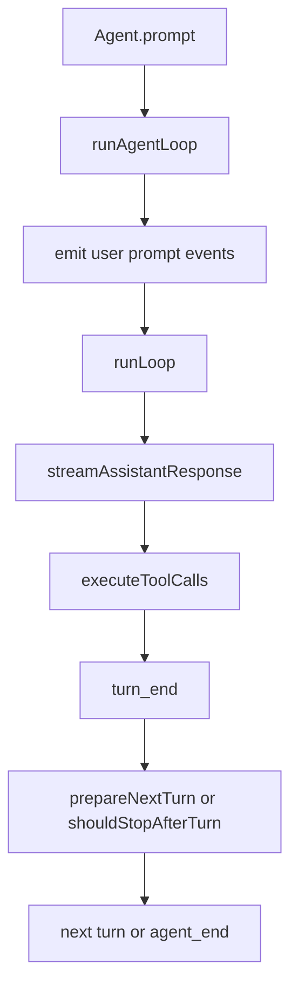

# 教程 01：整体结构与主循环

这一章只解决一个问题：当你调用 `Agent.prompt()` 时，`packages/agent` 到底做了什么。

如果一开始就钻进 `harness/session` 或 `compaction`，很容易把“产品环境能力”误以为“核心 agent 机制”。更稳的读法是先把最短主链路走通。

## 先建立心智模型

`packages/agent` 的核心不是一个大而全的类，而是两层配合：

1. `src/agent.ts` 负责高层状态包装。
2. `src/agent-loop.ts` 负责低层多轮运行循环。

简单说：

- `Agent` 管“现在是什么状态”。
- `agent-loop` 管“接下来怎么跑”。

这层分离很关键，因为状态管理、事件订阅、排队语义和真正的 provider 调用循环，并不是同一类问题。

## 推荐先读的文件

按这个顺序：

1. `packages/agent/src/index.ts`
2. `packages/agent/src/agent.ts`
3. `packages/agent/src/agent-loop.ts`

`index.ts` 的作用是帮你先分区。你会很快看到这个包不是只有 `Agent`，还公开了 loop、harness、session、compaction 等多个层面。

## `Agent` 做了什么

从 `src/agent.ts` 看，`Agent` 主要负责这些事情：

1. 持有当前 `state`。
2. 管理 `subscribe()` 订阅者。
3. 管理 steering / follow-up 队列。
4. 在 `prompt()`、`continue()` 之类的入口上调用低层 loop。
5. 处理 run 的 settle、abort signal 和 listener await 语义。

也就是说，`Agent` 更像“状态化门面”，而不是“真正的执行引擎”。

## 源码定位

建议按下面顺序直接跳源码：

1. [packages/agent/src/agent.ts](../../packages/agent/src/agent.ts)
    先看 [createMutableAgentState()](../../packages/agent/src/agent.ts#L66)，确认默认 state、队列和可注入策略是怎么挂上的。
2. [packages/agent/src/agent.ts](../../packages/agent/src/agent.ts)
    再看 [waitForIdle()](../../packages/agent/src/agent.ts#L309)、[prompt()](../../packages/agent/src/agent.ts#L327)、[continue()](../../packages/agent/src/agent.ts#L338)，确认高层入口怎样进入 low-level loop。
3. [packages/agent/src/agent.ts](../../packages/agent/src/agent.ts)
    接着看 [createLoopConfig()](../../packages/agent/src/agent.ts#L422) 和 [processEvents()](../../packages/agent/src/agent.ts#L509)，确认 `Agent` 怎样把实例状态翻译成 loop 配置和事件更新。
4. [packages/agent/src/agent-loop.ts](../../packages/agent/src/agent-loop.ts)
    最后按 [runAgentLoop()](../../packages/agent/src/agent-loop.ts#L95)、[runAgentLoopContinue()](../../packages/agent/src/agent-loop.ts#L120)、[runLoop()](../../packages/agent/src/agent-loop.ts#L155) 的顺序读，确认 turn 是如何一轮轮推进的。

## `agent-loop` 做了什么

`src/agent-loop.ts` 才是真正推动 agent 运行的地方。

你可以先只看 4 个函数：

1. `agentLoop()`
2. `agentLoopContinue()`
3. `runAgentLoop()`
4. `runLoop()`

它们的关系大致是：

## `prompt()` 和 `continue()` 的区别

第一次读时，很多人会把这两个入口看成“只是是否追加一条 user message”。这个理解不完整。

更准确地说：

1. `prompt()` 会先把新 prompt 放进 context，并为这些 prompt 发出 `message_start` / `message_end`。
2. `continue()` 不增加新消息，而是要求“当前上下文已经停在一个可以继续请求模型的位置”。

`agent-loop.ts` 明确限制了：如果当前最后一条消息是 `assistant`，就不能继续。这不是随便定的，而是为了保证下一次 provider 请求在 LLM 看来仍是合法上下文。

## 源码定位

这一节可以对照看：

1. [packages/agent/src/agent.ts](../../packages/agent/src/agent.ts)
    先看 [prompt()](../../packages/agent/src/agent.ts#L327) 和 [continue()](../../packages/agent/src/agent.ts#L338) 的入口封装。
2. [packages/agent/src/agent-loop.ts](../../packages/agent/src/agent-loop.ts)
    再看 [agentLoopContinue()](../../packages/agent/src/agent-loop.ts#L64) 对空上下文和末尾 `assistant` 的保护。
3. [packages/agent/test/agent-loop.test.ts](../../packages/agent/test/agent-loop.test.ts)
    最后回看 continue 相关测试，确认哪些限制是行为契约。

## 为什么 `AgentMessage` 不一开始就转成 LLM Message

这个包一个很重要的设计点是：内部尽量一直保留 `AgentMessage`，只在真正发起 LLM 请求前才调用 `convertToLlm()`。

这样做有两个直接好处：

1. 内部上下文可以保留 app 自定义消息，而不被 LLM 协议绑死。
2. `transformContext()` 可以先在更丰富的消息语义上做裁剪、注入和整理，再决定哪些内容真的喂给模型。

所以主链路不是：

`prompt -> 立刻转 LLM message -> 跑循环`

而是：

`prompt -> AgentMessage context -> transformContext -> convertToLlm -> stream`

## 源码定位

这里建议来回对照：

1. [packages/agent/src/types.ts](../../packages/agent/src/types.ts)
    先看 [AgentLoopConfig](../../packages/agent/src/types.ts#L135) 和 `AgentMessage` 相关定义。
2. [packages/agent/src/agent.ts](../../packages/agent/src/agent.ts)
    再看默认 `convertToLlm()` 实现附近的 [Agent](../../packages/agent/src/agent.ts#L202) 初始化代码。
3. [packages/agent/test/agent-loop.test.ts](../../packages/agent/test/agent-loop.test.ts)
    最后看 `transformContext` 先于 `convertToLlm` 的测试。

## 主循环真正怎么推进

`runLoop()` 里最值得先抓的是“双层循环”：

1. 外层循环处理“agent 本来要结束了，但又来了 follow-up message”的情况。
2. 内层循环处理“这轮 assistant 之后还有 tool calls 或 steering message”的情况。

这个结构说明作者并不是把 agent 当成“一次 request -> 一次 response”的封装，而是当成“一个可以在多轮事件和队列驱动下持续推进的运行体”。

## 先不要深挖，但要先记住的 3 个点

1. turn 是循环的基本单位，不是 request。
2. tool call 是 turn 推进的一部分，不是额外 side effect。
3. `Agent` 和 `agent-loop` 的边界，是整个包最重要的架构切分。

## 这一章读完后你应该回答的问题

1. 为什么 `Agent` 只适合做高层状态封装，而不适合承载全部循环逻辑。
2. `prompt()` 和 `continue()` 为什么不是简单的同义 API。
3. 为什么内部上下文保留 `AgentMessage` 到最后一刻才转换。

## 下一章看什么

下一章进入 `src/types.ts`，把状态、消息、事件和工具协议看清楚。主循环只告诉你“代码怎么走”，协议层才告诉你“哪些行为是稳定契约”。

## 阅读题

1. `Agent` 为什么要自己维护 listener 和 queue，而不是把这些都塞进 `agent-loop.ts`。
2. `runAgentLoop()` 为什么要先为用户 prompt 发 `message_start` / `message_end`，再进入 `runLoop()`。
3. `runLoop()` 里的外层循环和内层循环分别在解决什么不同问题。
4. 如果应用里存在自定义消息类型，为什么 low-level loop 不能仅凭最后一条 `AgentMessage` 的 role 就完全判定 `continue()` 一定安全。