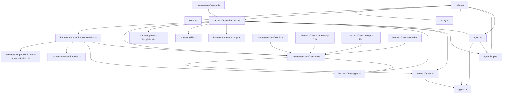

# 教程 07：文件作用与关系图

这份文档不是替代前面 6 章，而是给你一张“源码地图”：

1. `packages/agent/src` 下每个关键文件主要做什么。
2. 它和哪些文件构成直接关系。
3. 哪些文件是主干，哪些是运行环境层，哪些是持久化和压缩层。
4. 如果你想快速回查某个概念，应该先点开哪个文件。

如果你已经读过前面的教程，这一篇适合当索引和回查手册。如果你还没开始系统读源码，也可以先看这一篇建立全局地图。

## 1. 总体关系图

先看全局，再看单文件。

可以把 `packages/agent/src` 粗分成 6 个区域：

1. 对外入口层：`index.ts`、`node.ts`
2. 核心运行层：`agent.ts`、`agent-loop.ts`、`types.ts`
3. 代理适配层：`proxy.ts`
4. harness 编排层：`harness/agent-harness.ts`、`harness/types.ts`
5. 资源与上下文层：`harness/messages.ts`、`system-prompt.ts`、`skills.ts`、`prompt-templates.ts`
6. 长期运行层：`harness/session/*`、`harness/compaction/*`、`harness/env/*`

## 2. 顶层文件地图

### `index.ts`

作用：整个包的公共出口，把 core agent、loop、harness、session、compaction 以及部分辅助能力统一导出。

直接关系：

1. 导出 `agent.ts`、`agent-loop.ts`、`types.ts`
2. 导出 `harness/agent-harness.ts` 与 `harness/types.ts`
3. 透出 `harness/session/*`、`harness/compaction/*`、`harness/messages.ts`、`harness/skills.ts`、`harness/system-prompt.ts`
4. 透出 `proxy.ts` 和部分 harness utils

阅读意义：这是“这个包打算让外部看到什么”的最佳入口。

### `agent.ts`

作用：高层状态化门面。负责：

1. 管理 `AgentState`
2. 管理 listeners
3. 管理 steering / follow-up 队列
4. 提供 `prompt()`、`continue()`、`waitForIdle()` 等对外 API
5. 把实例状态翻译成 `AgentLoopConfig`

直接关系：

1. 依赖 `agent-loop.ts` 里的 `runAgentLoop()` / `runAgentLoopContinue()`
2. 依赖 `types.ts` 中的 `AgentState`、`AgentEvent`、`AgentLoopConfig`
3. 默认使用 `@earendil-works/pi-ai` 的 `streamSimple`

阅读意义：这是“用户怎么驱动一个 agent 实例”的核心文件。

### `agent-loop.ts`

作用：低层多轮执行循环。负责：

1. 新 prompt run 和 continue run 的入口
2. turn 生命周期推进
3. assistant stream 消费
4. tool call 执行和 tool result 回灌
5. steering / follow-up / stop-after-turn 决策

直接关系：

1. 被 `agent.ts` 和 `harness/agent-harness.ts` 调用
2. 依赖 `types.ts` 定义 loop 协议和事件类型
3. 在模型边界调用 `@earendil-works/pi-ai`

阅读意义：这是整个包里最重要的控制流文件之一。

### `types.ts`

作用：core 层的公共协议文件。定义：

1. `AgentMessage`
2. `AgentState`
3. `AgentEvent`
4. `AgentLoopConfig`
5. `AgentTool`、tool hook 上下文、`ToolExecutionMode`
6. `ThinkingLevel`

直接关系：

1. 被 `agent.ts`、`agent-loop.ts`、`harness/types.ts` 共同依赖
2. 通过 declaration merging 被 `harness/messages.ts` 扩展自定义消息角色

阅读意义：这是“哪些抽象是稳定契约”的最佳入口。

### `proxy.ts`

作用：代理型 stream function。适合“模型请求不直连 provider，而是走自家服务端”的场景。

直接关系：

1. 依赖 `@earendil-works/pi-ai` 的事件流与消息类型
2. 通过 `streamFn` 注入 `Agent` 或 harness

阅读意义：它不是主循环的一部分，但说明这个包在设计上明确支持“替换模型调用后端”。

### `node.ts`

作用：Node 运行时入口。主要是额外导出 `NodeExecutionEnv`，再透传 `index.ts` 的所有公共导出。

阅读意义：这个文件很薄，但它表达了“执行环境”是可插拔的，而 Node 只是其中一种实现。

## 3. `harness/` 目录文件地图

这一层可以分成 4 类：编排核心、消息/资源辅助、session、compaction。

### 3.1 编排核心

#### `harness/agent-harness.ts`

作用：完整运行环境的 orchestration 层。负责：

1. session 持久化
2. runtime config 与 turn snapshot
3. hooks 分发
4. queue 和 phase 管理
5. save point 语义
6. 调用 `runAgentLoop()` 执行真正的 turn

直接关系：

1. 依赖 `agent-loop.ts`
2. 深度依赖 `harness/types.ts`
3. 依赖 `messages.ts`、`system-prompt.ts`、`skills.ts`、`prompt-templates.ts`
4. 依赖 `session/session.ts` 与 `compaction/compaction.ts`

#### `harness/types.ts`

作用：harness 层的公共协议文件。定义：

1. `Skill`、`PromptTemplate`、`AgentHarnessResources`
2. `AgentHarnessStreamOptions`
3. `ExecutionEnv` 与文件/执行错误类型
4. `SessionError`、`CompactionError`、`AgentHarnessError`
5. session entry、repo、storage、event、phase 等长期运行协议

阅读意义：如果 `types.ts` 是 core 的协议边界，这个文件就是 harness 的协议边界。

### 3.2 消息与资源辅助

#### `harness/messages.ts`

作用：定义并实现 harness 扩展消息类型，包括：

1. `bashExecution`
2. `custom`
3. `branchSummary`
4. `compactionSummary`

同时提供把这些消息转回 LLM `Message[]` 的 `convertToLlm()`。

直接关系：

1. 通过 declaration merging 扩展 `../types.ts` 中的 `CustomAgentMessages`
2. 被 `agent-harness.ts` 和 `session/session.ts` 用来重建上下文

#### `harness/system-prompt.ts`

作用：把 skills 等资源格式化成 system prompt 中可见的说明块。

阅读意义：这是“模型究竟能看到哪些资源清单”的最短入口。

#### `harness/skills.ts`

作用：skills 的加载、诊断、格式化与来源标记支持。

直接关系：

1. 依赖 `ExecutionEnv` 读取文件系统
2. 读取 `SKILL.md` 与 frontmatter
3. 为 system prompt 和显式 skill 调用提供数据

#### `harness/prompt-templates.ts`

作用：prompt template 的加载、解析、参数拆分与诊断。

阅读意义：它和 `skills.ts` 平行，但语义更偏显式模板调用，而不是模型可见技能目录。

### 3.3 `harness/session/` 子目录

这一层解决“历史怎样持久化、怎样重建”。

#### `session.ts`

作用：session 核心抽象。负责：

1. 追加 message 与各种 session entry
2. 维护 leaf 游标
3. 从树路径重建 `SessionContext`
4. 暴露分支切换、label、session name 等语义

这是 session 子目录里最先该读的文件。

#### `jsonl-storage.ts` / `memory-storage.ts`

作用：两种底层 storage 实现，分别偏向磁盘 JSONL 持久化和内存存储。

#### `jsonl-repo.ts` / `memory-repo.ts`

作用：更高层的 repo 封装，围绕各自 storage 暴露 session repo 能力。

#### `repo-utils.ts`

作用：session repo 共用的辅助逻辑。

#### `uuid.ts`

作用：导出 `uuidv7`，给 session entry 和相关对象提供稳定 id。

### 3.4 `harness/compaction/` 子目录

这一层解决“历史太长时如何压缩，同时保留工作语义”。

#### `compaction.ts`

作用：compaction 主文件。负责：

1. token 估算
2. compact 阈值判断
3. 会话序列化
4. cut point 计算
5. summary 生成与 compaction 执行

这是 compaction 子目录里最核心的文件。

#### `branch-summarization.ts`

作用：处理 branch summary 这条并行能力，用于从历史分支抽出摘要再回到主路径。

#### `utils.ts`

作用：compaction 共用工具，尤其包括文件操作提取、会话序列化等辅助逻辑。

### 3.5 `harness/env/` 子目录

#### `env/nodejs.ts`

作用：Node 环境下的 `ExecutionEnv` 实现，承接文件系统和命令执行能力。

阅读意义：如果你想知道 harness 怎样真正访问磁盘、执行命令、处理 abort，这个文件是关键入口。

## 4. 哪些文件是主干，哪些是支线

如果你只想抓主干，优先读：

1. `packages/agent/src/index.ts`
2. `packages/agent/src/types.ts`
3. `packages/agent/src/agent.ts`
4. `packages/agent/src/agent-loop.ts`
5. `packages/agent/src/harness/agent-harness.ts`
6. `packages/agent/src/harness/session/session.ts`
7. `packages/agent/src/harness/compaction/compaction.ts`

如果你想抓“消息如何扩展”，优先读：

1. `packages/agent/src/types.ts`
2. `packages/agent/src/harness/messages.ts`

如果你想抓“资源如何进入系统 prompt”，优先读：

1. `packages/agent/src/harness/system-prompt.ts`
2. `packages/agent/src/harness/skills.ts`
3. `packages/agent/src/harness/prompt-templates.ts`

如果你想抓“运行环境与持久化”，优先读：

1. `packages/agent/src/harness/types.ts`
2. `packages/agent/src/harness/agent-harness.ts`
3. `packages/agent/src/harness/session/session.ts`
4. `packages/agent/src/harness/env/nodejs.ts`

## 5. 一条建议阅读路线

如果你已经看完前 6 章，按这条路线最稳：

1. 先从 `index.ts` 建立总览。
2. 读 `types.ts`，先把 core 协议钉住。
3. 读 `agent.ts` 和 `agent-loop.ts`，搞清状态和控制流。
4. 读 `harness/messages.ts`，确认扩展消息怎样进入上下文。
5. 读 `harness/types.ts` 和 `harness/agent-harness.ts`，搞清完整运行语义。
6. 读 `session/session.ts` 与 `compaction/compaction.ts`，理解长期运行能力。
7. 最后回到 `skills.ts`、`prompt-templates.ts`、`system-prompt.ts`、`proxy.ts`、`node.ts` 这些边缘但重要的辅助层。

## 6. 回查指南

当你在读源码时遇到下面这些问题，可以直接跳这里：

1. “这个包公开了哪些能力？”
   看 [packages/agent/src/index.ts](../../packages/agent/src/index.ts)
2. “Agent 自己到底管理什么状态？”
   看 [packages/agent/src/agent.ts](../../packages/agent/src/agent.ts)
3. “真正的 turn 循环在哪里？”
   看 [packages/agent/src/agent-loop.ts](../../packages/agent/src/agent-loop.ts)
4. “自定义消息是怎么进上下文的？”
   看 [packages/agent/src/harness/messages.ts](../../packages/agent/src/harness/messages.ts)
5. “完整运行环境和 save point 语义在哪里？”
   看 [packages/agent/src/harness/agent-harness.ts](../../packages/agent/src/harness/agent-harness.ts)
6. “session tree 是怎么重建上下文的？”
   看 [packages/agent/src/harness/session/session.ts](../../packages/agent/src/harness/session/session.ts)
7. “compaction 到底做了哪些事？”
   看 [packages/agent/src/harness/compaction/compaction.ts](../../packages/agent/src/harness/compaction/compaction.ts)
8. “skills 和 prompt templates 怎样从文件系统加载？”
   看 [packages/agent/src/harness/skills.ts](../../packages/agent/src/harness/skills.ts) 和 [packages/agent/src/harness/prompt-templates.ts](../../packages/agent/src/harness/prompt-templates.ts)

## 7. 读完后你应该能回答

1. `packages/agent` 的 core loop、harness、session、compaction 分别在哪些文件里。
2. 为什么 `messages.ts` 看起来像辅助文件，实际上却是扩展消息协议的重要连接点。
3. 为什么 `harness/types.ts` 的重要性接近顶层 `types.ts`，只是抽象层级不同。
4. 如果你要加一个新运行时能力，应该先判断它属于 core loop、harness orchestration，还是 session/compaction 子系统。