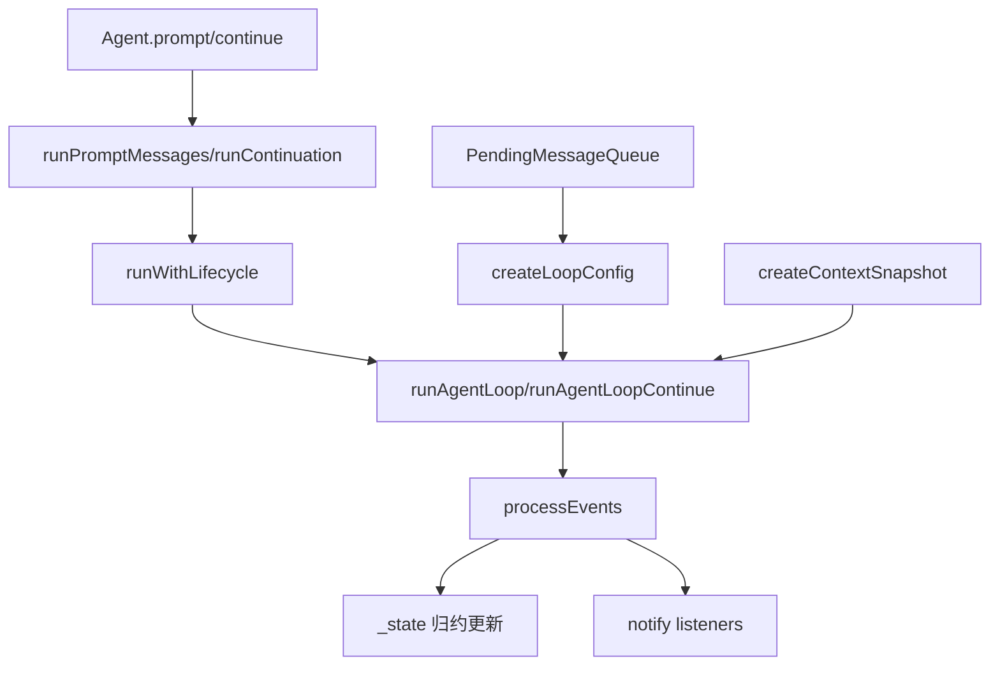
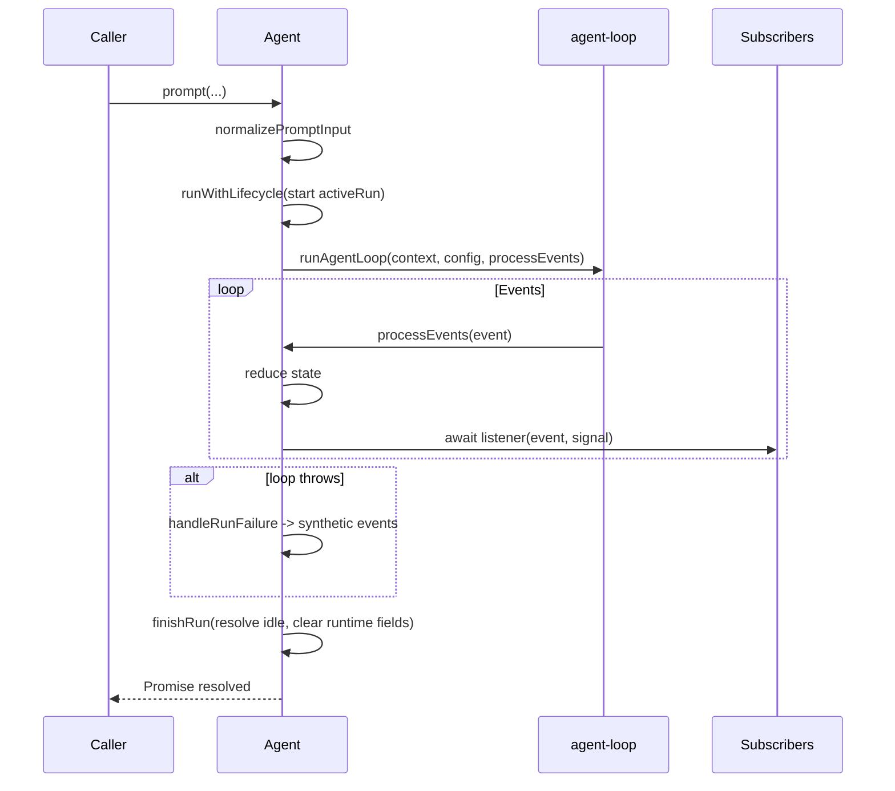
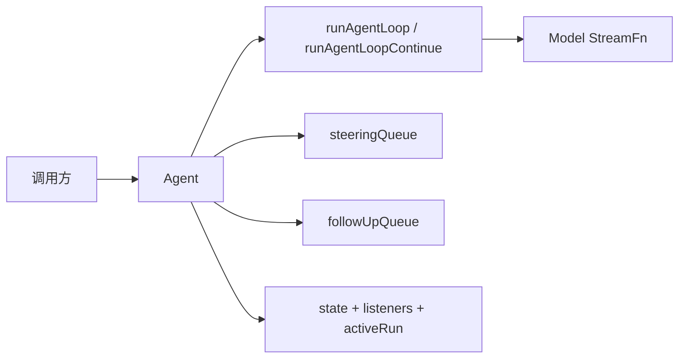
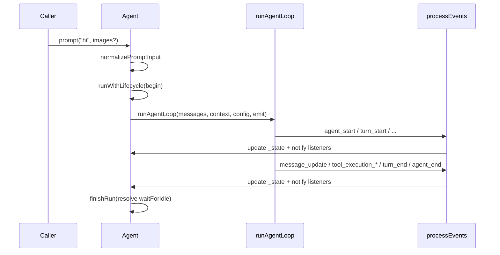

# 08: `agent.ts` 深度精读（逐函数 + 逐参数 + 逐依赖）

本文专门讲解 `packages/agent/src/agent.ts`。
目标是把这个文件从“能看懂”提升到“可以自信修改并扩展”。

---

## 1. 文件定位与职责边界

`agent.ts` 是 `packages/agent` 的“有状态门面层”（stateful facade）。

它不负责：

1. 真正的流式推理协议细节（这在 `agent-loop.ts` 里）。
2. Tool 参数校验与执行编排细节（也在 `agent-loop.ts`）。
3. 公共协议类型定义（在 `types.ts`）。

它负责：

1. 持有并维护运行时状态（`AgentState` 的可变实现）。
2. 管理一次 run 的生命周期（active run、abort、idle 结算）。
3. 管理两类消息队列（steering 与 follow-up）。
4. 将外部配置拼装成 `AgentLoopConfig`，交给 `runAgentLoop` / `runAgentLoopContinue`。
5. 处理 loop 事件并把事件“归约”到本地状态，然后再通知订阅者。

一句话总结：
`agent.ts` 是“状态管理 + 生命周期编排 + 事件桥接”；`agent-loop.ts` 是“纯流程执行器”。

---

## 2. 顶层导入与直接依赖关系

### 2.1 来自 `@earendil-works/pi-ai`

- `streamSimple`: 默认流函数（`Agent` 默认 `streamFn`）。
- `Message`: LLM 侧消息基类，用于 `convertToLlm` 的返回值。
- `ImageContent`, `TextContent`: 构造用户 prompt 内容块时使用。
- `Model`: 模型对象类型，用于默认模型和状态定义。
- `SimpleStreamOptions`: 用于 `onPayload` / `onResponse` 类型。
- `ThinkingBudgets`: 推理预算配置类型。
- `Transport`: 网络/传输策略类型。

### 2.2 来自本包内部

- `runAgentLoop`, `runAgentLoopContinue` from `./agent-loop.ts`
  - `Agent.prompt()` 最终进入 `runAgentLoop`。
  - `Agent.continue()` 最终进入 `runAgentLoopContinue`。
- 大量类型 from `./types.ts`
  - `AgentState`, `AgentMessage`, `AgentEvent` 是核心状态与事件协议。
  - `AgentLoopConfig`, `AgentContext` 是与 loop 层的桥接协议。
  - `QueueMode`, `ToolExecutionMode` 控制策略行为。

### 2.3 文件内依赖图（高层）



---

## 3. 顶层常量/类型与函数：逐项说明

## 3.1 `defaultConvertToLlm(messages)`

签名：

```ts
function defaultConvertToLlm(messages: AgentMessage[]): Message[]
```

作用：

默认把 `AgentMessage[]` 转成 LLM 可消费的 `Message[]`。它仅保留角色为 `user`、`assistant`、`toolResult` 的消息。

直接依赖：

1. 输入类型 `AgentMessage`（来自 `types.ts`）。
2. 输出类型 `Message`（来自 `pi-ai`）。

被谁依赖：

1. `Agent` 构造器：当 `options.convertToLlm` 未提供时使用它。
2. 后续经 `createLoopConfig.convertToLlm` 传到 `runAgentLoop`。

参数解析：

1. `messages`: 当前完整 agent 上下文消息列表，可能包含应用自定义消息。

返回值解析：

1. 过滤后的标准协议消息数组。
2. 这一步是“协议边界清洗”，让 LLM 侧只看到可理解消息。

---

## 3.2 `EMPTY_USAGE`

作用：

构造失败消息时使用的零 token/零 cost usage 占位值，避免缺字段。

直接依赖：

1. 无运行时依赖。
2. 结构需与 assistant 消息 usage 兼容。

被谁依赖：

1. `handleRunFailure()` 失败消息构造。

---

## 3.3 `DEFAULT_MODEL`

作用：

在没有初始模型时给 `state.model` 一个安全占位模型，满足类型但不会表达真实 provider 配置。

直接依赖：

1. `Model<any>` 类型。

被谁依赖：

1. `createMutableAgentState()` 默认模型。
2. `handleRunFailure()` 使用 `_state.model` 的字段填充失败消息。

---

## 3.4 `MutableAgentState`（类型）

定义要点：

```ts
type MutableAgentState = Omit<AgentState, "isStreaming" | "streamingMessage" | "pendingToolCalls" | "errorMessage"> & {
  isStreaming: boolean;
  streamingMessage?: AgentMessage;
  pendingToolCalls: Set<string>;
  errorMessage?: string;
};
```

作用：

把 `AgentState` 中只读/只读集合字段替换成可变实现，供类内部维护；对外仍通过 `AgentState` 暴露。

直接依赖：

1. `AgentState`, `AgentMessage`。
2. `Set<string>` 作为内部可变集合。

被谁依赖：

1. `Agent._state` 字段类型。
2. `createMutableAgentState()` 返回类型。

---

## 3.5 `createMutableAgentState(initialState?)`

签名：

```ts
function createMutableAgentState(
  initialState?: Partial<Omit<AgentState, "pendingToolCalls" | "isStreaming" | "streamingMessage" | "errorMessage">>,
): MutableAgentState
```

作用：

创建 `_state` 的默认值，并通过 getter/setter 做数组拷贝，避免外部数组引用直接污染内部状态。

直接依赖：

1. `DEFAULT_MODEL`。
2. `AgentState` 相关字段约束。
3. `AgentTool<any>[]`, `AgentMessage[]`。

被谁依赖：

1. `Agent` 构造器初始化 `_state`。

参数解析：

1. `initialState`: 允许注入初始 `systemPrompt/model/thinkingLevel/tools/messages`。

关键实现点：

1. `tools` 与 `messages` 在 set 时 `slice()`，实现浅拷贝写入。
2. 默认 `isStreaming=false`，`pendingToolCalls` 空集合。
3. `errorMessage` 初始化为 `undefined`。

---

## 3.6 `AgentOptions`（接口）

作用：

`Agent` 构造器参数协议，覆盖初始化状态、loop 行为、hook、队列模式、传输策略等。

直接依赖：

1. `AgentState` 的初始子集。
2. `AgentMessage`, `Message` 转换协议。
3. `StreamFn`, `QueueMode`, `ToolExecutionMode`。
4. `ThinkingBudgets`, `Transport`, `SimpleStreamOptions`。
5. Hook 上下文与结果类型：`BeforeToolCallContext` 等。

字段逐项说明：

1. `initialState`
   - 类型：`Partial<Omit<AgentState, ...>>`
   - 用途：初始化系统提示词、模型、推理等级、初始 transcript、tools。
2. `convertToLlm`
   - 把 `AgentMessage[]` 映射到 `Message[]`。
   - 默认是 `defaultConvertToLlm`。
3. `transformContext`
   - 在转换前做上下文裁剪/注入等。
4. `streamFn`
   - 替换底层流函数；默认 `streamSimple`。
5. `getApiKey`
   - 每次请求动态取 key。
6. `onPayload`, `onResponse`
   - 直接透传给 stream 层，做观测/拦截。
7. `beforeToolCall`, `afterToolCall`
   - tool 级 pre/post hook。
8. `prepareNextTurn`
   - 每轮后动态替换 context/model/thinking。
9. `steeringMode`, `followUpMode`
   - 两个队列的 drain 策略。
10. `sessionId`
    - 给 provider 的会话 ID（缓存友好）。
11. `thinkingBudgets`
    - 推理 token 预算分层配置。
12. `transport`
    - 请求传输策略（默认 `auto`）。
13. `maxRetryDelayMs`
    - provider 请求重试延迟上限。
14. `toolExecution`
    - assistant 单消息多 tool call 的执行模式。

---

## 4. `PendingMessageQueue`：队列策略实现

这是一个文件内私有类，负责 steering/follow-up 的统一抽象。

### 4.1 字段

1. `private messages: AgentMessage[]`
   - 实际缓冲区。
2. `public mode: QueueMode`
   - `all` 或 `one-at-a-time`。

### 4.2 方法与依赖

1. `constructor(mode: QueueMode)`
   - 设置 drain 行为策略。
2. `enqueue(message: AgentMessage): void`
   - 末尾入队。
3. `hasItems(): boolean`
   - 是否存在待处理项。
4. `drain(): AgentMessage[]`
   - `all` 模式：一次清空并返回全部。
   - `one-at-a-time`：返回最早一条，保留其余。
5. `clear(): void`
   - 清空队列。

被谁依赖：

1. `Agent.steeringQueue` 与 `Agent.followUpQueue` 两个实例。
2. `createLoopConfig().getSteeringMessages` 和 `.getFollowUpMessages` 调用 `drain()`。
3. `hasQueuedMessages()` 读取 `hasItems()`。

---

## 5. `ActiveRun`（类型）

定义：

```ts
type ActiveRun = {
  promise: Promise<void>;
  resolve: () => void;
  abortController: AbortController;
};
```

作用：

表示一次进行中的 run 的结算句柄：

1. `promise`: 给 `waitForIdle()`。
2. `resolve`: 在 `finishRun()` 时触发 settle。
3. `abortController`: 提供统一 abort 信号。

被谁依赖：

1. `Agent.activeRun` 字段。
2. `signal` getter、`abort()`、`waitForIdle()`、`processEvents()`。

---

## 6. `Agent` 类：逐成员精读

### 6.1 字段分组

状态字段：

1. `_state: MutableAgentState`。
2. `activeRun?: ActiveRun`。

事件字段：

1. `listeners: Set<(event, signal) => Promise<void> | void>`。

队列字段：

1. `steeringQueue: PendingMessageQueue`。
2. `followUpQueue: PendingMessageQueue`。

配置/钩子字段：

1. `convertToLlm`, `transformContext`, `streamFn`, `getApiKey`。
2. `onPayload`, `onResponse`。
3. `beforeToolCall`, `afterToolCall`, `prepareNextTurn`。
4. `sessionId`, `thinkingBudgets`, `transport`, `maxRetryDelayMs`, `toolExecution`。

---

### 6.2 构造器 `constructor(options: AgentOptions = {})`

作用：

1. 初始化内部状态。
2. 装配默认值（如 `streamSimple`, 队列模式、transport、toolExecution）。
3. 接受外部覆盖。

直接依赖：

1. `createMutableAgentState()`。
2. `defaultConvertToLlm`。
3. `PendingMessageQueue`。
4. `streamSimple`。

参数解析：

1. `options`: 对应前文 `AgentOptions` 全部字段。
2. 默认值策略：
   - `steeringMode/followUpMode` 默认 `one-at-a-time`。
   - `transport` 默认 `auto`。
   - `toolExecution` 默认 `parallel`。

---

### 6.3 订阅与状态访问

#### `subscribe(listener)`

作用：

注册生命周期监听器，返回取消订阅函数。

依赖：

1. 依赖 `listeners` 集合。
2. 由 `processEvents()` 串行 await 调用。

参数解析：

1. `listener(event, signal)`
   - `event`: `AgentEvent`。
   - `signal`: 当前 run 的 abort 信号。

关键语义：

1. listener 是被 await 的，因此会影响 run 结算时机。
2. `agent_end` 事件发出后，仍需等 listener 完成，agent 才 truly idle。

#### `get state()`

作用：

返回当前 `_state`（对外类型为 `AgentState`）。

语义：

1. `tools/messages` 通过 accessor 拷贝写入（防别名污染）。

---

### 6.4 队列模式控制

#### `set/get steeringMode`

作用：

修改/读取 steering 队列 drain 策略。

依赖：

1. `steeringQueue.mode`。

#### `set/get followUpMode`

作用：

修改/读取 follow-up 队列 drain 策略。

依赖：

1. `followUpQueue.mode`。

---

### 6.5 队列写入与清理

#### `steer(message)`

作用：

把消息放入 steering 队列，在“当前 assistant turn 完成后”注入。

依赖：

1. `steeringQueue.enqueue()`。
2. loop 通过 `getSteeringMessages` 消费。

参数：

1. `message: AgentMessage`。

#### `followUp(message)`

作用：

把消息放入 follow-up 队列，在 agent 本来要停下时再触发新 turn。

依赖：

1. `followUpQueue.enqueue()`。
2. loop 通过 `getFollowUpMessages` 消费。

#### `clearSteeringQueue()` / `clearFollowUpQueue()` / `clearAllQueues()`

作用：

清空对应队列。

依赖：

1. `PendingMessageQueue.clear()`。

#### `hasQueuedMessages()`

作用：

检查任一队列是否有待处理消息。

依赖：

1. 两个队列的 `hasItems()`。

---

### 6.6 运行态控制

#### `get signal()`

作用：

暴露当前 run abort 信号（若无 run 则 `undefined`）。

依赖：

1. `activeRun?.abortController.signal`。

#### `abort()`

作用：

中断当前 run。

依赖：

1. `activeRun?.abortController.abort()`。

#### `waitForIdle()`

作用：

等待当前 run 以及所有 await 的 listener 结束。

依赖：

1. `activeRun?.promise`。
2. 若无 active run，立即 resolve。

#### `reset()`

作用：

重置 transcript 与运行态。

执行内容：

1. 清空 `_state.messages`。
2. 重置 streaming 相关字段与 pending tool calls。
3. 清空 error。
4. 清空 steering/follow-up 队列。

注意：

1. 这不会改变模型、systemPrompt、thinkingLevel、tools。

---

### 6.7 对话入口：`prompt` 重载

签名（两种公开重载 + 一个实现）：

```ts
async prompt(message: AgentMessage | AgentMessage[]): Promise<void>;
async prompt(input: string, images?: ImageContent[]): Promise<void>;
```

作用：

启动一次新的 prompt run。

直接依赖：

1. `normalizePromptInput()`。
2. `runPromptMessages()`。
3. `activeRun` 并发保护。

参数解析：

1. `input`
   - 字符串：自动包装为一条 user 消息。
   - `AgentMessage`：直接作为单条输入。
   - `AgentMessage[]`：批量输入。
2. `images`
   - 仅字符串输入时生效，追加到 user content。

关键行为：

1. 若已有 `activeRun`，抛错，要求使用 `steer/followUp` 或等待完成。
2. 统一转换成 `AgentMessage[]` 后进入 `runPromptMessages`。

---

### 6.8 续跑入口：`continue()`

作用：

从已有 transcript 继续，不新增首条 prompt。

直接依赖：

1. `_state.messages` 最后消息校验。
2. `steeringQueue.drain()` 与 `followUpQueue.drain()`。
3. `runPromptMessages(..., { skipInitialSteeringPoll: true })`。
4. `runContinuation()`。

参数：

1. 无参数。

详细语义：

1. 若无消息，抛错。
2. 若最后一条是 `assistant`：
   - 先看 steering 队列，若有则把这些消息作为新 prompt 启动 run。
   - 否则看 follow-up 队列，若有则用这些消息启动 run。
   - 两者都无则抛错（assistant 之后不能直接 continue）。
3. 若最后一条不是 assistant（如 user/toolResult），直接 `runContinuation()`。

为什么有 `skipInitialSteeringPoll`：

1. 因为刚刚已经手工 drain 过 steering，不应在新 run 开始时被 loop 再拉一次。

---

### 6.9 输入标准化：`normalizePromptInput(input, images?)`

作用：

把多形态输入统一成 `AgentMessage[]`。

依赖：

1. `TextContent` / `ImageContent`。

参数解析：

1. `input`
   - 数组：原样返回。
   - 非字符串对象：包装成单元素数组。
   - 字符串：构造 user 消息。
2. `images`
   - 附加到字符串 prompt 的 content。

返回：

1. 标准化的 `AgentMessage[]`。

细节：

1. 字符串路径会填充 `timestamp: Date.now()`。

---

### 6.10 启动 prompt run：`runPromptMessages(messages, options?)`

作用：

用 run 生命周期包装 `runAgentLoop`。

依赖：

1. `runWithLifecycle()`。
2. `runAgentLoop()`。
3. `createContextSnapshot()`。
4. `createLoopConfig(options)`。
5. `processEvents()`。

参数解析：

1. `messages: AgentMessage[]`
   - 作为本轮新增 prompt 消息。
2. `options.skipInitialSteeringPoll?: boolean`
   - 首轮是否跳过 steering 拉取。

---

### 6.11 启动 continuation run：`runContinuation()`

作用：

用 run 生命周期包装 `runAgentLoopContinue`。

依赖：

1. `runWithLifecycle()`。
2. `runAgentLoopContinue()`。
3. `createContextSnapshot()`。
4. `createLoopConfig()`。
5. `processEvents()`。

---

### 6.12 上下文快照：`createContextSnapshot()`

作用：

从内部可变状态拷贝出传入 loop 的 `AgentContext` 快照。

依赖：

1. `_state.systemPrompt`。
2. `_state.messages.slice()`。
3. `_state.tools.slice()`。

意义：

1. 避免 loop 直接持有 `_state` 的数组引用。

---

### 6.13 loop 配置拼装：`createLoopConfig(options?)`

作用：

构建 `AgentLoopConfig`，将 Agent 的运行策略、hook 与队列读取逻辑下发到 loop 层。

依赖：

1. `_state.model` 与 `_state.thinkingLevel`。
2. `this.sessionId`, `onPayload`, `onResponse`, `transport`。
3. `thinkingBudgets`, `maxRetryDelayMs`, `toolExecution`。
4. hook：`beforeToolCall`, `afterToolCall`, `prepareNextTurn`。
5. 队列 drain：`steeringQueue`, `followUpQueue`。

参数解析：

1. `options.skipInitialSteeringPoll?: boolean`
   - 若 true，则首次 `getSteeringMessages` 返回空数组，随后恢复正常。

关键实现点：

1. `reasoning` 映射：
   - `thinkingLevel === "off"` 时传 `undefined`。
2. `prepareNextTurn` 封装：
   - 把 `this.signal` 传入用户定义函数。
3. `getSteeringMessages` 带一次性跳过逻辑。

---

### 6.14 生命周期包装：`runWithLifecycle(executor)`

作用：

统一处理 active run 注册、状态初始化、错误转事件、最终清理。

依赖：

1. `activeRun` 并发保护。
2. `AbortController`。
3. `handleRunFailure()`。
4. `finishRun()`。

参数解析：

1. `executor(signal)`
   - 真正执行 loop 的闭包，由 `runPromptMessages/runContinuation` 提供。

详细流程：

1. 若已有 `activeRun`，抛错。
2. 新建 `abortController` + 手工 promise/resolve。
3. 标记 `_state.isStreaming=true`，清理 streaming/error。
4. 执行 `executor`。
5. 若抛错，走 `handleRunFailure(error, aborted)`。
6. 最终总是 `finishRun()`。

---

### 6.15 失败路径：`handleRunFailure(error, aborted)`

作用：

把异常转成规范 assistant 失败消息，并按正常事件序列发出去。

依赖：

1. `_state.model`。
2. `EMPTY_USAGE`。
3. `processEvents()`。

参数解析：

1. `error: unknown`
   - 原始异常。
2. `aborted: boolean`
   - 由 `abortController.signal.aborted` 得到。

行为：

1. 生成 `stopReason` 为 `aborted` 或 `error` 的 assistant 消息。
2. 依次触发：
   - `message_start`
   - `message_end`
   - `turn_end`（`toolResults: []`）
   - `agent_end`

这保证：

1. 上层 UI/监听器可以按统一协议处理失败，不用分“异常通道”。

---

### 6.16 结算：`finishRun()`

作用：

把 run 从 active 状态彻底结束。

依赖：

1. `_state` 运行态字段。
2. `activeRun.resolve()`。

行为：

1. `isStreaming=false`。
2. 清空 `streamingMessage`。
3. 清空 `pendingToolCalls`。
4. resolve idle promise。
5. `activeRun=undefined`。

---

### 6.17 事件归约器：`processEvents(event)`

作用：

先把 loop 事件归约到 `_state`，再顺序 await 所有 listener。

依赖：

1. `AgentEvent` 联合类型。
2. `_state` 对应字段。
3. `activeRun.abortController.signal`。
4. `listeners` 集合。

参数解析：

1. `event: AgentEvent`
   - 来自 loop 的生命周期/消息/tool 执行事件。

分支更新规则：

1. `message_start` / `message_update`
   - 更新 `_state.streamingMessage`。
2. `message_end`
   - 清空 `_state.streamingMessage`。
   - 把最终消息 push 到 `_state.messages`。
3. `tool_execution_start`
   - 克隆 `pendingToolCalls`，add 当前 id，再替换。
4. `tool_execution_end`
   - 克隆集合并 delete 当前 id，再替换。
5. `turn_end`
   - 若是 assistant 且有 `errorMessage`，写入 `_state.errorMessage`。
6. `agent_end`
   - 兜底清空 `streamingMessage`。

然后：

1. 取 `signal = this.activeRun?.abortController.signal`。
2. 若拿不到 signal，抛错（防止 run 外部错误调用）。
3. 按订阅顺序 `await listener(event, signal)`。

关键语义：

1. listener 慢，会拖慢 run settle。
2. 这是显式设计，不是副作用。

---

## 7. 依赖关系总表（按“谁调用谁”）

## 7.1 顶层函数/常量

1. `defaultConvertToLlm`
   - 被 `constructor` 默认注入。
2. `createMutableAgentState`
   - 被 `constructor` 调用。
3. `EMPTY_USAGE`
   - 被 `handleRunFailure` 使用。
4. `DEFAULT_MODEL`
   - 被 `createMutableAgentState` 使用。

## 7.2 `Agent` 内部方法调用链

1. `prompt` -> `normalizePromptInput` -> `runPromptMessages`。
2. `continue`
   - 分支 A：`runPromptMessages(...skipInitialSteeringPoll)`。
   - 分支 B：`runContinuation`。
3. `runPromptMessages` -> `runWithLifecycle` -> `runAgentLoop`。
4. `runContinuation` -> `runWithLifecycle` -> `runAgentLoopContinue`。
5. `runPromptMessages/runContinuation` 都把事件 sink 设为 `processEvents`。
6. `runWithLifecycle` 异常时 -> `handleRunFailure` -> `processEvents`(多次)。
7. `runWithLifecycle` finally -> `finishRun`。
8. `createLoopConfig`
   - 绑定 `getSteeringMessages/getFollowUpMessages` 到队列 `drain`。
   - 绑定 `prepareNextTurn` 包装器传入 `this.signal`。

## 7.3 队列与 loop 的直接连接

1. `steer()` 入 `steeringQueue`。
2. `followUp()` 入 `followUpQueue`。
3. `createLoopConfig.getSteeringMessages()` 消费 steering。
4. `createLoopConfig.getFollowUpMessages()` 消费 follow-up。

---

## 8. 接口/类型之间的直接依赖关系

## 8.1 `AgentOptions` -> `Agent` 字段

`AgentOptions` 每个字段几乎都一一映射到 `Agent` 的 public 配置字段。
这是一种“配置即实例字段”的设计：

1. 构造时设值。
2. 后续可直接在实例上读写（例如切换 `transport` 或 `toolExecution`）。

## 8.2 `MutableAgentState` <- `AgentState`

1. 外部看到的是 `AgentState` 语义（含只读字段）。
2. 内部用 `MutableAgentState` 便于更新。

## 8.3 `AgentContext` / `AgentLoopConfig` 桥接

1. `createContextSnapshot()` 产出 `AgentContext`。
2. `createLoopConfig()` 产出 `AgentLoopConfig`。
3. 两者一起传入 `runAgentLoop` / `runAgentLoopContinue`。

## 8.4 Hook 类型链

1. `beforeToolCall`: `BeforeToolCallContext` -> `BeforeToolCallResult | undefined`。
2. `afterToolCall`: `AfterToolCallContext` -> `AfterToolCallResult | undefined`。
3. `prepareNextTurn`: 产出 `AgentLoopTurnUpdate | undefined`。

---

## 9. 生命周期时序图（从 prompt 到 idle）



---

## 10. 参数速查（高频入口）

## 10.1 `prompt(input, images?)`

1. `input`
   - 文本快捷方式，或完整消息对象，或消息数组。
2. `images`
   - 仅文本快捷方式场景有意义，用于拼 multimodal user message。

## 10.2 `createLoopConfig(options?)`

1. `options.skipInitialSteeringPoll`
   - 防重复消费 steering（主要用于 `continue()` 的 assistant-last 分支）。

## 10.3 `runWithLifecycle(executor)`

1. `executor(signal)`
   - 只负责具体 loop 工作，不负责外层状态切换/失败收敛。

## 10.4 `handleRunFailure(error, aborted)`

1. `error`
   - 原始异常，最终转字符串到 failure message。
2. `aborted`
   - 决定 failure message 的 `stopReason`。

---

## 11. 设计取舍与可修改点

## 11.1 为什么 listener 是串行 await

优点：

1. 可保证事件消费顺序和一致性。
2. 上层可以把 listener 当“事务后置阶段”。

代价：

1. 慢 listener 会延迟 idle。

## 11.2 为什么 `pendingToolCalls` 每次 clone 再替换

这是不可变更新风格：

1. 对观察者友好（引用变更可触发检测）。
2. 减少共享集合被外部误改的风险。

## 11.3 为什么失败走“事件协议”而不是直接抛出

为了保持 UI/日志消费路径统一：

1. 正常/失败都能收到 `message_*`, `turn_end`, `agent_end`。
2. 业务层无需开第二套异常渲染通道。

---

## 12. 学习建议：如何验证你已经掌握

可以按下面顺序做“读后验证”：

1. 手工跟踪一次 `prompt("hello")`：写出每一步对 `_state` 的影响。
2. 手工构造“assistant 结尾 + 有 steering 队列”的 `continue()` 场景，解释为何必须 `skipInitialSteeringPoll`。
3. 写一个 listener，故意 `await` 2 秒，观察 `waitForIdle()` 何时 resolve。
4. 调用 `abort()`，确认失败消息 stopReason 为 `aborted`。

如果这四步都能解释清楚，你已经具备修改 `agent.ts` 的工程级把控力。

---

## 13. 与相邻文件的阅读顺序建议

1. 先读本章（`agent.ts`）。
2. 再读 `03-tool-calls-and-turn-control.md` 对应 `agent-loop.ts` 的 tool 执行细节。
3. 最后回看 `02-state-messages-and-events.md`，把事件协议和状态更新映射到一起。

这样能形成“门面层 -> 执行层 -> 协议层”的完整闭环。# 08: `agent.ts` 超详细精读

本文专门讲解 `packages/agent/src/agent.ts`。目标是让你不仅知道“它做了什么”，还知道“为什么这样设计”。

你提出的 3 个要求，对应这份文档的结构如下：

1. 每个函数、类、接口的直接依赖关系：见第 2 到第 8 节（逐个元素展开）。
2. 每个元素的作用与参数详细解析：见第 3 到第 8 节（每个签名逐项解释）。
3. 保存到 `tutorial` 下：本文文件就是保存结果。

---

## 1. 文件定位与总体职责

`agent.ts` 是 `packages/agent` 的“**有状态运行器包装层**”。

- `agent-loop.ts` 负责“纯循环逻辑”（prompt、stream、tool 执行、turn 结束与继续）。
- `types.ts` 负责“契约与类型系统”（状态、事件、钩子、工具定义）。
- `agent.ts` 负责“运行期状态所有权 + 生命周期收敛 + 队列编排”。

一句话：**它把“无状态 loop”包装成“可复用、可订阅、可中断、可排队”的运行对象**。



---

## 2. 顶层依赖图（按 import 分组）

## 2.1 来自 `@earendil-works/pi-ai`

- `streamSimple`：默认 `streamFn`，在构造器中作为默认值。
- `Message`：LLM 边界消息类型，用在 `convertToLlm` 返回值。
- `Model`：模型类型，用于默认模型和状态中的 `model` 字段。
- `SimpleStreamOptions`：复用 `onPayload`/`onResponse` 的类型。
- `ThinkingBudgets`、`Transport`：作为 runtime 配置透传到 loop。
- `ImageContent`、`TextContent`：用于字符串 prompt 归一化时构造 user content。

## 2.2 来自同包 `agent-loop.ts`

- `runAgentLoop`：处理新 prompt 入口。
- `runAgentLoopContinue`：处理“从现有 transcript 继续”入口。

## 2.3 来自同包 `types.ts`

被 `Agent` 直接消费的关键契约：

- 状态/消息：`AgentState`、`AgentMessage`、`AgentContext`
- 循环配置：`AgentLoopConfig`、`AgentLoopTurnUpdate`
- 事件：`AgentEvent`
- 钩子：`BeforeToolCallContext/Result`、`AfterToolCallContext/Result`
- 队列策略：`QueueMode`
- 可替换流函数：`StreamFn`
- 工具执行策略：`ToolExecutionMode`
- 工具类型：`AgentTool`

---

## 3. 顶层常量、类型、函数：逐项解析

## 3.1 `defaultConvertToLlm(messages)`

签名：

```ts
function defaultConvertToLlm(messages: AgentMessage[]): Message[]
```

作用：

- 作为默认 `convertToLlm`。
- 只保留能被 LLM 直接理解的消息角色：`user` / `assistant` / `toolResult`。

直接依赖：

- 类型依赖：`AgentMessage`、`Message`
- 运行依赖：无外部函数调用，仅用 `Array.filter`

被谁依赖：

- `Agent` 构造器：`this.convertToLlm = options.convertToLlm ?? defaultConvertToLlm`

参数详解：

- `messages`：当前 agent transcript 的快照数组，可能包含扩展消息（custom message）。

返回值详解：

- 返回 `Message[]`，用于真正发给模型。
- 如果数组中有扩展消息类型，会被过滤掉。

---

## 3.2 `EMPTY_USAGE`

作用：

- 在 run 失败时构造“失败 assistant message”的 usage 占位值。

直接依赖：

- 无函数依赖。

被谁依赖：

- `handleRunFailure()`：作为 `failureMessage.usage`。

---

## 3.3 `DEFAULT_MODEL`

作用：

- 在没有显式设置模型时给 `state.model` 提供一个安全占位。

直接依赖：

- 类型依赖：`Model<any>`
- 语义依赖：`satisfies Model<any>` 约束结构完整性。

被谁依赖：

- `createMutableAgentState()`：`model: initialState?.model ?? DEFAULT_MODEL`

---

## 3.4 `MutableAgentState`（内部类型）

作用：

- 基于公开 `AgentState` 做内部可变扩展。
- 把只读字段变成内部可写，并把 `pendingToolCalls` 具体化为 `Set<string>`。

直接依赖：

- `AgentState`
- `Omit` 工具类型

被谁依赖：

- `Agent` 私有字段 `_state`
- `createMutableAgentState` 返回类型

---

## 3.5 `createMutableAgentState(initialState?)`

签名：

```ts
function createMutableAgentState(
  initialState?: Partial<Omit<AgentState, "pendingToolCalls" | "isStreaming" | "streamingMessage" | "errorMessage">>,
): MutableAgentState
```

作用：

- 创建 `Agent` 的初始内部状态对象。
- 对 `tools` 和 `messages` 使用 getter/setter + `slice`，避免外部数组引用直接污染内部状态。

直接依赖：

- `DEFAULT_MODEL`
- `MutableAgentState`
- `AgentState`（通过 `Omit`/`Partial`）

被谁依赖：

- `Agent` 构造器：`this._state = createMutableAgentState(options.initialState)`

参数详解：

- `initialState`：允许调用方注入 `systemPrompt`、`model`、`thinkingLevel`、`tools`、`messages`。
- 被刻意排除的字段：`pendingToolCalls`、`isStreaming`、`streamingMessage`、`errorMessage`，因为它们属于 runtime 管理字段，不允许外部直接初始化。

返回值详解：

- 一个符合 `MutableAgentState` 的对象。
- `tools` 和 `messages` 的赋值会复制顶层数组，读操作返回当前内部数组引用（不是深拷贝）。

---

## 3.6 `AgentOptions`（公开接口）

作用：

- 定义 `new Agent(options)` 的构造参数集合。
- 汇集了 loop 配置、hook、provider 配置、队列策略、tool 执行策略。

直接依赖：

- `AgentState` 派生类型（`initialState`）
- `Message` / `AgentMessage`（`convertToLlm`）
- `StreamFn`
- 钩子上下文与结果类型
- `QueueMode`
- `ThinkingBudgets`、`Transport`
- `ToolExecutionMode`

字段逐项解析：

- `initialState`：初始化状态快照。
- `convertToLlm`：把 `AgentMessage[]` 映射到 `Message[]`。
- `transformContext`：模型调用前可做上下文裁剪/注入。
- `streamFn`：替代默认 `streamSimple`。
- `getApiKey`：按 provider 动态拿 key，适合短期 token。
- `onPayload` / `onResponse`：底层 stream 透传回调。
- `beforeToolCall` / `afterToolCall`：工具执行前后 hook。
- `prepareNextTurn`：当前 turn 结束后，可替换下一轮上下文/模型/thinkingLevel。
- `steeringMode`：`steer()` 队列取消息策略。
- `followUpMode`：`followUp()` 队列取消息策略。
- `sessionId`：透传给 provider（缓存感知场景）。
- `thinkingBudgets`：按 thinking level 配置 token budget。
- `transport`：provider transport 偏好。
- `maxRetryDelayMs`：重试延迟上限。
- `toolExecution`：多 toolCall 时顺序/并行策略。

---

## 4. `PendingMessageQueue`：队列策略最小实现

## 4.1 类职责

这个类只干一件事：**按 `QueueMode` 提供“入队 + drain”语义**。

- `all`：一次性取完。
- `one-at-a-time`：每次只取最旧一条。

## 4.2 字段与方法依赖表

### `messages: AgentMessage[]`

- 作用：队列存储。
- 依赖：`AgentMessage` 类型。

### `mode: QueueMode`

- 作用：控制 `drain()` 行为。
- 依赖：`QueueMode` 类型。

### `constructor(mode)`

- 参数：`mode: QueueMode`
- 行为：直接赋值。

### `enqueue(message)`

- 参数：`message: AgentMessage`
- 行为：`push`。

### `hasItems()`

- 返回：`boolean`
- 行为：`length > 0`。

### `drain()`

- 返回：`AgentMessage[]`
- 行为：
  - `all` 模式：返回拷贝并清空。
  - `one-at-a-time`：返回首条并移除首条。
  - 空队列：返回空数组。

### `clear()`

- 行为：清空队列。

## 4.3 被谁依赖

- `Agent` 的 `steeringQueue`、`followUpQueue` 两个实例。
- `Agent.createLoopConfig()` 将其 `drain` 封装成 `getSteeringMessages` / `getFollowUpMessages`。

---

## 5. `ActiveRun`（内部运行句柄）

```ts
type ActiveRun = {
  promise: Promise<void>;
  resolve: () => void;
  abortController: AbortController;
}
```

作用：

- 让 `Agent` 具备“可等待 + 可中断 + 单运行互斥”的运行句柄。

依赖关系：

- `runWithLifecycle()` 创建并赋值。
- `waitForIdle()` 读取 `promise`。
- `abort()` 触发 `abortController.abort()`。
- `finishRun()` 调用 `resolve()` 后清空 `activeRun`。

---

## 6. `Agent` 类：逐成员精讲

## 6.1 类定位

`Agent` 是整个文件的核心对象。它提供：

- 运行入口：`prompt()` / `continue()`
- 运行控制：`abort()` / `waitForIdle()` / `reset()`
- 队列控制：`steer()` / `followUp()` / 清队列
- 事件机制：`subscribe()`
- 状态可见性：`state` getter 与运行态字段

## 6.2 构造器

签名：

```ts
constructor(options: AgentOptions = {})
```

直接依赖：

- `createMutableAgentState`
- `defaultConvertToLlm`
- `streamSimple`
- `PendingMessageQueue`

参数解释（`options`）：

- 见第 3.6 的完整字段说明。
- 核心默认值：
  - `convertToLlm`: `defaultConvertToLlm`
  - `streamFn`: `streamSimple`
  - `steeringMode`: `one-at-a-time`
  - `followUpMode`: `one-at-a-time`
  - `transport`: `auto`
  - `toolExecution`: `parallel`

关键设计点：

- 让“调用方可自定义”与“无配置即能运行”同时成立。

---

## 6.3 事件订阅相关

### `subscribe(listener)`

签名：

```ts
subscribe(listener: (event: AgentEvent, signal: AbortSignal) => Promise<void> | void): () => void
```

作用：

- 注册生命周期监听器。
- 返回取消订阅函数。

直接依赖：

- `listeners: Set<...>`
- 类型 `AgentEvent`

参数详解：

- `listener`：
  - 输入 `event`: 每个 loop 事件。
  - 输入 `signal`: 当前 run 的 abort signal。
  - 返回可同步或异步。

输出详解：

- 返回函数 `() => void`，调用后将该 listener 从集合删除。

补充：

- listener 是串行 `await` 执行（见 `processEvents`），会影响 run settlement 时间。

---

## 6.4 状态与模式访问器

### `get state()`

- 返回 `AgentState` 视图（实际对象是 `_state`）。
- 依赖：`_state`。

### `set/get steeringMode`

- 作用：动态修改或读取 steering 队列 drain 策略。
- 依赖：`steeringQueue.mode`。

### `set/get followUpMode`

- 作用：动态修改或读取 followUp 队列 drain 策略。
- 依赖：`followUpQueue.mode`。

---

## 6.5 队列操作方法

### `steer(message)`

- 参数：`message: AgentMessage`
- 行为：入 `steeringQueue`。
- 使用场景：当前 assistant turn 完成后，插入“中途指导消息”。

### `followUp(message)`

- 参数：`message: AgentMessage`
- 行为：入 `followUpQueue`。
- 使用场景：agent 原本要停时再追加后续任务。

### `clearSteeringQueue()` / `clearFollowUpQueue()` / `clearAllQueues()`

- 行为：清队列。
- 依赖：对应队列的 `clear()`。

### `hasQueuedMessages()`

- 返回：任一队列非空则 `true`。
- 依赖：两个队列的 `hasItems()`。

---

## 6.6 运行控制方法

### `get signal()`

- 返回：当前活动 run 的 `AbortSignal`，无活动 run 时 `undefined`。
- 依赖：`activeRun?.abortController.signal`。

### `abort()`

- 行为：中断当前 run。
- 依赖：`activeRun?.abortController.abort()`。

### `waitForIdle()`

- 返回：
  - 有活动 run：返回该 run 的 `promise`
  - 无活动 run：`Promise.resolve()`
- 含义：等待 run 及其已 await 的监听器全部结束。

### `reset()`

- 行为：清 transcript 与 runtime 字段并清队列。
- 清理项：
  - `messages = []`
  - `isStreaming = false`
  - `streamingMessage = undefined`
  - `pendingToolCalls = new Set()`
  - `errorMessage = undefined`
  - 两个队列清空

注意：

- `reset()` 不会改变 `systemPrompt`、`model`、`thinkingLevel`、`tools`。

---

## 6.7 入口方法：`prompt()`（重载）

签名：

```ts
async prompt(message: AgentMessage | AgentMessage[]): Promise<void>
async prompt(input: string, images?: ImageContent[]): Promise<void>
```

统一实现签名：

```ts
async prompt(input: string | AgentMessage | AgentMessage[], images?: ImageContent[]): Promise<void>
```

直接依赖：

- `activeRun` 互斥检查
- `normalizePromptInput`
- `runPromptMessages`

参数详解：

- `input`：
  - `string`：自动包装成 user message。
  - `AgentMessage`：单条消息直接用。
  - `AgentMessage[]`：批量消息直接用。
- `images`：仅当 `input` 为字符串时生效；会附加到同一 user message 的 `content`。

行为细节：

- 如果已有活动 run，抛错，提示使用 `steer()` / `followUp()`。
- 规范化后进入统一运行链。

---

## 6.8 入口方法：`continue()`

签名：

```ts
async continue(): Promise<void>
```

直接依赖：

- `_state.messages`
- `steeringQueue.drain()`
- `followUpQueue.drain()`
- `runPromptMessages`
- `runContinuation`

作用：

- 在“已有上下文”上继续跑，不新增外部输入（除非走队列补消息）。

决策路径：

1. 有活动 run -> 抛错。
2. 没有任何消息 -> 抛错。
3. 最后一条是 assistant：
   - 先尝试 drain steering 队列，有则当作 prompt 跑。
   - 再尝试 drain followUp 队列，有则当作 prompt 跑。
   - 都没有则抛错（不能从 assistant 直接 continue）。
4. 最后一条不是 assistant -> 调 `runContinuation()`。

设计意义：

- 保证传给 `runAgentLoopContinue` 的上下文结尾合法（user/toolResult）。

---

## 6.9 输入归一化：`normalizePromptInput(input, images?)`

签名：

```ts
private normalizePromptInput(
  input: string | AgentMessage | AgentMessage[],
  images?: ImageContent[],
): AgentMessage[]
```

直接依赖：

- `TextContent` / `ImageContent`（内容块类型）
- `Date.now()`（timestamp）

行为：

- 数组输入：原样返回。
- 单消息输入：包装成长度 1 数组。
- 字符串输入：构造 user message：
  - 内容首块 `{ type: "text", text: input }`
  - 若有图片，追加到 content
  - 自动打 `timestamp`

---

## 6.10 运行桥接：`runPromptMessages(messages, options?)`

签名：

```ts
private async runPromptMessages(
  messages: AgentMessage[],
  options: { skipInitialSteeringPoll?: boolean } = {},
): Promise<void>
```

直接依赖：

- `runWithLifecycle`
- `runAgentLoop`
- `createContextSnapshot`
- `createLoopConfig`
- `processEvents`
- `streamFn`

参数详解：

- `messages`：本次要注入的 prompt 消息。
- `options.skipInitialSteeringPoll`：
  - `true` 时，loop 首次 `getSteeringMessages` 返回空。
  - 用于避免“队列消息被重复吸入”。

---

## 6.11 继续桥接：`runContinuation()`

签名：

```ts
private async runContinuation(): Promise<void>
```

直接依赖：

- `runWithLifecycle`
- `runAgentLoopContinue`
- `createContextSnapshot`
- `createLoopConfig`
- `processEvents`
- `streamFn`

作用：

- 在不注入新 prompt 的情况下，从当前上下文继续 loop。

---

## 6.12 快照方法：`createContextSnapshot()`

签名：

```ts
private createContextSnapshot(): AgentContext
```

直接依赖：

- `_state.systemPrompt`
- `_state.messages.slice()`
- `_state.tools.slice()`

作用：

- 生成当前上下文的浅拷贝快照，避免 loop 直接持有可变原数组。

返回字段：

- `systemPrompt`
- `messages`（浅拷贝）
- `tools`（浅拷贝）

---

## 6.13 loop 配置构建：`createLoopConfig(options?)`

签名：

```ts
private createLoopConfig(options: { skipInitialSteeringPoll?: boolean } = {}): AgentLoopConfig
```

直接依赖：

- `_state.model` / `_state.thinkingLevel`
- 实例字段：`sessionId`、`onPayload`、`onResponse`、`transport`、`thinkingBudgets`、`maxRetryDelayMs`、`toolExecution`
- hook 字段：`beforeToolCall`、`afterToolCall`、`prepareNextTurn`
- `convertToLlm`、`transformContext`、`getApiKey`
- 队列 drain：`steeringQueue.drain`、`followUpQueue.drain`
- `signal` getter

关键细节：

- `reasoning` 映射：
  - `thinkingLevel === off` -> `reasoning: undefined`
  - 否则把 level 透传。
- `prepareNextTurn` 包装：
  - 传入当前 `this.signal`，保证 hook 能感知 abort。
- `getSteeringMessages` 的“首次跳过”逻辑：
  - 闭包变量 `skipInitialSteeringPoll` 控制只跳过一次。

参数详解：

- `options.skipInitialSteeringPoll`：见 6.10。

---

## 6.14 生命周期门面：`runWithLifecycle(executor)`

签名：

```ts
private async runWithLifecycle(executor: (signal: AbortSignal) => Promise<void>): Promise<void>
```

作用：

- 为一次 run 统一处理：
  - 活动 run 互斥
  - abort controller 创建
  - `waitForIdle` 所需 promise
  - 初始 runtime 状态
  - 错误兜底（`handleRunFailure`）
  - 结束清理（`finishRun`）

直接依赖：

- `handleRunFailure`
- `finishRun`
- `ActiveRun` 结构

参数详解：

- `executor(signal)`：真正的执行体（prompt loop 或 continue loop）。

行为细节：

- 设置 `_state.isStreaming = true` 并清空 `streamingMessage` / `errorMessage`。
- 若 executor 抛错：
  - 调 `handleRunFailure`，把失败转换成标准事件序列。
- `finally` 始终 `finishRun`。

---

## 6.15 错误收敛：`handleRunFailure(error, aborted)`

签名：

```ts
private async handleRunFailure(error: unknown, aborted: boolean): Promise<void>
```

作用：

- 把异常统一转换成一个 assistant 失败消息，并发出完整事件链。

直接依赖：

- `EMPTY_USAGE`
- `_state.model` 元信息
- `processEvents`
- `Date.now`

参数详解：

- `error`：原始异常对象。
- `aborted`：是否是 abort 导致。

事件输出顺序：

1. `message_start` (failure message)
2. `message_end`
3. `turn_end` (toolResults: [])
4. `agent_end` (messages: [failure message])

这样做的意义：

- 即使异常，也维持 UI / 订阅方可预测的事件闭环。

---

## 6.16 结束清理：`finishRun()`

签名：

```ts
private finishRun(): void
```

直接依赖：

- `_state` runtime 字段
- `activeRun.resolve`

行为：

- `isStreaming = false`
- `streamingMessage = undefined`
- `pendingToolCalls = new Set()`
- 调用 `activeRun.resolve()`
- 清空 `activeRun`

---

## 6.17 核心 reducer：`processEvents(event)`

签名：

```ts
private async processEvents(event: AgentEvent): Promise<void>
```

作用：

- 先根据事件更新内部状态，再把事件广播给订阅器。

直接依赖：

- `AgentEvent` 各变体
- `_state` 多个字段
- `listeners`
- `activeRun.abortController.signal`

状态更新规则：

- `message_start` / `message_update`：更新 `streamingMessage`
- `message_end`：清空 `streamingMessage`，并把完整消息 push 进 transcript
- `tool_execution_start`：把 toolCallId 加入 `pendingToolCalls`
- `tool_execution_end`：从 `pendingToolCalls` 删除 toolCallId
- `turn_end`：若 assistant 且有 `errorMessage`，写入 `_state.errorMessage`
- `agent_end`：确保 `streamingMessage = undefined`

监听器调用语义：

- 若 `activeRun` 不存在，抛错（防止越界调用）。
- 所有 listener 逐个 `await`，顺序与订阅顺序一致。

影响：

- 慢 listener 会拉长 `waitForIdle()` 完成时间。

---

## 7. 依赖关系总表（函数/类/接口）

这一节按“元素 -> 直接依赖 -> 直接被依赖”压缩汇总。

| 元素 | 直接依赖 | 直接被依赖 |
|---|---|---|
| `defaultConvertToLlm` | `AgentMessage` `Message` | `Agent.constructor` |
| `createMutableAgentState` | `AgentState` `MutableAgentState` `DEFAULT_MODEL` | `Agent.constructor` |
| `AgentOptions` | hooks/types/`QueueMode`/`StreamFn`/`Transport` 等 | `Agent.constructor` 参数 |
| `PendingMessageQueue` | `AgentMessage` `QueueMode` | `Agent.steeringQueue` `Agent.followUpQueue` |
| `ActiveRun` | `Promise` `AbortController` | `runWithLifecycle` `waitForIdle` `abort` `finishRun` |
| `Agent.constructor` | `createMutableAgentState` `defaultConvertToLlm` `streamSimple` `PendingMessageQueue` | `new Agent(...)` |
| `subscribe` | `listeners` `AgentEvent` | 外部 UI/调用方 |
| `state` getter | `_state` | 外部读取状态 |
| `steeringMode` set/get | `steeringQueue.mode` | 外部调度策略控制 |
| `followUpMode` set/get | `followUpQueue.mode` | 外部调度策略控制 |
| `steer` | `steeringQueue.enqueue` | 外部运行中插入消息 |
| `followUp` | `followUpQueue.enqueue` | 外部延后消息 |
| `clearSteeringQueue` | `steeringQueue.clear` | `clearAllQueues` 外部 |
| `clearFollowUpQueue` | `followUpQueue.clear` | `clearAllQueues` 外部 |
| `clearAllQueues` | 上述两个 clear | 外部 |
| `hasQueuedMessages` | 两个 `hasItems` | 外部 |
| `signal` getter | `activeRun.abortController.signal` | `createLoopConfig.prepareNextTurn` |
| `abort` | `activeRun.abortController.abort` | 外部取消 |
| `waitForIdle` | `activeRun.promise` | 外部等待 |
| `reset` | `_state` + clear queue | 外部重置 |
| `prompt` | `activeRun` `normalizePromptInput` `runPromptMessages` | 外部主入口 |
| `continue` | `_state.messages` + queues + `runPromptMessages` + `runContinuation` | 外部继续入口 |
| `normalizePromptInput` | `TextContent` `ImageContent` `Date.now` | `prompt` |
| `runPromptMessages` | `runWithLifecycle` `runAgentLoop` `createContextSnapshot` `createLoopConfig` `processEvents` | `prompt` `continue` |
| `runContinuation` | `runWithLifecycle` `runAgentLoopContinue` `createContextSnapshot` `createLoopConfig` `processEvents` | `continue` |
| `createContextSnapshot` | `_state` | `runPromptMessages` `runContinuation` |
| `createLoopConfig` | runtime fields/hooks/queues | `runPromptMessages` `runContinuation` |
| `runWithLifecycle` | `handleRunFailure` `finishRun` `AbortController` | `runPromptMessages` `runContinuation` |
| `handleRunFailure` | `EMPTY_USAGE` `processEvents` `Date.now` | `runWithLifecycle` |
| `finishRun` | `_state` `activeRun.resolve` | `runWithLifecycle` |
| `processEvents` | `_state` `listeners` `activeRun.signal` | `runPromptMessages` `runContinuation` `handleRunFailure` |

---

## 8. 两条关键时序（掌握这两条就吃透文件）

## 8.1 `prompt("text")` 时序



## 8.2 `continue()` 在末尾是 assistant 时

```mermaid
flowchart TD
    S[continue()] --> C{activeRun?}
    C -- yes --> E1[throw busy error]
    C -- no --> L{last message exists?}
    L -- no --> E2[throw no messages]
    L -- yes --> R{last.role === assistant?}
    R -- no --> RC[runContinuation]
    R -- yes --> D1[drain steeringQueue]
    D1 --> M1{has message?}
    M1 -- yes --> RP1[runPromptMessages(skipInitialSteeringPoll=true)]
    M1 -- no --> D2[drain followUpQueue]
    D2 --> M2{has message?}
    M2 -- yes --> RP2[runPromptMessages]
    M2 -- no --> E3[throw cannot continue from assistant]
```

---

## 9. 设计意图与实战理解

## 9.1 为什么 `Agent` 不自己实现 loop

因为 loop 已在 `agent-loop.ts` 完成，`Agent` 专注：

- runtime 可控性（abort/wait/reset）
- 队列注入策略（steer/followUp）
- 状态 reducer（processEvents）
- 失败协议化（handleRunFailure）

这样可以让 loop 更可测试，封装层更可替换。

## 9.2 为什么 listener 要串行 await

优点：

- 事件处理顺序稳定，便于 UI 一致性。

代价：

- 慢 listener 会拖慢 run 结束。

这是显式权衡：稳定性优先于吞吐。

## 9.3 为什么 `pendingToolCalls` 每次都 new Set

这是不可变更新风格（即便字段可写也尽量替换引用）：

- 让外部基于引用变化做订阅优化更安全。
- 避免共享 `Set` 在异步场景下被意外原地修改。

---

## 10. 阅读建议（从这份文档继续）

1. 读完本文后，立刻对照 `packages/agent/src/agent.ts` 逐行映射。
2. 再读 `packages/agent/src/agent-loop.ts`，重点看 `runLoop` 与 `executeToolCalls*`。
3. 最后读 `packages/agent/src/types.ts`，把 hook/事件契约与本文流程对齐。

如果你希望，我下一步可以继续产出一份“`agent.ts` 调试手册”，包括：

- 常见报错触发条件
- 如何用最小测试复现
- listener 变慢时如何定位瓶颈
- steer/followUp 队列乱序时的排查清单
