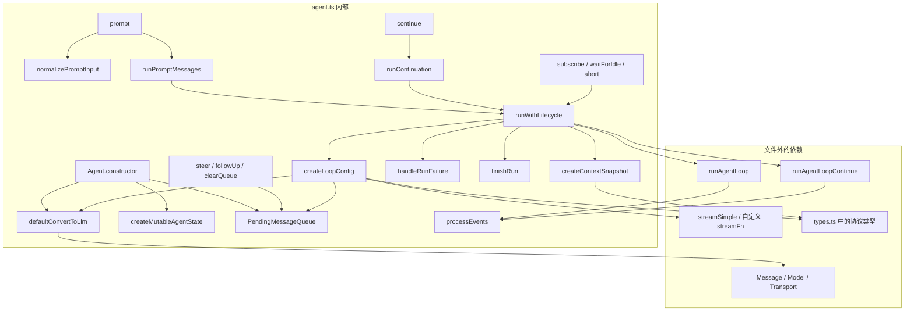
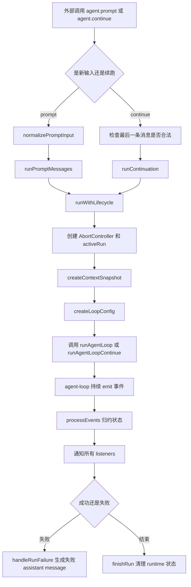
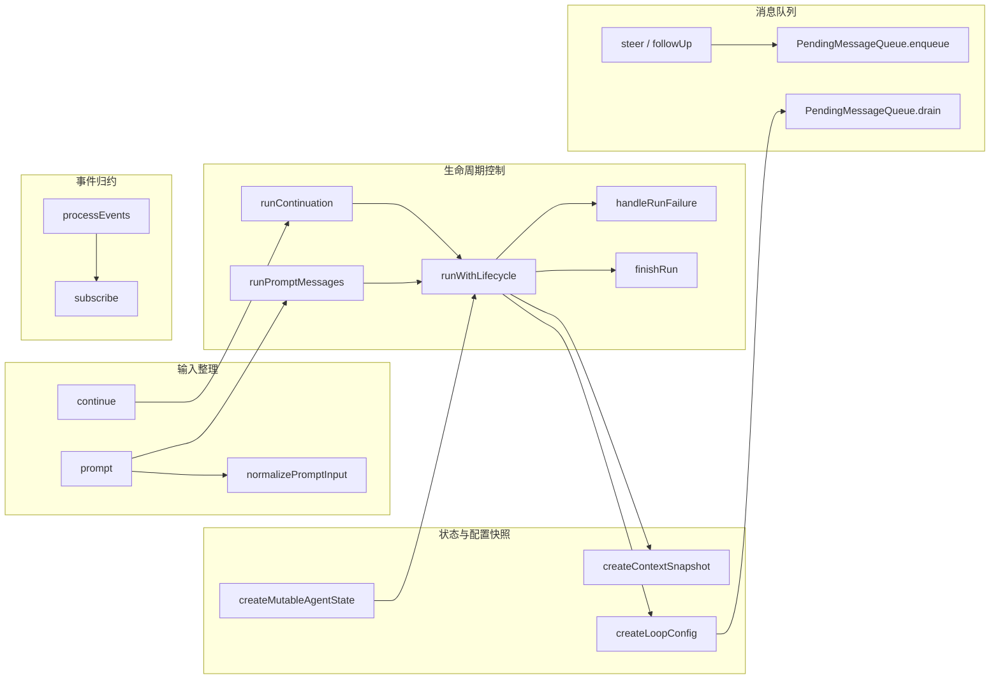
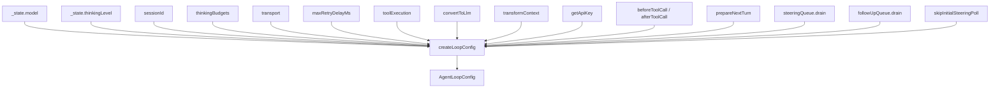
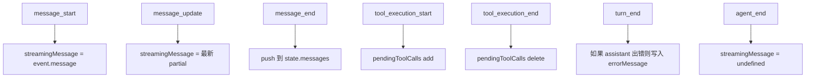

# 09: `agent.ts` 函数流转图谱

这篇文档不再按“源码顺序”讲，而是按“函数怎么流转、为什么这样分层、参数怎么串起来”来讲。

如果第 08 篇解决的是“这个文件逐行在做什么”，这一篇解决的是：

1. `Agent` 为什么要长成现在这样。
2. 每个函数在整条链路里的职责是什么。
3. 外部函数和内部函数之间，边界是怎么划的。
4. 参数不是孤立存在的，它们如何沿着调用链逐步收敛成一次真实的 LLM 请求。

---

## 1. 先抓住一句话

`packages/agent/src/agent.ts` 不是“真正执行推理循环的地方”，它是一个有状态的门面层。

它做 4 件事：

1. 持有状态。
2. 控制一次 run 的生命周期。
3. 管理外部插队消息（`steer` / `followUp`）。
4. 把高层配置整理成低层 loop 能直接执行的配置。

真正执行 assistant stream、tool call、turn 迭代的是 [packages/agent/src/agent-loop.ts](/Users/robot/Documents/Projects/pi/packages/agent/src/agent-loop.ts)。

这就是它最重要的设计思想：

把“状态管理者”和“流程执行器”拆开。

---

## 2. 一张总图：外部关系 + 内部关系



这张图可以读出一个非常关键的事实：

`Agent` 自己并不“思考”。

它做的是：

1. 整理输入。
2. 快照状态。
3. 组装配置。
4. 把执行委托给 loop。
5. 再把 loop 发回来的事件归约回本地状态。

这是一种很稳的写法，因为状态和执行虽然配合，但不会缠死在一起。

---

## 3. 主链路：从外部调用到一次 run 结束



为什么这样写：

1. `prompt()` 和 `continue()` 是两个入口，但它们共用同一套生命周期控制。
2. `runWithLifecycle()` 把“并发互斥、abort、idle 结算、失败收敛”集中在一个地方，避免分散到每个入口里。
3. 真正的流程细节交给 loop，`Agent` 只做壳层 orchestration。

这是一种典型的 facade + engine 结构。

---

## 4. 内部函数关系图：谁负责什么



建议把这些函数分成 5 组理解，而不是一个个孤立理解。

---

## 5. 外部函数之间的关系

这里的“外部函数”，核心是指 `agent.ts` 以外、但直接参与主链路的函数。

### 5.1 `runAgentLoop` / `runAgentLoopContinue`

位置： [packages/agent/src/agent-loop.ts](/Users/robot/Documents/Projects/pi/packages/agent/src/agent-loop.ts)

它们是低层执行入口：

1. `runAgentLoop(prompts, context, config, emit, signal, streamFn)` 用于新 prompt。
2. `runAgentLoopContinue(context, config, emit, signal, streamFn)` 用于续跑。

它们与 `Agent` 的关系不是“父子”，而是“门面层委托执行器”。

`Agent` 负责：

1. 决定什么时候能跑。
2. 提供当前快照。
3. 提供事件接收器 `processEvents`。

`agent-loop` 负责：

1. 跑 turn。
2. 拉取 steering/follow-up。
3. 调用模型。
4. 执行工具。
5. 发事件。

### 5.2 `streamSimple` / 自定义 `streamFn`

位置：`@earendil-works/pi-ai`

这是真正触发模型请求的函数。`Agent` 不直接懂 provider 协议，而是把它再下放一层。

这样写的意义：

1. `Agent` 不与某个 provider 绑死。
2. 可以注入 mock stream 做测试。
3. 高层逻辑稳定，底层传输可替换。

### 5.3 `types.ts` 里的协议函数型接口

位置： [packages/agent/src/types.ts](/Users/robot/Documents/Projects/pi/packages/agent/src/types.ts)

这里最重要的不是“类型本身”，而是它们定义了边界：

1. `AgentMessage` 说明上下文里允许放什么消息。
2. `AgentEvent` 说明 loop 以什么粒度把过程暴露出来。
3. `AgentLoopConfig` 说明高层能影响低层执行器的所有开口。

换句话说，`agent.ts` 的很多函数看似只是在搬运参数，本质是在把“面向业务的 API”收敛成“面向执行器的协议”。

---

## 6. 核心函数逐组解析

## 6.1 输入入口组

### `prompt(input, images?)`

它是“启动一次新 run”的公开入口。

它干什么：

1. 防止并发运行。
2. 把 `string | AgentMessage | AgentMessage[]` 统一成 `AgentMessage[]`。
3. 交给 `runPromptMessages()`。

为什么这样写：

1. 用户层想要方便，所以允许直接传字符串。
2. 执行层想要一致，所以内部尽快统一成消息数组。

参数关系：

1. `input` 是高层友好接口。
2. `images` 只有在 `input` 为字符串时才有意义，会被拼到同一条 `user` 消息里。
3. 进入 loop 之前，输入必须收敛到标准消息结构。

### `continue()`

它是“沿着当前 transcript 继续跑”的入口。

它干什么：

1. 防止并发运行。
2. 检查上下文最后一条消息是否合法。
3. 如果最后一条是 `assistant`，先尝试消费 `steeringQueue`，再尝试消费 `followUpQueue`。
4. 否则进入 `runContinuation()`。

为什么这样写：

`continue()` 不应该凭空制造下一轮，它必须站在一个能合法发给模型的上下文边界上继续。

这也是为什么最后一条不能是 `assistant`。如果最后一条还是 assistant，模型会认为现在轮不到用户说话，也轮不到 tool result 说话。

### `normalizePromptInput(input, images?)`

它是一个小函数，但很关键，因为它把输入世界压扁成执行世界。

参数关系：

1. `string` 会被包装成一条 `role: "user"` 的消息。
2. `images` 会跟文本一起进入 `content` 数组。
3. 已经是 `AgentMessage` 或 `AgentMessage[]` 的输入则直接透传。

设计动机：

公开 API 可以宽松，内部执行 API 必须严格。

---

## 6.2 生命周期控制组

### `runPromptMessages(messages, options?)`

它不做复杂逻辑，只做一件事：

把 `messages` 包进 `runWithLifecycle()`，并在里面调用 `runAgentLoop()`。

这里的重点不在业务，而在结构：

1. prompt 入口共用生命周期模板。
2. 真正的差异只体现在调用哪个 loop 函数、传什么参数。

### `runContinuation()`

和上面同理，只是它调用的是 `runAgentLoopContinue()`。

### `runWithLifecycle(executor)`

这是整个文件最像“中控室”的函数。

它干什么：

1. 保证同一时刻只有一个 active run。
2. 创建 `AbortController`。
3. 创建 `waitForIdle()` 依赖的 `promise`。
4. 设置运行态：`isStreaming = true`。
5. 执行传入的 `executor`。
6. 如果抛错，统一走 `handleRunFailure()`。
7. 最后无论如何都走 `finishRun()`。

为什么这样写：

所有 run 都有相同的“外壳语义”：

1. 可 abort。
2. 可等待 settle。
3. 有统一失败表现。
4. 有统一清理动作。

如果这些散落在 `prompt()`、`continue()`、未来别的入口里，维护成本会急剧上升。

### `handleRunFailure(error, aborted)`

这个函数非常有启发性。

它没有简单地“把错误 throw 给外面”，而是把失败也编码成一条 assistant message，并补齐正常事件序列：

1. `message_start`
2. `message_end`
3. `turn_end`
4. `agent_end`

为什么这样写：

订阅者如果依赖事件流做 UI、日志、状态同步，它们更希望看到“失败也是一个完整结束的 turn”，而不是突然断流。

这是一个非常典型的工程选择：

统一协议，优先于暴露底层异常形态。

### `finishRun()`

它负责清理纯 runtime 状态：

1. `isStreaming = false`
2. 清空 `streamingMessage`
3. 清空 `pendingToolCalls`
4. resolve 当前 run 的 `promise`
5. 移除 `activeRun`

为什么不在 `processEvents()` 里做：

因为“事件结束”不等于“run 真正 settle”。

只有 listeners 都跑完，runtime 才能宣布自己 idle。

---

## 6.3 状态快照与配置收敛组

### `createContextSnapshot()`

它把当前 `_state` 收敛成一个给 loop 使用的 `AgentContext`。

它为什么重要：

1. 低层 loop 应该拿到一份清晰输入，而不是直接操作 `Agent` 的整个内部对象。
2. `messages.slice()` 与 `tools.slice()` 表示这里是“快照边界”，不是共享引用。

这是为了防止两个世界互相污染：

1. 门面层的内部状态。
2. 执行器在当前 run 内部的上下文演进。

### `createLoopConfig(options?)`

这是最值得花时间看的函数，因为绝大多数配置关系都在这里汇合。

它做的不是简单转发，而是“把 Agent 的运行语义翻译成 loop 可执行配置”。

参数流转图如下：



这个函数里最有意思的不是普通字段，而是 3 个被重新包装的回调：

1. `prepareNextTurn`
2. `getSteeringMessages`
3. `getFollowUpMessages`

#### `prepareNextTurn`

源码里把它包装成：使用 `this.signal` 调用。

这说明一个设计意图：

外部传进来的高层 hook，不需要自己知道 abort controller 放在哪，`Agent` 会把当前活动 run 的 signal 注入给它。

#### `getSteeringMessages`

它内部处理了 `skipInitialSteeringPoll`。

为什么要有这个参数：

当 `continue()` 是因为刚刚从 `assistant` 后面消费了队列消息再进入 prompt 路径时，不能在 loop 一开始又立刻把同一波 steering 再 poll 一次，否则语义会重复。

这个布尔值不是业务参数，而是为了修正队列边界语义。

#### `getFollowUpMessages`

它很纯粹，就是把 follow-up 队列 drain 给 loop。

设计上，steering 和 follow-up 都是“外部注入消息”，但注入时机不同：

1. steering 是本轮结束后、下一轮 assistant 之前插入。
2. follow-up 是 agent 本来准备停下时才插入。

---

## 6.4 队列与控制面组

### `PendingMessageQueue`

这个小类的价值不是数据结构，而是把“队列 drain 策略”显式化。

`mode` 只有两种：

1. `all`
2. `one-at-a-time`

为什么值得单独抽出来：

因为“插队消息一次放多少”会直接影响 agent 的行为风格。这个策略不是偶然细节，而是运行语义的一部分。

### `steer(message)`

把消息放进 steering 队列，含义是：

当前 assistant 这轮先走完，但下一次可以尽快插入这条消息。

### `followUp(message)`

把消息放进 follow-up 队列，含义是：

只有 agent 原本打算停下时，才开始处理这条消息。

### `clearSteeringQueue()` / `clearFollowUpQueue()` / `clearAllQueues()` / `hasQueuedMessages()`

这些函数不复杂，但它们补齐了控制面。没有这些函数，外部很难把 `Agent` 当成一个可控运行单元。

---

## 6.5 事件归约组

### `processEvents(event)`

这是另一个核心函数。

它做两步：

1. 先把事件归约到本地状态。
2. 再按订阅顺序通知 listeners。

事件到状态的映射关系如下：



为什么先归约、再通知：

订阅者通常希望拿到的是“事件发生后的一致状态”，而不是“事件还没反映到状态里”的半成品。

这是一种很常见但很容易被忽略的顺序设计。

### `subscribe(listener)`

它返回取消订阅函数，本身不复杂。

真正关键的是：listener 会被 `await`。

这意味着：

1. 监听器不是旁路观察者，它参与 run 的 settle。
2. `waitForIdle()` 等待的是“loop 完成 + listeners 完成”。

为什么这很重要：

如果 UI、日志落盘、状态同步是通过 listener 完成的，那么“逻辑结束”并不等于“系统稳定”。把 listener 纳入 idle 语义，能减少大量边界 bug。

### `abort()` / `signal` / `waitForIdle()`

这三个函数是运行控制面的最小闭环：

1. `abort()` 负责中断。
2. `signal` 暴露当前 run 的 abort signal。
3. `waitForIdle()` 负责等待真正 settle。

---

## 7. 参数之间真正的联系

如果只看类型定义，很多参数像是散的；但沿着调用链看，它们其实形成了 4 条主线。

### 7.1 消息主线

```mermaid
flowchart LR
    I1[input string / AgentMessage] --> I2[normalizePromptInput]
    I2 --> I3[AgentMessage[]]
    I3 --> I4[createContextSnapshot]
    I4 --> I5[runAgentLoop]
    I5 --> I6[transformContext]
    I6 --> I7[convertToLlm]
    I7 --> I8[Message[]]
```

启发：

高层消息结构故意保留更强表达力，直到最后一刻才压缩成 LLM 能理解的协议。

这样做的好处是：

1. 中间层可以挂自定义消息。
2. UI 或 harness 可以保留更多运行时语义。
3. 真正面向模型时再收敛，不会过早丢信息。

### 7.2 模型与推理主线

`_state.model`、`thinkingLevel`、`thinkingBudgets`、`transport`、`sessionId`、`maxRetryDelayMs` 最终都汇入 `createLoopConfig()`。

它们共同描述的是“下一次 provider 请求该怎么发”。

也就是说：

1. `Agent` 持有长期运行偏好。
2. loop 在每次 turn 里消费这些偏好。
3. `prepareNextTurn()` 又允许在回合之间动态调整这些偏好。

### 7.3 工具执行主线

`beforeToolCall`、`afterToolCall`、`toolExecution` 最终都进入 loop。

这说明一个边界判断：

1. tool 的“策略”由 `Agent` 装配。
2. tool 的“执行细节”由 loop 落地。

这比把工具逻辑直接写进 `Agent` 更合理，因为 tool execution 本质属于 turn 执行器，不属于状态门面。

### 7.4 队列控制主线

`steeringMode`、`followUpMode`、`steer()`、`followUp()`、`skipInitialSteeringPoll` 共同描述的是“外部消息以什么节奏重新进入主循环”。

这条线非常像一个小型调度器。

---

## 8. 为什么这种写法值得学

## 8.1 门面层不要直接背流程细节

`Agent` 有状态，但没有把 assistant stream、tool batch、turn 推进全塞进去。

这样做的结果是：

1. `Agent` 更像一个稳定 API。
2. `agent-loop` 更像一个可单测、可替换、可推演的执行器。

## 8.2 错误也走正常协议

`handleRunFailure()` 的思路非常值得借鉴。

不是“异常时另开一套世界”，而是“异常仍然投影回既有事件模型”。

这会让上层观察者、UI 和持久化逻辑简单很多。

## 8.3 快照边界要明确

`createContextSnapshot()` 与 `createMutableAgentState()` 里的数组拷贝，说明作者很在意共享引用污染。

这是状态系统最常见、最隐蔽的问题之一。

## 8.4 队列语义要显式建模

很多系统会把“插队消息”偷偷写成若干 if/else。这里单独做成 `PendingMessageQueue`，并给出 `QueueMode`，是更工程化的写法。

因为这说明作者把它当成正式能力，而不是偶然补丁。

---

## 9. 推荐阅读顺序

如果你现在准备真正修改 [packages/agent/src/agent.ts](/Users/robot/Documents/Projects/pi/packages/agent/src/agent.ts)，建议按这个顺序回看源码：

1. 先看 `prompt()`、`continue()`、`runWithLifecycle()`，建立大骨架。
2. 再看 `createLoopConfig()`，理解参数如何汇合。
3. 再看 `processEvents()`，理解 loop 怎样回写状态。
4. 最后去看 [packages/agent/src/agent-loop.ts](/Users/robot/Documents/Projects/pi/packages/agent/src/agent-loop.ts)，把门面层和执行层拼起来。

如果你已经读过第 08 篇，这一篇最应该带走的是两个判断：

1. 哪些函数是在“整理运行语义”。
2. 哪些函数是在“真正推进执行”。

把这两类函数分开看，这个文件会一下子清楚很多。