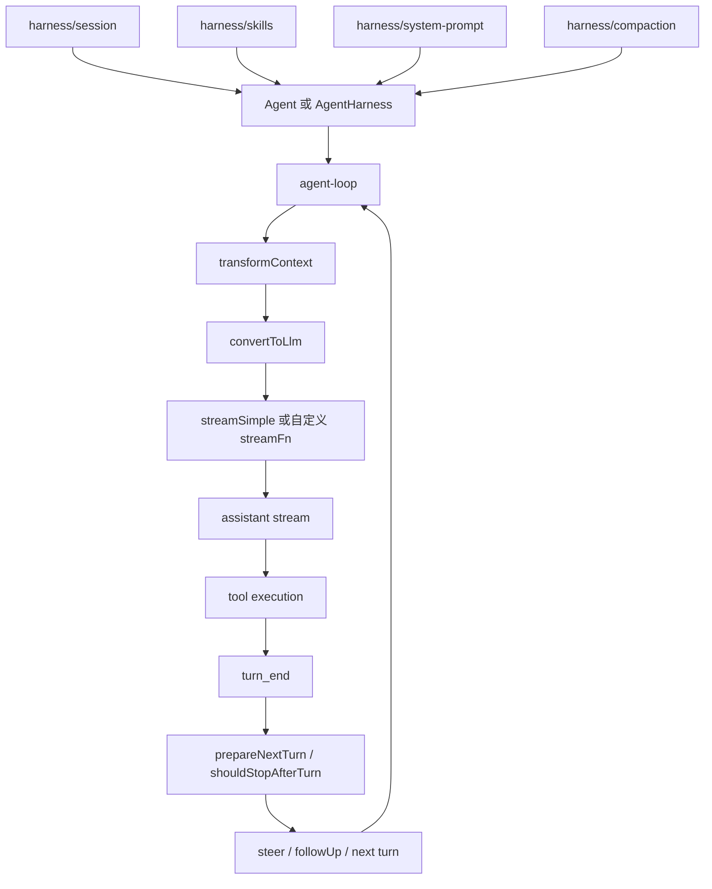

# packages/agent 教程索引

这套教程面向“读源码理解设计”，不是使用手册。建议按顺序阅读，先建立主循环和协议边界，再进入 harness、session 与测试。

## 阅读顺序

1. [01-overview-and-main-loop.md](01-overview-and-main-loop.md)
   先抓 `Agent`、`agent-loop`、`convertToLlm()` 和 turn 生命周期的主链路。
2. [02-state-messages-and-events.md](02-state-messages-and-events.md)
   理解 `AgentState`、`AgentMessage`、`AgentEvent` 和可扩展协议边界。
3. [03-tool-calls-and-turn-control.md](03-tool-calls-and-turn-control.md)
   理解 tool call、hook、并行执行、early terminate 与下一轮推进的关系。
4. [04-harness-architecture.md](04-harness-architecture.md)
   从 `AgentHarness` 视角理解运行时配置、phase、save point 与队列语义。
5. [05-session-compaction-and-hooks.md](05-session-compaction-and-hooks.md)
   理解 session tree、compaction、hooks 以及为什么这些能力不放进 `Agent` 本体。
6. [06-tests-notes-and-study-plan.md](06-tests-notes-and-study-plan.md)
   用测试反推行为契约，并给出一条实际可执行的学习路线。
7. [07-file-map-and-relationships.md](07-file-map-and-relationships.md)
   按文件整理 `packages/agent/src` 的职责、依赖关系和最值得先读的入口。
8. [08-agent-ts-deep-dive.md](08-agent-ts-deep-dive.md)
   对 `packages/agent/src/agent.ts` 做逐函数、逐参数、逐依赖关系的精读。

## 先记住 4 层结构

`packages/agent` 的源码可以先粗分成 4 层：

1. 核心状态层：`Agent` 负责持有状态、事件订阅、排队与 run settlement。
2. 核心循环层：`agent-loop` 负责 prompt、assistant stream、tool execution、turn 迭代。
3. 协议层：`types.ts` 定义消息、事件、hook、tool execution mode 等公共契约。
4. 运行环境层：`harness/` 把 session、skills、prompt template、compaction、hooks 接到主循环上。

## 一张总图

## 这套教程的目标

读完之后，你应该能回答：

1. `Agent` 和 `agent-loop` 分层的真实原因是什么。
2. 为什么 `AgentMessage` 要晚到 LLM 边界才转换成 `Message`。
3. tool call 为什么会直接决定 turn 是否继续。
4. `AgentHarness` 相比裸 `Agent` 增加了哪些产品级运行语义。
5. 应该先读哪些测试，才能最快验证自己的理解。

## 建议用法

如果你第一次读 `packages/agent`，按章节顺序读。

如果你已经理解核心循环，只想进入完整运行环境，可以直接从 [04-harness-architecture.md](04-harness-architecture.md) 开始，再回头补前两章。