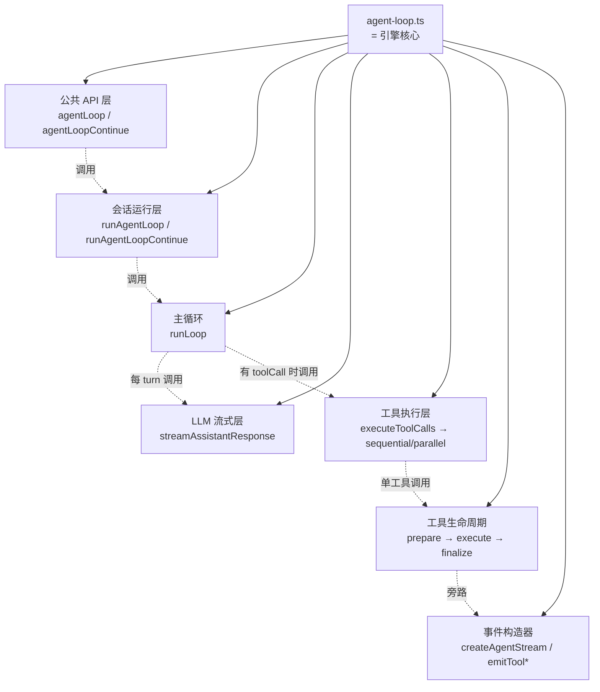
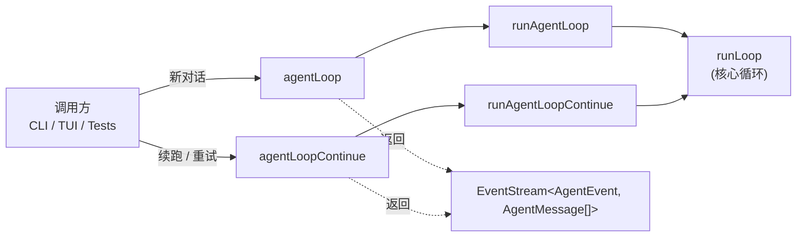
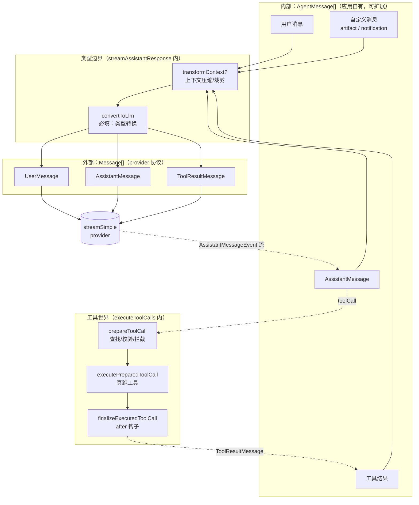
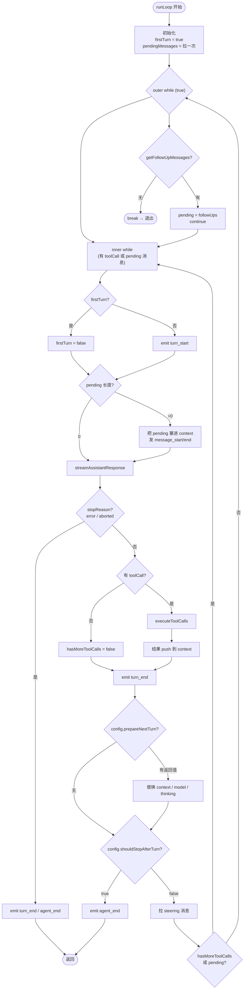
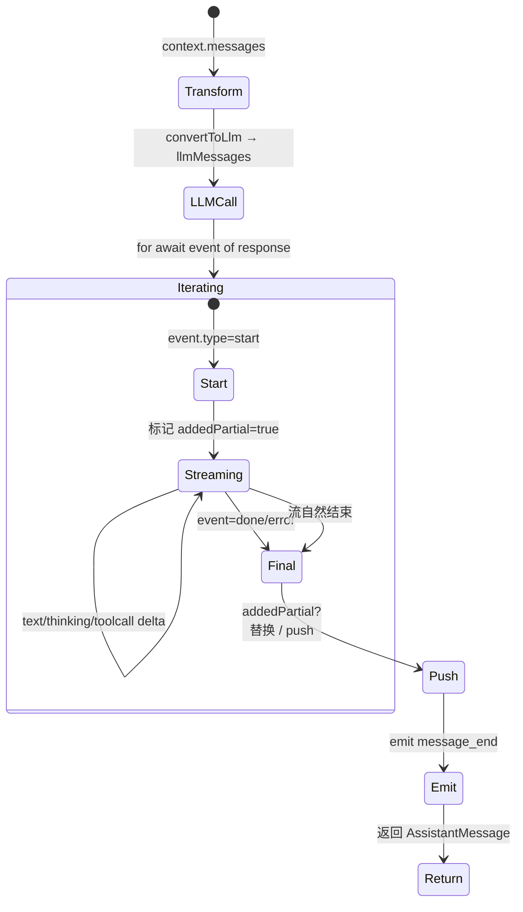
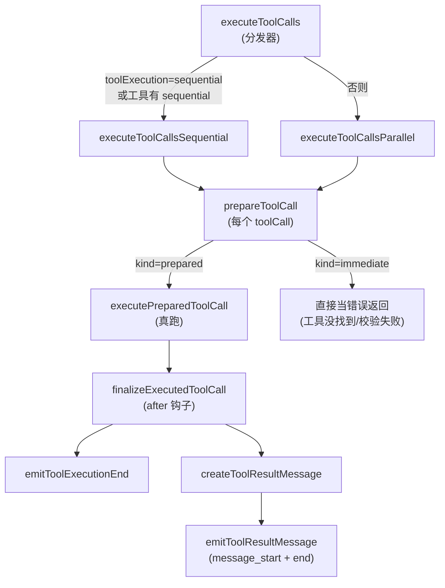
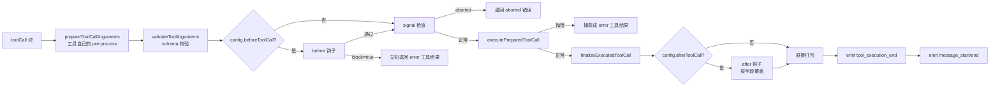
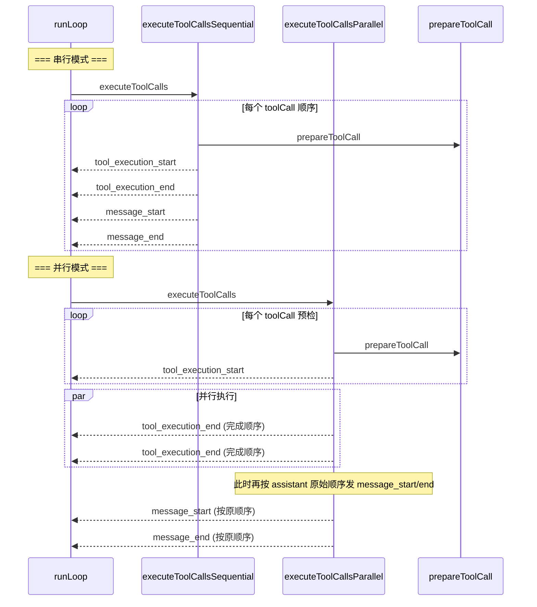
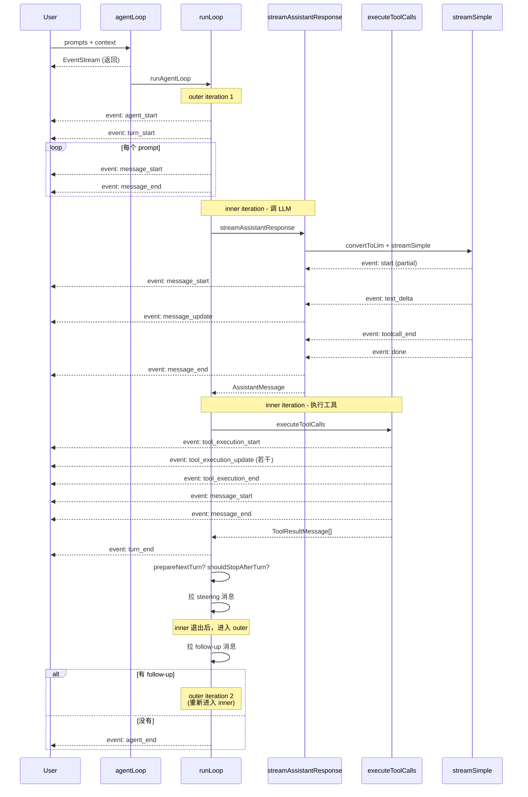
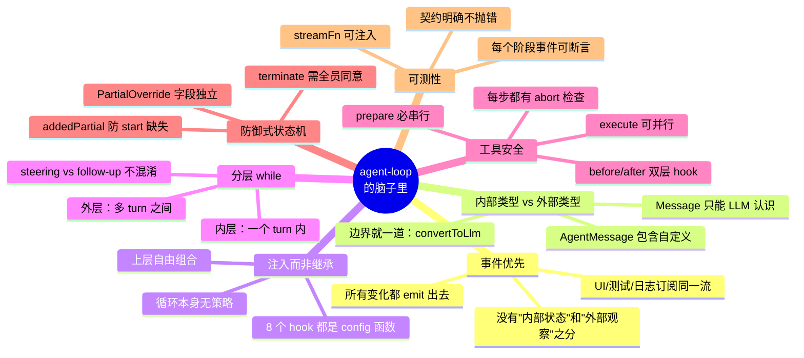

# `agent-loop.ts` 脑图笔记

> 目标：**抓住作者的设计意图**——这个文件不是"一个 LLM 调用的循环"，而是把"对话/工具/事件/可扩展性"四种关注点分离后重新缝合的容器。

---

## 0. 一句话心智模型

```
agent-loop.ts = 一个"事件源" + 一个"可注入的循环" + 一道"类型边界"
```

- **事件源** — 所有状态变化都通过 `emit(event)` 流出去，UI / 日志 / 测试订阅同一份事件。
- **可注入的循环** — 业务策略（上下文压缩、工具权限、是否停、转 model）全部走 `AgentLoopConfig` 里的 hook 函数，循环本身没有策略。
- **类型边界** — 内部全程用 `AgentMessage[]`（可扩展），只在调 LLM 的那一行转成 `Message[]`（provider 认识），转完即丢，不污染主循环。

这个三角支撑了后面所有的设计选择。

---

## 1. 文件整体包含关系（Hierarchy）



**为什么这样分层？**
- API 层只管"建流 + 包事件"，不碰循环细节
- 运行层只管"塞 prompt + 启动循环 + 收尾"，不碰 turn 细节
- 主循环 `runLoop` 是唯一能**多轮迭代**的地方，所以它最复杂
- LLM 流式层和工具执行层都是**单 turn 内**的事，被主循环反复调用
- 工具生命周期是**单工具**的事，被 sequential/parallel 共用

> 设计原则：**越外层越策略，越内层越机械**。外层问"还要继续吗"，内层只问"这一步怎么走"。

---

## 2. 外部函数关系（Public Surface）



**为什么有两条入口而不是一条？**
- `agentLoop(prompts, ctx, ...)`：**追加新消息**到 context（"用户又发了条消息"）
- `agentLoopContinue(ctx, ...)`：**复用现有 context**（"重试上次失败 / 上一轮工具结果已就位"）
- `continue` 故意不做"清空 / 拼接"，把责任完全交给调用方——这样上层能自己决定"重试到底什么"
- 但两者**都校验最后一条消息的 role ≠ assistant**（line 74 / line 131）—— provider 协议上 assistant 后面跟 assistant 不合法

---

## 3. 内部数据流（最关键的一张图）



**为什么要把这道边界放在 LLM 调用前？**
- 让所有 hook（`beforeToolCall` / `afterToolCall` / `transformContext`）都操作**内部类型**——它们不需要懂 provider 的怪癖
- 内部类型可以是 `CustomAgentMessages`（UI 通知、artifact 引用等），这些**永远不会发给 LLM**
- 转换责任**收敛在一个地方**（`convertToLlm`），换 provider 时只改这一处
- "自定义消息不能转 LLM" 的过滤也在转换函数里，**不污染主循环的判断逻辑**

---

## 4. 主循环 `runLoop` 控制流



**外层 vs 内层的语义差别（重要）：**

| 维度 | inner loop（一个 turn 内） | outer loop（多 turn 间） |
|---|---|---|
| 触发再循环的原因 | 还有 toolCall 没跑完 / 有 steering 消息 | 没人想停，但有 follow-up 排队 |
| 消费的消息类型 | steering（**打断式**：插在 assistant 之后） | follow-up（**追加式**：等当前会话自然停） |
| 模型/工具可能换 | 否（一个 turn 内固定） | 是（每个 turn 独立 `prepareNextTurn`） |
| 退出条件 | 跑完所有 toolCall 且没人想插话 | 没有 follow-up |

**为什么 steering 和 follow-up 拆开？**
- **steering** = 用户在 agent 工作时打字，要"插队"，**不能跳过当前工具**
- **follow-up** = 排在队尾的消息，要"等 agent 自己讲完话"
- 一个是 **synchronous interruption**，一个是 **asynchronous queue**——混淆会破坏语义
- 看 `runLoop` line 167、253（steering 拉取点）和 line 257（follow-up 拉取点）位置就懂

---

## 5. LLM 流式层 `streamAssistantResponse` 状态机



**为什么有 `addedPartial` 标志位？**
- `start` 事件携带**最初的 partial 消息**——循环要把它先 push 到 context，让"当前正在流的消息"对其它 hook 可见
- `done`/`error` 之后流可能不会再产生 `start`——但 context 里**必须**有这条消息
- `addedPartial` 区分两种情况：
  - `true`：`context.messages[length-1]` 已经是 partial 了，**替换**即可
  - `false`：流里没收到 `start`（很少见但合法），**push** 一条
- 同样的逻辑在 line 345-365 出现两次（done/error 一次 + 流自然结束一次）—— 因为**正常完成和异常完成都需要落库**

**为什么 `transformContext` 放在 `convertToLlm` 之前？**
- `transformContext` 操作 `AgentMessage[]`（应用层抽象）
- `convertToLlm` 操作内部类型→provider 类型
- 顺序：**先剪裁，再转译**——剪裁后的消息少，转译也快
- 而且"上下文压缩"这类操作**不该看到 LLM 消息**（它管的是应用层的对话历史）

**为什么 `getApiKey` 每次 LLM 调用都跑一次？**
- OAuth token 短效（GitHub Copilot 等），**一个长跑 agent 可能跨多个 token 生命周期**
- 抽到 config 里、每次拉新，是"宁可重复取，也不能过期"的策略

---

## 6. 工具执行层

### 6.1 整体包含关系



### 6.2 工具生命周期（单工具视角）



**为什么拆 `prepare` / `execute` / `finalize` 三段？**
- `prepare`：**纯函数式**（不做 I/O）——参数预处理、schema 校验、`beforeToolCall` 拦截
- `execute`：**真跑工具**，会 await，可能抛错，可能发 `tool_execution_update`
- `finalize`：**结果改写**——`afterToolCall` 可以审核、改写、决定是否 terminate

**为什么 `prepare` 要在并行模式下串行做？**
- 校验 / 拦截是轻量的，但**能 fail-fast**——一个参数不合法的工具，后面并行执行就是浪费
- 看 `executeToolCallsParallel` line 461-500：先**同步跑完所有 prepare**，再把"活的"塞进 thunk 数组
- 这种"**预检串行、执行并行**"是控制并发安全 + 最大化并行的经典模式

### 6.3 串行 vs 并行的"事件顺序"差异



**为什么事件顺序这样安排？**
- `tool_execution_start/end` —— 反映**真实完成顺序**，UI 要实时显示进度
- `message_start/end` —— 反映 **LLM 看到的顺序**（assistant 源顺序），否则下一轮 LLM 拿到错位的工具结果
- 串行模式天然两者一致；并行模式必须**把 message 事件延后**到 `Promise.all` 之后
- 这是 `executeToolCallsParallel` line 502-510 的微妙之处

### 6.4 `FinalizedToolCallEntry` 联合类型设计

```typescript
type FinalizedToolCallEntry =
  | FinalizedToolCallOutcome       // immediate：已经完成
  | (() => Promise<FinalizedToolCallOutcome>);  // prepared：待执行
```

**为什么是这个形态？**
- 并行模式下，`prepare` 时**无法预知**结果是 immediate（错误）还是需要真正执行
- 立即错误 → 直接把 `outcome` 塞进数组（line 471-477）
- 需要执行 → 塞一个 thunk（line 484-496）
- 最后用 `typeof entry === "function" ? entry() : Promise.resolve(entry)`（line 503）统一收敛
- **统一收口 + 保留类型差异**——比"全部包成 thunk"少一次 microtask

---

## 7. 关键设计哲学（"为什么"汇总）

| 决策 | 表层原因 | 深层原因 |
|---|---|---|
| `AgentMessage[]` 内部 + `Message[]` 边界 | 协议兼容 | 让自定义消息（UI 通知/artifact）不污染 LLM 协议 |
| Hook 函数（`transformContext`/`beforeToolCall`/...） | 配置驱动 | 业务策略和执行机制解耦，循环本身可被任何上层复用 |
| `convertToLlm` **必填**而非可选 | 类型安全 | 强制调用方声明"如何映射"，而不是循环瞎猜 |
| `convertToLlm` / `transformContext` 契约"**不要抛错**" | 健壮性 | 这俩是循环的"必要环节"，抛错会让 agent 死得很难看 |
| 双层 while（inner/outer） | 控制 turn 边界 | 一个 turn 内换 model 没必要；多 turn 间才需要换 |
| Steering 在 turn_end 后拉 | 不打断工具 | 用户在工具执行中打字，等当前工具跑完再注入新指令 |
| Follow-up 在"无 toolCall & 无 steering"时拉 | 自然排队 | "我现在没活了，下一条是谁的" |
| 工具 prepare 串行、execute 可并行 | fail-fast + 最大并发 | 校验便宜无副作用；执行慢可能重资源 |
| `getApiKey` 每次调用 | 短效 token | OAuth 时代 token 会过期，跨长 agent run 必须重拉 |
| `addedPartial` 状态标志 | 状态机补全 | 防御性编程：流协议不保证一定有 `start` 事件 |
| `streamFn` 可注入 | 测试 + 代理 | 不让循环和具体 provider SDK 耦合，方便 mock / 代理 |
| `PartialOverride` after 字段合并 | 不打破既有契约 | 想改 `terminate` 不需要重发 `content/details` |
| `terminate` 必须**所有工具**都同意 | 防止误停 | 一个工具认为完成 ≠ 应该停；要达成共识 |

---

## 8. 状态变化全景（一次典型 run 的事件序列）



---

## 9. 一图带走：作者脑子里在画什么



---

## 10. 跟读建议（按上面这个心智模型走）

1. **先读 §3 数据流图** —— 抓住"内/外类型边界"这个最核心的隐喻
2. **再读 §4 主循环图** —— 理解"双层 while + steering/follow-up 拆开"是这套架构的骨架
3. **再读 §6 工具层** —— 体会"prepare/execute/finalize 三段"和"preflight 串行 + execute 并行"
4. **最后对照源码** —— 看完图再读 line 155-269 的 `runLoop`，会发现每一行都在回应上面某张图
5. **随手翻 §7 哲学表** —— 任何"为什么这样写"的疑问，去那张表查

> 一旦你接受了"事件是真相、循环是容器、类型有边界"这三件事，整个文件读起来会顺畅很多。
