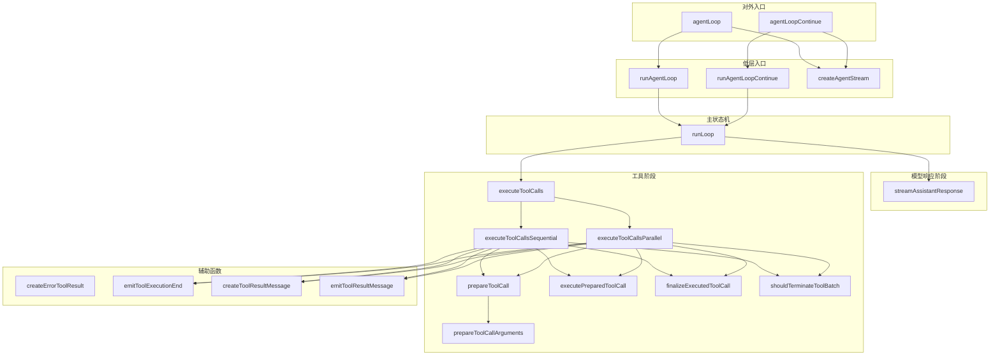
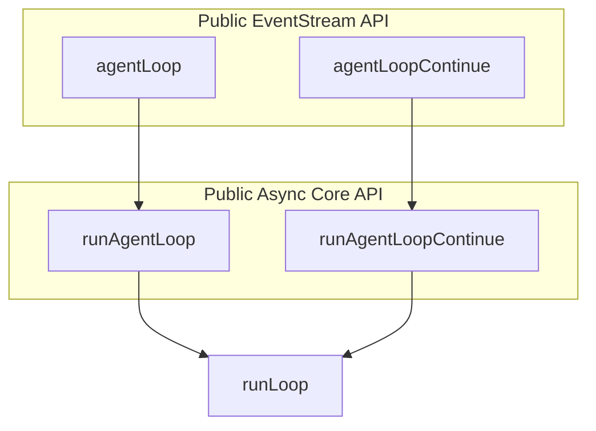
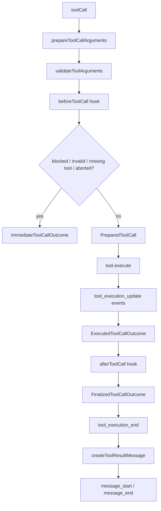
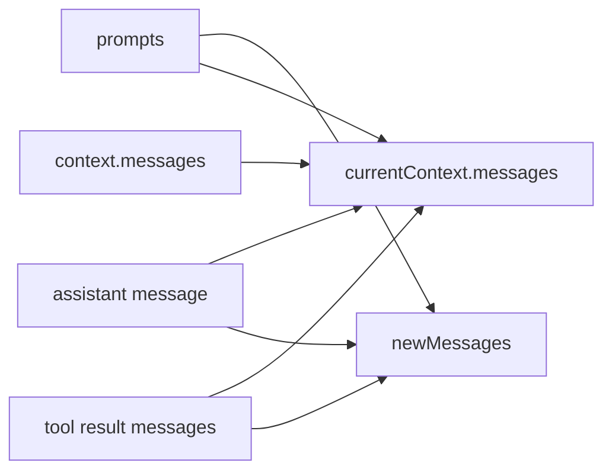

# agent-loop.ts 源码阅读导图

这份文档不是 API 手册，而是从“这个文件在整个 agent 系统里承担什么职责”出发，帮助你读懂 [packages/agent/src/agent-loop.ts](../src/agent-loop.ts)。

如果只看一句话：`agent-loop.ts` 是一个低层运行时状态机。它把下面几件事串成一个稳定回路：

- 接收新消息或继续已有上下文
- 调用 LLM 流式生成 assistant 消息
- 识别 assistant 发出的 tool call
- 执行工具，并把结果重新放回上下文
- 通过事件流把全过程暴露给 UI、日志、上层 Agent 包装器

它的目标不是“帮你持久化所有状态”，也不是“定义产品级 Agent 行为”，而是把一次 agent run 内部的最小闭环做扎实。

## 1. 它在整体结构里的位置

先看文件外部关系。

```mermaid
flowchart TD
    A[Agent class\npackages/agent/src/agent.ts] --> B[runAgentLoop / runAgentLoopContinue]
    C[Direct callers / tests / harness] --> B
    B --> D[runLoop]
    D --> E[streamAssistantResponse]
    D --> F[executeToolCalls]
    E --> G[streamSimple or injected streamFn\n@earendil-works/pi-ai]
    E --> H[convertToLlm]
    F --> I[validateToolArguments\n@earendil-works/pi-ai]
    F --> J[AgentTool.execute]
    D --> K[AgentEventSink emit]
    B --> L[EventStream wrapper]
```

可以把它理解成三层：

- 最上层是 [packages/agent/src/agent.ts](../src/agent.ts)，它是有状态的 `Agent` 类，负责持有长期状态、监听器、队列等。
- 中间层是 [packages/agent/src/agent-loop.ts](../src/agent-loop.ts)，它负责“一次运行”的控制流。
- 最底层是外部依赖和注入能力，比如 `streamSimple`、`validateToolArguments`、工具本身的 `execute`、以及 `convertToLlm` 这些策略点。

所以这个文件最核心的价值，是把“业务可变策略”和“运行流程骨架”分开。

## 2. 这个文件内部有哪些层

文件内部可以分成四层：

1. 对外入口：`agentLoop`、`agentLoopContinue`
2. 低层入口：`runAgentLoop`、`runAgentLoopContinue`
3. 主状态机：`runLoop`
4. 子阶段：模型响应、工具执行、事件/消息封装



这种拆法的重点不是“函数变多”，而是把不同决策点拆开：

- 对外入口只负责把异步过程包装成事件流
- 低层入口只负责初始化上下文和首轮事件
- `runLoop` 只负责回合控制
- 工具执行继续拆成 prepare / execute / finalize，分别处理校验、副作用、后处理

## 3. 外部入口函数关系

文件对外暴露 4 个主要入口，可以分成两组。



### `agentLoop(...)`

职责：给调用方一个 `EventStream` 风格的接口。

它做的事很少：

- 创建 `EventStream`
- 调用 `runAgentLoop(...)`
- 把底层发出的事件 `push` 到 stream
- 等底层结束后，把最终 `messages` 作为 stream result 收尾

为什么要这样写：

- 有些调用方想 `for await ... of` 订阅事件
- 有些调用方只想等最终结果
- `EventStream` 允许两者同时成立

### `agentLoopContinue(...)`

职责：从现有上下文继续运行，不注入新的 prompt。

它和 `agentLoop(...)` 的区别不是“逻辑不同”，而是“起点不同”：

- `agentLoop` 会把 `prompts` 先加进上下文
- `agentLoopContinue` 假设上下文里已经有该有的用户消息或 tool result

这里前置检查很重要：

- `context.messages` 不能为空
- 最后一条消息不能是 `assistant`

原因很直接：下一次给 LLM 的最后一条通常应该是 user 或 tool result，否则 continuation 的语义就断了。

### `runAgentLoop(...)`

职责：做真正的“新 prompt 开始一轮 run”的异步逻辑。

它会：

- 构造 `newMessages = [...prompts]`
- 构造 `currentContext = old context + prompts`
- 发出 `agent_start`、`turn_start`、prompt 的 `message_start/end`
- 调用 `runLoop(...)`
- 返回本次新增消息数组

### `runAgentLoopContinue(...)`

职责：做 continuation 场景下的底层逻辑。

和 `runAgentLoop` 的区别是：

- 不追加新 prompt
- `newMessages` 初始为空
- `currentContext` 直接从现有 `context` 开始

这里能看出作者的一个思路：

- 对外入口分成“有 stream 包装”和“纯 async 核心”两层
- 对内又分成“新 prompt 起跑”和“从已有上下文继续”两种起点

这样复用多，但语义仍然清楚。

## 4. 真正的核心：`runLoop(...)`

如果这个文件只能读一个函数，就读 `runLoop(...)`。

它是整个状态机的中心调度器。

```mermaid
flowchart TD
    A[runLoop start] --> B[读取初始 steering messages]
    B --> C{outer while true}
    C --> D[hasMoreToolCalls = true]
    D --> E{inner while\nhasMoreToolCalls || pendingMessages}
    E --> F[emit turn_start except first turn]
    F --> G[注入 pending messages 到 context/newMessages]
    G --> H[streamAssistantResponse]
    H --> I{assistant stopReason\nerror or aborted?}
    I -- yes --> J[emit turn_end]
    J --> K[emit agent_end]
    I -- no --> L[提取 tool calls]
    L --> M{有 tool calls?}
    M -- yes --> N[executeToolCalls]
    M -- no --> O[toolResults = []]
    N --> P[tool result messages 追加到 context/newMessages]
    O --> Q[emit turn_end]
    P --> Q
    Q --> R[prepareNextTurn]
    R --> S{shouldStopAfterTurn?}
    S -- yes --> T[emit agent_end and return]
    S -- no --> U[拉取 steering messages]
    U --> E
    E --> V[拉取 follow-up messages]
    V --> W{有 follow-up?}
    W -- yes --> X[设为 pendingMessages 并继续 outer loop]
    W -- no --> Y[emit agent_end]
```

### 为什么是双层循环

这是这个文件最值得学的设计之一。

内层循环负责“当前这次 agent 还没真正停下来”的情况：assistant 还在走工具链，或者有 steering message 要在下一次模型调用前插入。

外层循环负责“agent 本来要停了，但后来又有 follow-up message 进来”的情况。这样拆的好处是语义非常清楚：

- steering message 是“半路插队”
- follow-up message 是“本轮做完后再接着来”

如果只写一个大循环，这两种消息的时机会混在一起，代码会更难解释。

### `firstTurn` 为什么存在

`runAgentLoop(...)` 和 `runAgentLoopContinue(...)` 在进入 `runLoop(...)` 之前已经发过一次 `turn_start`。

因此 `runLoop(...)` 不能在第一次进入内层循环时再发一次，否则 turn 事件就重复了。所以这里用 `firstTurn` 来跳过第一次循环的 `turn_start`。

## 5. LLM 边界：`streamAssistantResponse(...)`

这个函数非常关键，因为它是整个文件里“Agent 世界”和“LLM 世界”的交界处。

```mermaid
flowchart TD
    A[currentContext.messages] --> B{transformContext?}
    B --> C[AgentMessage[]]
    C --> D[convertToLlm]
    D --> E[Message[]]
    E --> F[build llmContext]
    F --> G[resolve apiKey]
    G --> H[streamFn or streamSimple]
    H --> I[消费流式事件]
    I --> J[更新 partial assistant message]
    J --> K[emit message_start/update/end]
    K --> L[返回最终 AssistantMessage]
```

它做了 5 件事：

1. 可选地对 `AgentMessage[]` 做 `transformContext`
2. 用 `convertToLlm` 把消息转成真正传给模型的 `Message[]`
3. 组装 `llmContext`
4. 调用 `streamFn` 获得流式 assistant 响应
5. 一边消费响应事件，一边更新 `context.messages` 中最后那条 assistant 消息

这里的关键思想有两个：

- 内部尽量一直保留 `AgentMessage`，只在模型边界做 `convertToLlm`
- `context.messages` 的最后一条始终代表“当前 assistant 回复的最新版本”

这样 UI 能实时展示流式内容，主循环也不用关心 partial/final message 的差别。

## 6. 工具调用层：`executeToolCalls(...)`

assistant 消息里只要出现 `toolCall`，就进入这个阶段。

它先判断是顺序执行还是并行执行：

- 全局 `config.toolExecution === "sequential"`
- 或某个工具声明了 `executionMode === "sequential"`

只要任一工具要求顺序执行，整批就走顺序模式。

### 为什么不直接“拿到 toolCall 就 execute”

这里的实现故意拆成了多段：

- `prepareToolCallArguments`
- `prepareToolCall`
- `executePreparedToolCall`
- `finalizeExecutedToolCall`



这套拆法的思想价值很高。

### `prepareToolCall(...)`

这是“预检阶段”。它负责：

- 查找工具是否存在
- 参数 schema 校验
- 执行 `beforeToolCall`
- 检查 abort

失败时不一定 throw，而是返回 `ImmediateToolCallOutcome`。这样即使前置检查失败，loop 仍然可以按统一协议产出 tool result，而不是把整个 turn 打断。

### `executePreparedToolCall(...)`

这里才是真正调用 `tool.execute(...)` 的地方。它把工具执行中的增量信息转成 `tool_execution_update` 事件，这样 UI 不需要知道工具内部实现，也能实时展示进度。

### `finalizeExecutedToolCall(...)`

这里允许 `afterToolCall` 重写：

- `content`
- `details`
- `terminate`
- `isError`

这让“工具功能”和“运行时策略”继续分开，避免把所有决策都塞进工具本体。

## 7. 顺序执行 vs 并行执行

### `executeToolCallsSequential(...)`

特征：一个个执行，每个工具完整走完生命周期再处理下一个。

适合：

- 工具有副作用，需要严格顺序
- 后一个工具依赖前一个工具的外部状态
- 想更容易地处理中途 abort

### `executeToolCallsParallel(...)`

特征：预检仍然顺序执行，但真正的执行部分并发跑。

这里最值得学的点是，它刻意保住了两种顺序：

- `tool_execution_end` 按真实完成顺序发出
- `tool result message` 最终按 assistant 原始 toolCall 顺序产出

这不是简单 `Promise.all`，而是把“并发执行顺序”和“结果入 transcript 的顺序”分开处理。

## 8. 参数之间的联系

### 与状态有关的参数

- `prompts`：本次新注入的消息
- `context`：调用前已有的上下文快照
- `currentContext`：loop 内部实际不断变化的上下文
- `newMessages`：本次 run 新增的消息收集器，也是最终返回值来源

它们关系如下：



关键理解：

- `currentContext.messages` 决定下一次模型调用看到什么
- `newMessages` 决定这个函数最后向外返回什么

### 与控制策略有关的参数

- `config`：本次 run 的策略控制面板，决定模型、转换、hook、停止条件、队列注入时机
- `streamFn`：LLM 调用实现的注入点，默认是 `streamSimple`

### 与可观测性和取消有关的参数

- `emit`：整个文件的事件出口，把运行时从 UI/日志/外部监听器解耦
- `signal`：整次 run 的取消令牌，传给 `transformContext`、hook、工具执行和模型流

## 9. 事件视角下，这个文件为什么好用

一个典型 turn 的事件顺序大致是：

```text
agent_start
turn_start
message_start(user)
message_end(user)
message_start(assistant partial or final)
message_update(...)
message_end(assistant)
tool_execution_start
tool_execution_update
tool_execution_end
message_start(toolResult)
message_end(toolResult)
turn_end
agent_end
```

这种设计的好处不只是“方便日志”，更深一层是：

- 控制流和呈现层分离
- 事件边界天然形成调试点
- 测试可以验证时序，而不仅仅是验证最终结果

## 10. 你最值得学的几个写法

### 1. 把“一次 run 的流程骨架”和“上层 Agent 状态管理”分开

`agent.ts` 负责长生命周期对象，`agent-loop.ts` 负责一次执行过程。这样职责边界非常清楚。

### 2. 在 LLM 边界才做消息类型收敛

内部一直保留 `AgentMessage`，只有真正调模型时才 `convertToLlm`。这让系统既能扩展，又不把 provider 层污染到全局。

### 3. 用双层循环准确表达两种“继续”

- tool / steering 造成的继续
- follow-up 造成的新一波继续

### 4. 把工具调用拆成 prepare / execute / finalize

这让校验、hook、并发、错误处理、结果改写都能各归其位，而不是糊成一个大函数。

### 5. 全流程事件化

事件不是附加功能，而是运行时协议本身的一部分。这使得 UI、测试、日志系统都能站在统一抽象上工作。

## 11. 读这个文件的推荐顺序

1. 先读 [packages/agent/src/types.ts](../src/types.ts) 里的 `AgentContext`、`AgentEvent`、`AgentLoopConfig`
2. 再读 [packages/agent/src/agent-loop.ts](../src/agent-loop.ts) 里的 `runLoop(...)`
3. 接着读 `streamAssistantResponse(...)`
4. 再读 `executeToolCalls(...)` 及其 prepare/execute/finalize 三段
5. 最后回头看 `agentLoop(...)` / `runAgentLoop(...)` 这些入口包装

## 12. 一句话总结

`agent-loop.ts` 的本质，不是“调一次模型”这么简单，而是把一次 agent run 抽象成一个可观察、可插拔、可继续推进、可安全执行工具的状态机。

如果你把这个文件读透，你能学到的不是某个 API，而是 runtime 控制流该怎么分层：

- 哪些东西是状态
- 哪些东西是策略
- 哪些东西是事件
- 哪些边界必须单独隔离

这正是它最有启发性的地方。