# AgentHarness 学习笔记

> AgentHarness 是 pi-main 项目中 agent 包的**核心编排层（Orchestration Layer）**，位于底层 agent loop 之上，负责会话持久化、运行时配置、资源解析、操作锁定和扩展 API。

---

## 一、AgentHarness 在项目中的位置

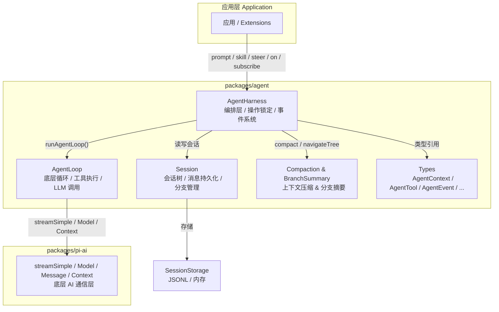

---

## 二、核心类：`AgentHarness`

### 2.1 泛型参数

```typescript
export class AgentHarness<
  TSkill extends Skill = Skill,
  TPromptTemplate extends PromptTemplate = PromptTemplate,
  TTool extends AgentTool = AgentTool,
>
```

三个泛型参数允许应用传入自己的具体类型：
- **TSkill**：技能定义，至少满足 `Skill` 接口
- **TPromptTemplate**：提示模板，至少满足 `PromptTemplate` 接口
- **TTool**：工具定义，至少满足 `AgentTool` 接口

### 2.2 实例属性总览

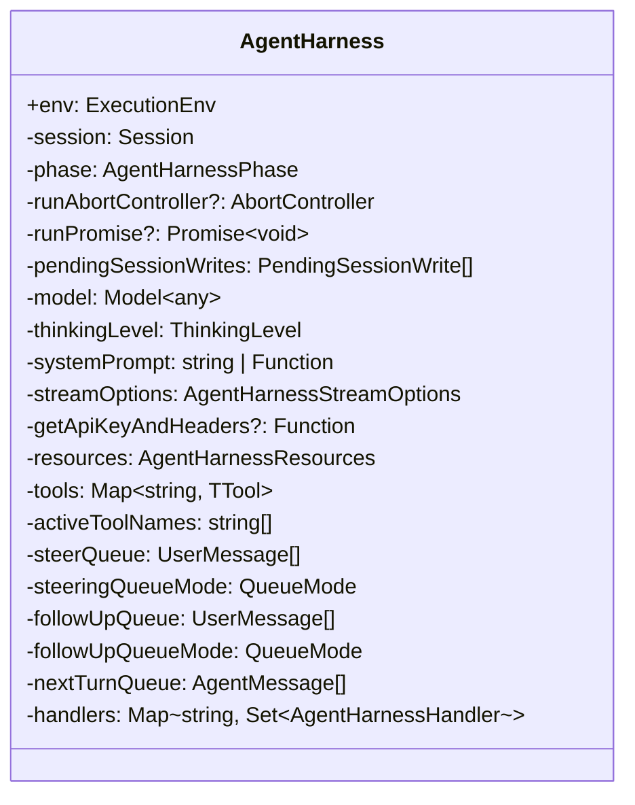

---

## 三、四大状态模型

AgentHarness 将状态分为四个独立类别，这是理解其行为的关键：

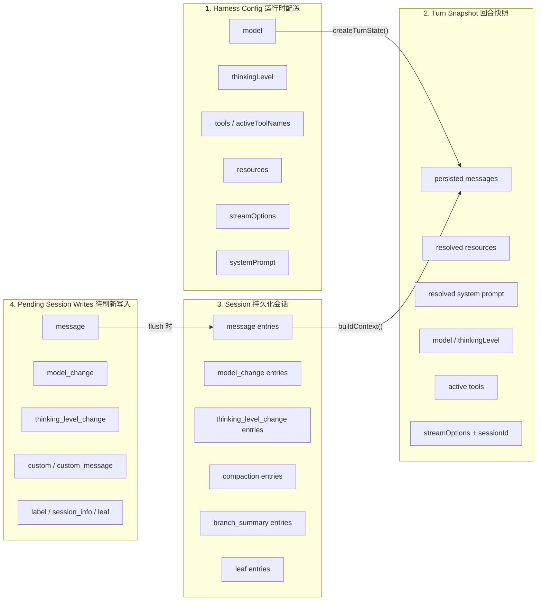

**关键设计原则**：
- **Getter 返回 harness config**（最新运行时配置），不返回 in-flight 快照
- **Setter 立即更新 harness config**，但只影响下一个回合快照
- **Session 只包含已持久化的条目**，不包含 queued writes
- **Pending writes** 在 save point、settlement 或 failure cleanup 时刷新

---

## 四、操作阶段（Phase）

```typescript
type AgentHarnessPhase = "idle" | "turn" | "compaction" | "branch_summary" | "retry";
```

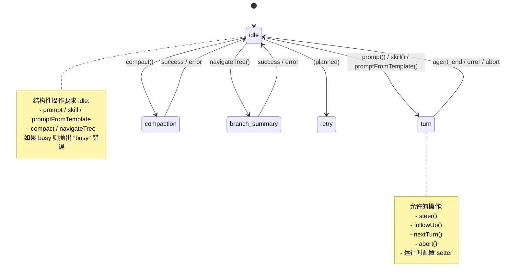

---

## 五、类型系统详解

### 5.1 核心类型关系

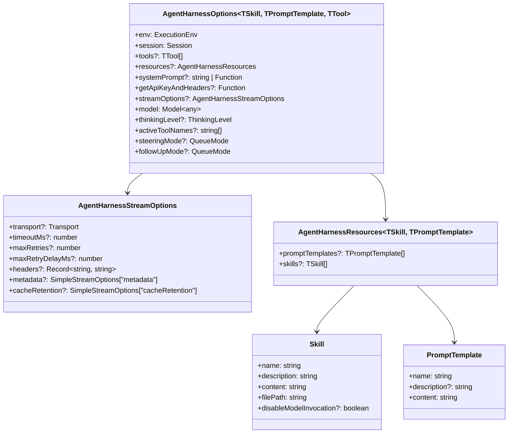

### 5.2 事件类型体系

```mermaid
classDiagram
    class AgentHarnessOwnEvent~TSkill, TPromptTemplate~ {
        <<union>>
    }

    class QueueUpdateEvent {
        +type: "queue_update"
        +steer: AgentMessage[]
        +followUp: AgentMessage[]
        +nextTurn: AgentMessage[]
    }

    class SavePointEvent {
        +type: "save_point"
        +hadPendingMutations: boolean
    }

    class AbortEvent {
        +type: "abort"
        +clearedSteer: AgentMessage[]
        +clearedFollowUp: AgentMessage[]
    }

    class SettledEvent {
        +type: "settled"
        +nextTurnCount: number
    }

    class BeforeAgentStartEvent {
        +type: "before_agent_start"
        +prompt: string
        +images?: ImageContent[]
        +systemPrompt: string
        +resources: AgentHarnessResources
    }

    class ContextEvent {
        +type: "context"
        +messages: AgentMessage[]
    }

    class BeforeProviderRequestEvent {
        +type: "before_provider_request"
        +model: Model~any~
        +sessionId: string
        +streamOptions: AgentHarnessStreamOptions
    }

    class BeforeProviderPayloadEvent {
        +type: "before_provider_payload"
        +model: Model~any~
        +payload: unknown
    }

    class AfterProviderResponseEvent {
        +type: "after_provider_response"
        +status: number
        +headers: Record~string, string~
    }

    class ToolCallEvent {
        +type: "tool_call"
        +toolCallId: string
        +toolName: string
        +input: Record~string, unknown~
    }

    class ToolResultEvent {
        +type: "tool_result"
        +toolCallId: string
        +toolName: string
        +input: Record~string, unknown~
        +content: Array~TextContent | ImageContent~
        +details: unknown
        +isError: boolean
    }

    class ModelSelectEvent {
        +type: "model_select"
        +model: Model~any~
        +previousModel: Model~any~ | undefined
        +source: "set" | "restore"
    }

    class ThinkingLevelSelectEvent {
        +type: "thinking_level_select"
        +level: ThinkingLevel
        +previousLevel: ThinkingLevel
    }

    class ResourcesUpdateEvent {
        +type: "resources_update"
        +resources: AgentHarnessResources
        +previousResources: AgentHarnessResources
    }

    AgentHarnessOwnEvent --> QueueUpdateEvent
    AgentHarnessOwnEvent --> SavePointEvent
    AgentHarnessOwnEvent --> AbortEvent
    AgentHarnessOwnEvent --> SettledEvent
    AgentHarnessOwnEvent --> BeforeAgentStartEvent
    AgentHarnessOwnEvent --> ContextEvent
    AgentHarnessOwnEvent --> BeforeProviderRequestEvent
    AgentHarnessOwnEvent --> BeforeProviderPayloadEvent
    AgentHarnessOwnEvent --> AfterProviderResponseEvent
    AgentHarnessOwnEvent --> ToolCallEvent
    AgentHarnessOwnEvent --> ToolResultEvent
    AgentHarnessOwnEvent --> ModelSelectEvent
    AgentHarnessOwnEvent --> ThinkingLevelSelectEvent
    AgentHarnessOwnEvent --> ResourcesUpdateEvent
```

### 5.3 错误类型体系

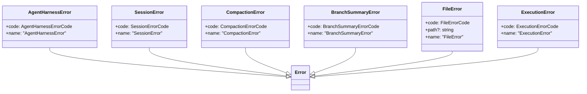

错误码：

| 错误类 | 错误码 |
|--------|--------|
| `AgentHarnessError` | `busy`, `invalid_state`, `invalid_argument`, `session`, `hook`, `auth`, `compaction`, `branch_summary`, `unknown` |
| `SessionError` | `not_found`, `invalid_session`, `invalid_entry`, `invalid_fork_target`, `storage`, `unknown` |
| `CompactionError` | `aborted`, `summarization_failed`, `invalid_session`, `unknown` |
| `BranchSummaryError` | `aborted`, `summarization_failed`, `invalid_session` |
| `FileError` | `aborted`, `not_found`, `permission_denied`, `not_directory`, `is_directory`, `invalid`, `not_supported`, `unknown` |
| `ExecutionError` | `aborted`, `timeout`, `shell_unavailable`, `spawn_error`, `callback_error`, `unknown` |

### 5.4 Result 类型（函数式错误处理）

```typescript
type Result<TValue, TError> =
  | { ok: true; value: TValue }
  | { ok: false; error: TError };
```

辅助函数：
- `ok(value)` — 创建成功结果
- `err(error)` — 创建失败结果
- `getOrThrow(result)` — 提取值或抛出错误
- `getOrUndefined(result)` — 提取值或返回 `undefined`（仅限 object 类型）
- `toError(unknown)` — 将任意值规范化为 `Error` 实例

**使用约定**：
- 底层能力/辅助函数使用 `Result` 返回（不抛出）
- 高层编排 API（`Session`, `AgentHarness`）使用 `throw` 语义
- 公共 `AgentHarness` 错误统一规范化为 `AgentHarnessError`

### 5.5 会话树条目类型

```mermaid
classDiagram
    class SessionTreeEntryBase {
        +type: string
        +id: string
        +parentId: string | null
        +timestamp: string
    }

    class MessageEntry {
        +type: "message"
        +message: AgentMessage
    }

    class ModelChangeEntry {
        +type: "model_change"
        +provider: string
        +modelId: string
    }

    class ThinkingLevelChangeEntry {
        +type: "thinking_level_change"
        +thinkingLevel: string
    }

    class CompactionEntry~T~ {
        +type: "compaction"
        +summary: string
        +firstKeptEntryId: string
        +tokensBefore: number
        +details?: T
        +fromHook?: boolean
    }

    class BranchSummaryEntry~T~ {
        +type: "branch_summary"
        +fromId: string
        +summary: string
        +details?: T
        +fromHook?: boolean
    }

    class CustomEntry~T~ {
        +type: "custom"
        +customType: string
        +data?: T
    }

    class CustomMessageEntry~T~ {
        +type: "custom_message"
        +customType: string
        +content: string | (TextContent | ImageContent)[]
        +details?: T
        +display: boolean
    }

    class LabelEntry {
        +type: "label"
        +targetId: string
        +label: string | undefined
    }

    class SessionInfoEntry {
        +type: "session_info"
        +name?: string
    }

    class LeafEntry {
        +type: "leaf"
        +targetId: string | null
    }

    SessionTreeEntryBase <|-- MessageEntry
    SessionTreeEntryBase <|-- ModelChangeEntry
    SessionTreeEntryBase <|-- ThinkingLevelChangeEntry
    SessionTreeEntryBase <|-- CompactionEntry
    SessionTreeEntryBase <|-- BranchSummaryEntry
    SessionTreeEntryBase <|-- CustomEntry
    SessionTreeEntryBase <|-- CustomMessageEntry
    SessionTreeEntryBase <|-- LabelEntry
    SessionTreeEntryBase <|-- SessionInfoEntry
    SessionTreeEntryBase <|-- LeafEntry
```

### 5.6 事件结果映射

```typescript
type AgentHarnessEventResultMap = {
  before_agent_start: BeforeAgentStartResult | undefined;
  context: ContextResult | undefined;
  before_provider_request: BeforeProviderRequestResult | undefined;
  before_provider_payload: BeforeProviderPayloadResult | undefined;
  after_provider_response: undefined;
  tool_call: ToolCallResult | undefined;
  tool_result: ToolResultPatch | undefined;
  session_before_compact: SessionBeforeCompactResult | undefined;
  session_compact: undefined;
  session_before_tree: SessionBeforeTreeResult | undefined;
  session_tree: undefined;
  model_select: undefined;
  thinking_level_select: undefined;
  resources_update: undefined;
  queue_update: undefined;
  save_point: undefined;
  abort: undefined;
  settled: undefined;
};
```

**注意**：只有标记为有返回值的事件（如 `before_agent_start`、`context`、`tool_call` 等）才允许 hook 返回结果。`undefined` 类型的事件是纯通知事件（fire-and-forget）。

---

## 六、函数详解

### 6.1 构造函数 `constructor(options)`

初始化所有实例属性，设置初始状态：

```typescript
constructor(options: AgentHarnessOptions<TSkill, TPromptTemplate, TTool>)
```

**初始化逻辑**：
1. 存储 `env`、`session`、`resources`（浅拷贝）
2. 克隆 `streamOptions`
3. 存储 `systemPrompt`（字符串或回调函数）
4. 存储 `getApiKeyAndHeaders`
5. 将 `tools` 数组转换为 `Map<string, TTool>`（按 `tool.name` 索引）
6. 设置 `model`、`thinkingLevel`（默认 `"off"`）
7. 设置 `activeToolNames`（默认所有 tools）
8. 设置队列模式（默认 `"one-at-a-time"`）

### 6.2 事件系统方法

#### `subscribe(listener)` — 订阅所有事件

```typescript
subscribe(
  listener: (event: AgentHarnessEvent, signal?: AbortSignal) => Promise<void> | void
): () => void  // 返回取消订阅函数
```

订阅到 `"*"` 通配符 key，接收所有 harness 事件 + agent 事件。

#### `on(type, handler)` — 按类型订阅 Hook

```typescript
on<TType extends keyof AgentHarnessEventResultMap>(
  type: TType,
  handler: (event) => Promise<ResultType> | ResultType
): () => void  // 返回取消订阅函数
```

按事件类型订阅。只有特定类型允许返回结果（参见 `AgentHarnessEventResultMap`）。

#### 内部 emit 方法

| 方法 | 用途 | 接收者 |
|------|------|--------|
| `emitOwn(event)` | 发送 harness 自有事件 | `"*"` 订阅者 |
| `emitAny(event)` | 发送任意事件（含 agent 事件） | `"*"` 订阅者 |
| `emitHook(event)` | 发送 hook 事件并收集结果 | 按 `event.type` 注册的 handler |

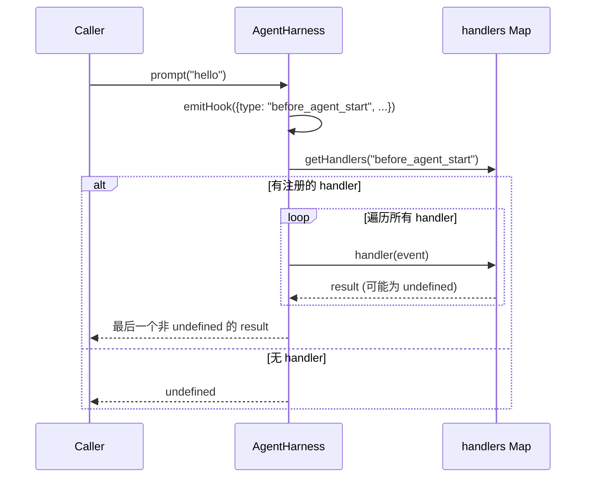

### 6.3 结构性操作方法

#### `prompt(text, options?)` → `AssistantMessage`

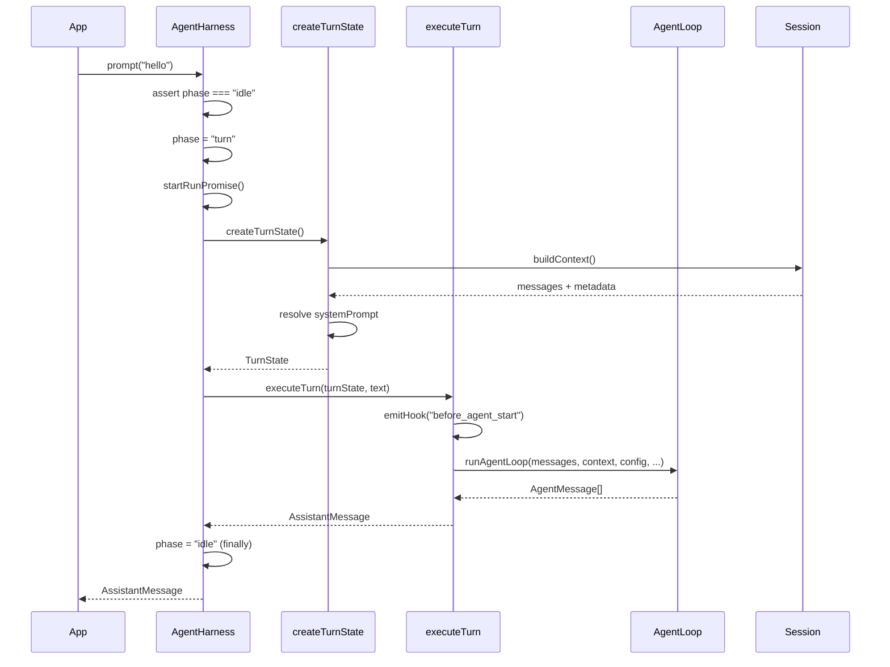

**完整流程**：
1. 检查 phase 必须是 `"idle"`，否则抛 `"busy"`
2. 设置 `phase = "turn"`
3. 启动 `runPromise`（用于 `waitForIdle()` 等待）
4. 调用 `createTurnState()` 创建回合快照
5. 调用 `executeTurn()` 执行回合
6. `finally` 中调用 `finishRunPromise()` 完成

#### `skill(name, additionalInstructions?)` → `AssistantMessage`

与 `prompt()` 相同的流程，但会：
1. 从 `turnState.resources.skills` 中按 name 查找 skill
2. 如果找不到则抛 `"invalid_argument"`
3. 通过 `formatSkillInvocation()` 将 skill 格式化为 prompt

#### `promptFromTemplate(name, args?)` → `AssistantMessage`

与 `prompt()` 相同的流程，但会：
1. 从 `turnState.resources.promptTemplates` 中按 name 查找模板
2. 如果找不到则抛 `"invalid_argument"`
3. 通过 `formatPromptTemplateInvocation()` 格式化模板

### 6.4 运行时操作方法

#### `steer(text, options?)` → `void`

在 turn 运行中插入 steering 消息：
- 如果 `phase === "idle"` 则抛 `"invalid_state"`
- 将消息推入 `steerQueue`
- 发送 `queue_update` 事件
- 消息在 agent loop 的安全点被消费（由 `steeringQueueMode` 控制）

#### `followUp(text, options?)` → `void`

与 `steer()` 类似，但消息推入 `followUpQueue`。

#### `nextTurn(text, options?)` → `void`

将消息推入 `nextTurnQueue`：
- **可以在任何时候调用**（不要求 busy）
- 消息在下一个用户发起的 turn 时插入到用户消息之前
- **abort 不会清除 nextTurn 消息**

#### `abort()` → `AbortResult`

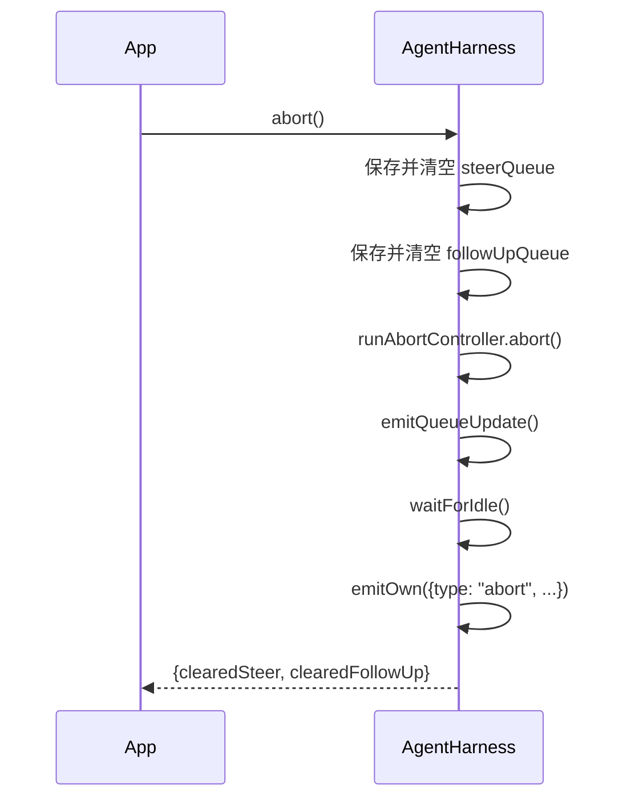

**关键行为**：
- 清空 steer/followUp 队列（不清理 nextTurn）
- 发送 abort 信号到当前 run
- 等待 run 完成
- 不丢弃 pending session writes

### 6.5 配置方法

#### `setModel(model)` → `void`

- 如果 idle：直接持久化到 session
- 如果 busy：加入 pending writes 队列
- 更新内存中的 model
- 发送 `model_select` 事件

#### `setThinkingLevel(level)` → `void`

- 与 `setModel` 相同的 idle/busy 分支逻辑
- 发送 `thinking_level_select` 事件

#### `setActiveTools(toolNames)` → `void`

- 验证所有 toolName 在注册表中存在
- 更新 `activeToolNames`

#### `setTools(tools, activeToolNames?)` → `void`

- 替换整个工具注册表
- 可选更新 activeToolNames
- 验证 activeToolNames 在新注册表中有效

#### `setResources(resources)` → `void`

- 浅拷贝存储新的 resources
- 发送 `resources_update` 事件

#### `setStreamOptions(streamOptions)` → `void`

- 克隆并存储新的 stream options

### 6.6 查询方法

| 方法 | 返回值 | 说明 |
|------|--------|------|
| `getModel()` | `Model<any>` | 返回最新运行时 model |
| `getThinkingLevel()` | `ThinkingLevel` | 返回最新运行时 thinking level |
| `getResources()` | `AgentHarnessResources` | 返回浅拷贝的当前 resources |
| `getStreamOptions()` | `AgentHarnessStreamOptions` | 返回克隆的当前 stream options |
| `getSteeringMode()` | `QueueMode` | 返回当前 steering 队列模式 |
| `getFollowUpMode()` | `QueueMode` | 返回当前 followUp 队列模式 |
| `waitForIdle()` | `Promise<void>` | 等待当前 run 完成 |

### 6.7 会话操作方法

#### `appendMessage(message)` → `void`

- 如果 idle：直接持久化到 session
- 如果 busy：加入 pending writes 队列

#### `compact(customInstructions?)` → `CompactResult`

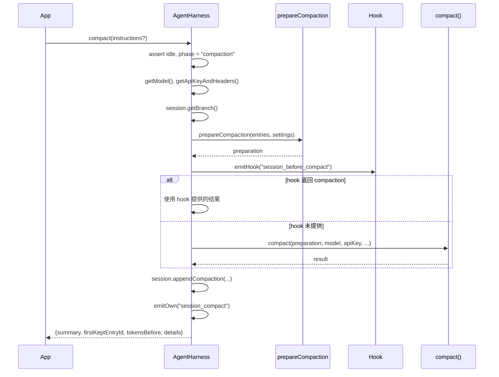

#### `navigateTree(targetId, options?)` → `NavigateTreeResult`

树导航（分支切换）的完整流程：

1. 检查 idle，设置 `phase = "branch_summary"`
2. 获取旧 leafId 和目标 entry
3. 收集需要摘要的条目
4. 调用 `emitHook("session_before_tree")`
5. 如果 hook 取消则返回 `{ cancelled: true }`
6. 如果需要摘要且 hook 未提供，调用 `generateBranchSummary()`
7. 执行 `session.moveTo()` 移动 leaf
8. 发送 `session_tree` 事件
9. 返回结果（含 `editorText` 和 `summaryEntry`）

### 6.8 内部辅助函数

#### `createUserMessage(text, images?)` → `UserMessage`

创建带时间戳的用户消息。

#### `createFailureMessage(model, error, aborted)` → `AssistantMessage`

创建表示错误的 assistant 消息（`stopReason: "aborted" | "error"`）。

#### `cloneStreamOptions(streamOptions?)` → `AgentHarnessStreamOptions`

浅克隆 stream options，包括 headers 和 metadata。

#### `mergeHeaders(...headers)` → `Record<string, string> | undefined`

合并多个 headers 对象。

#### `applyStreamOptionsPatch(base, patch?)` → `AgentHarnessStreamOptions`

应用 stream options 补丁，支持：
- 字段级别覆盖（`transport`, `timeoutMs`, `maxRetries`, 等）
- headers/metadata 的增量更新（`undefined` 值删除 key）
- 显式 `headers: undefined` 清除所有 headers

#### `normalizeHarnessError(error, fallbackCode)` → `AgentHarnessError`

将任意错误规范化为 `AgentHarnessError`，保留子系统错误作为 `cause`。

---

## 七、核心内部方法

### 7.1 `createTurnState()`

创建回合快照，这是每次 LLM 调用的基础：

```
createTurnState():
  1. session.buildContext() → messages, metadata
  2. getResources() → 当前资源浅拷贝
  3. 解析 tools 和 activeTools
  4. 解析 systemPrompt（字符串直接使用，函数则调用）
  5. 组装 TurnState 对象
```

### 7.2 `executeTurn(turnState, text, options?)`

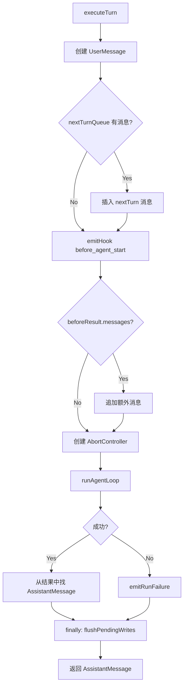

### 7.3 `createLoopConfig(getTurnState, setTurnState)`

创建传递给 `runAgentLoop` 的配置，包含：

| 回调 | 用途 |
|------|------|
| `transformContext` | 在发送给 LLM 前通过 `context` hook 转换消息 |
| `beforeToolCall` | 工具调用前通过 `tool_call` hook 检查/阻止 |
| `afterToolCall` | 工具调用后通过 `tool_result` hook 修改结果 |
| `prepareNextTurn` | Save point：刷新 pending writes，创建新的 turn snapshot |
| `getSteeringMessages` | 从 steerQueue 中按模式取出消息 |
| `getFollowUpMessages` | 从 followUpQueue 中按模式取出消息 |

### 7.4 `createStreamFn(getTurnState)`

创建传递给 `runAgentLoop` 的流函数：

```
createStreamFn:
  1. 获取当前 turnState
  2. 调用 getApiKeyAndHeaders() 获取认证
  3. 合并 headers
  4. emitBeforeProviderRequest() → 修改 streamOptions
  5. 调用 streamSimple() 并传入:
     - onPayload: emitBeforeProviderPayload
     - onResponse: emitOwn("after_provider_response")
```

### 7.5 `handleAgentEvent(event, signal?)`

处理来自 agent loop 的事件：

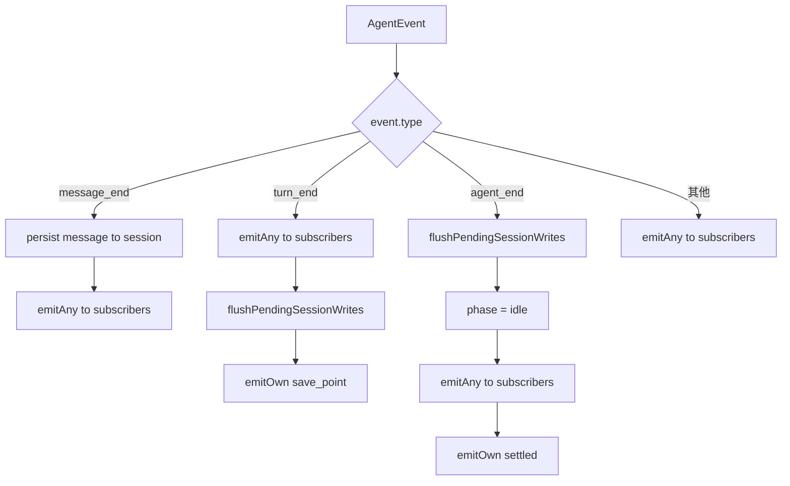

### 7.6 `flushPendingSessionWrites()`

逐个处理 pending writes 队列，按类型分发到不同的 session 方法：

| Write 类型 | Session 方法 |
|------------|-------------|
| `message` | `session.appendMessage()` |
| `model_change` | `session.appendModelChange()` |
| `thinking_level_change` | `session.appendThinkingLevelChange()` |
| `custom` | `session.appendCustomEntry()` |
| `custom_message` | `session.appendCustomMessageEntry()` |
| `label` | `session.appendLabel()` |
| `session_info` | `session.appendSessionName()` |
| `leaf` | `session.getStorage().setLeafId()` |

---

## 八、完整架构图

```mermaid
graph TB
    subgraph "External API 外部 API"
        API1["prompt(text, opts?)"]
        API2["skill(name, instr?)"]
        API3["promptFromTemplate(name, args?)"]
        API4["steer(text, opts?)"]
        API5["followUp(text, opts?)"]
        API6["nextTurn(text, opts?)"]
        API7["abort()"]
        API8["compact(instr?)"]
        API9["navigateTree(id, opts?)"]
        API10["subscribe(listener)"]
        API11["on(type, handler)"]
        API12["setModel / setThinkingLevel / setTools / ..."]
    end

    subgraph "AgentHarness Core"
        CT["createTurnState()
        构建回合快照"]
        ET["executeTurn()
        执行单个回合"]
        CL["createLoopConfig()
        创建 AgentLoop 配置"]
        CS["createStreamFn()
        创建 Provider Stream"]
        HA["handleAgentEvent()
        处理 Agent 事件"]
        FP["flushPendingSessionWrites()
        刷新待写入队列"]
    end

    subgraph "Queue System 队列系统"
        SQ["steerQueue"]
        FQ["followUpQueue"]
        NQ["nextTurnQueue"]
        QM["QueueMode
        all | one-at-a-time"]
    end

    subgraph "Event System 事件系统"
        EMIT["emitOwn / emitAny / emitHook"]
        HOOKS["handlers Map
        按类型注册"]
        EVENTS["17 种事件类型
        + AgentEvent"]
    end

    subgraph "State 状态"
        PHASE["phase:
        idle | turn | compaction | branch_summary"]
        PSW["pendingSessionWrites[]
        待刷新写入"]
        RP["runPromise
        用于 waitForIdle()"]
        AC["runAbortController
        用于 abort()"]
    end

    subgraph "External Dependencies 外部依赖"
        AL["runAgentLoop()
        agent-loop.ts"]
        S["Session
        会话持久化"]
        COMP["Compaction Helpers
        上下文压缩"]
        BS["BranchSummary Helpers
        分支摘要"]
        AI["pi-ai
        streamSimple / Model"]
    end

    API1 --> CT
    API2 --> CT
    API3 --> CT
    API1 --> ET
    API2 --> ET
    API3 --> ET
    API4 --> SQ
    API5 --> FQ
    API6 --> NQ
    API7 --> AC

    CT --> S
    CT --> CS
    ET --> CL
    ET --> AL
    ET --> HA
    ET --> EMIT

    CL --> SQ
    CL --> FQ
    CL --> EMIT

    CS --> AI
    CS --> EMIT

    HA --> S
    HA --> FP
    HA --> EMIT
    HA --> PHASE

    API8 --> COMP
    API8 --> EMIT
    API9 --> BS
    API9 --> EMIT

    API10 --> HOOKS
    API11 --> HOOKS
    EMIT --> HOOKS

    FP --> S
    FP --> PSW
```

---

## 九、关键设计原则总结

### 9.1 状态分离

> [!important] 核心原则
> Harness Config ≠ Turn Snapshot ≠ Session ≠ Pending Writes

- **Config** 是"最新设置"，getter 立即返回
- **Snapshot** 是"回合开始时冻结的状态"，整个 turn 不变
- **Session** 是"已持久化的历史"
- **Pending Writes** 是"等待刷新的暂存区"

### 9.2 Save Point 机制

```
Save Point 时机: 每个 assistant turn + tool results 完成后

Save Point 行为:
  1. 刷新 pending session writes
  2. 创建新的 turn snapshot
  3. 应用新的 context/model/thinkingLevel/streamOptions
```

这保证了运行时配置变更在下一个 turn 生效，而不影响正在进行的 provider 请求。

### 9.3 错误处理分层

```
底层 (FileSystem, Shell):  Result<T, E> — 不抛出
中层 (Session storage):    throw SessionError
高层 (AgentHarness API):   throw AgentHarnessError
```

### 9.4 事件系统的两种订阅模式

| 方法 | 订阅范围 | 可否返回结果 | 用途 |
|------|----------|-------------|------|
| `subscribe()` | 所有事件（`"*"`） | 否 | 观察者 / 日志 / 副作用 |
| `on(type, handler)` | 特定事件类型 | 部分类型可以 | Hook / 拦截 / 修改行为 |

---

## 十、数据流示例：一次完整的 prompt 调用

```mermaid
sequenceDiagram
    participant App as Application
    participant AH as AgentHarness
    participant TS as TurnState
    participant Loop as AgentLoop
    participant Provider as LLM Provider
    participant Session as Session

    App->>AH: prompt("分析这段代码")
    AH->>AH: phase = "turn"

    Note over AH,Session: === 创建回合快照 ===
    AH->>TS: createTurnState()
    TS->>Session: buildContext()
    Session-->>TS: 历史 messages
    TS->>TS: resolve systemPrompt
    TS->>TS: resolve tools, streamOptions
    TS-->>AH: TurnState

    Note over AH,Loop: === 执行回合 ===
    AH->>AH: executeTurn(turnState, text)
    AH->>AH: emitHook("before_agent_start")
    AH->>Loop: runAgentLoop(messages, context, config)

    loop Agent Loop
        Loop->>Provider: streamSimple(context)
        Provider-->>Loop: AssistantMessage (含 tool_calls)

        alt 有 tool calls
            Loop->>AH: emitHook("tool_call")
            AH-->>Loop: {block?, reason?}
            Loop->>Loop: execute tool
            Loop->>AH: emitHook("tool_result")
            AH-->>Loop: {content?, isError?, terminate?}
            Loop->>AH: handleAgentEvent("message_end")
            AH->>Session: appendMessage()
        end

        Note over Loop,AH: === Save Point ===
        Loop->>AH: prepareNextTurn()
        AH->>AH: flushPendingSessionWrites()
        AH->>TS: createTurnState() (新快照)
    end

    Loop-->>AH: AgentMessage[]
    AH->>AH: handleAgentEvent("agent_end")
    AH->>AH: phase = "idle"
    AH->>AH: emitOwn("settled")
    AH-->>App: AssistantMessage
```

---

## 十一、相关文件索引

| 文件 | 说明 |
|------|------|
| [[agent-harness.ts]] | 主实现文件 |
| [[types.ts]] | 所有类型定义 |
| [[agent-loop.ts]] | 底层 Agent 循环 |
| [[Projects/PI/agent/harness/agent-harness]] | 官方设计文档 |
| [[hooks.md]] | Hook 系统设计 |
| [[session.ts]] | Session 实现 |
| [[compaction.ts]] | 上下文压缩 |
| [[branch-summarization.ts]] | 分支摘要 |
| [[agent-harness.test.ts]] | 核心测试 |
| [[agent-harness-stream.test.ts]] | Stream 测试 |

---

## 十二、QueueMode 说明

```typescript
type QueueMode = "all" | "one-at-a-time";
```

| 模式 | 行为 |
|------|------|
| `"all"` | 一次性取出队列中的所有消息 |
| `"one-at-a-time"` | 每次只取一条消息，其余留待下次 drain |

默认值：steering 和 followUp 都默认为 `"one-at-a-time"`。

`nextTurn` 消息不使用 QueueMode — 它们在下次用户发起 turn 时一次性全部插入。
