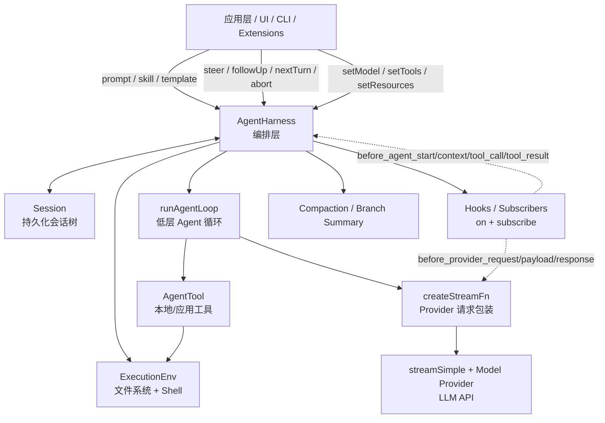
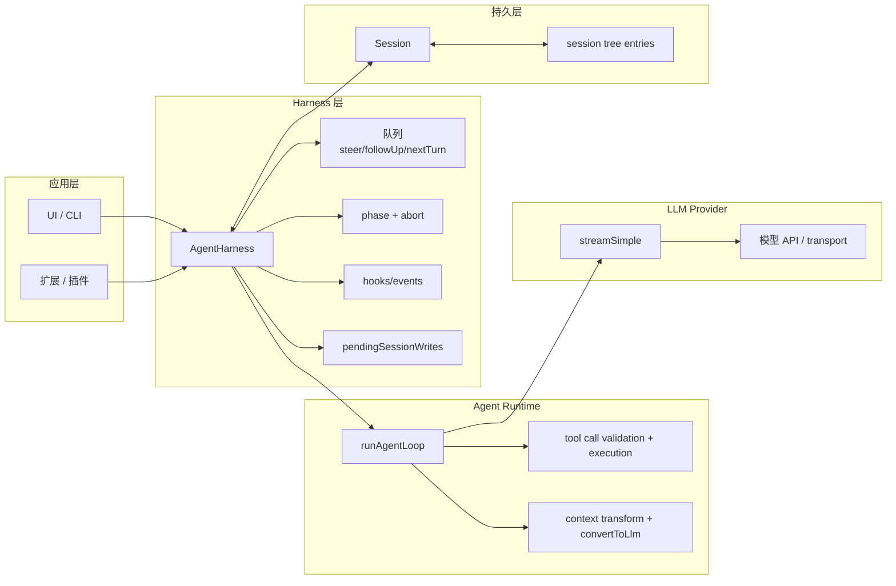
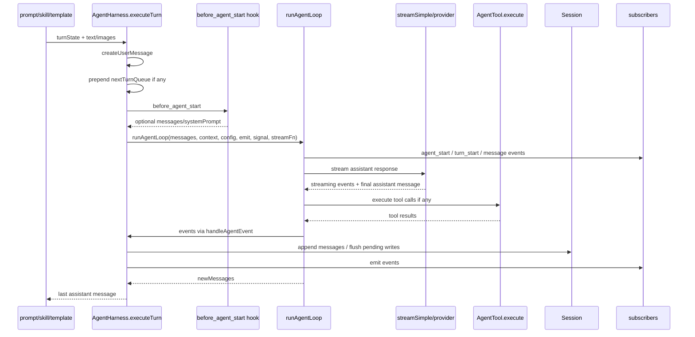
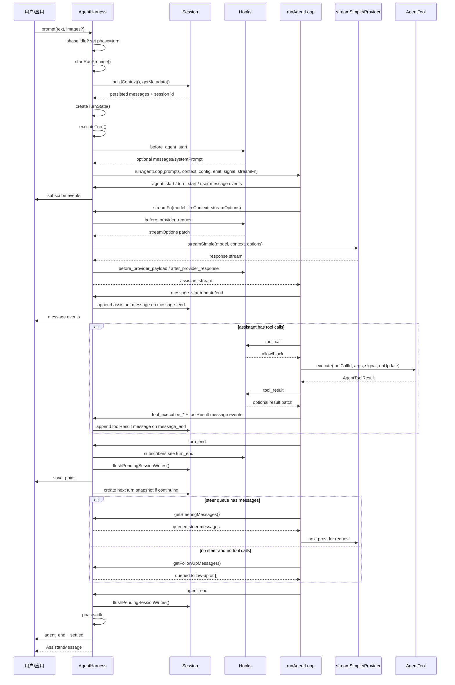
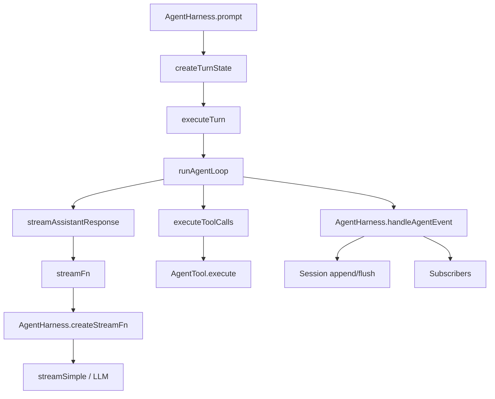
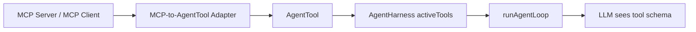
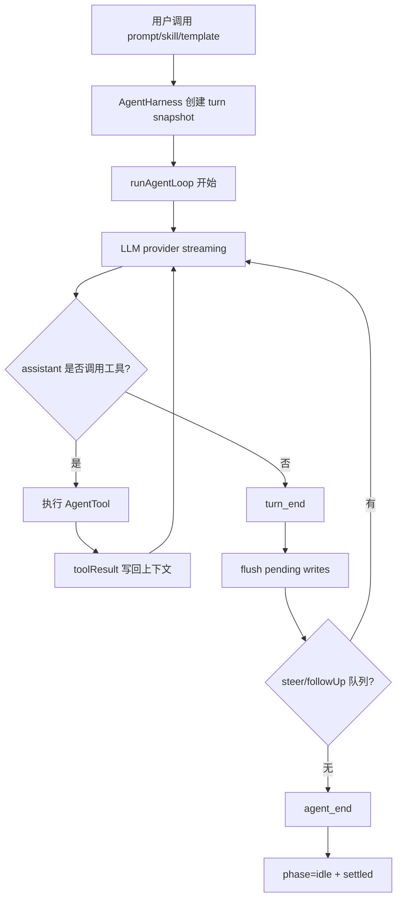

# AgentHarness 学习笔记（agent-harness.ts）

> 源码位置：[packages/agent/src/harness/agent-harness.ts](../src/harness/agent-harness.ts)  
> 关联类型：[packages/agent/src/harness/types.ts](../src/harness/types.ts)、[packages/agent/src/types.ts](../src/types.ts)  
> 关联执行循环：[packages/agent/src/agent-loop.ts](../src/agent-loop.ts)

本文按“架构定位 → 数据结构 → 工具函数 → AgentHarness 类 → 一次 prompt 的完整链路 → Tool/MCP/LLM 概念映射”的顺序学习这个文件。

---

## 1. 这个文件在项目中的定位

[agent-harness.ts](../src/harness/agent-harness.ts) 实现的是 `AgentHarness`：它位于低层 `runAgentLoop()` 之上，是一个**面向应用/扩展的 Agent 编排层**。

它不直接实现模型推理，也不直接实现工具执行算法，而是负责把这些能力组织起来：

1. 从 `Session` 读取/写入持久化上下文。
2. 生成一次运行所需的 turn snapshot（模型、system prompt、tools、resources、stream options）。
3. 调用低层 [runAgentLoop](../src/agent-loop.ts#L95) 执行 LLM → tool → LLM 的循环。
4. 包装 `streamSimple()`，在真正请求 provider 前后插入 hook。
5. 管理 `steer`、`followUp`、`nextTurn` 三类队列。
6. 管理运行阶段 `phase`，避免并发结构性操作破坏状态。
7. 把模型变更、thinking level 变更、消息追加等写入 session；运行中发生的写入会先进入 `pendingSessionWrites`，再在安全点 flush。
8. 提供 compaction 和 tree navigation 这类结构性 session 操作。

一句话：

> `AgentHarness` 是“会持久化、可扩展、可插 hook、支持队列和分支/压缩”的 Agent 运行外壳；真正的 LLM/tool 循环由 `runAgentLoop()` 执行。

---

## 2. 总体架构图



### 分层理解



---

## 3. 核心运行状态：phase 与 turn snapshot

### 3.1 `AgentHarnessPhase`

`AgentHarness` 通过 `phase` 控制当前状态，类型定义在 [types.ts](../src/harness/types.ts#L485)：

```ts
type AgentHarnessPhase = "idle" | "turn" | "compaction" | "branch_summary" | "retry";
```

在 [agent-harness.ts](../src/harness/agent-harness.ts#L171) 中默认是：

```ts
private phase: AgentHarnessPhase = "idle";
```

含义：

| phase | 含义 | 典型进入点 |
|---|---|---|
| `idle` | 空闲，可以启动结构性操作 | 初始状态、turn 完成后 |
| `turn` | 正在运行一次 agent turn | `prompt()` / `skill()` / `promptFromTemplate()` |
| `compaction` | 正在压缩会话上下文 | `compact()` |
| `branch_summary` | 正在切换会话树分支并可能生成 summary | `navigateTree()` |
| `retry` | 预留/规划中的 retry 阶段 | 当前文件未实际使用 |

结构性操作要求 `idle`，例如 [prompt](../src/harness/agent-harness.ts#L603)、[compact](../src/harness/agent-harness.ts#L681)、[navigateTree](../src/harness/agent-harness.ts#L737)。如果 busy，会抛 `AgentHarnessError("busy", ...)`。

### 3.2 Turn snapshot：`AgentHarnessTurnState`

`AgentHarnessTurnState` 是本文件内部接口，定义在 [agent-harness.ts](../src/harness/agent-harness.ts#L148)：

```ts
interface AgentHarnessTurnState<
  TSkill extends Skill = Skill,
  TPromptTemplate extends PromptTemplate = PromptTemplate,
  TTool extends AgentTool = AgentTool,
> {
  messages: AgentMessage[];
  resources: AgentHarnessResources<TSkill, TPromptTemplate>;
  streamOptions: AgentHarnessStreamOptions;
  sessionId: string;
  systemPrompt: string;
  model: Model<any>;
  thinkingLevel: ThinkingLevel;
  tools: TTool[];
  activeTools: TTool[];
}
```

它是“一次 provider 请求/一段 agent 循环使用的快照”。为什么需要快照？

- 运行中应用可能调用 `setModel()`、`setResources()`、`setTools()`。
- 当前已经发出去的 provider 请求不能被突变影响。
- 但下一轮 LLM 请求应该看到最新配置。

所以 `AgentHarness` 的策略是：

1. 启动 turn 时调用 [createTurnState](../src/harness/agent-harness.ts#L313) 创建快照。
2. 当前 LLM 请求使用快照里的 model/system/tools/options。
3. 每个 save point 后，通过 `prepareNextTurn` 重新创建快照，影响下一次 provider request。

这个设计对应项目文档 [packages/agent/docs/agent-harness.md](agent-harness.md#state-model) 里的“harness config vs turn snapshot”。

---

## 4. 文件中的辅助函数逐个讲解

### 4.1 `createUserMessage(text, images?)`

位置：[agent-harness.ts:43](../src/harness/agent-harness.ts#L43)

作用：把用户输入的文本和可选图片封装成 `UserMessage`。

```ts
function createUserMessage(text: string, images?: ImageContent[]): UserMessage
```

逻辑：

1. 先创建一个 text content：`{ type: "text", text }`。
2. 如果有 images，就追加到 content 数组后面。
3. 返回 `{ role: "user", content, timestamp: Date.now() }`。

它被这些方法使用：

- [executeTurn](../src/harness/agent-harness.ts#L532)：普通 prompt 的用户消息。
- [steer](../src/harness/agent-harness.ts#L652)：运行中插入 steering message。
- [followUp](../src/harness/agent-harness.ts#L658)：运行结束前追加 follow-up。
- [nextTurn](../src/harness/agent-harness.ts#L664)：排到下一次用户 turn 之前。

### 4.2 `createFailureMessage(model, error, aborted)`

位置：[agent-harness.ts:49](../src/harness/agent-harness.ts#L49)

作用：当 `runAgentLoop()` 抛错或运行失败时，创建一个“失败的 assistant message”，让失败也能以正常消息生命周期事件写入 session。

关键字段：

- `role: "assistant"`
- `content` 是空文本。
- `api/provider/model` 来自当前 `model`。
- `stopReason` 是 `"aborted"` 或 `"error"`。
- `errorMessage` 保存错误信息。
- `usage` 全部置 0。

这个函数被 [emitRunFailure](../src/harness/agent-harness.ts#L512) 使用。

### 4.3 `cloneStreamOptions(streamOptions?)`

位置：[agent-harness.ts:70](../src/harness/agent-harness.ts#L70)

作用：浅拷贝 provider stream options，尤其是 `headers` 和 `metadata` 两个对象也会浅拷贝。

为什么重要：

- stream options 会被 turn snapshot 固定下来。
- hook 可以 patch stream options。
- 不希望 patch 当前请求时意外修改 harness 的全局配置对象。

### 4.4 `mergeHeaders(...headers)`

位置：[agent-harness.ts:78](../src/harness/agent-harness.ts#L78)

作用：合并多组 header，后面的覆盖前面的。

使用点：[createStreamFn](../src/harness/agent-harness.ts#L358) 中把 snapshot headers 和 auth headers 合并：

```ts
headers: mergeHeaders(turnState.streamOptions.headers, auth?.headers)
```

这意味着 auth headers 优先级更高。

### 4.5 `applyStreamOptionsPatch(base, patch?)`

位置：[agent-harness.ts:89](../src/harness/agent-harness.ts#L89)

作用：把 provider hook 返回的 `AgentHarnessStreamOptionsPatch` 应用到当前请求 options 上。

它支持两类 patch：

1. 普通字段替换：
   - `transport`
   - `timeoutMs`
   - `maxRetries`
   - `maxRetryDelayMs`
   - `cacheRetention`

2. `headers` / `metadata` 的细粒度 patch：
   - `headers: undefined` 表示清空全部 headers。
   - 某个 key 的 value 是 `undefined` 表示删除该 key。
   - 某个 key 的 value 是 string/unknown 表示设置或覆盖。

这个函数用于 [emitBeforeProviderRequest](../src/harness/agent-harness.ts#L250)。多个 hook 会按注册顺序串行 patch。

### 4.6 `SUBSCRIBER_EVENT_TYPE`

位置：[agent-harness.ts:131](../src/harness/agent-harness.ts#L131)

```ts
const SUBSCRIBER_EVENT_TYPE = "*";
```

`subscribe()` 注册的是“监听所有事件”的 listener，因此内部用 `"*"` 作为 map key。

### 4.7 `AgentHarnessHandler`

位置：[agent-harness.ts:133](../src/harness/agent-harness.ts#L133)

```ts
type AgentHarnessHandler = (event: any, signal?: AbortSignal) => Promise<any> | any;
```

这是内部统一 handler 类型。公开 API `subscribe()` / `on()` 是泛型和强类型的，但内部 `Map<string, Set<AgentHarnessHandler>>` 需要一个统一形态。

### 4.8 `normalizeHarnessError(error, fallbackCode)`

位置：[agent-harness.ts:135](../src/harness/agent-harness.ts#L135)

作用：把任意错误规整成 `AgentHarnessError`。

转换规则：

| 输入错误 | 输出 |
|---|---|
| 已经是 `AgentHarnessError` | 原样返回 |
| `SessionError` | `AgentHarnessError("session", ...)` |
| `CompactionError` | `AgentHarnessError("compaction", ...)` |
| `BranchSummaryError` | `AgentHarnessError("branch_summary", ...)` |
| 其他 | `AgentHarnessError(fallbackCode, ...)` |

这保证 public API 抛出的错误有稳定的 `code`。

### 4.9 `normalizeHookError(error)`

位置：[agent-harness.ts:144](../src/harness/agent-harness.ts#L144)

只是 `normalizeHarnessError(error, "hook")` 的简写。所有 hook/listener 抛错都会归为 `AgentHarnessError("hook", ...)`，除非本身已经是更具体的 harness error。

---

## 5. AgentHarness 泛型与字段

### 5.1 类声明

位置：[agent-harness.ts:164](../src/harness/agent-harness.ts#L164)

```ts
export class AgentHarness<
  TSkill extends Skill = Skill,
  TPromptTemplate extends PromptTemplate = PromptTemplate,
  TTool extends AgentTool = AgentTool,
> { ... }
```

三个泛型：

| 泛型 | 默认 | 作用 |
|---|---|---|
| `TSkill` | `Skill` | 应用可扩展 skill 结构 |
| `TPromptTemplate` | `PromptTemplate` | 应用可扩展 prompt template 结构 |
| `TTool` | `AgentTool` | 应用可扩展 tool 结构 |

这让核心 harness 保持通用，而 coding-agent 或其他上层应用可以携带自己的 tool/resource 附加字段。

### 5.2 关键字段分类

#### 环境与会话

```ts
readonly env: ExecutionEnv;
private session: Session;
```

- `env`：文件系统 + shell 执行环境，见 [ExecutionEnv](../src/harness/types.ts#L331)。
- `session`：持久会话，负责保存消息、模型变更、thinking level 变更、分支/leaf 等。

#### 生命周期控制

```ts
private phase: AgentHarnessPhase = "idle";
private runAbortController?: AbortController;
private runPromise?: Promise<void>;
```

- `phase`：互斥结构操作。
- `runAbortController`：当前 turn 的取消信号。
- `runPromise`：当前 run 的 settle barrier，`waitForIdle()` 等它。

#### pending session writes

```ts
private pendingSessionWrites: PendingSessionWrite[] = [];
```

运行中调用 `appendMessage()`、`setModel()`、`setThinkingLevel()` 等不能直接乱写 session，否则可能打乱 agent-emitted message 的顺序。于是运行中先进入 pending，save point / agent_end / finally 时 flush。

#### runtime config

```ts
private model: Model<any>;
private thinkingLevel: ThinkingLevel;
private systemPrompt: AgentHarnessOptions["systemPrompt"];
private streamOptions: AgentHarnessStreamOptions;
private getApiKeyAndHeaders?: AgentHarnessOptions["getApiKeyAndHeaders"];
private resources: AgentHarnessResources<TSkill, TPromptTemplate>;
```

这些是最新 harness config，不一定等于当前 in-flight request 的 snapshot。

#### tools

```ts
private tools = new Map<string, TTool>();
private activeToolNames: string[];
```

- `tools` 保存所有注册工具。
- `activeToolNames` 决定当前对 LLM 暴露哪些工具。

#### 队列

```ts
private steerQueue: UserMessage[] = [];
private steeringQueueMode: QueueMode;
private followUpQueue: UserMessage[] = [];
private followUpQueueMode: QueueMode;
private nextTurnQueue: AgentMessage[] = [];
```

三种队列：

| 队列 | 何时加入 | 何时消费 | 用途 |
|---|---|---|---|
| `steerQueue` | `steer()` | agent 每轮结束后、继续工具/下一次 LLM 前 | “正在跑时纠偏” |
| `followUpQueue` | `followUp()` | agent 原本要停止时 | “等它做完后继续问” |
| `nextTurnQueue` | `nextTurn()` | 下一次用户主动 `prompt()` 开始时 | “排到下一次用户输入前” |

`QueueMode` 定义在 [types.ts](../src/types.ts#L44)：`"all" | "one-at-a-time"`。

#### handlers

```ts
private handlers = new Map<string, Set<AgentHarnessHandler>>();
```

保存：

- `subscribe()` 的全事件 listener，key 是 `"*"`。
- `on(type, handler)` 的特定 hook handler，key 是事件 type。

---

## 6. constructor：初始化 harness

位置：[agent-harness.ts:190](../src/harness/agent-harness.ts#L190)

构造函数接收 `AgentHarnessOptions`，定义在 [types.ts](../src/harness/types.ts#L780)。

主要初始化逻辑：

1. 保存 `env`、`session`。
2. resources 默认为 `{}`。
3. stream options 通过 `cloneStreamOptions()` 拷贝。
4. 保存 system prompt provider。
5. 保存 auth provider `getApiKeyAndHeaders`。
6. 把 `options.tools` 放进 `Map<tool.name, tool>`。
7. 保存 model。
8. thinking level 默认 `"off"`。
9. active tools 默认启用所有传入 tools。
10. steering/follow-up mode 默认 `"one-at-a-time"`。

---

## 7. 事件与 Hook 机制

### 7.1 `getHandlers(type)`

位置：[agent-harness.ts:207](../src/harness/agent-harness.ts#L207)

从 `handlers` map 取对应 type 的 handler 集合。

### 7.2 `emitOwn(event, signal?)`

位置：[agent-harness.ts:211](../src/harness/agent-harness.ts#L211)

只发送 harness 自己产生的事件给 `subscribe()` listener。注意它只遍历 `"*"` listener，不会触发 `on(type)` hook。

### 7.3 `emitAny(event, signal?)`

位置：[agent-harness.ts:221](../src/harness/agent-harness.ts#L221)

发送任意事件，包括低层 `AgentEvent` 和 harness own event，给 `subscribe()` listener。

`emitOwn` 和 `emitAny` 代码很像，区别主要是类型语义：

- `emitOwn`：只用于 `AgentHarnessOwnEvent`。
- `emitAny`：用于 `AgentHarnessEvent`，也就是 own event + low-level agent event。

### 7.4 `emitHook(event)`

位置：[agent-harness.ts:231](../src/harness/agent-harness.ts#L231)

触发通过 `on(type, handler)` 注册的 hook。

特点：

1. 只触发特定 event.type 的 handlers。
2. 多个 handler 顺序执行。
3. 如果 handler 返回非 `undefined`，就记录为 `lastResult`。
4. 最终返回最后一个非 undefined 结果。

注意：这是当前实现的简单 reducer 语义。文档中提到未来会有更完整的 reducer 表。

### 7.5 provider 请求相关 hook

#### `emitBeforeProviderRequest(model, sessionId, streamOptions)`

位置：[agent-harness.ts:250](../src/harness/agent-harness.ts#L250)

触发 `before_provider_request` hook，并允许每个 hook 返回 `streamOptions` patch。多个 hook 按顺序链式修改。

典型用途：

- 增加 provider header。
- 修改 timeout/retry。
- 选择 transport。
- 注入 metadata。
- 设置 cacheRetention。

#### `emitBeforeProviderPayload(model, payload)`

位置：[agent-harness.ts:276](../src/harness/agent-harness.ts#L276)

触发 `before_provider_payload` hook，允许修改最终发给 provider 的 payload。

典型用途：

- 调试/审计 provider payload。
- 注入兼容字段。
- 做 provider-specific payload patch。

### 7.6 `emitQueueUpdate()`

位置：[agent-harness.ts:293](../src/harness/agent-harness.ts#L293)

发出：

```ts
{
  type: "queue_update",
  steer: [...this.steerQueue],
  followUp: [...this.followUpQueue],
  nextTurn: [...this.nextTurnQueue],
}
```

用于 UI 更新队列状态。

### 7.7 subscribe vs on

#### `subscribe(listener)`

位置：[agent-harness.ts:969](../src/harness/agent-harness.ts#L969)

监听所有事件：低层 agent lifecycle、message、tool 事件，以及 harness own event。

适合 UI 观察：

- 显示 message streaming。
- 显示 tool start/update/end。
- 显示 queue update。
- 显示 settled/save point。

#### `on(type, handler)`

位置：[agent-harness.ts:981](../src/harness/agent-harness.ts#L981)

注册特定 hook，并且可按事件类型返回对应 result。

适合扩展/拦截：

- `before_agent_start`：改 system prompt 或追加消息。
- `context`：改上下文。
- `tool_call`：阻止工具执行。
- `tool_result`：改工具结果。
- `before_provider_request`：改请求参数。
- `before_provider_payload`：改 provider payload。
- `session_before_compact`：取消或提供自定义 compaction。
- `session_before_tree`：取消或提供 branch summary。

---

## 8. Turn snapshot 与 LLM stream 包装

### 8.1 `startRunPromise()`

位置：[agent-harness.ts:302](../src/harness/agent-harness.ts#L302)

创建一个 `runPromise`，并返回 `finishRunPromise()`。

用途：

- `prompt()` 开始时创建 promise。
- `waitForIdle()` 等待这个 promise。
- `finally` 中调用 finish，表示 run 已 settle。

### 8.2 `createTurnState()`

位置：[agent-harness.ts:313](../src/harness/agent-harness.ts#L313)

这是 `AgentHarness` 的关键函数之一。

它做了这些事：

1. `session.buildContext()`：读取当前持久 session 上下文。
2. `getResources()`：读取当前 resources 的浅拷贝。
3. `session.getMetadata()`：拿 session id。
4. 从 `tools` map 得到全部 tools。
5. 根据 `activeToolNames` 过滤 active tools。
6. 解析 system prompt：
   - 如果是 string，直接用。
   - 如果是函数，传入 env/session/model/thinkingLevel/activeTools/resources 后执行。
   - 如果没有，默认 `"You are a helpful assistant."`。
7. 返回 turn state。

关键点：system prompt provider 是在 snapshot 创建时执行，而不是每次 provider payload 生成时执行。

### 8.3 `createContext(turnState, systemPrompt?)`

位置：[agent-harness.ts:347](../src/harness/agent-harness.ts#L347)

把 `AgentHarnessTurnState` 转成低层 loop 需要的 `AgentContext`：

```ts
{
  systemPrompt,
  messages: turnState.messages.slice(),
  tools: turnState.activeTools.slice(),
}
```

注意：这里只传 active tools，不传全部 tools。

### 8.4 `createStreamFn(getTurnState)`

位置：[agent-harness.ts:358](../src/harness/agent-harness.ts#L358)

这是 `AgentHarness` 和真实 LLM provider 的边界。

低层 `runAgentLoop()` 需要一个 `StreamFn`。默认它可以直接调用 `streamSimple()`，但 harness 包了一层，加入了：

1. 每次 provider request 前动态获取 auth：
   ```ts
   const auth = await this.getApiKeyAndHeaders?.(model);
   ```
   这样长时间运行时 token 过期也能刷新。

2. 合并 snapshot headers 和 auth headers。

3. 触发 `before_provider_request`，允许 patch stream options。

4. 调用 `streamSimple(model, context, options)`。

5. 在 `onPayload` 中触发 `before_provider_payload`。

6. 在 `onResponse` 中触发 `after_provider_response`。

7. 把 low-level loop 传来的 `reasoning` 和 `signal` 原样带上。

这也是理解“LLM harness”的核心：

> `AgentHarness` 不直接拼 provider payload，而是通过 `streamSimple()` 提供统一 provider 抽象；但它拥有请求前/请求 payload/响应后的扩展点。

---

## 9. 队列与低层 loop config

### 9.1 `drainQueuedMessages(queue, mode)`

位置：[agent-harness.ts:391](../src/harness/agent-harness.ts#L391)

根据 `QueueMode` 从队列取消息：

- `"all"`：取出全部。
- `"one-at-a-time"`：只取第一个。

如果成功取出，会 emit `queue_update`。

重要细节：如果 emit queue update 失败，它会把取出的 messages 放回队头：

```ts
queue.unshift(...messages);
```

这保证 hook/listener 失败不会悄悄丢队列消息。

### 9.2 `createLoopConfig(getTurnState, setTurnState)`

位置：[agent-harness.ts:403](../src/harness/agent-harness.ts#L403)

生成低层 [AgentLoopConfig](../src/types.ts#L135)。这是 harness 影响 `runAgentLoop()` 行为的总入口。

主要字段：

| 字段 | 来源/行为 |
|---|---|
| `model` | 当前 turn snapshot model |
| `reasoning` | `thinkingLevel === "off" ? undefined : thinkingLevel` |
| `convertToLlm` | 使用 [convertToLlm](../src/harness/messages.ts) 把 AgentMessage 转 LLM Message |
| `transformContext` | 触发 `context` hook |
| `beforeToolCall` | 触发 `tool_call` hook，可 block 工具 |
| `afterToolCall` | 触发 `tool_result` hook，可 patch 工具结果 |
| `prepareNextTurn` | flush pending writes，创建新 snapshot，并更新低层 loop 的 context/model/thinking |
| `getSteeringMessages` | drain `steerQueue` |
| `getFollowUpMessages` | drain `followUpQueue` |

### 9.3 save point 的关键：`prepareNextTurn`

在 [createLoopConfig](../src/harness/agent-harness.ts#L439) 里：

1. `flushPendingSessionWrites()`。
2. `createTurnState()` 重新从 session 和最新 config 创建快照。
3. `setTurnState(nextTurnState)` 更新闭包里的 activeTurnState。
4. 返回新 context/model/thinkingLevel 给低层 loop。

这意味着：

- 运行中 `setModel()` 不影响当前 provider request。
- 当前 assistant turn + tool results 完成后，下一次 provider request 会使用新 model。
- 运行中 append 的 pending session writes 会在 agent-emitted messages 之后确定性写入。

---

## 10. Session 写入与事件处理

### 10.1 `validateToolNames(toolNames, tools?)`

位置：[agent-harness.ts:454](../src/harness/agent-harness.ts#L454)

检查 active tool names 是否存在于 tool registry。缺失就抛：

```ts
AgentHarnessError("invalid_argument", `Unknown tool(s): ...`)
```

被这些方法使用：

- [setActiveTools](../src/harness/agent-harness.ts#L875)
- [setTools](../src/harness/agent-harness.ts#L924)

### 10.2 `flushPendingSessionWrites()`

位置：[agent-harness.ts:459](../src/harness/agent-harness.ts#L459)

把运行中缓存的 pending writes 逐个写入 session。

支持的 write 类型来自 [PendingSessionWrite](../src/harness/types.ts#L487)，本质是 `SessionTreeEntry` 去掉 `id/parentId/timestamp` 后的形状。

当前处理分支：

| write.type | 调用 |
|---|---|
| `message` | `session.appendMessage()` |
| `model_change` | `session.appendModelChange()` |
| `thinking_level_change` | `session.appendThinkingLevelChange()` |
| `custom` | `session.appendCustomEntry()` |
| `custom_message` | `session.appendCustomMessageEntry()` |
| `label` | `session.appendLabel()` |
| `session_info` | `session.appendSessionName()` |
| `leaf` | `session.getStorage().setLeafId()` |

它用 `while` + 每次成功后 `shift()`，所以如果中途失败，失败项和之后的项还留在队列里，不会丢。

### 10.3 `handleAgentEvent(event, signal?)`

位置：[agent-harness.ts:483](../src/harness/agent-harness.ts#L483)

这是低层 `runAgentLoop()` 所有事件进入 harness 的统一处理点。

特殊处理：

#### `message_end`

位置：[agent-harness.ts:484](../src/harness/agent-harness.ts#L484)

- 先 `session.appendMessage(event.message)`。
- 再 `emitAny(event)`。

也就是说，subscriber 看到 `message_end` 时，消息已经持久化。

#### `turn_end`

位置：[agent-harness.ts:489](../src/harness/agent-harness.ts#L489)

- 先 emit event。
- 记录 emit 是否出错。
- flush pending session writes。
- 如果 emit 出错，flush 后再抛。
- 发出 `save_point` own event。

这就是 save point。

#### `agent_end`

位置：[agent-harness.ts:502](../src/harness/agent-harness.ts#L502)

- flush pending writes。
- `phase = "idle"`。
- emit `agent_end`。
- emit `settled`，包含 `nextTurnCount`。

其他事件直接 `emitAny(event)`。

---

## 11. 执行失败与一次 turn 的核心流程

### 11.1 `emitRunFailure(model, error, aborted, signal)`

位置：[agent-harness.ts:512](../src/harness/agent-harness.ts#L512)

当 `runAgentLoop()` 异常时，harness 不只是 throw，而是模拟一组标准生命周期事件：

1. `message_start`
2. `message_end`
3. `turn_end`
4. `agent_end`

消息内容是 `createFailureMessage()` 创建的 assistant failure message。

这样 UI/session 仍能看到一次完整失败 turn。

### 11.2 `executeTurn(turnState, text, options?)`

位置：[agent-harness.ts:526](../src/harness/agent-harness.ts#L526)

这是一次 prompt 真正跑起来的核心。

流程图：



具体步骤：

1. 创建当前用户消息。
2. 如果 `nextTurnQueue` 有内容，先取出并放到当前用户消息前面。
3. 触发 `before_agent_start` hook。
4. hook 可以追加 messages，也可以覆盖 system prompt。
5. 创建新的 `AbortController` 并保存为 `runAbortController`。
6. 调用 `runAgentLoop()`：
   - prompts 是本次新消息。
   - context 来自 `createContext()`。
   - config 来自 `createLoopConfig()`。
   - event sink 是 `handleAgentEvent()`。
   - streamFn 是 `createStreamFn()`。
7. 如果低层 loop 抛错，转为 failure message 生命周期。
8. 等 loop 返回 `newMessages` 后，从后往前找最后一条 assistant message 作为返回值。
9. finally 中 flush pending writes，并清空 `runAbortController`。

---

## 12. Public API 逐个讲解

### 12.1 `prompt(text, options?)`

位置：[agent-harness.ts:603](../src/harness/agent-harness.ts#L603)

普通用户输入入口。

步骤：

1. 如果不是 idle，抛 `busy`。
2. 设置 `phase = "turn"`。
3. 创建 `runPromise`。
4. 创建 turn snapshot。
5. 调用 `executeTurn()`。
6. 失败时恢复 `phase = "idle"` 并规范化错误。
7. finally 结束 `runPromise`。

### 12.2 `skill(name, additionalInstructions?)`

位置：[agent-harness.ts:618](../src/harness/agent-harness.ts#L618)

显式调用一个 skill。

区别于 `prompt()`：

1. 先创建 turn snapshot。
2. 在 snapshot resources 的 `skills` 里找 `name`。
3. 找不到抛 `invalid_argument`。
4. 用 [formatSkillInvocation](../src/harness/skills.ts) 把 skill + additional instructions 格式化成 prompt text。
5. 交给 `executeTurn()`。

注意：skill 是从同一个 turn snapshot 解析的，不会中途再读 resources。

### 12.3 `promptFromTemplate(name, args?)`

位置：[agent-harness.ts:635](../src/harness/agent-harness.ts#L635)

显式调用 prompt template。

流程与 `skill()` 类似，只是查找 `promptTemplates`，并用 [formatPromptTemplateInvocation](../src/harness/prompt-templates.ts) 格式化。

### 12.4 `steer(text, options?)`

位置：[agent-harness.ts:652](../src/harness/agent-harness.ts#L652)

运行中纠偏。

规则：

- 如果当前 idle，抛 `invalid_state`，因为没东西可 steer。
- 否则把 user message push 到 `steerQueue`。
- emit queue update。

低层 loop 会在每轮 assistant/tool 完成后通过 `getSteeringMessages()` drain。

### 12.5 `followUp(text, options?)`

位置：[agent-harness.ts:658](../src/harness/agent-harness.ts#L658)

运行中追加“等你做完后继续”的消息。

规则与 `steer()` 类似，但进入 `followUpQueue`。低层 loop 会在原本要结束时 drain。

### 12.6 `nextTurn(text, options?)`

位置：[agent-harness.ts:664](../src/harness/agent-harness.ts#L664)

排到下一次用户主动 prompt 前。

特点：

- idle 和 busy 都允许。
- 不会被当前 run 消费。
- 下次 `executeTurn()` 开始时插入到新 user message 前面。
- abort 不会清空它。

### 12.7 `appendMessage(message)`

位置：[agent-harness.ts:669](../src/harness/agent-harness.ts#L669)

应用/扩展向 session 追加消息。

- idle：立即 `session.appendMessage()`。
- busy：进入 `pendingSessionWrites`，稍后按顺序 flush。

### 12.8 `compact(customInstructions?)`

位置：[agent-harness.ts:681](../src/harness/agent-harness.ts#L681)

手动压缩会话上下文。

流程：

1. 必须 idle。
2. 设置 phase 为 `compaction`。
3. 获取 model 和 auth。
4. `session.getBranch()` 获取当前分支 entries。
5. `prepareCompaction()` 计算哪些消息要总结、哪些保留。
6. 触发 `session_before_compact` hook：
   - 可取消。
   - 可直接提供 compaction 结果，跳过模型总结。
7. 如果 hook 没提供结果，则调用 `compact()` 用模型生成 summary。
8. `session.appendCompaction()` 写入 compaction entry。
9. 如果 entry 类型正确，emit `session_compact`。
10. finally 恢复 phase idle。

### 12.9 `navigateTree(targetId, options?)`

位置：[agent-harness.ts:737](../src/harness/agent-harness.ts#L737)

切换 session tree leaf，可选生成 branch summary。

用途：类似聊天历史树里切到某个历史节点，必要时总结旧分支到新分支的差异。

流程：

1. 必须 idle。
2. 设置 phase 为 `branch_summary`。
3. 获取当前 `oldLeafId`。
4. 如果已经在目标 leaf，直接 `{ cancelled: false }`。
5. 校验 target entry 存在。
6. `collectEntriesForBranchSummary()` 找到需要总结的 entries 和 common ancestor。
7. 触发 `session_before_tree` hook：
   - 可取消。
   - 可提供 summary。
   - 可改 customInstructions/replaceInstructions/label。
8. 如果需要 summary 且 hook 没提供，则调用 `generateBranchSummary()`。
9. 如果 target 是 user message 或 custom message，会把 new leaf 设为它的 parent，并提取 editorText，方便 UI 把该用户输入放回编辑器。
10. 调用 `session.moveTo()` 切换 leaf，可能写入 branch summary。
11. emit `session_tree`。
12. 返回 `{ cancelled, editorText?, summaryEntry? }`。

### 12.10 getter/setter 类 API

#### `getModel()` / `setModel(model)`

位置：[agent-harness.ts:837](../src/harness/agent-harness.ts#L837)、[agent-harness.ts:845](../src/harness/agent-harness.ts#L845)

`setModel()`：

- idle：先写入 session model change，再更新内存。
- busy：把 model_change 放入 pending，然后立即更新内存 config。
- emit `model_select`。

这体现了“getters 返回最新 config，in-flight request 使用旧 snapshot”的设计。

#### `getThinkingLevel()` / `setThinkingLevel(level)`

位置：[agent-harness.ts:841](../src/harness/agent-harness.ts#L841)、[agent-harness.ts:860](../src/harness/agent-harness.ts#L860)

逻辑类似 `setModel()`，写 `thinking_level_change`。

#### `setActiveTools(toolNames)`

位置：[agent-harness.ts:875](../src/harness/agent-harness.ts#L875)

校验工具名存在后更新 active tool names。

#### `getSteeringMode()` / `setSteeringMode(mode)`

位置：[agent-harness.ts:884](../src/harness/agent-harness.ts#L884)

读取/设置 steering queue drain 模式。live 生效，不是 turn snapshot。

#### `getFollowUpMode()` / `setFollowUpMode(mode)`

位置：[agent-harness.ts:892](../src/harness/agent-harness.ts#L892)

读取/设置 follow-up queue drain 模式。

#### `getResources()` / `setResources(resources)`

位置：[agent-harness.ts:900](../src/harness/agent-harness.ts#L900)

- `getResources()` 返回浅拷贝。
- `setResources()` 保存浅拷贝并 emit `resources_update`。

resources 包含：

- `skills`
- `promptTemplates`

#### `getStreamOptions()` / `setStreamOptions(streamOptions)`

位置：[agent-harness.ts:916](../src/harness/agent-harness.ts#L916)

读写 provider stream options，读写都 clone，避免外部对象引用污染内部状态。

#### `setTools(tools, activeToolNames?)`

位置：[agent-harness.ts:924](../src/harness/agent-harness.ts#L924)

整体替换 tool registry。

流程：

1. 用新 tools 创建新 Map。
2. 如果传了 activeToolNames 用它，否则沿用旧 activeToolNames。
3. 校验 active tool names 在新 Map 里存在。
4. 替换 `this.tools` 和 `this.activeToolNames`。

### 12.11 `abort()`

位置：[agent-harness.ts:936](../src/harness/agent-harness.ts#L936)

取消当前 run，并清空 steer/followUp 队列。

步骤：

1. 保存将被清空的 steer/followUp。
2. 清空 steer/followUp。
3. `runAbortController?.abort()`。
4. emit queue update。
5. `waitForIdle()` 等低层 run settle。
6. emit `abort`。
7. 如果过程中有错误，聚合后抛。
8. 返回 `{ clearedSteer, clearedFollowUp }`。

注意：`nextTurnQueue` 不会被清空。

### 12.12 `waitForIdle()`

位置：[agent-harness.ts:965](../src/harness/agent-harness.ts#L965)

等待当前 `runPromise`。如果没有 run，`await undefined` 会立即结束。

---

## 13. 一次 prompt 的完整时序图



---

## 14. 低层 runAgentLoop 与 Harness 的分工

`AgentHarness` 调用 [runAgentLoop](../src/agent-loop.ts#L95)，低层循环主要负责：

1. 把 prompts 加入 context。
2. emit `agent_start`、`turn_start`、message events。
3. 调用 provider stream 得到 assistant response。
4. 解析 assistant message 里的 tool calls。
5. 校验 tool 参数。
6. 执行 tool。
7. 生成 toolResult message。
8. 判断是否继续下一轮 LLM。
9. drain steering/follow-up queues。
10. emit `agent_end`。

`AgentHarness` 负责：

1. 传入合适的 config/hook。
2. 包装 provider 请求。
3. 处理 session persistence。
4. 控制 phase/abort/runPromise。
5. 处理 pending writes 和 save point。
6. 提供 public API。



---

## 15. Tool、MCP、LLM Harness 概念映射

### 15.1 Tool 在这个文件里是什么？

Tool 的核心类型是 [AgentTool](../src/types.ts#L360)：

```ts
interface AgentTool<TParameters extends TSchema = TSchema, TDetails = any> extends Tool<TParameters> {
  label: string;
  prepareArguments?: (args: unknown) => Static<TParameters>;
  execute: (...args) => Promise<AgentToolResult<TDetails>>;
  executionMode?: ToolExecutionMode;
}
```

`AgentHarness` 不直接执行工具；它只把 active tools 放入 `AgentContext`。工具执行发生在 [agent-loop.ts](../src/agent-loop.ts#L373) 的 `executeToolCalls()`。

但 `AgentHarness` 提供了工具治理能力：

- `setTools()` 替换工具注册表。
- `setActiveTools()` 控制暴露给模型的工具。
- `tool_call` hook 可以 block 工具调用。
- `tool_result` hook 可以修改工具结果。
- save point 后 tool 配置变更会影响下一次 provider request。

### 15.2 MCP 在这个文件里在哪里？

这个文件没有显式出现 `MCP` 字样。原因是此项目把 MCP 更可能抽象成某种 `AgentTool` 或资源/扩展提供的工具集合。

也就是说，在 `AgentHarness` 视角：



`AgentHarness` 只关心：

- 工具的 name/schema/execute。
- 是否 active。
- 调用前后 hook。
- 工具结果如何进入上下文。

它不关心这个工具背后是本地函数、shell、文件系统，还是 MCP server 暴露的能力。

### 15.3 LLM Harness 在这个文件里体现在哪里？

LLM harness 的关键点在 [createStreamFn](../src/harness/agent-harness.ts#L358)：

- 根据当前 turn snapshot 取 stream options。
- 每次请求动态取 auth。
- 合并 headers。
- 触发 provider hooks。
- 调用 `streamSimple()`。
- 把 provider stream 交给低层 loop。

以及 [createLoopConfig](../src/harness/agent-harness.ts#L403)：

- 指定 model。
- 指定 reasoning/thinking level。
- 指定 context transform。
- 指定 tool call/result hook。
- 指定 prepareNextTurn。

所以此文件是一个“LLM provider 请求生命周期 + agent loop 生命周期”的 glue layer。

---

## 16. 关键事件速查

事件类型定义集中在 [harness/types.ts](../src/harness/types.ts#L493) 和 [src/types.ts](../src/types.ts#L403)。

### 16.1 低层 AgentEvent

| 事件 | 含义 |
|---|---|
| `agent_start` | agent run 开始 |
| `agent_end` | agent run 结束 |
| `turn_start` | 一个 assistant turn 开始 |
| `turn_end` | 一个 assistant turn 和其工具结果完成 |
| `message_start` | user/assistant/toolResult message 开始 |
| `message_update` | assistant streaming 更新 |
| `message_end` | message 完成 |
| `tool_execution_start` | 工具开始执行 |
| `tool_execution_update` | 工具部分更新 |
| `tool_execution_end` | 工具执行结束 |

### 16.2 Harness own events

| 事件 | 触发点 |
|---|---|
| `queue_update` | 队列变化或 drain 后 |
| `save_point` | `turn_end` 后 pending writes flush 完 |
| `abort` | abort 流程完成 |
| `settled` | `agent_end` 后 phase 已回 idle |
| `before_agent_start` | turn 启动前 hook |
| `context` | provider 请求前上下文转换 hook |
| `before_provider_request` | provider 请求前 patch stream options |
| `before_provider_payload` | provider payload 生成后/发送前 |
| `after_provider_response` | provider HTTP response 后 |
| `tool_call` | 工具执行前 hook |
| `tool_result` | 工具执行后 hook |
| `session_before_compact` | compaction 前 hook |
| `session_compact` | compaction 写入后 |
| `session_before_tree` | tree navigation 前 hook |
| `session_tree` | tree navigation 完成后 |
| `model_select` | model 更新后 |
| `thinking_level_select` | thinking level 更新后 |
| `resources_update` | resources 更新后 |

---

## 17. 设计亮点

### 17.1 当前请求不可变，未来请求可变

`createTurnState()` 将一次 turn 所需配置固定下来。运行中 setter 更新的是 harness config；save point 后才重新 snapshot。

优点：

- 不会出现当前 provider request headers/model/tools 被中途修改。
- UI/扩展仍然可以在运行中改变未来行为。

### 17.2 session 写入确定性排序

agent 自己产生的 message 在 `message_end` 立即写入 session；扩展运行中追加的写入进入 `pendingSessionWrites`，在 `turn_end` 后 flush。

这避免扩展写入插到 assistant/tool result 中间，导致 transcript 顺序混乱。

### 17.3 hook 错误不会悄悄吞掉

listener/hook 抛错会被 `normalizeHookError()` 包成 harness error。某些地方会先完成关键持久化，再把错误抛出，例如 `turn_end`。

### 17.4 队列 drain 失败可回滚

`drainQueuedMessages()` 如果 emit queue update 失败，会把已经 splice 出来的消息放回队列。

### 17.5 Provider 请求扩展点清晰

`before_provider_request`、`before_provider_payload`、`after_provider_response` 三个点覆盖：

- 请求参数 patch。
- payload patch/审计。
- 响应 header/status 观察。

---

## 18. 需要注意的坑

1. **`waitForIdle()` 不要在当前 run 的同步 listener 里乱 await。** 文档 [agent-harness.md](agent-harness.md#ultimate-lifecycle-goal) 提到：listener 如果 close over raw harness 并在 active run 中等待 settlement API，可能死锁。

2. **`setModel()` busy 时会立即更新内存 model，但 session 写入延后。** getter 返回最新 config，不代表当前 provider request 已使用该 model。

3. **`setResources()` 是浅拷贝。** resource 数组复制了，但 skill/template 对象本身没有 deep clone。

4. **`nextTurnQueue` 不会被 abort 清空。** 这是有意设计：abort 只清 steer/followUp。

5. **`emitHook()` 当前是 last-result-wins。** 多个 hook 返回结果时，最后一个非 undefined 结果覆盖之前结果。provider request patch 是单独实现的链式 patch。

6. **MCP 不在本文件直接建模。** 如果你学习 MCP，要继续找 MCP adapter 或工具加载层；在 harness 层它只是 `AgentTool`。

---

## 19. 推荐阅读顺序

如果你已经学到 `agent-harness.ts`，建议下一步按这个顺序读：

1. [packages/agent/src/types.ts](../src/types.ts)  
   先理解 `AgentLoopConfig`、`AgentTool`、`AgentContext`、`AgentEvent`。

2. [packages/agent/src/agent-loop.ts](../src/agent-loop.ts)  
   理解 LLM/tool 循环：stream assistant、解析 toolCall、执行工具、生成 toolResult、继续下一轮。

3. [packages/agent/src/harness/types.ts](../src/harness/types.ts)  
   理解 session、entries、hook events、resources、errors。

4. [packages/agent/src/harness/session/session.ts](../src/harness/session/session.ts)  
   理解 session tree 和 `buildContext()`。

5. [packages/agent/src/harness/messages.ts](../src/harness/messages.ts)  
   理解 `AgentMessage` 如何转换成 LLM 可理解的消息。

6. [packages/agent/src/harness/compaction/](../src/harness/compaction/)  
   理解 compaction 和 branch summary 如何裁剪/总结历史。

---

## 20. 极简心智模型



记住这三句话基本就抓住了这个文件：

1. `AgentHarness` 管的是生命周期、持久化、hook、队列和运行配置。
2. `runAgentLoop` 管的是 LLM/tool 的循环执行。
3. `streamSimple` 管的是实际 provider 请求；harness 在它前后加认证、headers、payload 和 response hook。
