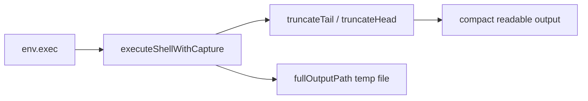
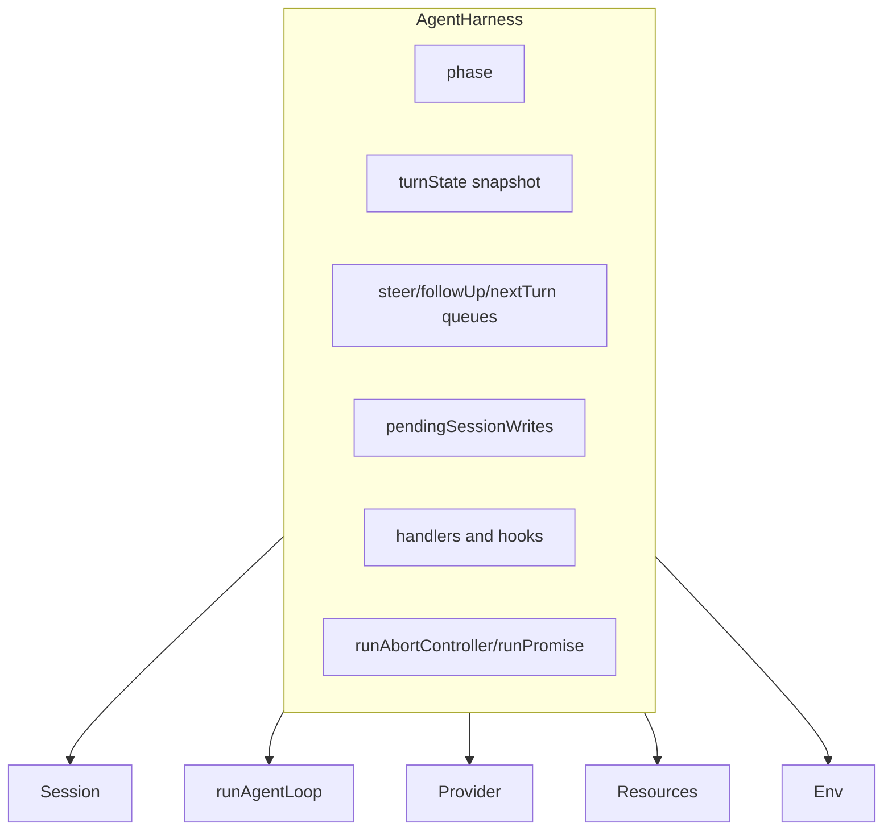
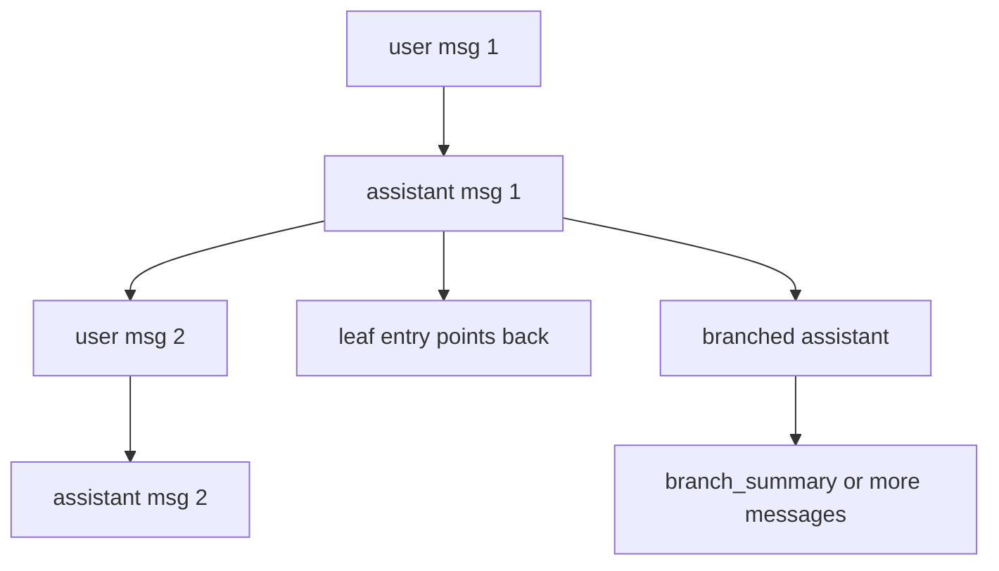
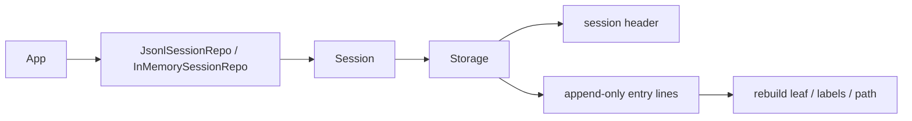
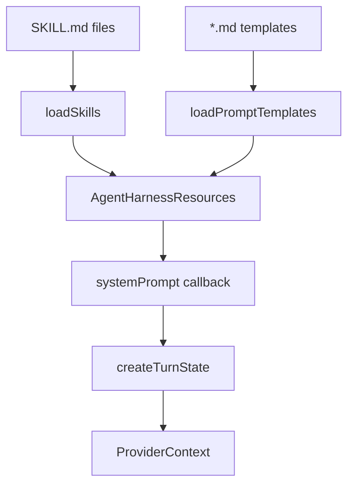
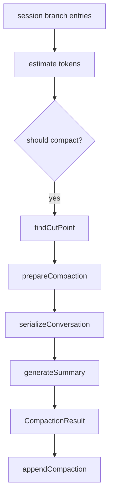
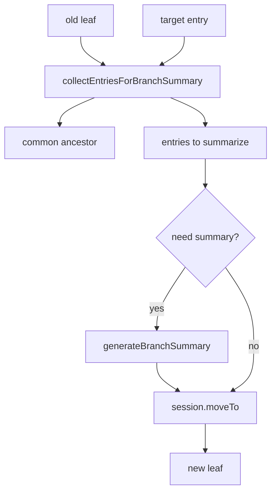
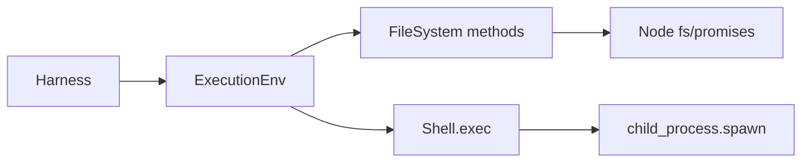
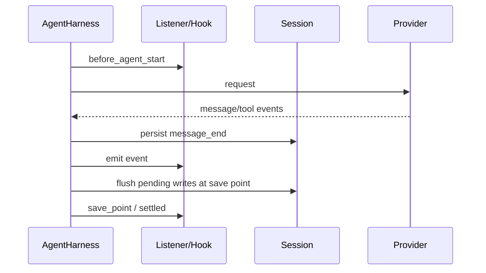

# packages/agent/harness 学习指南

这份文档面向“准备系统学习 `packages/agent/src/harness`”的读者。目标不是简单解释几个类名，而是把它看成一个完整的运行时子系统：它如何组织一次 agent 运行、如何保存会话、如何处理资源、如何压缩上下文、如何在树形会话之间跳转。

为了便于定位，这里把学习范围扩展为三层：

1. `packages/agent/src/harness/` 下的实现。
2. `packages/agent/docs/` 下已有的设计文档。
3. `packages/agent/test/harness/` 下用于验证行为的测试。

相关入口文件：

- [../src/harness/agent-harness.ts](../src/harness/agent-harness.ts)
- [../src/harness/types.ts](../src/harness/types.ts)
- [../src/harness/session/session.ts](../src/harness/session/session.ts)
- [../src/harness/env/nodejs.ts](../src/harness/env/nodejs.ts)
- [../src/index.ts](../src/index.ts)
- [agent-harness.md](Projects/PI/agent/harness/agent-harness.md)
- [durable-harness.md](durable-harness.md)

## 1. 先建立整体心智模型

如果只用一句话概括 `harness`：

`AgentHarness` 是位于底层 `runAgentLoop()` 之上的“编排层”。它不直接实现 LLM 推理本身，而是负责把一次 agent 运行所需的上下文、资源、会话持久化、生命周期事件、队列操作、上下文压缩和树导航组织起来。

你可以把它理解成下面这几个子系统的组合：

- 编排核心：`AgentHarness`
- 类型契约：`types.ts`
- 会话树与存储：`session/`
- 运行环境抽象：`env/`
- 资源加载：`skills.ts`、`prompt-templates.ts`、`system-prompt.ts`
- 消息适配：`messages.ts`
- 压缩与分支摘要：`compaction/`
- 辅助工具：`utils/`

### 整体架构图

```mermaid
flowchart TD
    User[应用层 / 调用方] --> Harness[AgentHarness]
    Harness --> Session[Session]
    Session --> Storage[SessionStorage]
    Storage --> JSONL[JsonlSessionStorage]
    Storage --> Memory[InMemorySessionStorage]

    Harness --> Env[ExecutionEnv]
    Env --> NodeEnv[NodeExecutionEnv]

    Harness --> Resources[Resources]
    Resources --> Skills[skills.ts]
    Resources --> Templates[prompt-templates.ts]
    Resources --> SysPrompt[system-prompt.ts]

    Harness --> Messages[messages.ts]
    Harness --> Compaction[compaction/*]
    Harness --> Loop[runAgentLoop]
    Loop --> Provider[@earendil-works/pi-ai]

    Harness --> Events[hooks / subscribe / on]
```

## 2. 目录结构与每个部分的作用

### 2.1 核心入口

#### `agent-harness.ts`

这是整个 harness 的主控文件，主要职责有五类：

1. 管理生命周期阶段：`idle`、`turn`、`compaction`、`branch_summary`、`retry`。
2. 为一次运行创建快照：消息、资源、模型、思考等级、工具、流选项、会话 ID、system prompt。
3. 调用底层 `runAgentLoop()`，并把 loop 事件转成持久化与 hook 行为。
4. 处理运行期间允许发生的动态变更，比如 `steer()`、`followUp()`、`nextTurn()`、`setModel()`、`setResources()`。
5. 在会话树上执行结构性操作，比如 `compact()` 和 `navigateTree()`。

可以把这个文件看成“运行时总线 + 生命周期协调器”。

#### `types.ts`

这个文件非常重要，因为它定义了整个 harness 子系统的语言边界。它不是简单的类型收纳箱，而是包含：

- 错误模型：`FileError`、`ExecutionError`、`SessionError`、`CompactionError`、`BranchSummaryError`、`AgentHarnessError`
- 抽象能力接口：`FileSystem`、`Shell`、`ExecutionEnv`
- 会话数据模型：`SessionTreeEntry` 及其各种变体
- 生命周期事件模型：`AgentHarnessOwnEvent`、`AgentHarnessEventResultMap`
- 运行配置模型：`AgentHarnessOptions`、`AgentHarnessStreamOptions`
- 资源模型：`Skill`、`PromptTemplate`、`AgentHarnessResources`

学习建议：读 harness 时，如果某个字段不理解，不要猜，回到 `types.ts` 看它是否是“持久态”“快照态”“事件载荷”还是“抽象能力”。

### 2.2 会话层 `session/`

#### `session.ts`

`Session` 是会话树 API 的外观层，作用是把底层 `SessionStorage` 提供的 append-only 树形存储，包装成更高层的语义操作，例如：

- `appendMessage()`
- `appendThinkingLevelChange()`
- `appendModelChange()`
- `appendCompaction()`
- `appendCustomMessageEntry()`
- `appendLabel()`
- `appendSessionName()`
- `moveTo()`
- `buildContext()`

其中最关键的是 `buildContext()`。它会根据当前 leaf 回溯整条分支，把会话条目重建成模型真正需要看到的消息序列。

#### `jsonl-storage.ts`

这是持久化实现。它把 session 存成 JSONL 文件：

- 第一行是 session header
- 后续每一行都是一个 `SessionTreeEntry`

它的核心特点：

- append-only，天然适合审计和恢复
- 每次 `appendEntry()` 都直接写磁盘
- `setLeafId()` 不是改内存指针，而是追加一个 `leaf` 条目
- reopen 时会通过扫描 entries 重建当前 leaf 和标签缓存

这套设计很关键，因为它解释了为什么 harness 文档一直强调“durable semantics”。

#### `memory-storage.ts`

这是测试和轻量场景用的内存实现。接口和 JSONL 存储保持一致，但不落盘。

它的作用不是替代 JSONL，而是：

- 让测试不依赖文件系统
- 让 `Session` 和 `AgentHarness` 可以在纯内存环境下验证行为
- 证明 storage 是可替换的抽象层，而不是实现细节

#### `jsonl-repo.ts` 与 `memory-repo.ts`

这两个文件提供的是“仓库级”能力，不是单 session 能力。它们负责：

- 创建 session
- 打开 session
- 列出 session
- 删除 session
- fork session

也就是说：

- `SessionStorage` 负责一棵树怎么存
- `SessionRepo` 负责一堆 session 怎么管理

#### `repo-utils.ts`

这个文件的作用是为 repo/storage 提供一些共用逻辑，比如：

- 生成 session id
- 构造 `Session`
- 把 `FileSystem` 的 `Result` 错误提升为 `SessionError`
- 计算 fork 时应该复制哪一段树路径

### 2.3 环境层 `env/`

#### `nodejs.ts`

`NodeExecutionEnv` 是 `ExecutionEnv` 的 Node.js 实现。它把 harness 依赖的两类能力统一到了一个对象里：

- 文件系统能力
- shell 执行能力

它的价值在于：

- harness 不直接依赖 Node 的 `fs` 或 `child_process`
- 测试可以替换环境实现
- 未来可以扩展成其他宿主环境

### 2.4 资源层

#### `skills.ts`

作用有三层：

1. 从目录递归加载 `SKILL.md`
2. 解析 frontmatter，构造成 `Skill`
3. 生成 skill invocation 文本，供 `harness.skill()` 使用

实现上还有两个值得注意的点：

- 支持 `.gitignore`、`.ignore`、`.fdignore`
- 支持 symlink 路径

这意味着 skills 设计目标不是“只读一个固定目录”，而是“适配真实工程目录结构”。

#### `prompt-templates.ts`

它和 skills 很像，但职责更窄：

- 从目录或文件加载 prompt template
- 解析 frontmatter
- 做简单的参数替换，例如 `$1`、`$@`、`${@:2}`

skills 是“整块能力说明”，templates 是“命令式 prompt 宏”。

#### `system-prompt.ts`

这里的作用很专一：把 skills 转成 system prompt 可注入的 XML 块。

重点不是“做字符串拼接”，而是决定“模型如何看到技能目录”。当 `disableModelInvocation` 为 `true` 时，skill 仍可被应用显式调用，但不会暴露给模型自发选择。

### 2.5 消息层 `messages.ts`

这个文件的作用是把“session/运行时里的扩展消息”映射到“模型能理解的普通 LLM message”。

它主要解决四件事：

1. 定义自定义消息类型，比如 `bashExecution`、`custom`、`branchSummary`、`compactionSummary`
2. 为 branch/compaction 生成可注入消息对象
3. 把 bash 执行结果转换成模型可读文本
4. 通过 `convertToLlm()` 统一映射为 provider 侧的 `Message[]`

这层很重要，因为 session 中保留的是 richer message 类型，而 provider API 只能接受标准化消息。

### 2.6 压缩层 `compaction/`

#### `compaction.ts`

作用是“在上下文太长时，把旧历史折叠成结构化摘要”。

它包含几个关键步骤：

- 估算上下文 token
- 判断是否需要 compact
- 找切点 `findCutPoint()`
- 组织待压缩消息与保留消息
- 调用模型生成总结 `generateSummary()`
- 输出可写回 session 的 compaction 结果

#### `branch-summarization.ts`

作用是“用户从一个会话分支回跳到另一个分支时，为离开的分支生成摘要”。

和 compaction 的差异：

- compaction 面向“上下文太长”
- branch summary 面向“会话树跳转”

#### `compaction/utils.ts`

这是 compaction/branch summary 共同依赖的消息序列化和文件操作统计层，主要负责：

- 从 tool call 中提取读写文件路径
- 区分 read-only 与 modified 文件
- 把消息序列串行化成总结 prompt 文本

### 2.7 工具层 `utils/`

当前 `utils/` 里虽然只有两个文件，但都很实用：

#### `shell-output.ts`

核心能力是 `executeShellWithCapture()`。它负责：

- 同时捕获 stdout/stderr
- 过滤二进制脏字符
- 超过阈值时只保留 tail，并把完整输出写到临时文件
- 返回结构化结果：`output`、`exitCode`、`cancelled`、`truncated`、`fullOutputPath`

这层的意义是：shell 工具不只是“跑命令”，还要在长输出场景下维持可读性和可恢复性。

#### `truncate.ts`

这是统一的截断策略实现，支持：

- `truncateHead()`：适合文件读取，保留开头
- `truncateTail()`：适合终端输出，保留结尾
- 同时按行数和字节数控制
- 尽量避免返回半行内容
- 对 UTF-8 和 surrogate pair 做兼容处理

它们不主导整体架构，但属于“支撑 harness 实用化”的底层配套。

### 工具层架构图



## 3. `AgentHarness` 的内部架构

学习 harness，最核心的是理解它的 6 个内部状态面。

### 3.1 状态面一：phase

`phase` 用于表达当前是否处于可接受结构性操作的状态。

定义在 [../src/harness/types.ts](../src/harness/types.ts)：

- `idle`
- `turn`
- `compaction`
- `branch_summary`
- `retry`

当前规则可以简单记成：

- `prompt()`、`skill()`、`promptFromTemplate()`、`compact()`、`navigateTree()` 只能在 `idle`
- `steer()`、`followUp()`、`abort()`、运行时配置更新可以在 turn 内发生

### 3.2 状态面二：turn snapshot

每次 turn 启动前，`createTurnState()` 会构造一个快照，包含：

- 当前 branch 的消息
- 当前资源 `resources`
- 当前 stream options
- session id
- system prompt
- model
- thinking level
- 所有工具
- active tools

关键点：

- 快照在 turn 开始时取一次
- 当前 provider 请求使用这个快照
- 运行中更新配置不会回写到当前请求
- save point 后会取新快照，供下一轮 continuation 使用

### 3.3 状态面三：队列

`AgentHarness` 内部维护三个消息队列：

- `steerQueue`
- `followUpQueue`
- `nextTurnQueue`

它们的语义不同：

- `steer()` 是在 agent 还在进行中时插入引导消息
- `followUp()` 是 agent 原本要停下时，补一轮用户跟进
- `nextTurn()` 不要求当前 turn 忙闲，会在下一次用户显式触发 turn 时先注入

### 3.4 状态面四：pending session writes

这是理解 harness 生命周期的关键。

当 harness 正在忙时，外部如果还要写 session，不能直接破坏当前消息顺序。因此实现选择：

- idle 时，直接写 session
- busy 时，先放进 `pendingSessionWrites`
- 在 save point、`agent_end`、失败清理时再刷盘

这就是文档里一直强调“deterministic ordering”的原因。

### 3.5 状态面五：事件与 hook

`AgentHarness` 有两套观察机制：

- `subscribe()`：订阅所有事件，适合观察与监听
- `on(type, handler)`：按事件类型注册 hook，部分 hook 允许返回 patch/result

返回值型 hook 的典型例子：

- `before_agent_start`
- `context`
- `before_provider_request`
- `before_provider_payload`
- `tool_call`
- `tool_result`
- `session_before_compact`
- `session_before_tree`

### 3.6 状态面六：运行中的当前控制器

运行中还维护了：

- `runAbortController`
- `runPromise`

对应两个能力：

- `abort()` 终止当前 run
- `waitForIdle()` 等待整个 run 连同监听器 settle 完成

### `AgentHarness` 内部结构图



## 4. 一次 `prompt()` 的完整执行流

这是最值得反复看的主路径。

### 执行步骤

1. `prompt()` 先检查 `phase === "idle"`。
2. 把 `phase` 切到 `turn`。
3. 调用 `createTurnState()` 构造快照。
4. 进入 `executeTurn()`。
5. 构造当前 user message，如果有 `nextTurnQueue` 先插入队列消息。
6. 触发 `before_agent_start` hook，可追加消息或改 system prompt。
7. 调用 `runAgentLoop()`。
8. loop 过程中，消息事件交给 `handleAgentEvent()`：
   - `message_end` 时先持久化再发事件
   - `turn_end` 时 flush pending writes，并触发 `save_point`
   - `agent_end` 时 flush、切回 `idle`、发 `settled`
9. 如果 loop 抛错，生成一个 assistant failure message 持久化。
10. 返回最后一个 assistant message。

### 主执行时序图

```mermaid
sequenceDiagram
    participant App as 应用层
    participant Harness as AgentHarness
    participant Session as Session
    participant Loop as runAgentLoop
    participant Provider as Provider

    App->>Harness: prompt("hello")
    Harness->>Harness: assert idle + phase=turn
    Harness->>Session: buildContext()
    Session-->>Harness: branch messages
    Harness->>Harness: createTurnState()
    Harness->>Harness: executeTurn()
    Harness->>Loop: runAgentLoop(...)
    Loop->>Provider: stream/complete request
    Provider-->>Loop: assistant/tool events
    Loop-->>Harness: AgentEvent
    Harness->>Session: appendMessage()/flush pending writes
    Harness-->>App: AssistantMessage
```

## 5. 会话层的架构与作用

### 5.1 为什么 session 不是简单数组

这里的 session 是树，不是线性聊天记录。因为它要支持：

- 分支
- 回退到旧节点
- 在旧节点上继续生成新分支
- 对离开的分支做摘要
- 对旧历史做压缩

所以底层数据结构必须支持 `parentId`。

### 5.2 `SessionTreeEntry` 有哪些类型

核心 entry 类型包括：

- `message`
- `thinking_level_change`
- `model_change`
- `compaction`
- `branch_summary`
- `custom`
- `custom_message`
- `label`
- `session_info`
- `leaf`

这里最容易忽略的是：

- `leaf` 也是持久化条目
- `compaction` 和 `branch_summary` 不是只存在于 UI，它们会影响后续上下文重建

### 5.3 `buildSessionContext()` 的作用

`session.ts` 中的 `buildSessionContext()` 会把树路径还原成 LLM 侧上下文：

- 遇到 `message`，直接加消息
- 遇到 `custom_message`，转成 `custom`
- 遇到 `branch_summary`，转成 `branchSummary`
- 遇到 `compaction`，不会把全部旧消息展开，而是注入一条 `compactionSummary`，再拼接保留段

这说明 session 并不是“存什么就原样给模型看什么”，而是“先存结构，再重建上下文”。

### Session 子系统架构图

```mermaid
flowchart TD
    Repo[SessionRepo] --> Session[Session]
    Session --> Storage[SessionStorage]
    Storage --> InMem[InMemorySessionStorage]
    Storage --> Jsonl[JsonlSessionStorage]
    Session --> Context[buildSessionContext]
    Context --> LLMContext[AgentMessage[] for snapshot]
```

### 会话树结构图



## 6. 存储层的架构与作用

### 6.1 `JsonlSessionStorage`

它的设计重点是“可恢复、可审计、追加式”。

文件结构：

- header：session 元数据
- entry lines：每行一个 `SessionTreeEntry`

为什么这样设计：

- 追加成本低
- 出错后更容易恢复
- 能保留 leaf 变更历史
- 易于支持 durable harness 的后续设计

### 6.2 `InMemorySessionStorage`

这个实现的价值不在功能更多，而在“保持同一套存储契约”。

因此它非常适合拿来学习 API 语义：

- 不受磁盘 I/O 干扰
- 逻辑更直接
- 测试覆盖多

### 6.3 repo 层为什么单独存在

如果没有 repo 层，session 只能处理“一棵树”。repo 层补上的是：

- 多个 session 的生命周期管理
- `list()` 与 `open()`
- `fork()` 复制某一段分支作为新 session

### 存储层架构图



## 7. 资源层的架构与作用

### 7.1 skill 的作用

skill 解决的问题是“把复杂的专门知识打包成可加载资源”。

一个 `Skill` 至少包含：

- `name`
- `description`
- `content`
- `filePath`

skill 有两种使用方式：

- 显式：`harness.skill(name)`
- 隐式：通过 system prompt 暴露给模型，让模型知道有哪些 skill 可以读

### 7.2 prompt template 的作用

template 的定位更接近“参数化 prompt 命令”。

它适合：

- 快速触发固定模板
- 把命令行式参数替换成 prompt 文本
- 为应用层提供 slash command 风格能力

### 7.3 system prompt 的作用

`AgentHarness` 的 `systemPrompt` 可以是：

- 静态字符串
- 动态回调

动态回调拿到的上下文包括：

- env
- session
- model
- thinkingLevel
- activeTools
- resources

这意味着 system prompt 不是固定常量，而是“当前运行配置的视图函数”。

### 资源层架构图



## 8. 消息层的架构与作用

### 8.1 为什么需要消息适配层

会话里存在很多“不是标准聊天消息”的信息：

- bash 执行输出
- 自定义消息
- 压缩摘要
- 分支摘要

这些消息对产品和调试很有价值，但 provider 接口通常只接受标准消息格式。因此 `messages.ts` 的职责就是做适配。

### 8.2 `convertToLlm()` 的关键行为

- `bashExecution` -> user text message
- `custom` -> user message
- `branchSummary` -> user message，带 `<summary>` 包裹
- `compactionSummary` -> user message，带 `<summary>` 包裹
- `user` / `assistant` / `toolResult` -> 原样透传

这其实是在做一种“语义降级”：保留信息，不保留内部实现类型。

### 消息层架构图

```mermaid
flowchart LR
    SessionEntries[Session entries] --> BuildContext[buildSessionContext]
    BuildContext --> AgentMessages[AgentMessage[]]
    AgentMessages --> Convert[convertToLlm]
    Convert --> LlmMessages[provider Message[]]
```

## 9. compaction 子系统的架构与作用

### 9.1 compaction 想解决什么问题

当会话越来越长时，完整上下文会超过模型窗口，或者即使没超过，也会变得昂贵。compaction 的目标是：

- 保留最近一段原始消息
- 把更早的历史压成结构化摘要
- 继续让模型知道之前做过什么

### 9.2 compaction 的关键函数

#### `estimateContextTokens()`

用最近 assistant usage 或启发式估算当前上下文 token。

#### `shouldCompact()`

判断是否已经逼近 context window。

#### `findCutPoint()`

决定从哪一条 entry 开始保留最近消息。这里要避免把 turn 切坏，所以还会考虑：

- cut point 是否落在用户消息上
- 是否切开了一个未完整结束的 turn

#### `generateSummary()`

把待压缩消息序列化，喂给模型，要求模型产出固定结构的 checkpoint summary。

#### `prepareCompaction()` 与 `compact()`

前者负责准备，后者负责真正执行模型摘要并返回 `CompactionResult`。

### 9.3 compaction 不只是摘要文本

`compaction/utils.ts` 还会分析工具调用里涉及的文件：

- read files
- modified files

这样未来模型即使只看到摘要，也知道之前触碰过哪些文件。

### compaction 架构图



## 10. 分支摘要与树导航的架构与作用

### 10.1 `navigateTree()` 在做什么

这个方法不是简单地“改一下 leaf”。它实际做了三件事：

1. 找到当前 leaf 和目标节点的公共祖先
2. 收集当前分支上将被离开的 entries
3. 视情况生成 branch summary，再移动 leaf

### 10.2 为什么需要 branch summary

如果用户在一条支线上做了很多探索，然后又跳回旧分支，这些探索结果不能完全丢掉。branch summary 的价值就是：

- 不把整段分支原文都塞回上下文
- 但保留这段探索的目标、进展、关键决策和下一步

### 10.3 `collectEntriesForBranchSummary()` 的作用

它会：

- 取 old leaf 的路径
- 取 target 的路径
- 找 deepest common ancestor
- 把 old leaf 到祖先之间那段“即将离开的分支”提出来

### 10.4 `generateBranchSummary()` 的作用

它和 compaction summary 很像，但 prompt 更聚焦在：

- 这个分支要做什么
- 做到了哪一步
- 关键决定是什么
- 回来继续时下一步应该做什么

### 分支导航架构图



## 11. `ExecutionEnv` 的架构与作用

### 11.1 为什么 harness 自己不直接用 Node API

如果 `AgentHarness` 直接依赖：

- `fs/promises`
- `child_process`

那测试、跨环境适配和宿主隔离都会变差。因此这里引入 `ExecutionEnv` 抽象。

### 11.2 `NodeExecutionEnv` 提供了什么

- 路径解析：`absolutePath()`、`joinPath()`
- 文件读写：`readTextFile()`、`writeFile()`、`appendFile()` 等
- 目录操作：`listDir()`、`createDir()`、`remove()`
- shell 执行：`exec()`
- abort / timeout / callback error 映射

### 11.3 设计价值

- harness 只依赖能力，不依赖平台
- 错误统一映射到稳定错误码
- 文件与 shell 都遵守 `Result<T, E>` 风格，不随便 throw

### 环境层架构图



## 12. hooks、事件与 save point

### 12.1 事件分成两类

#### 底层 loop 事件

来自 `runAgentLoop()`，例如：

- `message_start`
- `message_end`
- `turn_end`
- `agent_end`
- tool execution 相关事件

#### harness 自有事件

定义在 `types.ts`，例如：

- `queue_update`
- `save_point`
- `abort`
- `settled`
- `before_agent_start`
- `before_provider_request`
- `before_provider_payload`
- `session_before_compact`
- `session_before_tree`
- `resources_update`

### 12.2 save point 为什么重要

save point 的语义是：

- 一个 assistant turn 及其 tool result 消息已经完成
- agent 发出的消息已经持久化完毕
- 这时可以安全地 flush pending writes
- 也可以为下一轮 continuation 刷新 turn snapshot

因此 save point 是“当前请求快照”和“下一轮运行配置”之间的边界。

### 12.3 provider hooks 为什么拆成两层

provider 相关 hook 分成：

- `before_provider_request`：改请求级 stream options
- `before_provider_payload`：改底层 payload

这样的好处是：

- transport/header/metadata 级别变更更清晰
- payload 变换链更灵活
- auth header 合并和 hook patch 有明确顺序

### 事件流架构图



## 13. 设计文档里“已实现”和“规划中”的边界

学习这套代码时，一个常见误区是把 docs 里的设计目标误认为已经全部落地。当前应该区分两层：

### 已经比较清晰实现的部分

- `AgentHarness` 的基本 turn orchestration
- session tree 与 storage/repo
- queue 机制
- save point 刷新语义
- provider request / payload hook 链
- compaction 与 branch summary 的基础路径

### 仍在演进或明确标注为 planned 的部分

- 更完整的 hook/reducer 架构
- 更强的 lifecycle hardening
- 半持久化恢复能力
- retry 相关完整语义
- 更成熟的 pending writes facade

这也是为什么你应该同时读：

- [agent-harness.md](Projects/PI/agent/harness/agent-harness.md)
- [durable-harness.md](durable-harness.md)

前者讲当前生命周期目标，后者讲未来恢复与耐久性方向。

## 14. 如何结合测试学习

如果你想快速建立“哪些语义是被保证的”，测试比源码更高效。

推荐阅读顺序：

1. [../test/harness/agent-harness.test.ts](../test/harness/agent-harness.test.ts)
2. [../test/harness/agent-harness-stream.test.ts](../test/harness/agent-harness-stream.test.ts)
3. [../test/harness/session.test.ts](../test/harness/session.test.ts)
4. [../test/harness/storage.test.ts](../test/harness/storage.test.ts)
5. [../test/harness/skills.test.ts](../test/harness/skills.test.ts)
6. [../test/harness/prompt-templates.test.ts](../test/harness/prompt-templates.test.ts)

你可以重点从测试里验证这些认知：

- queue 是如何 drain 的
- `abort()` 清理哪些队列，保留哪些队列
- save point 如何刷新 model/thinking/resources/tools
- pending session writes 的顺序保证是什么
- JSONL storage 如何重建 leaf 和 label
- skill/template loader 如何处理目录、symlink 和诊断

## 15. 推荐学习顺序

如果你准备真正吃透这套代码，建议按下面顺序读：

1. [../src/harness/types.ts](../src/harness/types.ts)
   先掌握词汇表，不然后面每个对象都容易混。
2. [../src/harness/session/session.ts](../src/harness/session/session.ts)
   先理解 session tree，后面的 turn snapshot 才容易懂。
3. [../src/harness/agent-harness.ts](../src/harness/agent-harness.ts)
   重点看 `createTurnState()`、`executeTurn()`、`handleAgentEvent()`、`compact()`、`navigateTree()`。
4. [../src/harness/messages.ts](../src/harness/messages.ts)
   理解上下文为什么不是直接拿 session entries 喂给模型。
5. [../src/harness/skills.ts](../src/harness/skills.ts)、[../src/harness/prompt-templates.ts](../src/harness/prompt-templates.ts)、[../src/harness/system-prompt.ts](../src/harness/system-prompt.ts)
   理解资源如何进入 prompt。
6. [../src/harness/compaction/compaction.ts](../src/harness/compaction/compaction.ts) 与 [../src/harness/compaction/branch-summarization.ts](../src/harness/compaction/branch-summarization.ts)
   理解长上下文和分支返回这两个高级能力。
7. [../src/harness/session/jsonl-storage.ts](../src/harness/session/jsonl-storage.ts) 与 [../src/harness/env/nodejs.ts](../src/harness/env/nodejs.ts)
   最后看宿主实现，理解它怎样把抽象落到磁盘和系统进程上。

## 16. 你应该记住的 10 个关键结论

1. `AgentHarness` 不是模型循环本身，而是模型循环外面的编排层。
2. 当前上下文来自 session tree 的 branch 重建，不是简单消息数组。
3. `phase` 决定哪些操作能在忙时发生，哪些必须 idle。
4. turn 使用 snapshot，运行时配置更新影响的是之后的 snapshot，不是当前 provider 请求。
5. session 写入在 busy 时会进入 pending 队列，之后按 save point 顺序 flush。
6. `leaf` 是 durable entry，不是纯内存指针。
7. `compaction` 解决长上下文，`branch summary` 解决分支切换。
8. skills/template/system prompt 共同组成资源层，但语义各不相同。
9. `ExecutionEnv` 让 harness 与宿主平台解耦。
10. 现有实现已经很完整，但 docs 明确说明还有一部分生命周期与 durability 设计仍在演进中。

## 17. 适合继续深挖的问题

当你第一遍读完后，建议再带着下面这些问题回看源码：

1. 为什么 `message_end` 要先持久化，再通知 listener？
2. 为什么 `setLeafId()` 要写一条 `leaf` entry，而不是只更新存储里的当前字段？
3. `nextTurnQueue` 为什么不在 `abort()` 里清掉？
4. `before_provider_request` 和 `before_provider_payload` 为什么拆成两类 hook？
5. `compactionSummary` 与 `branchSummary` 为什么被当成 user message 注入模型？
6. save point 为什么是 runtime config 刷新的边界？
7. 如果未来做 durable recovery，哪些状态可以直接恢复，哪些必须由 app 重新提供？

如果你能把这 7 个问题都用源码回答出来，就已经不只是“会用 harness”，而是基本能参与它的演进了。