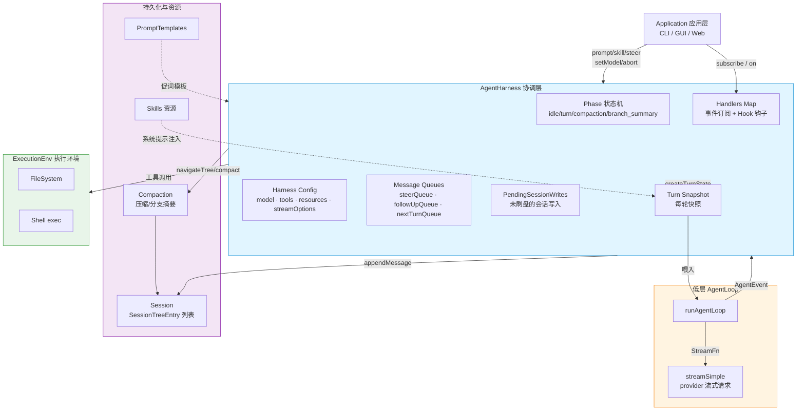
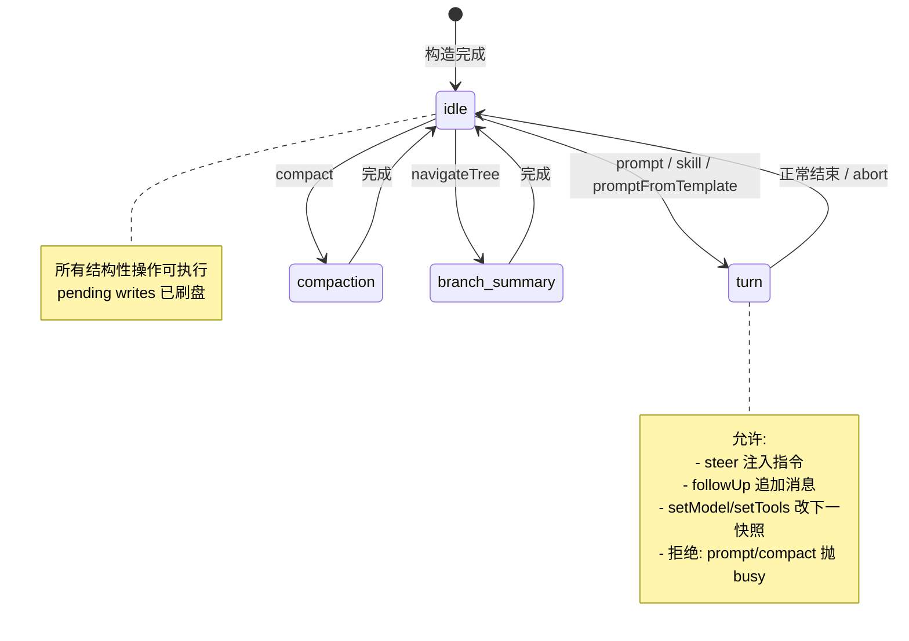
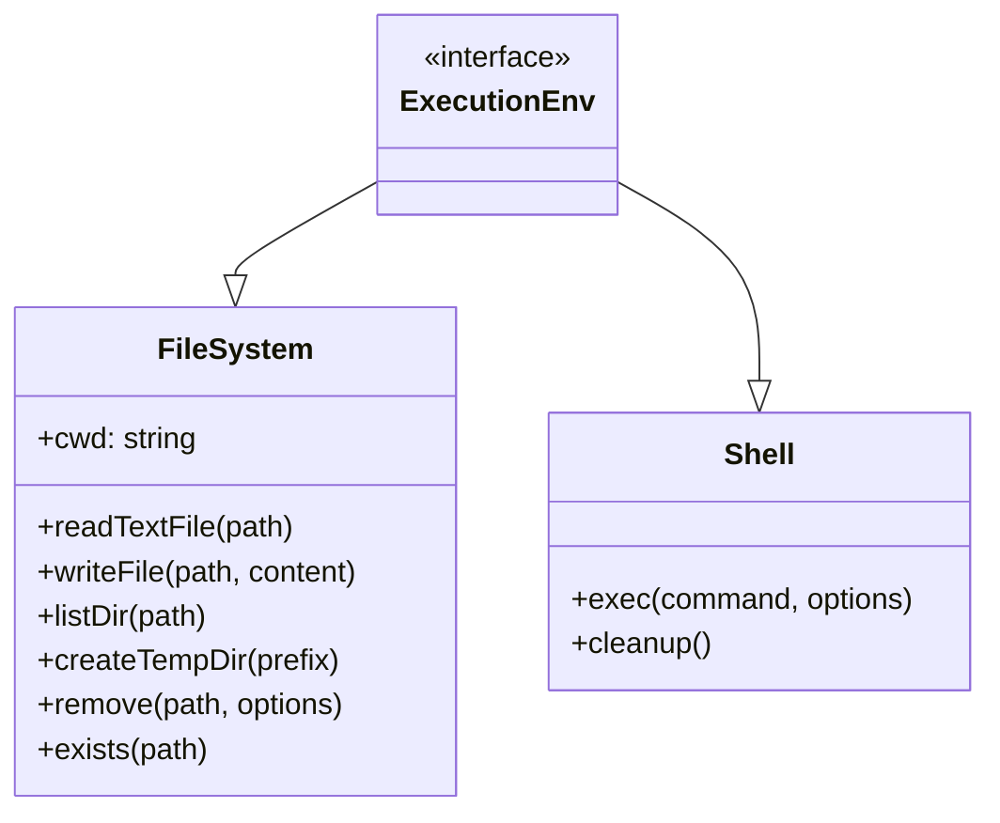
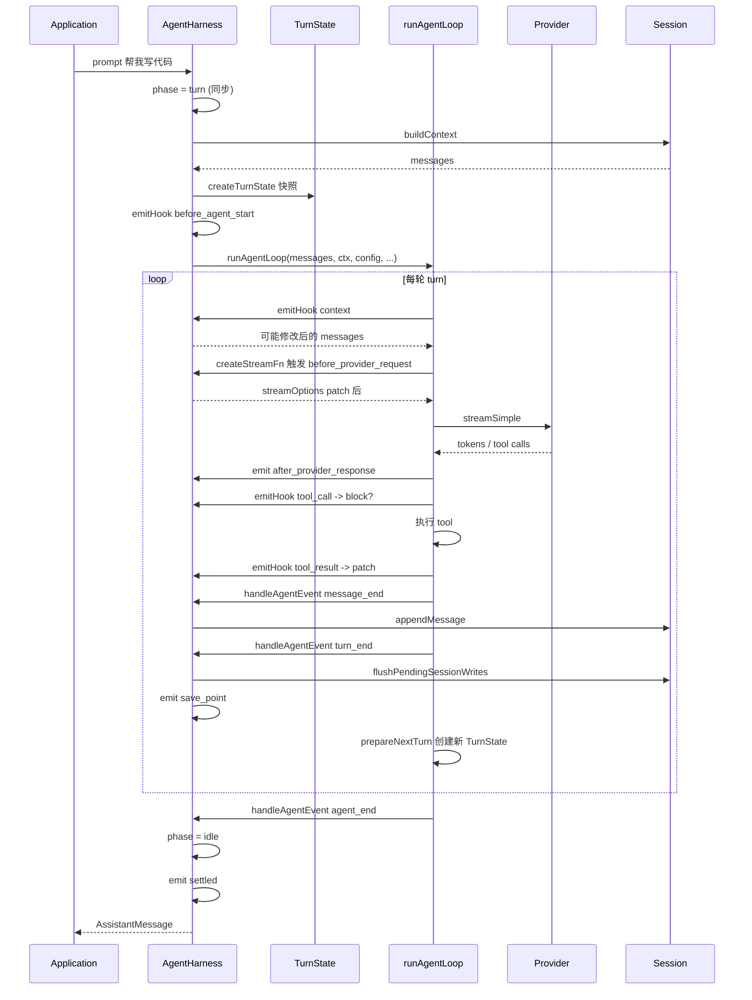
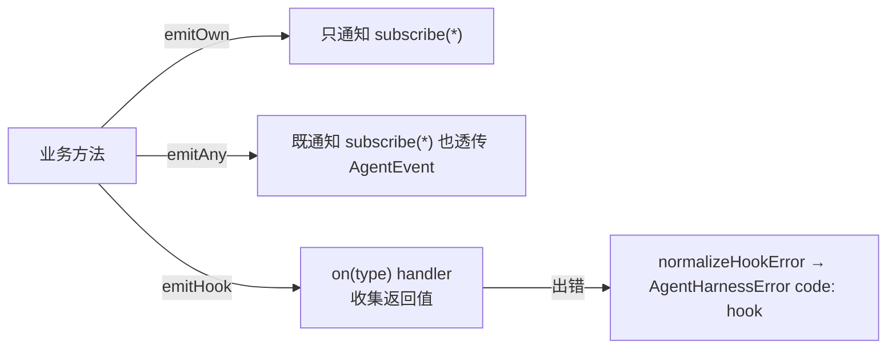
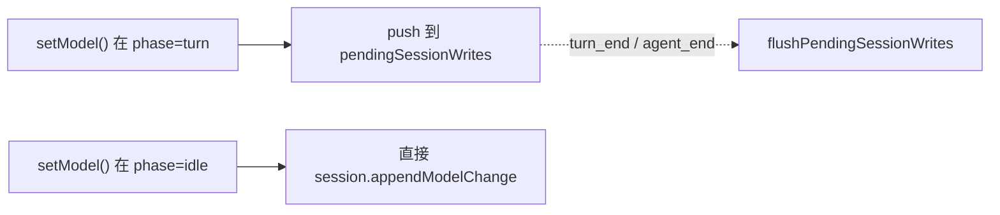
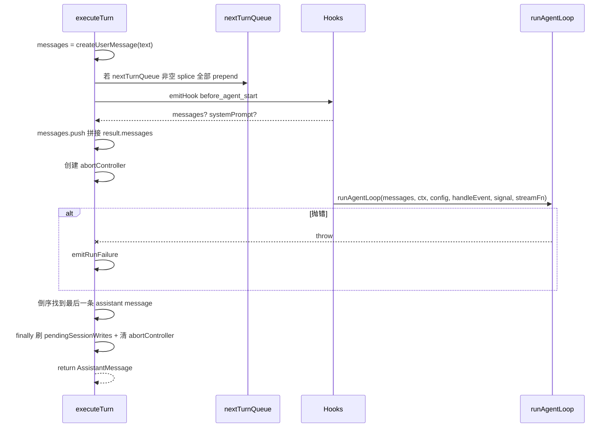
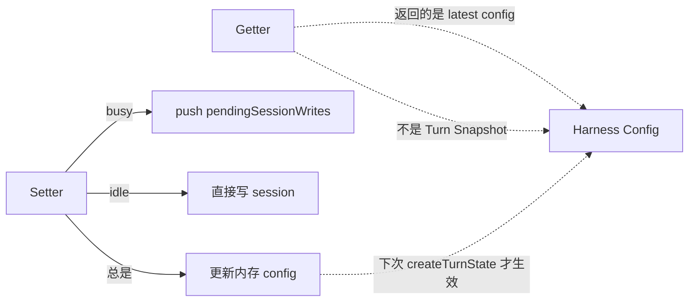

# AgentHarness 学习笔记

> [!info] 文件位置
> `packages/agent/src/harness/agent-harness.ts`(996 行)
> 同目录配套类型定义：`packages/agent/src/harness/types.ts`
> 官方文档：`packages/agent/docs/agent-harness.md`

`AgentHarness` 是 pi 项目里 **Agent 协作运行的"总控制器"**：它在低层 `runAgentLoop`(纯函数式的对话循环)之上加了一层 **会话持久化 / 配置管理 / 资源解析 / 操作锁 / 钩子(hooks)与事件订阅** 的能力，构成了一个完整、可扩展的 Agent Runtime。

---

## 一、整体架构图



---

## 二、生命周期与 Phase 状态机



> [!warning] 锁约束
> `prompt / skill / promptFromTemplate / compact / navigateTree` 都要求 `phase === "idle"`，否则抛 `AgentHarnessError("busy")`；这条规则在第一次 `await` 之前 **同步置位**，避免并发竞态。

---

## 三、核心类型(types.ts)详解

### 1. Result 与错误体系

| 类型 / 类                                                                                                             | 作用                                                             |
| ------------------------------------------------------------------------------------------------------------------ | -------------------------------------------------------------- |
| `Result<T, E>`                                                                                                     | `{ ok: true, value }` 或 `{ ok: false, error }`，用于"低层不抛、上层抛"的边界 |
| `ok / err / getOrThrow / getOrUndefined / toError`                                                                 | Result 配套工具函数                                                  |
| `FileError` (code: not_found/permission_denied/...)                                                                | 文件系统错误                                                         |
| `ExecutionError`                                                                                                   | Shell 执行错误                                                     |
| `CompactionError` / `BranchSummaryError`                                                                           | 压缩 / 分支摘要错误                                                    |
| `SessionError`                                                                                                     | 会话存储错误                                                         |
| `AgentHarnessError`(code: busy/invalid_state/invalid_argument/session/hook/auth/compaction/branch_summary/unknown) | **公共 API 抛出的统一错误**，原始错误挂在 `cause` 上                            |

> [!note] 错误归一化
> `normalizeHarnessError()` 会把任意 throw 出来的错误归一化成 `AgentHarnessError`，并把 `SessionError` / `CompactionError` / `BranchSummaryError` 自动映射到对应 code。

### 2. 资源相关

```typescript
interface Skill {
    name: string;            // 唯一名
    description: string;     // 模型可见描述
    content: string;         // 完整指令
    filePath: string;        // 绝对路径(用于解析相对引用)
    disableModelInvocation?: boolean; // 仅允许应用显式调用
}

interface PromptTemplate {
    name: string;
    description?: string;
    content: string;         // 含参数占位符
}

interface AgentHarnessResources<TSkill, TPromptTemplate> {
    promptTemplates?: TPromptTemplate[];
    skills?: TSkill[];
}
```

### 3. 流式请求选项

- `AgentHarnessStreamOptions` —— harness 拥有的"干净版"配置：`transport / timeoutMs / maxRetries / maxRetryDelayMs / headers / metadata / cacheRetention`
- `AgentHarnessStreamOptionsPatch` —— Hook 返回的 patch(可用 `undefined` 删除某个 header/metadata key)，由 `applyStreamOptionsPatch()` 合并

### 4. ExecutionEnv



> [!important] 关键不变量
> `FileSystem` 所有操作 **绝不抛异常** —— 失败必须封装到 `Result` 里返回。

### 5. Session Tree Entry

会话本质是一棵 **树**(支持分支/回滚)，每种节点用一种 entry 表示：

| Entry 类型 | 含义 |
|---|---|
| `MessageEntry` | 用户/助手/工具消息 |
| `ThinkingLevelChangeEntry` | 切换 thinking 等级 |
| `ModelChangeEntry` | 切换模型 |
| `CompactionEntry` | 上下文压缩节点(含 summary、firstKeptEntryId) |
| `BranchSummaryEntry` | 分支跳转产生的摘要 |
| `CustomEntry` / `CustomMessageEntry` | 应用自定义元数据 |
| `LabelEntry` | 给某节点打标签 |
| `SessionInfoEntry` | 会话名称(legacy) |
| `LeafEntry` | 当前活跃叶节点指针(durable) |

### 6. 事件体系

```mermaid
graph LR
    subgraph OwnEvents["AgentHarness 自有事件 OwnEvent"]
        E1[queue_update]
        E2[save_point]
        E3[abort]
        E4[settled]
        E5[before_agent_start]
        E6[context]
        E7[before_provider_request]
        E8[before_provider_payload]
        E9[after_provider_response]
        E10[tool_call]
        E11[tool_result]
        E12[session_before_compact / session_compact]
        E13[session_before_tree / session_tree]
        E14[model_select]
        E15[thinking_level_select]
        E16[resources_update]
    end
    
    subgraph LoopEvents["低层 AgentEvent"]
        L1[message_start]
        L2[message_end]
        L3[turn_end]
        L4[agent_end]
    end
    
    OwnEvents --> Sub["subscribe(*)"]
    OwnEvents --> On["on(type) hook"]
    LoopEvents --> Sub
    On -->|可返回 patch| Mutate[影响下一步]
```



> [!tip] subscribe vs on
> - `subscribe(listener)` —— 注册"全订阅"，监听所有事件，**返回值会被忽略**(只读)
> - `on(type, handler)` —— 注册"单类型 hook"，**handler 的返回值会被使用**(可改 messages、systemPrompt、tool 结果、cancel 压缩等)

### 7. AgentHarnessEventResultMap

定义每个 hook 类型可以返回什么 patch：

| 事件                        | 可返回的 patch                                              |
| ------------------------- | ------------------------------------------------------- |
| `before_agent_start`      | `{ messages?, systemPrompt? }` —— 注入额外消息 / 替换系统提示       |
| `context`                 | `{ messages }` —— 改 LLM 看到的上下文                          |
| `before_provider_request` | `{ streamOptions? }` —— 改请求头/超时                         |
| `before_provider_payload` | `{ payload }` —— 改最终 payload                            |
| `tool_call`               | `{ block?, reason? }` —— 拦截工具调用                         |
| `tool_result`             | `{ content?, details?, isError?, terminate? }` —— 改工具结果 |
| `session_before_compact`  | `{ cancel?, compaction? }` —— 取消或代为生成                   |
| `session_before_tree`     | `{ cancel?, summary?, customInstructions?, ... }`       |

---

## 四、AgentHarness 内部数据流



---

## 五、内部辅助函数(顶层 functions)

| 函数 | 行号 | 作用 |
|---|---|---|
| `createUserMessage(text, images?)` | 43-47 | 把字符串+图像构造成 `UserMessage` |
| `createFailureMessage(model, error, aborted)` | 49-68 | 在 run 失败时合成一条 stopReason 为 `aborted` / `error` 的 `AssistantMessage` |
| `cloneStreamOptions(opts)` | 70-76 | 浅拷贝 stream 选项(headers / metadata 也单独拷一层) |
| `mergeHeaders(...)` | 78-87 | 合并多个 headers 对象，全空时返回 `undefined` |
| `applyStreamOptionsPatch(base, patch)` | 89-129 | 应用 patch：`undefined` 值删除 key，整个字段为 `undefined` 则清空 |
| `normalizeHarnessError(error, fallbackCode)` | 135-142 | 任意 throw → `AgentHarnessError`，自动映射子系统错误码 |
| `normalizeHookError(error)` | 144-146 | 钩子错误统一标注 code = `"hook"` |

```typescript
const SUBSCRIBER_EVENT_TYPE = "*";        // 全订阅的特殊键
type AgentHarnessHandler = (event: any, signal?: AbortSignal) => Promise<any> | any;
```

---

## 六、AgentHarness 类成员逐一解读

### 6.1 字段(constructor 装载)

```typescript
class AgentHarness<TSkill, TPromptTemplate, TTool> {
    readonly env: ExecutionEnv;                // 执行环境
    private session: Session;                  // 持久化会话
    private phase: AgentHarnessPhase = "idle"; // 状态机
    private runAbortController?: AbortController;
    private runPromise?: Promise<void>;        // waitForIdle 用
    private pendingSessionWrites: PendingSessionWrite[] = [];  // 忙时缓存的写
    private model, thinkingLevel, systemPrompt;                // 配置
    private streamOptions, getApiKeyAndHeaders, resources;
    private tools = new Map<string, TTool>();
    private activeToolNames: string[];
    private steerQueue, followUpQueue, nextTurnQueue;          // 三种消息队列
    private steeringQueueMode, followUpQueueMode;              // QueueMode: "all" | "one-at-a-time"
    private handlers = new Map<string, Set<AgentHarnessHandler>>();
}
```

> [!note] 三类消息队列差异
> - **`steerQueue`** —— 运行中"插队指令"，下一轮 turn 开始时被消费(支持一次全发或一次一条)
> - **`followUpQueue`** —— 当前轮**结束后**追加进下一轮的消息，让 agent 接着回应
> - **`nextTurnQueue`** —— 等待**下一次 `prompt()` 调用**时一并发送(用于把外部输入"压栈")

### 6.2 事件分发三件套



- **`emitOwn(event)`** —— 仅 harness 自身事件，发给所有 `subscribe(*)`
- **`emitAny(event)`** —— 包含来自 loop 的 `AgentEvent`，同样发给 `subscribe(*)`
- **`emitHook(event)`** —— 触发同 `type` 上的所有 `on(type)` handler，**收集最后一个非 undefined 返回值**作为 patch
- **`emitBeforeProviderRequest`** / **`emitBeforeProviderPayload`** —— 特殊 hook：把多个 handler 的 patch 链式合并

### 6.3 Turn Snapshot 构建

```typescript
private async createTurnState(): Promise<AgentHarnessTurnState>
```

每一轮 turn 开始都会调一次：

1. `session.buildContext()` —— 沿当前 leaf 重建 messages
2. `getResources()` —— 浅拷贝资源数组
3. `session.getMetadata()` —— 取 sessionId
4. 解析 active tools(根据 `activeToolNames` 过滤)
5. 解析 systemPrompt(可以是字符串，也可以是 callback)
6. 复制 streamOptions
7. 返回不可被外部 setter 当场覆盖的"快照"

> [!important] Snapshot 不变性
> Setter(`setModel`/`setTools`/...) 在 turn 中是允许调用的，但只影响 **下一次** `createTurnState()` 生成的快照，**不会篡改正在跑的 provider 请求**。

### 6.4 StreamFn 工厂

```typescript
private createStreamFn(getTurnState): StreamFn
```

返回一个闭包，每次 LLM 请求都会：

1. 拿当前 turnState
2. 调 `getApiKeyAndHeaders(model)` 获取最新凭证(允许 token 刷新)
3. 触发 `before_provider_request` hook 收集 patch
4. 调 `streamSimple()`，挂上：
   - `onPayload` —— 触发 `before_provider_payload`
   - `onResponse` —— 触发 `after_provider_response`(暴露 status/headers)

### 6.5 LoopConfig 工厂(嵌入 hooks 的关键)

```typescript
private createLoopConfig(getTurnState, setTurnState): AgentLoopConfig
```

返回一个 `AgentLoopConfig`，在低层 loop 的每个关键点注入 hook：

| Loop 钩子 | Hook 类型 | 行为 |
|---|---|---|
| `transformContext(messages)` | `context` | 让 hook 改 LLM 看到的 messages |
| `beforeToolCall` | `tool_call` | 拦截/允许 |
| `afterToolCall` | `tool_result` | 修改/终止 |
| `prepareNextTurn` | (无 hook) | 刷 pending writes → 创建新 snapshot → 设 setTurnState |
| `getSteeringMessages` / `getFollowUpMessages` | (无) | 把 `steerQueue` / `followUpQueue` drain 给 loop |

### 6.6 写入排队 + 刷盘

```typescript
private async flushPendingSessionWrites()
```

按 FIFO 处理 9 种写入(`message` / `model_change` / `thinking_level_change` / `custom` / `custom_message` / `label` / `session_info` / `leaf`)。在三个时机触发：

1. `turn_end` 事件后(每轮 turn 结束)
2. `agent_end` 事件后(整个 run 结束)
3. `executeTurn` 的 `finally` 兜底
4. 所有结构性操作的 setter 在 idle 时直接写、busy 时排队



### 6.7 失败回放：`emitRunFailure`

run 抛错时：合成一条 failure `AssistantMessage`，**主动**走完 `message_start → message_end → turn_end → agent_end` 四个事件，让订阅者看到"完整的失败 turn"，不会看到半截事件流。

### 6.8 主流程：`executeTurn`

被 `prompt / skill / promptFromTemplate` 共用：



---

## 七、公共 API 一览

### 7.1 触发对话

| 方法 | 用途 | Phase 要求 |
|---|---|---|
| `prompt(text, { images? })` | 普通发起一轮 | `idle` |
| `skill(name, additionalInstructions?)` | 显式调用 skill(走 `formatSkillInvocation`) | `idle` |
| `promptFromTemplate(name, args)` | 用 PromptTemplate(走 `formatPromptTemplateInvocation`) | `idle` |

### 7.2 运行中"操控"

| 方法 | 含义 | Phase 要求 |
|---|---|---|
| `steer(text)` | 入 `steerQueue`，下轮被插入 | 非 `idle` |
| `followUp(text)` | 入 `followUpQueue`，本轮结束后接着发 | 非 `idle` |
| `nextTurn(text)` | 入 `nextTurnQueue`，等下次 `prompt()` 拼上 | 任意 |
| `appendMessage(msg)` | 写入会话(idle 直写，busy 排队) | 任意 |
| `abort()` | 终止运行；返回 `{ clearedSteer, clearedFollowUp }` | 任意 |
| `waitForIdle()` | 等到 `runPromise` resolve | 任意 |

### 7.3 会话维度

| 方法 | 作用 |
|---|---|
| `compact(customInstructions?)` | 触发上下文压缩；产生 `CompactionEntry`；hook `session_before_compact` 可代劳或取消 |
| `navigateTree(targetId, { summarize?, ... })` | 跳转分支(类似 git checkout)；可选生成分支摘要；返回 `{ cancelled, editorText, summaryEntry }` |

### 7.4 配置 Getter / Setter



| API | 类型 |
|---|---|
| `getModel / setModel` | 模型；setter 触发 `model_select` 事件 |
| `getThinkingLevel / setThinkingLevel` | 思考等级；触发 `thinking_level_select` |
| `setActiveTools(names)` | 启用的工具名列表(会校验是否存在) |
| `getSteeringMode / setSteeringMode` | `"all"` 或 `"one-at-a-time"` |
| `getFollowUpMode / setFollowUpMode` | 同上 |
| `getResources / setResources` | 触发 `resources_update`(浅拷贝当前/旧资源) |
| `getStreamOptions / setStreamOptions` | 替换流式选项 |
| `setTools(tools, activeToolNames?)` | 全量替换 tool 列表，可同时改 active 集 |

### 7.5 订阅与钩子

```typescript
subscribe(listener): () => void                  // 全订阅(所有事件)，返回 unsubscribe
on<TType>(type, handler): () => void             // 按类型订阅，handler 返回值生效
```

---

## 八、设计要点速记

> [!quote] 高内聚的设计哲学
> 1. **低层不抛、上层抛**：`Result<T,E>` 用在 ExecutionEnv / 压缩等"可恢复失败"的边界；`AgentHarness` / `Session` 等编排 API 直接 reject。
> 2. **Snapshot 隔离**：运行中改配置不会污染当前请求；getter 返回 live config，turn 用的是快照。
> 3. **写入持久化保证**：所有 mutation 一定刷盘 —— 在 turn 中排队，turn_end / agent_end / finally 都会 flush。
> 4. **单写者模型**：phase 锁 + `runAbortController` + `runPromise` 保证一次只有一个结构性操作；并发请求一律抛 `busy`。
> 5. **事件 vs Hook 分离**：subscribe 是"看戏"，on 是"演戏"——hook 可以改流程，且用 last-non-undefined 收敛多 handler。
> 6. **三层队列**：steer / followUp / nextTurn 覆盖了"对话中插指令"、"答完接着说"、"等下次发"三种交互范式。

---

## 九、可能踩的坑

> [!warning] 注意
> - **死锁**：在 hook 里调用 `waitForIdle()` 会死锁(harness 还没 settle)。文档明确说未来会有 `runWhenIdle()` facade 但目前没有。
> - **Hook 失败不回滚**：如果 commit 之后某个 hook 抛异常，状态不会回滚，方法会以 `code: "hook"` reject。
> - **`subscribe` 全订阅返回值会被忽略**：想改流程必须用 `on(type, handler)`。
> - **抗压缩配置**：`compact()` 时若没有 `getApiKeyAndHeaders`、没有 model，会抛 `auth` / `invalid_state`。
> - **navigateTree 的 leafId 语义**：跳到 user message 节点会回到它的 parent(然后 editorText 把内容回填到编辑器)。
> - **资源浅拷**：`setResources` / `getResources` 只复制数组层，单个 skill / template 对象同源 —— 别在外部 mutate 它们。

---

## 十、相关延伸学习

- [[runAgentLoop 源码导读]]：低层那个纯函数 loop，理解 turn / message_end / tool 调用如何被解析
- [[Session 树结构与 Compaction]]：`session.ts` + `compaction/`
- [[Skills 与 PromptTemplate 格式]]：`skills.ts` 与 `prompt-templates.ts`
- [[ExecutionEnv 抽象层]]：filesystem 与 shell 的契约
- [[provider 流式协议 streamSimple]]：`@earendil-works/pi-ai`

---

## 附录 A：构造选项 `AgentHarnessOptions`

```typescript
interface AgentHarnessOptions<TSkill, TPromptTemplate, TTool> {
    env: ExecutionEnv;
    session: Session;
    tools?: TTool[];
    resources?: AgentHarnessResources<TSkill, TPromptTemplate>;
    systemPrompt?: string | ((context: {
        env, session, model, thinkingLevel, activeTools, resources
    }) => string | Promise<string>);
    getApiKeyAndHeaders?: (model) => Promise<{ apiKey, headers? } | undefined>;
    streamOptions?: AgentHarnessStreamOptions;
    model: Model<any>;
    thinkingLevel?: ThinkingLevel;
    activeToolNames?: string[];
    steeringMode?: QueueMode;
    followUpMode?: QueueMode;
}
```

==必填：`env / session / model`；其余有默认值或可空。==

## 附录 B：常用错误码速查

| code | 触发场景 |
|---|---|
| `busy` | 当前 phase 不是 `idle`，但调了结构性 API |
| `invalid_state` | 比如在 idle 时调 `steer` / `followUp`、没有 model 时 `compact` |
| `invalid_argument` | 未知 skill / 未知 tool / 未知 prompt template |
| `session` | session 写入失败 |
| `hook` | 任意 hook / subscriber 抛错 |
| `auth` | `getApiKeyAndHeaders` 返回空但需要凭证 |
| `compaction` | 压缩准备/执行失败、被 hook cancel |
| `branch_summary` | 分支摘要生成失败 |
| `unknown` | 兜底 |

---

%% 学习记录：把整份 agent-harness.ts 拆成"类型层 → 内部辅助 → 类字段 → 事件三件套 → Turn 快照 → StreamFn / LoopConfig → 公共 API → 错误处理"八条主线，配三张 mermaid(架构 / 状态机 / 序列图) 各覆盖一个视角。 %%
