# AgentHarness 学习笔记

> [!info] 文件位置
> 源码：[`packages/agent/src/harness/agent-harness.ts`](../src/harness/agent-harness.ts)
> 类型：[`packages/agent/src/harness/types.ts`](../src/harness/types.ts)
> 设计文档：[[Projects/pi/agent/harness/agent-harness]]

`AgentHarness` 是 pi-main 项目中位于 **底层 agent loop 之上** 的 *编排层（orchestration layer）*。它把"运行一次 LLM 对话"从"粗糙的循环驱动"升级为一个 **有状态、有阶段、可暂停、可介入、可持久化** 的对象。

如果说 `runAgentLoop()` 是一个会"自顾自跑完"的引擎，那么 `AgentHarness` 就是装着这个引擎的整车——加上仪表盘（事件）、变速箱（队列）、油箱（session 持久化）、安全带（阶段锁）。

---

## 一、整体架构图

下面这张 Mermaid 图展示 AgentHarness 在系统中的位置以及它对外/对内的关键交互：

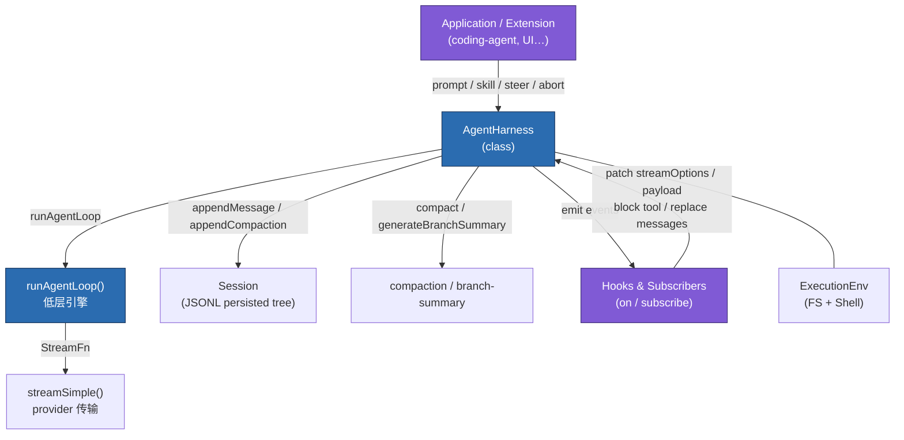

> [!tip] 一句话定位
> **AgentHarness = 配置 + 阶段锁 + 队列 + 持久化 + 钩子事件** ——它把"驱动一次 LLM turn 所需的所有可变性"集中在一个对象上。

---

## 二、核心概念分层

`AgentHarness` 把状态明确分成 **4 类**，这是理解一切行为的钥匙。

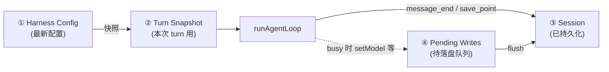

| 分类                         | 内容                                                                                         | 何时变更                                          | 何时被使用                           |
| -------------------------- | ------------------------------------------------------------------------------------------ | --------------------------------------------- | ------------------------------- |
| **Harness Config**         | model / thinkingLevel / tools / activeToolNames / resources / streamOptions / systemPrompt | `setXxx()` 立刻生效                               | 下一次 `createTurnState()`         |
| **Turn Snapshot**          | 上述配置的"冻结副本" + persisted messages + sessionId                                               | 每次 `prompt/skill/...` 开始或 save point 时刷新      | 整轮 LLM 请求                       |
| **Session**                | 持久化的对话树（JSONL 节点）                                                                          | `message_end` / `flushPendingSessionWrites()` | 构建 context、tree 导航              |
| **Pending Session Writes** | busy 时排队的 `appendMessage`、`model_change` 等                                                 | `phase !== "idle"` 时 push                     | save point 或 settlement 时 flush |

> [!warning] Getter 的语义
> 所有 `getXxx()` 返回的是 **Harness Config（最新）**，**不是** 当前正在跑的 turn snapshot。也就是说：在 turn 中途调 `setModel()` + `getModel()`，会立刻看到新的，但新的要到 *下一个 save point* 之后才真正发请求。

---

## 三、阶段（Phase）与生命周期

```ts
type AgentHarnessPhase = "idle" | "turn" | "compaction" | "branch_summary" | "retry";
```

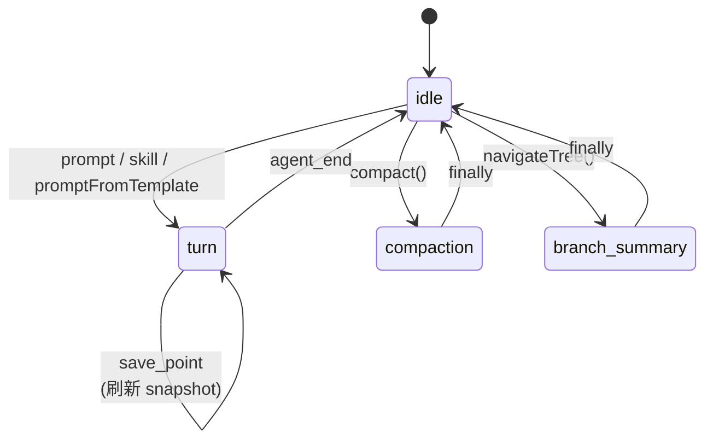

> [!important] 关键规则
> - **结构性操作**（`prompt` / `skill` / `promptFromTemplate` / `compact` / `navigateTree`）要求 `phase === "idle"`，并在 *第一个 await 之前* 同步设置 phase。
> - 重复发起 → 抛 `AgentHarnessError({ code: "busy" })`。
> - **运行期操作** `steer / followUp / nextTurn / abort / setXxx` 在 turn 中允许调用。

---

## 四、Type 详解（按用途分组）

### 4.1 Result & 错误类型

```ts
type Result<TValue, TError> =
  | { ok: true; value: TValue }
  | { ok: false; error: TError };
```

底层能力（`ExecutionEnv`、文件、shell、compaction helper）**不抛错**，统一返回 `Result`。
高层（`Session`、`AgentHarness`）则 **抛出** `AgentHarnessError` 等。

错误类继承层级：

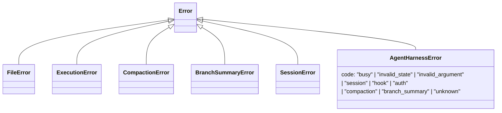

`normalizeHarnessError()` 是粘合剂——把任何子系统错误统一包装成 `AgentHarnessError`，并保留 `cause`。

### 4.2 资源类型

```ts
interface Skill {
  name: string;
  description: string;
  content: string;
  filePath: string;
  disableModelInvocation?: boolean;
}

interface PromptTemplate {
  name: string;
  description?: string;
  content: string;
}

interface AgentHarnessResources<TSkill, TPromptTemplate> {
  promptTemplates?: TPromptTemplate[];
  skills?: TSkill[];
}
```

> [!note] 设计取舍
> 资源由应用层自己加载（从磁盘/网络），harness 只负责**持有快照**并在 `skill()` / `promptFromTemplate()` 调用时按 `name` 查找。

### 4.3 Stream 选项

```ts
interface AgentHarnessStreamOptions {
  transport?: Transport;
  timeoutMs?: number;
  maxRetries?: number;
  maxRetryDelayMs?: number;
  headers?: Record<string, string>;
  metadata?: SimpleStreamOptions["metadata"];
  cacheRetention?: SimpleStreamOptions["cacheRetention"];
}
```

`AgentHarnessStreamOptionsPatch` 是它的 *delta 形式*：
- `headers: { foo: undefined }` → 删除 `foo`
- `headers: undefined` → 清空所有 headers

由 `applyStreamOptionsPatch()` 实现。

### 4.4 Session 树节点

`SessionTreeEntry` 是一个 **可辨识联合（discriminated union）**：

| `type` 字段 | 含义 |
|---|---|
| `message` | 一条 `AgentMessage`（user / assistant / tool） |
| `thinking_level_change` | 切换 thinking 等级 |
| `model_change` | 切换模型 |
| `compaction` | 压缩摘要节点 |
| `branch_summary` | 分支摘要节点 |
| `custom` | 应用自定义数据 |
| `custom_message` | 应用自定义消息（带显示标志） |
| `label` | 给某节点打标签 |
| `session_info` | session 元信息（如重命名） |
| `leaf` | **持久化的叶子指针**——重启后恢复树游标 |

`PendingSessionWrite` 由它派生：去掉 `id / parentId / timestamp` 这些"由 storage 生成"的字段。

```ts
type PendingSessionWrite = SessionTreeEntry extends infer TEntry
  ? TEntry extends SessionTreeEntry
    ? Omit<TEntry, "id" | "parentId" | "timestamp">
    : never
  : never;
```

### 4.5 事件家族

==事件是 AgentHarness 与外界对话的语言==。分两组：

**A. 来自底层 loop 的 `AgentEvent`**（`message_start`、`message_end`、`turn_end`、`agent_end` 等）

**B. Harness 自己发出的 `AgentHarnessOwnEvent`**：

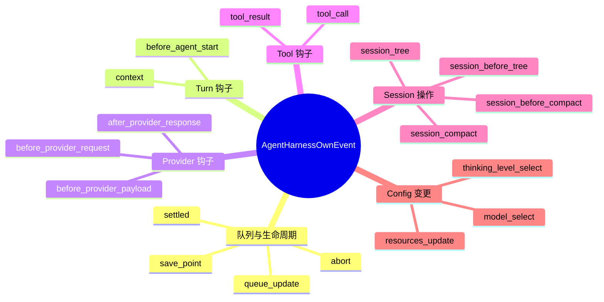

每个事件可能有 *返回类型*（`AgentHarnessEventResultMap`）。例如：

```ts
type AgentHarnessEventResultMap = {
  before_provider_request: BeforeProviderRequestResult | undefined;
  // 钩子可以返回 streamOptions 的 patch
  tool_call: ToolCallResult | undefined;
  // 钩子可以 block 工具调用
  tool_result: ToolResultPatch | undefined;
  // 钩子可以替换 / 修改工具结果，甚至 terminate
  // ...
};
```

> [!example] 钩子返回值的链式语义
> - **before_provider_request**：每个 handler 返回的 patch 顺序叠加到 streamOptions 上。
> - **before_provider_payload**：每个 handler 可以修改 payload（链式 transform）。
> - **tool_call / tool_result**：取最后一个非 undefined 的结果。

### 4.6 选项类型

```ts
interface AgentHarnessOptions<TSkill, TPromptTemplate, TTool> {
  env: ExecutionEnv;
  session: Session;
  model: Model<any>;
  tools?: TTool[];
  resources?: AgentHarnessResources<TSkill, TPromptTemplate>;
  systemPrompt?: string | (ctx => string | Promise<string>);
  getApiKeyAndHeaders?: (model) => Promise<{ apiKey; headers? } | undefined>;
  streamOptions?: AgentHarnessStreamOptions;
  thinkingLevel?: ThinkingLevel;
  activeToolNames?: string[];
  steeringMode?: QueueMode;
  followUpMode?: QueueMode;
}
```

> [!tip] systemPrompt 的两种形态
> 字符串就是字面量；函数则会在 **每次 createTurnState** 时被调用一次，可以基于"当前 model / 激活工具 / 资源"动态生成 system prompt。

### 4.7 内部类型

```ts
interface AgentHarnessTurnState<TSkill, TPromptTemplate, TTool> {
  messages: AgentMessage[];
  resources: AgentHarnessResources<TSkill, TPromptTemplate>;
  streamOptions: AgentHarnessStreamOptions;
  sessionId: string;
  systemPrompt: string;
  model: Model<any>;
  thinkingLevel: ThinkingLevel;
  tools: TTool[];
  activeTools: TTool[];
}
```

==这是"一次 turn 的快照"==——`createTurnState()` 产生它，`createContext()` / `createStreamFn()` / `createLoopConfig()` 都通过 `getTurnState()` 闭包读取它，`prepareNextTurn`（save point）通过 `setTurnState()` 替换它。

---

## 五、Function 详解

### 5.1 顶层辅助函数（模块级）

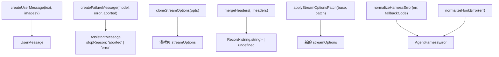

| 函数 | 作用 |
|---|---|
| `createUserMessage` | 把纯文本（可选 images）包装成 `UserMessage`。 |
| `createFailureMessage` | 当 turn 异常或被 abort，构造一条空内容、stopReason 为 `aborted` 或 `error` 的 assistant 消息。让上层观察者看到"这一轮失败了"的语义事件。 |
| `cloneStreamOptions` | 浅拷贝 stream options，**包括** headers 和 metadata 也单独浅拷贝——避免外部修改污染 harness 内部状态。 |
| `mergeHeaders` | 多个 header 对象按顺序合并，后者覆盖前者；都 undefined 则返回 undefined。 |
| `applyStreamOptionsPatch` | 把 `Patch`（含 `undefined` 删除语义）应用到 base 上，返回新对象。 |
| `normalizeHarnessError` | 把任何异常归一化为 `AgentHarnessError`，识别已知子系统错误并设置对应 `code`。 |
| `normalizeHookError` | `normalizeHarnessError(_, "hook")` 的便捷版本。 |

### 5.2 AgentHarness 类成员

下面把方法分成 **5 大族**。

#### 族一：私有事件 / 钩子分发

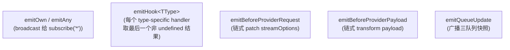

| 方法 | 类型 | 行为 |
|---|---|---|
| `getHandlers(type)` | `private` | 取某 type 的 handler set |
| `emitOwn(event)` | `private async` | 广播 harness-自有事件给 `subscribe('*')` 订阅者 |
| `emitAny(event)` | `private async` | 广播 *所有* 事件（含底层 AgentEvent） |
| `emitHook<TType>(event)` | `private async` | 调用 type-specific handler，**返回最后一个非 undefined 的结果** |
| `emitBeforeProviderRequest` | `private async` | 链式累加 streamOptions 的 patch |
| `emitBeforeProviderPayload` | `private async` | 链式 transform payload |
| `emitQueueUpdate` | `private async` | 广播 `queue_update`（三队列快照） |

> [!warning] hook handler 抛错怎么办？
> 任何 handler 抛错都会被 `normalizeHookError()` 包成 `AgentHarnessError({ code: "hook" })`。**已经持久化的 state 不会回滚**，但发起调用的 public 方法会失败。

#### 族二：Turn 状态构建

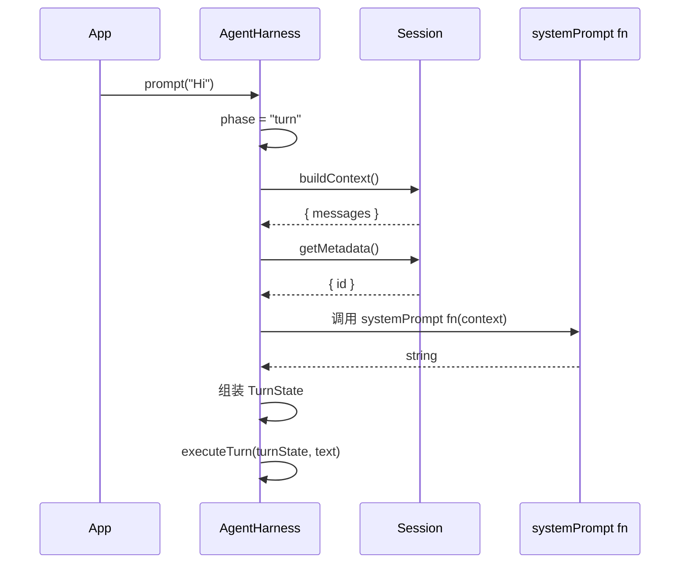

| 方法 | 行为 |
|---|---|
| `createTurnState()` | 创建一份完整的 turn 快照：拉 session messages、解析 system prompt、克隆 streamOptions、收集 active tools |
| `createContext(turnState, systemPrompt?)` | 把 turnState 转成 `AgentContext`（messages 切片 + tools 切片） |
| `createStreamFn(getTurnState)` | 返回一个闭包 `StreamFn`：每次 provider 请求时，从最新的 turnState 取配置 + 调用 `getApiKeyAndHeaders()` + 应用 `before_provider_request` patch + 调 `streamSimple()` |
| `createLoopConfig(getTurnState, setTurnState)` | 把所有 hooks 织入到 `runAgentLoop` 需要的 `AgentLoopConfig` 中：`transformContext`、`beforeToolCall`、`afterToolCall`、`prepareNextTurn`、`getSteeringMessages`、`getFollowUpMessages` |
| `validateToolNames` | 检查 active tool names 都存在于 tools map |
| `flushPendingSessionWrites` | 一条一条 dispatch 到 session（`appendMessage` / `appendModelChange` / `appendCustomEntry` / `setLeafId` / …），失败不丢，留在队列首部 |
| `drainQueuedMessages(queue, mode)` | 按 `QueueMode` 取队列：`"all"` 全取，`"one-at-a-time"` 取一条；广播 `queue_update`，失败时 unshift 回去 |

> [!important] save point 是怎么发生的？
> `prepareNextTurn` 由低层 loop 在每个 turn 结束、决定是否还要继续时调用 → 它会：
> 1. flush pending writes
> 2. 重新 `createTurnState()`
> 3. 调 `setTurnState()` 替换闭包内的 turnState
> 这样下一次 provider 请求自动用新 model / 新 system prompt / 新 tools。

#### 族三：Turn 执行（公开入口）

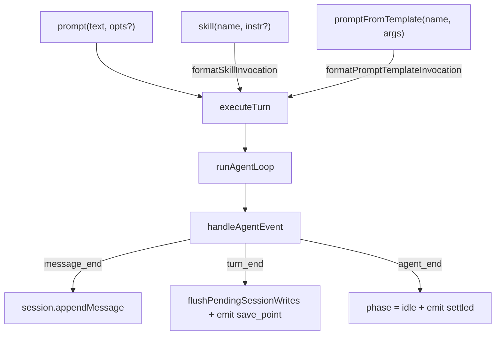

| 方法 | 阶段约束 | 说明 |
|---|---|---|
| `prompt(text, options?)` | idle → turn | 主要入口；options 可带 images |
| `skill(name, additionalInstructions?)` | idle → turn | 在当前 snapshot 中查找 skill，渲染调用文本 |
| `promptFromTemplate(name, args)` | idle → turn | 同上，但用 prompt template + 参数渲染 |
| `executeTurn(turnState, text, opts?)` | `private async` | 内部执行流：构造首条 user message → 合并 nextTurn 队列 → 触发 `before_agent_start` 钩子（可注入消息或替换 system prompt）→ `runAgentLoop` → 失败时 `emitRunFailure` 走完失败事件 |
| `handleAgentEvent` | `private async` | 把底层 event 路由到 session 持久化 + 事件广播。`message_end`：先 `appendMessage` 再 `emitAny`。`turn_end`：emit + flush + emit save_point。`agent_end`：flush + phase=idle + emit settled |
| `emitRunFailure` | `private async` | 失败时 *人工合成* 一组 `message_start → message_end → turn_end → agent_end` 让外部看到"完整一轮但失败了" |

> [!example] `before_agent_start` 钩子的威力
> 它能：
> - **追加消息**：在用户消息之后插入更多 user/assistant message（注入历史/上下文）
> - **替换 systemPrompt**：临时换一个系统提示
> 但只对**第一次**走 loop 有效；后续 save point 不会再触发。

#### 族四：队列操作（运行期介入）

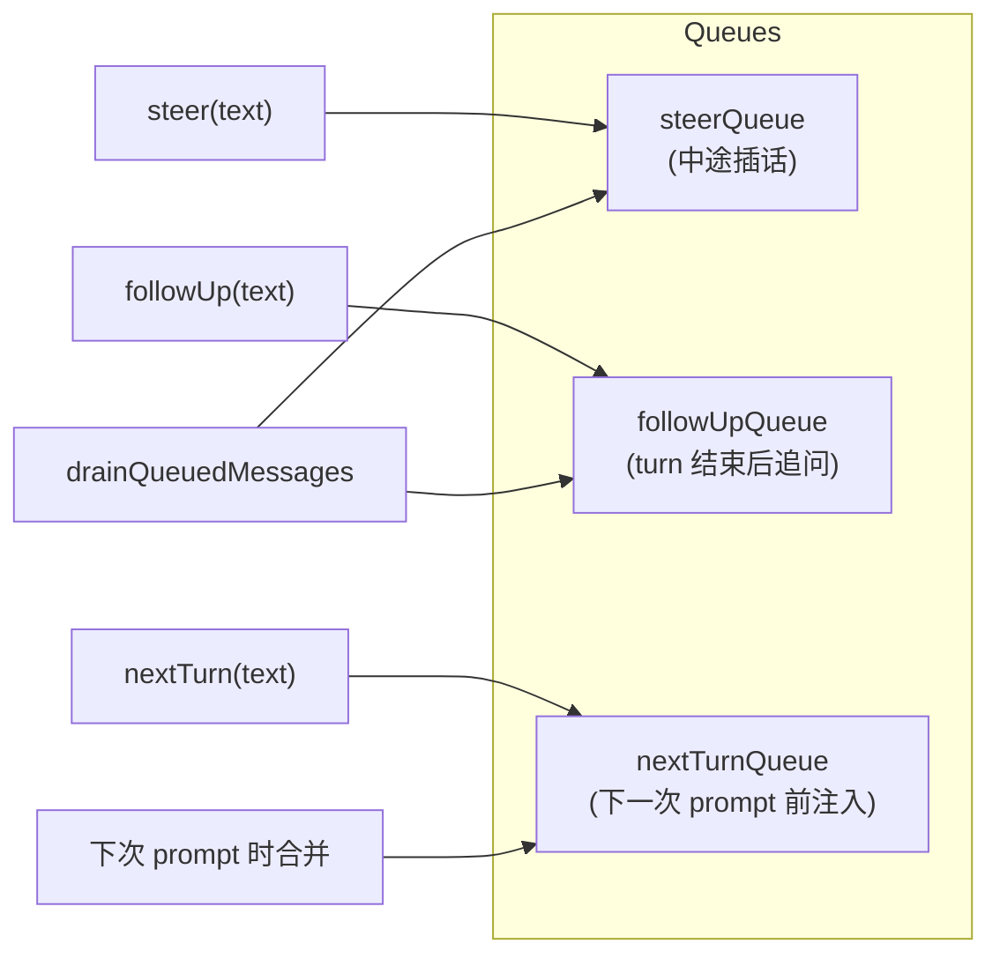

| 方法 | 行为 | 阶段约束 |
|---|---|---|
| `steer(text, opts?)` | push 到 `steerQueue`，由低层 loop 在 turn 中安全点取出（最常见：让模型立刻调整） | **必须 busy**，idle 时抛 `invalid_state` |
| `followUp(text, opts?)` | push 到 `followUpQueue`，turn 结束后作为新的 user message 触发下一轮 | **必须 busy** |
| `nextTurn(text, opts?)` | push 到 `nextTurnQueue`，**任何阶段**都可调用；下次 `prompt/skill/...` 时插入到用户输入之前 | 任意 |
| `appendMessage(message)` | idle 立刻 append，busy 进 pending 队列 | 任意 |

> [!note] 与 abort 的关系
> `abort()` 会清空 `steer` 和 `followUp` 队列，但 **不会清空 `nextTurn` 队列**——这是设计语义：nextTurn 代表"下一次用户启动的 turn"，与"中途取消当前 turn"无关。

#### 族五：结构性操作

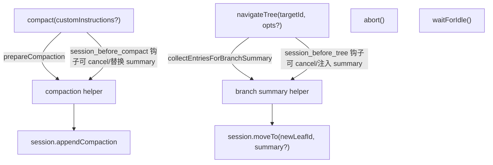

| 方法 | 阶段 | 关键流程 |
|---|---|---|
| `compact(customInstructions?)` | idle → compaction → idle | `prepareCompaction()` → `session_before_compact` 钩子（可 cancel 或直接提供已压缩结果） → 调 `compact()` LLM 调用 → `session.appendCompaction()` → emit `session_compact` |
| `navigateTree(targetId, opts?)` | idle → branch_summary → idle | 比较 oldLeaf/newLeaf → `session_before_tree` 钩子 → 可选 `generateBranchSummary` LLM 调用 → 计算 newLeafId（user message 类节点会跳到 parent，并把内容回填给 editor） → `session.moveTo()` → emit `session_tree` |
| `abort()` | 任意 | 清空 steer/followUp 队列 → abort signal → emit queue_update → `waitForIdle()` → emit `abort` 事件 |
| `waitForIdle()` | 任意 | 等待 `runPromise` |

#### 族六：Config getter / setter

| Getter | Setter | 是否持久化 | busy 行为 |
|---|---|---|---|
| `getModel()` | `setModel(model)` | 是（`model_change` 节点） | 排进 pending writes，下个 save point 才落盘 |
| `getThinkingLevel()` | `setThinkingLevel(level)` | 是（`thinking_level_change`） | 同上 |
| `getResources()` | `setResources(res)` | 否 | 立即生效，emit `resources_update` |
| `getStreamOptions()` | `setStreamOptions(opts)` | 否 | 立即生效，下次 turn snapshot 用 |
| —— | `setTools(tools, activeNames?)` | 否 | 立即生效（先 validate） |
| —— | `setActiveTools(names)` | 否 | 立即生效 |
| `getSteeringMode()` | `setSteeringMode(mode)` | 否 | 立即；只影响下次 drain |
| `getFollowUpMode()` | `setFollowUpMode(mode)` | 否 | 同上 |

> [!important] "立即生效"的真实含义
> 修改的是 **Harness Config**，不是当前的 turn snapshot。当前正在跑的 provider 请求继续用旧值；下一次 `createTurnState()`（save point 或新 prompt）才取新值。

#### 族七：订阅 API

```ts
subscribe(listener: (event, signal?) => void | Promise<void>): () => void
on<TType>(type: TType, handler: (event) => Result | Promise<Result>): () => void
```

- `subscribe('*')` 订阅 **所有事件**（含底层 AgentEvent + harness own event）；不能返回结果。
- `on(type, handler)` 订阅 **特定 type**；如果该 type 在 `AgentHarnessEventResultMap` 中可返回结果，则用作钩子。
- 两者都返回一个 `() => void` 取消订阅。

---

## 六、一次完整 turn 的时序图

下面把所有内容串起来——这是阅读源码最值得反复回看的图：

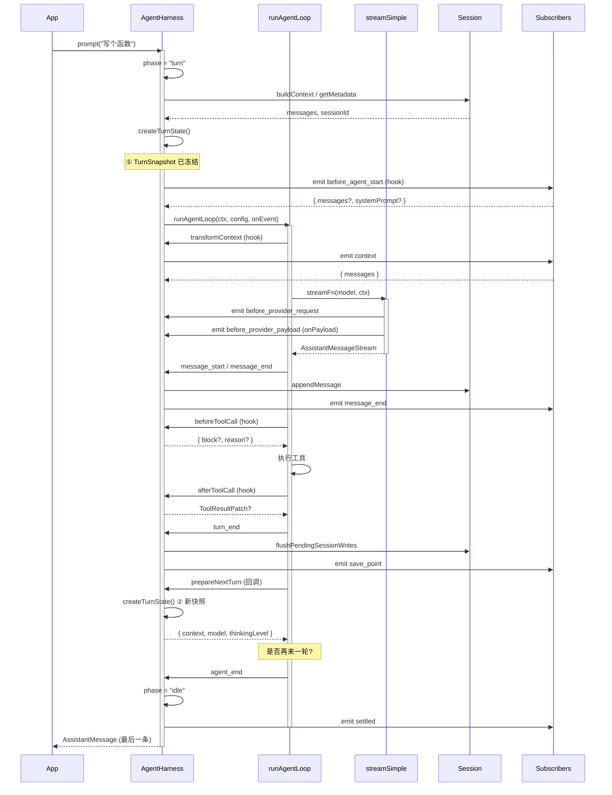

---

## 七、关键设计原则速记

> [!success] 设计原则（背下来）
> 1. **结构性操作必须 idle**——通过同步设置 phase 阻塞重入。
> 2. **Turn snapshot 不可变**——已发出的 provider 请求绝不改主意。
> 3. **运行期 setter 不动 in-flight**——只影响下一个 snapshot。
> 4. **Pending writes 永不丢**——保留在队列首部直到落盘成功。
> 5. **Hook 失败不回滚 state**——但 public 方法会拒绝。
> 6. **Listener 可以 close over harness**——但调用 `waitForIdle()` 会死锁（未来 facade 会修）。
> 7. **持久化先于通知**——`message_end` 先 `appendMessage` 再广播。
> 8. **abort 不清 nextTurn**——nextTurn 是"下一回合"语义，不属于本回合。
> 9. **leaf 是持久化节点**——重启可恢复树游标。

---

## 八、阅读源码的推荐路径

> [!tip] 跟着这条路径读，最不容易迷
> 1. `types.ts` 里的 `Skill` / `PromptTemplate` / `AgentHarnessOptions` / `AgentHarnessOwnEvent` —— 先把语义吃透
> 2. `agent-harness.ts` 构造函数 —— 看初始化字段
> 3. `createTurnState()` —— 理解 snapshot 概念
> 4. `executeTurn()` —— 主流程骨架
> 5. `handleAgentEvent()` —— 事件 → session/广播 路由
> 6. `createLoopConfig()` —— hook 与 prepareNextTurn
> 7. `prompt() / steer() / abort()` —— 公开 API
> 8. `compact() / navigateTree()` —— 进阶结构性操作
> 9. 测试 [`test/harness/agent-harness.test.ts`](../test/harness/agent-harness.test.ts) 与 [`agent-harness-stream.test.ts`](../test/harness/agent-harness-stream.test.ts) —— 对照行为验证理解

---

## 九、相关链接

- [[Projects/pi/agent/harness/agent-harness|AgentHarness 设计文档（lifecycle）]]
- [[hooks|Hooks 设计草案]]
- [[durable-harness|可恢复 Harness 设计]]
- [[observability|可观测性设计]]
- 外部参考：[Anthropic Agent SDK](https://docs.anthropic.com/) — 类似的"harness over loop"分层思路

---

%%
最后更新：2026-06-17
读源码时遇到 prepareNextTurn 死循环之类的问题，回到本文第六章时序图。
%%
