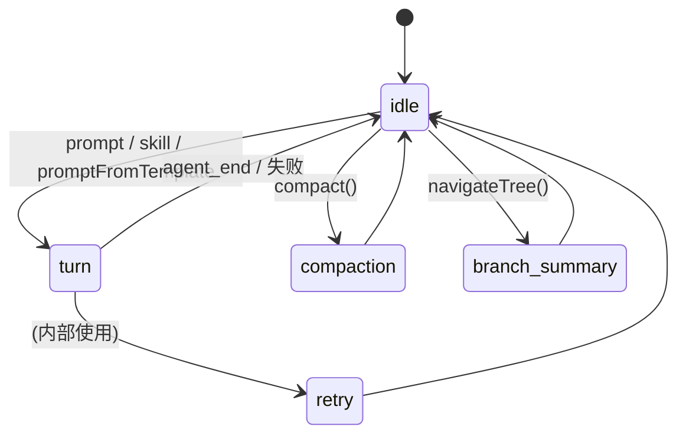
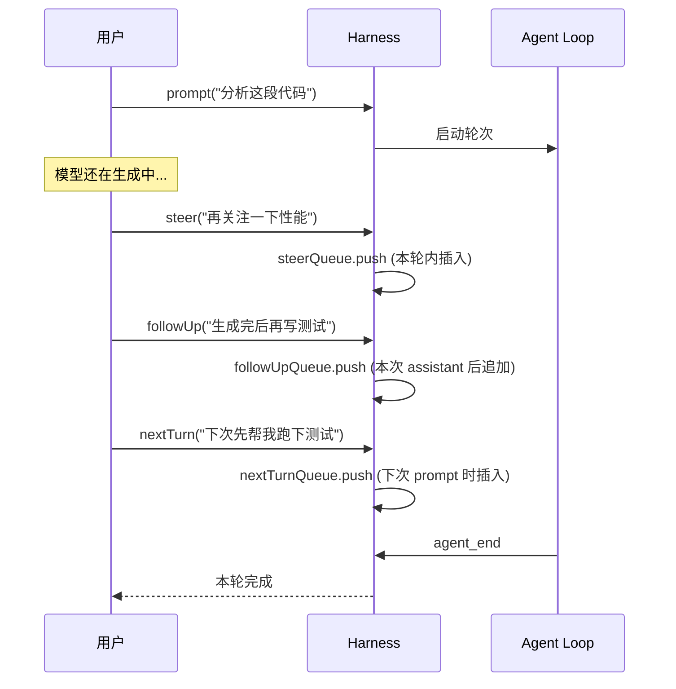
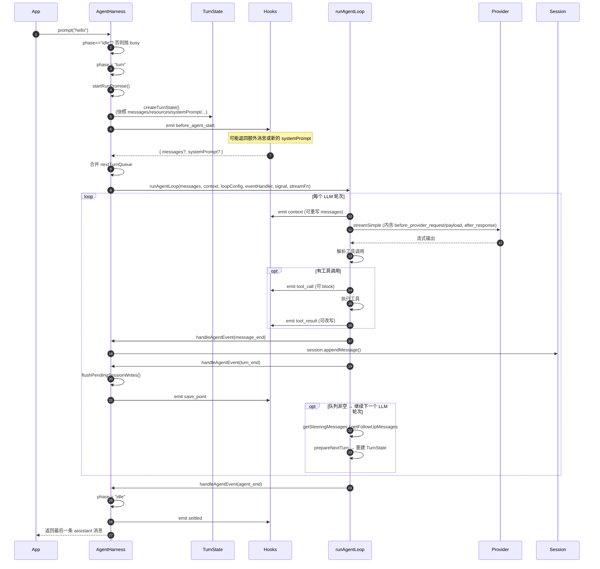
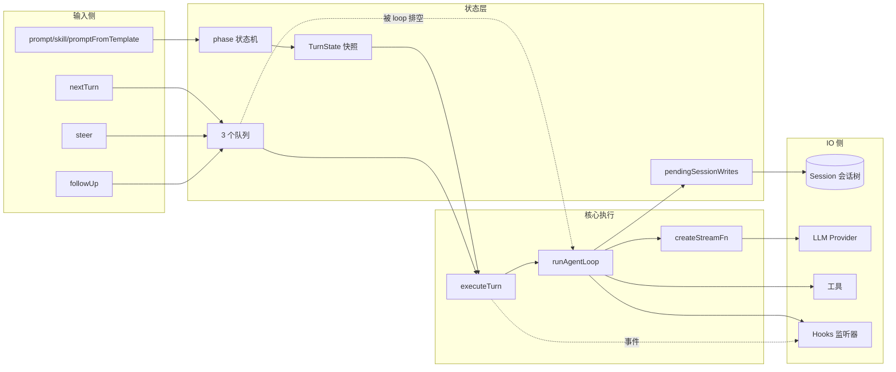

# AgentHarness 详解

> 文件位置: [packages/agent/src/harness/agent-harness.ts](../../packages/agent/src/harness/agent-harness.ts)
> 类型定义: [packages/agent/src/harness/types.ts](../../packages/agent/src/harness/types.ts)

`AgentHarness` 是整个 `pi-agent` 的**顶层运行时容器（runtime harness）**。它把"模型 + 会话 + 工具 + 资源 + Hook 系统"组合成一个可以接收用户指令、对接 LLM、调度工具调用、持久化会话树的"代理外壳"。

可以把它理解为 **Agent Loop 的指挥中枢**：
- `agent-loop.ts` —— 一次"轮次（turn）"的执行核心（流式调用模型 + 调度工具 + 收集结果）
- `AgentHarness` —— 包裹 Agent Loop，加上**会话持久化、状态机、消息队列、Hook、压缩、分支导航**等周边能力

---

## 一、整体架构图

```mermaid
flowchart TB
    User[用户/应用层] -->|prompt / skill / promptFromTemplate| Harness

    subgraph Harness["AgentHarness（顶层外壳）"]
        direction TB
        Phase[Phase 状态机<br/>idle | turn | compaction<br/>| branch_summary | retry]
        Queues[消息队列<br/>steerQueue / followUpQueue / nextTurnQueue]
        Hooks[Hook 系统<br/>handlers + subscribe + on]
        Pending[pendingSessionWrites<br/>turn 内延迟写入]
        TurnState[AgentHarnessTurnState<br/>每轮快照]
    end

    Harness -->|createTurnState| Session[(Session<br/>会话树存储)]
    Harness -->|createLoopConfig + streamFn| Loop[runAgentLoop<br/>agent-loop.ts]
    Loop -->|streamSimple| Provider[LLM Provider<br/>@earendil-works/pi-ai]
    Loop -->|tool calls| Tools[AgentTool 集合]

    Harness -->|compact| Compaction[compaction.ts<br/>历史压缩]
    Harness -->|navigateTree| Branch[branch-summarization.ts<br/>分支总结]

    Hooks -.emitOwn / emitAny / emitHook.-> Subscribers[订阅者<br/>UI / 日志 / 自定义逻辑]

    style Harness fill:#e3f2fd
    style Loop fill:#fff3e0
    style Session fill:#f3e5f5
```

---

## 二、关键类型（Types）

### 2.1 状态与阶段

```ts
type AgentHarnessPhase = "idle" | "turn" | "compaction" | "branch_summary" | "retry";
```

`AgentHarness` 内部是一个**单写者状态机**：同一时刻只能处于一个阶段。所有进入"非 idle"状态的方法（`prompt` / `skill` / `compact` / `navigateTree`）都会先检查 `phase !== "idle"`，否则抛 `busy` 错误。



### 2.2 `AgentHarnessTurnState`（私有接口）

每一轮（turn）执行前会通过 `createTurnState()` **拍下一个不可变快照**，让一轮内部即使外部状态变化（`setModel`、`setThinkingLevel`）也不影响已开始的轮次：

```ts
interface AgentHarnessTurnState {
    messages: AgentMessage[];           // 来自 session.buildContext() 的历史消息
    resources: AgentHarnessResources;   // skills + promptTemplates 的快照
    streamOptions: AgentHarnessStreamOptions;
    sessionId: string;
    systemPrompt: string;               // 字符串或动态回调求值后的结果
    model: Model<any>;
    thinkingLevel: ThinkingLevel;
    tools: TTool[];                     // 全部工具
    activeTools: TTool[];               // 仅本轮启用的工具
}
```

### 2.3 资源、工具、Skill、PromptTemplate

| 类型 | 作用 |
|------|------|
| `Skill` | `SKILL.md` 风格的能力声明 (name/description/content/filePath)，可被模型在 system prompt 中看见，也可显式调用 `harness.skill(name)` |
| `PromptTemplate` | 命名提示模板，通过 `harness.promptFromTemplate(name, args)` 显式渲染并发起轮次 |
| `AgentTool` | 模型在轮次内可以调用的工具 |
| `AgentHarnessResources` | `{ skills?, promptTemplates? }`，资源容器 |

### 2.4 Stream / Provider 选项

```ts
interface AgentHarnessStreamOptions {
    transport?: Transport;
    timeoutMs?: number;
    maxRetries?: number;
    maxRetryDelayMs?: number;
    headers?: Record<string, string>;
    metadata?: SimpleStreamOptions["metadata"];
    cacheRetention?: SimpleStreamOptions["cacheRetention"];
}
```

`AgentHarnessStreamOptionsPatch` 是 hook 返回的"差量补丁"——`headers/metadata` 中 `value === undefined` 表示**删除该键**。`applyStreamOptionsPatch()` 函数负责把补丁合并到当前快照上。

### 2.5 事件体系

事件分两层：

```
AgentHarnessEvent
├── AgentEvent          (来自 agent-loop：message_start / message_end / turn_end / agent_end / ...)
└── AgentHarnessOwnEvent (harness 自己产生的)
    ├── 队列/生命周期: queue_update / save_point / abort / settled
    ├── 启动/上下文:  before_agent_start / context
    ├── Provider 钩子: before_provider_request / before_provider_payload / after_provider_response
    ├── 工具钩子:    tool_call / tool_result
    ├── 会话维护:    session_before_compact / session_compact / session_before_tree / session_tree
    └── 元状态:      model_select / thinking_level_select / resources_update
```

`AgentHarnessEventResultMap` 把每种事件类型映射到它**返回值的形状**——这是 hook 修改流程的关键机制（见下文）。

### 2.6 错误层级

```ts
class AgentHarnessError {  // 顶层公开错误
    code: "busy" | "invalid_state" | "invalid_argument" | "session"
        | "hook" | "auth" | "compaction" | "branch_summary" | "unknown";
}
// 底层各子系统：SessionError / CompactionError / BranchSummaryError / ExecutionError / FileError
```

`normalizeHarnessError()` 把任意错误规范化为 `AgentHarnessError`：把 `SessionError` 映射到 `code: "session"`，`CompactionError` → `"compaction"`，等等。

### 2.7 `PendingSessionWrite`

```ts
type PendingSessionWrite = SessionTreeEntry 去掉 id/parentId/timestamp 的 union
```

当 `phase !== "idle"`（一轮正在跑）时，对 model/工具/消息的修改不会立即写入会话树，而是**入队到 `pendingSessionWrites`**，等到 `turn_end` 或 `prepareNextTurn` 时通过 `flushPendingSessionWrites()` 顺序落盘。这保证了**一轮内会话树状态的一致性**。

---

## 三、辅助函数

### 3.1 消息构造

| 函数 | 作用 |
|------|------|
| `createUserMessage(text, images?)` | 构造 `UserMessage`（text + 可选图片） |
| `createFailureMessage(model, error, aborted)` | 模型调用失败时合成一条空 assistant 消息，`stopReason` 为 `"aborted"` 或 `"error"`，让 UI 能感知失败 |

### 3.2 Stream 选项处理

| 函数 | 作用 |
|------|------|
| `cloneStreamOptions(opts)` | 深拷贝（headers/metadata 也复制），避免外部 mutation |
| `mergeHeaders(...headers)` | 多个 header map 合并（auth header + 配置 header） |
| `applyStreamOptionsPatch(base, patch)` | 把 hook 返回的补丁应用到基础选项上，支持"undefined 删除键"语义 |

### 3.3 错误规范化

| 函数 | 作用 |
|------|------|
| `normalizeHarnessError(err, fallbackCode)` | 把任意异常包装成 `AgentHarnessError`，并按子系统映射 code |
| `normalizeHookError(err)` | 专门给 hook 抛错用，`fallbackCode: "hook"` |

---

## 四、`AgentHarness` 类详解

### 4.1 私有状态字段

```ts
class AgentHarness {
    readonly env: ExecutionEnv;          // 文件系统 + Shell 执行环境
    private session: Session;            // 会话树存储
    private phase: AgentHarnessPhase;    // 状态机
    private runAbortController?;         // 当前轮次的 AbortController
    private runPromise?;                 // waitForIdle 用：当前轮次完成的 Promise
    private pendingSessionWrites: PendingSessionWrite[]; // turn 内延迟写入
    private model: Model<any>;
    private thinkingLevel: ThinkingLevel;
    private systemPrompt: string | callback;
    private streamOptions: AgentHarnessStreamOptions;
    private getApiKeyAndHeaders?;        // 鉴权回调
    private resources;                   // skills + promptTemplates
    private tools: Map<string, TTool>;   // 全部工具索引
    private activeToolNames: string[];   // 当前激活的工具名（按顺序）
    private steerQueue, followUpQueue, nextTurnQueue;  // 三种消息队列
    private steeringQueueMode, followUpQueueMode: QueueMode;  // 排空策略
    private handlers: Map<string, Set<AgentHarnessHandler>>;  // type → 监听器集合
}
```

### 4.2 三种消息队列

这是 harness 的重要设计：在一轮已经开始执行的过程中，用户可以追加输入，由 harness 决定何时插入：



| 队列 | 时机 | 排空模式 |
|------|------|---------|
| `steerQueue` | 本轮**模型生成中**插入用户消息（指导/纠偏） | `getSteeringMessages` 在 loop 内被调用 |
| `followUpQueue` | 本轮 assistant 消息**输出后**追加（让模型继续接力） | `getFollowUpMessages` 同理 |
| `nextTurnQueue` | **下一次** `prompt/skill/promptFromTemplate` 启动时插到用户消息**前面** | `executeTurn` 启动处 splice |

`QueueMode` 控制每次"排空"取多少：
- `"one-at-a-time"`: 取 1 条（细粒度交互）
- `"all"`: 一次性取空

`drainQueuedMessages()` 实现了**事务性**：取出消息后调用 `emitQueueUpdate`，如果钩子抛错，则 `unshift` 把消息塞回队列，保证不丢失。

### 4.3 Hook 系统三种发射方式

```ts
private emitOwn(event)   // 仅广播给 SUBSCRIBER_EVENT_TYPE ("*") 的订阅者，不收集返回值
private emitAny(event)   // 同上，但用于 AgentLoop 转发的事件
private emitHook(event)  // 按 event.type 分发给 on(type, handler) 注册的 handler，并收集返回值
```

`emitHook` 是**双向的**——handler 的返回值可以**改变 harness 的行为**：

| 事件类型 | Handler 返回 | 效果 |
|---------|-------------|-----|
| `before_agent_start` | `{ messages?, systemPrompt? }` | 在用户消息后追加消息 / 替换 system prompt |
| `context` | `{ messages }` | 在每次发给模型前重写消息列表（截断、过滤、注入） |
| `before_provider_request` | `{ streamOptions: patch }` | 调整 transport / headers / timeout 等 |
| `before_provider_payload` | `{ payload }` | 完全改写发送给 provider 的请求体 |
| `tool_call` | `{ block?, reason? }` | 拦截工具调用 |
| `tool_result` | `{ content?, details?, isError?, terminate? }` | 改写工具返回值，或终止本轮 |
| `session_before_compact` | `{ cancel?, compaction? }` | 取消压缩 / 提供自定义压缩结果 |
| `session_before_tree` | `{ cancel?, summary?, customInstructions?, ... }` | 取消导航 / 注入分支总结 |

### 4.4 Hook 的两个注册 API

```ts
subscribe(listener): unsubscribe   // 监听所有事件，仅做观察（不能改流程）
on(type, handler):  unsubscribe    // 监听特定类型，可返回值改流程
```

二者底层都是 `handlers: Map<string, Set<Handler>>`：
- `subscribe` 注册到 `"*"` 这个特殊键
- `on(type)` 注册到 `type` 键

### 4.5 核心流程：一次 `prompt()` 的全过程



**关键点**：
1. `runAgentLoop` 一次调用内部可能跑**多个 LLM 轮次**（被 steering / follow-up / 工具结果驱动），harness 通过 `prepareNextTurn` 回调让 loop 重建 turn state
2. 失败处理走 `emitRunFailure`：合成失败消息 → 触发完整生命周期事件（message_start → message_end → turn_end → agent_end），让监听者总能看到一致的事件序列
3. `runAbortController` 暴露给 `abort()` 用——可被外部强制终止

### 4.6 `executeTurn()` —— 真正的轮次执行

```ts
private async executeTurn(turnState, text, options): Promise<AssistantMessage>
```

步骤：
1. 构造首条 `UserMessage`
2. 把 `nextTurnQueue` 中的消息插到 user message **前面**（事务性 splice）
3. 触发 `before_agent_start` hook，可能追加消息或换 systemPrompt
4. 创建 `AbortController` 并存到 `runAbortController`
5. 调 `runAgentLoop`，传入：
   - `createContext()` —— 当前轮的 `AgentContext { systemPrompt, messages, tools }`
   - `createLoopConfig()` —— loop 所有钩子和回调
   - `handleAgentEvent` —— 转发 loop 事件 / 写会话 / 触发 own event
   - `createStreamFn()` —— 模型流调用器（内含鉴权、provider hooks）
6. 失败时 `emitRunFailure` 合成失败消息
7. 倒序找到最后一条 assistant 消息返回；找不到就抛 `invalid_state`
8. `finally` 中再次 `flushPendingSessionWrites()` 兜底

### 4.7 `createLoopConfig()` —— 把 harness 适配成 loop 协议

它把 harness 的钩子和会话状态包装成 `AgentLoopConfig`：

| Loop 回调 | 实现 |
|----------|-----|
| `transformContext(messages)` | 调用 `context` hook，让外部重写每次发给 LLM 的消息 |
| `beforeToolCall` | `tool_call` hook → block/reason |
| `afterToolCall` | `tool_result` hook → 重写 content/details/isError/terminate |
| `prepareNextTurn` | `flushPendingSessionWrites()` → `createTurnState()` 重建快照 → 通过 `setTurnState` 替换 |
| `getSteeringMessages` | 从 `steerQueue` 排空（受 `steeringQueueMode` 控制） |
| `getFollowUpMessages` | 从 `followUpQueue` 排空 |

### 4.8 `createStreamFn()` —— 流调用 + Provider 钩子

```ts
private createStreamFn(getTurnState): StreamFn {
    return async (model, context, streamOptions) => {
        const auth = await getApiKeyAndHeaders?.(model);
        const snapshot = { ...turnState.streamOptions, headers: merge(...) };
        const requestOptions = await emitBeforeProviderRequest(model, sessionId, snapshot);
        return streamSimple(model, context, {
            ...requestOptions,
            onPayload: payload => emitBeforeProviderPayload(model, payload),
            onResponse: response => emitOwn({ type: "after_provider_response", ... }),
            apiKey: auth?.apiKey,
            ...
        });
    };
}
```

### 4.9 `handleAgentEvent()` —— Agent 事件分发

```ts
if (event.type === "message_end")    -> session.appendMessage + emitAny
if (event.type === "turn_end")       -> emitAny + flushPendingSessionWrites + emit save_point
if (event.type === "agent_end")      -> flushPendingSessionWrites + phase=idle + emitAny + emit settled
default                              -> emitAny
```

注意 `turn_end` 的特殊处理：先尝试触发用户监听器（用户可能要求观察事件），无论是否抛错都**继续 flush 会话写入**——保证持久化不丢；如果用户 hook 抛错，最后还是把错误抛出去。

### 4.10 公共 API 一览

#### 启动轮次

| 方法 | 作用 |
|------|------|
| `prompt(text, { images? })` | 直接发起一轮对话 |
| `skill(name, additionalInstructions?)` | 用资源中的某个 Skill 渲染成 prompt 后发起一轮 |
| `promptFromTemplate(name, args[])` | 用某个 PromptTemplate 渲染后发起一轮 |

三者都要求 `phase === "idle"`，否则抛 `busy`。

#### 进行中插入消息

| 方法 | 何时可调用 |
|------|----------|
| `steer(text)` | `phase !== "idle"`，本轮内插入 |
| `followUp(text)` | `phase !== "idle"`，本轮 assistant 之后追加 |
| `nextTurn(text)` | 任何时候，下一次 prompt 启动时插入 |

#### 控制与查询

| 方法 | 作用 |
|------|------|
| `abort()` | 取消当前轮，清空 steer/followUp 队列，等 idle，触发 `abort` 事件 |
| `waitForIdle()` | `await runPromise`，等当前轮结束 |
| `appendMessage(message)` | 直接往会话树写一条消息（idle 立即写，否则入 `pendingSessionWrites`） |

#### 会话维护

| 方法 | 作用 |
|------|------|
| `compact(customInstructions?)` | 压缩历史。要求 idle，phase → "compaction"。先 prepare → before_compact hook → compact 调 LLM → appendCompaction → 触发 `session_compact` |
| `navigateTree(targetId, options?)` | 切换会话树叶子节点。可选生成 branch summary。before_tree hook → 生成总结 → moveTo → 触发 `session_tree` |

#### 状态变更

所有 setter（`setModel`、`setThinkingLevel`、`setActiveTools`、`setTools`、`setResources`、`setStreamOptions`、`setSteeringMode`、`setFollowUpMode`）都遵循统一规则：
- 如果 `phase === "idle"`：立即写会话
- 否则：入 `pendingSessionWrites`，等 turn 边界 flush

`setActiveTools` / `setTools` 还会用 `validateToolNames` 校验工具名是否存在。

#### 订阅

```ts
subscribe(listener): unsubscribe        // 监听所有事件
on(type, handler):  unsubscribe         // 监听某类事件并返回值改流程
```

返回的是**取消订阅函数**，用 `useEffect` 风格管理生命周期。

---

## 五、数据流 / 控制流总览



---

## 六、设计要点总结

1. **状态机 + 单写者**：`phase` 字段保证同时只有一类操作在跑，避免并发写会话树。
2. **TurnState 不可变快照**：每轮拍一份 model/tools/resources/systemPrompt 的快照，外部 setter 不影响进行中的轮次。
3. **三级消息队列**：`steer/followUp/nextTurn` 让外部异步指令在合适的时机插入。
4. **延迟写会话（pendingSessionWrites）**：在轮次内对会话树的写操作攒到 turn 边界批量 flush，保证一致性。
5. **双轨 Hook 系统**：`subscribe` 看戏，`on(type)` 干预；通过 `AgentHarnessEventResultMap` 做强类型返回值。
6. **错误分层 + 规范化**：底层多种错误（`SessionError`/`CompactionError`/...）→ 统一归一为 `AgentHarnessError`，外部只关心 `code` 字段。
7. **失败也走完整生命周期**：`emitRunFailure` 即使 LLM 调用失败也合成 message + 触发完整事件序列，让 UI/日志保持一致。
8. **`abort()` 优雅终止**：取消 controller + 清队列 + 等 idle + 触发事件，错误聚合成 `AggregateError`。

---

## 七、典型用法骨架

```ts
const harness = new AgentHarness({
    env, session, model,
    tools: [...],
    resources: { skills, promptTemplates },
    systemPrompt: ({ activeTools, resources }) => buildSystem(activeTools, resources),
    getApiKeyAndHeaders: async (model) => ({ apiKey: "...", headers: {...} }),
    streamOptions: { timeoutMs: 60_000, maxRetries: 3 },
    steeringMode: "all",
});

// 监听全部事件做 UI 渲染
const unsubscribe = harness.subscribe((event) => render(event));

// 用 on 注入逻辑：拦截危险工具调用
harness.on("tool_call", (e) => {
    if (e.toolName === "rm" && e.input.recursive) return { block: true, reason: "禁止递归删除" };
});

// 跑一轮
const response = await harness.prompt("帮我重构这段代码");

// 用户中途想给指引
await harness.steer("先关注函数命名");

// 想让下一轮接着跑
await harness.nextTurn("接下来生成对应单元测试");

// 优雅退出
await harness.abort();
unsubscribe();
```

---

## 八、推荐继续阅读的文件

- [agent-loop.ts](../../packages/agent/src/agent-loop.ts) —— 真正驱动一次/多次 LLM 调用 + 工具调度的核心
- [harness/session/](../../packages/agent/src/harness/session/) —— 会话树的存储/分支/快照实现
- [harness/compaction/](../../packages/agent/src/harness/compaction/) —— `compact` 与 `branch-summarization` 的算法
- [harness/messages.ts](../../packages/agent/src/harness/messages.ts) —— `convertToLlm` 把 AgentMessage 转成 provider 协议
- [harness/skills.ts](../../packages/agent/src/harness/skills.ts) / [harness/prompt-templates.ts](../../packages/agent/src/harness/prompt-templates.ts) —— 显式调用资源时的字符串渲染逻辑
- [harness/types.ts](../../packages/agent/src/harness/types.ts) —— 全部类型契约（Session / Storage / Resources / Events / Errors）

掌握 `AgentHarness` 之后，你就理解了 pi-agent 这个项目"对外的形状"——下一步去看 `agent-loop.ts` 即可深入"内部引擎"。
