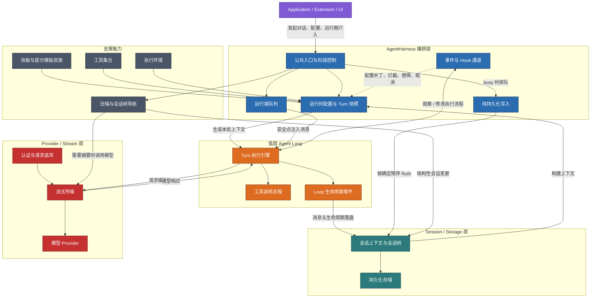

# AgentHarness 架构图

> [!info] 关联文件
> - 源码：[`../src/harness/agent-harness.ts`](../src/harness/agent-harness.ts)
> - 类型：[`../src/harness/types.ts`](../src/harness/types.ts)
> - 生命周期文档：[[agent-harness]]
> - 学习笔记：[[agent-harness-学习笔记]]

## 图 1：AgentHarness 整体架构

## 图 2：AgentHarness 封装 / 分层图（函数与 Type 对照）

```mermaid
flowchart TB
    subgraph L0["L0 外部调用层：应用只接触公共方法和稳定类型"]
        PublicMethods["Public methods<br/>prompt(text, options?)<br/>skill(name, additionalInstructions?)<br/>promptFromTemplate(name, args?)<br/>steer(text) / followUp(text) / nextTurn(text)<br/>appendMessage(message)<br/>compact(customInstructions?)<br/>navigateTree(targetId, options?)<br/>abort() / waitForIdle()"]
        PublicTypes["Types<br/>AgentHarnessOptions<br/>AgentHarnessPromptOptions<br/>AbortResult<br/>NavigateTreeResult<br/>CompactResult<br/>AgentHarnessError / AgentHarnessErrorCode"]
    end

    subgraph L1["L1 状态与快照封装：把最新配置冻结成本轮 turn 的输入"]
        StateFns["Functions<br/>createTurnState()<br/>createContext(turnState, systemPrompt?)<br/>validateToolNames(toolNames, tools?)"]
        StateTypes["Types<br/>AgentHarnessPhase<br/>AgentHarnessTurnState<br/>AgentHarnessResources<br/>Skill / PromptTemplate<br/>AgentHarnessStreamOptions<br/>ThinkingLevel / QueueMode<br/>Model / AgentTool"]
        StateFields["Fields<br/>phase / model / thinkingLevel / systemPrompt<br/>resources / tools / activeToolNames<br/>streamOptions / getApiKeyAndHeaders"]
    end

    subgraph L2["L2 队列与运行期介入封装：busy 状态下的安全输入通道"]
        QueueFns["Functions<br/>createUserMessage(text, images?)<br/>drainQueuedMessages(queue, mode)<br/>emitQueueUpdate()<br/>setSteeringMode(mode) / getSteeringMode()<br/>setFollowUpMode(mode) / getFollowUpMode()"]
        QueueTypes["Types<br/>UserMessage / ImageContent<br/>AgentMessage<br/>QueueMode<br/>QueueUpdateEvent"]
        QueueFields["Fields<br/>steerQueue<br/>followUpQueue<br/>nextTurnQueue<br/>steeringQueueMode<br/>followUpQueueMode"]
    end

    subgraph L3["L3 Hook / Event 封装：所有可观察点和可变更点"]
        EventFns["Functions<br/>subscribe(listener)<br/>on(type, handler)<br/>getHandlers(type)<br/>emitOwn(event, signal?)<br/>emitAny(event, signal?)<br/>emitHook(event)<br/>emitBeforeProviderRequest(model, sessionId, streamOptions)<br/>emitBeforeProviderPayload(model, payload)"]
        EventTypes["Types<br/>AgentHarnessEvent<br/>AgentHarnessOwnEvent<br/>AgentHarnessEventResultMap<br/>BeforeAgentStartResult / ContextResult<br/>BeforeProviderRequestResult / BeforeProviderPayloadResult<br/>ToolCallResult / ToolResultPatch<br/>SessionBeforeCompactResult / SessionBeforeTreeResult"]
        EventFields["Field<br/>handlers: Map&lt;string, Set&lt;AgentHarnessHandler&gt;&gt;"]
    end

    subgraph L4["L4 Loop 适配封装：把 Harness 语义织入 runAgentLoop"]
        LoopFns["Functions<br/>executeTurn(turnState, text, options?)<br/>createLoopConfig(getTurnState, setTurnState)<br/>createStreamFn(getTurnState)<br/>handleAgentEvent(event, signal?)<br/>emitRunFailure(model, error, aborted, signal)<br/>startRunPromise()"]
        LoopTypes["Types<br/>AgentLoopConfig<br/>AgentContext<br/>AgentEvent<br/>AssistantMessage / UserMessage<br/>StreamFn<br/>AgentHarnessStreamOptionsPatch"]
        LoopDeps["Dependencies<br/>runAgentLoop()<br/>convertToLlm()<br/>streamSimple()"]
    end

    subgraph L5["L5 Session / 持久化封装：保证 transcript 与 pending writes 顺序确定"]
        PersistFns["Functions<br/>flushPendingSessionWrites()<br/>session.appendMessage()<br/>session.appendModelChange()<br/>session.appendThinkingLevelChange()<br/>session.appendCustomEntry()<br/>session.appendCustomMessageEntry()<br/>session.appendLabel()<br/>session.appendSessionName()<br/>session.getStorage().setLeafId()"]
        PersistTypes["Types<br/>Session<br/>SessionStorage<br/>SessionTreeEntry<br/>PendingSessionWrite<br/>MessageEntry / ModelChangeEntry / ThinkingLevelChangeEntry<br/>CompactionEntry / BranchSummaryEntry / LeafEntry<br/>SessionError"]
        PersistFields["Fields<br/>session<br/>pendingSessionWrites[]"]
    end

    subgraph L6["L6 Provider / Stream 封装：每次请求按快照 + hook + auth 组装"]
        StreamFns["Functions<br/>cloneStreamOptions(streamOptions?)<br/>mergeHeaders(...headers)<br/>applyStreamOptionsPatch(base, patch)<br/>getApiKeyAndHeaders(model)<br/>streamSimple(model, context, options)"]
        StreamTypes["Types<br/>AgentHarnessStreamOptions<br/>AgentHarnessStreamOptionsPatch<br/>SimpleStreamOptions<br/>Transport<br/>Model<br/>BeforeProviderRequestEvent<br/>BeforeProviderPayloadEvent<br/>AfterProviderResponseEvent"]
    end

    subgraph L7["L7 结构性操作封装：只允许 idle 执行的会话树变更"]
        StructFns["Functions<br/>compact(customInstructions?)<br/>navigateTree(targetId, options?)<br/>prepareCompaction(entries, settings)<br/>compact(preparation, model, apiKey, headers, ...)<br/>collectEntriesForBranchSummary(session, oldLeafId, targetId)<br/>generateBranchSummary(entries, options)"]
        StructTypes["Types<br/>CompactionPreparation<br/>CompactionSettings<br/>CompactionEntry<br/>BranchSummaryEntry<br/>TreePreparation<br/>GenerateBranchSummaryOptions<br/>BranchSummaryResult<br/>CompactionError / BranchSummaryError"]
    end

    subgraph L8["L8 底层能力与错误封装：低层 Result，高层 throw"]
        EnvFns["Functions<br/>ok(value) / err(error)<br/>getOrThrow(result)<br/>getOrUndefined(result)<br/>toError(error)<br/>normalizeHarnessError(error, fallbackCode)<br/>normalizeHookError(error)"]
        EnvTypes["Types<br/>Result&lt;TValue, TError&gt;<br/>ExecutionEnv = FileSystem + Shell<br/>FileError / ExecutionError<br/>FileInfo / FileKind<br/>ExecutionEnvExecOptions"]
    end

    PublicMethods --> StateFns
    PublicMethods --> QueueFns
    PublicMethods --> StructFns
    StateFns --> LoopFns
    QueueFns --> LoopFns
    EventFns --> LoopFns
    LoopFns --> PersistFns
    LoopFns --> StreamFns
    StreamFns --> EventFns
    PersistFns --> StateFns
    StructFns --> PersistFns
    StructFns --> StreamFns
    EnvFns --> StateFns
    EnvFns --> PersistFns
    EnvFns --> StructFns

    PublicTypes -.-> PublicMethods
    StateTypes -.-> StateFns
    QueueTypes -.-> QueueFns
    EventTypes -.-> EventFns
    LoopTypes -.-> LoopFns
    PersistTypes -.-> PersistFns
    StreamTypes -.-> StreamFns
    StructTypes -.-> StructFns
    EnvTypes -.-> EnvFns

    classDef layer fill:#2b6cb0,color:#fff,stroke:#1a365d;
    classDef types fill:#2c7a7b,color:#fff,stroke:#234e52;
    classDef fields fill:#4a5568,color:#fff,stroke:#1a202c;
    classDef deps fill:#dd6b20,color:#fff,stroke:#7b341e;

    class PublicMethods,StateFns,QueueFns,EventFns,LoopFns,PersistFns,StreamFns,StructFns,EnvFns layer;
    class PublicTypes,StateTypes,QueueTypes,EventTypes,LoopTypes,PersistTypes,StreamTypes,StructTypes,EnvTypes types;
    class StateFields,QueueFields,EventFields,PersistFields fields;
    class LoopDeps deps;
```

> [!tip] 阅读顺序
> 建议先看图 1 理解边界：应用 → Harness → Loop / Session / Provider。再看图 2，从 L0 到 L8 对照源码中的函数和类型，能快速定位每一块的职责。
