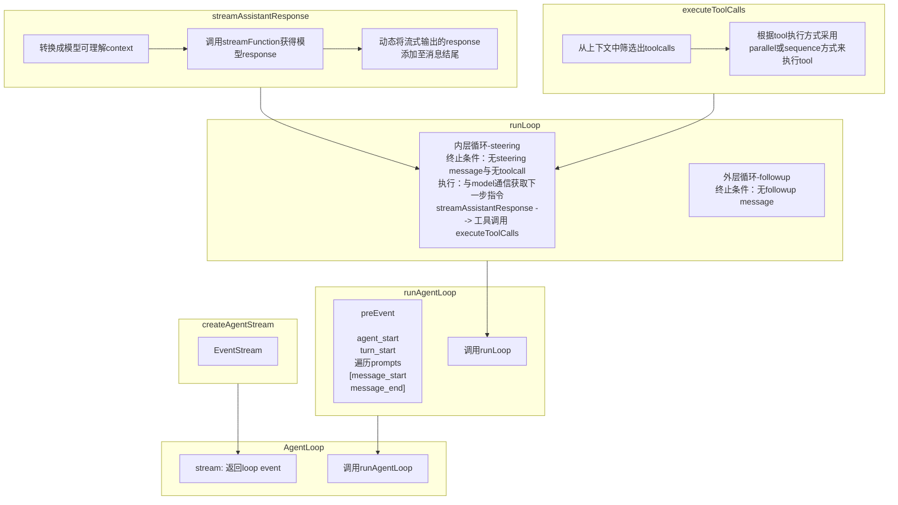
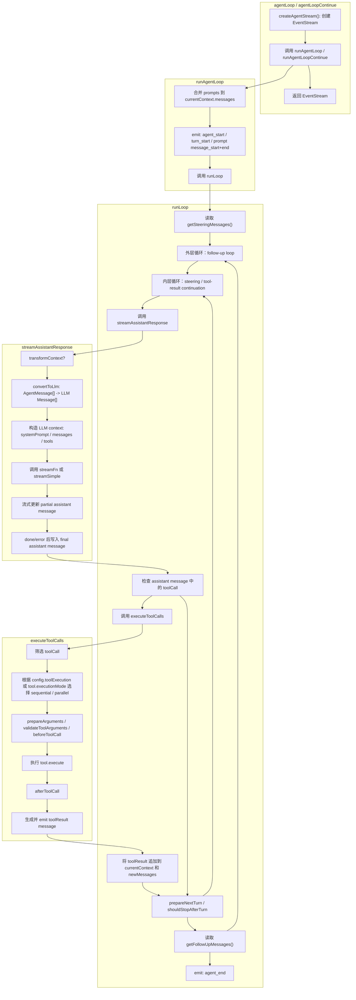
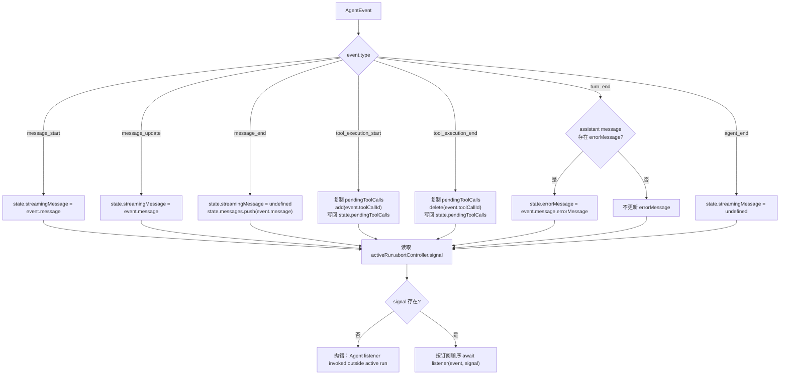
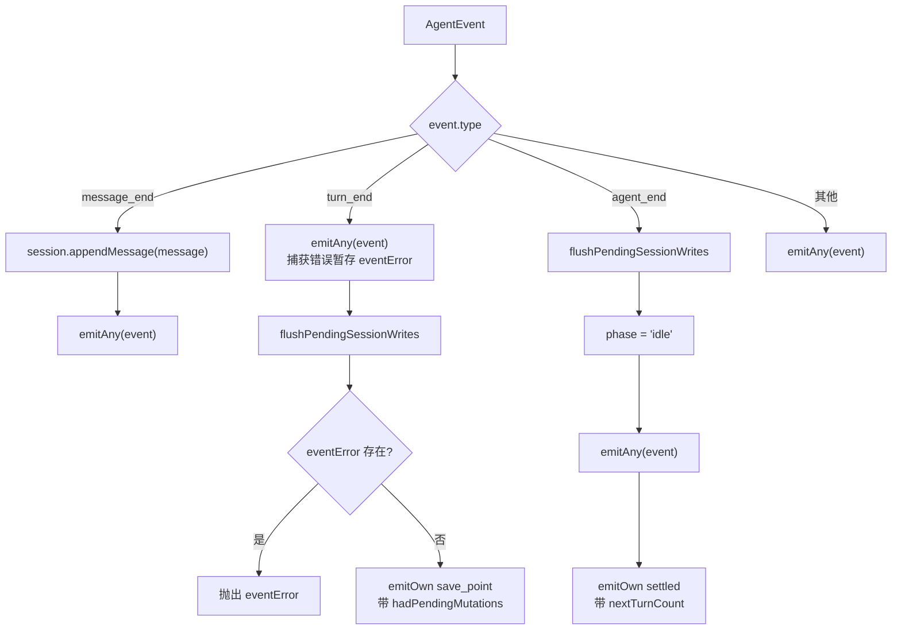

## Agent-Loop
+ 文件定位：agent-loop.ts

## Agent Loop 执行流程

- 文件定位：`packages/agent/src/agent-loop.ts`

## Agent 状态封装与事件处理流程

- 文件定位：`packages/agent/src/agent.ts`

```mermaid
flowchart TD
    subgraph AgentConstructor["Agent constructor"]
        initState["createMutableAgentState(initialState)<br/>初始化 systemPrompt / model / tools / messages"]
        initConvert["设置 convertToLlm<br/>默认 defaultConvertToLlm"]
        initStream["设置 streamFn<br/>默认 streamSimple"]
        initHooks["设置 hooks<br/>getApiKey / beforeToolCall / afterToolCall / prepareNextTurn"]
        initQueues["创建 steeringQueue / followUpQueue"]
        initRuntime["设置 sessionId / thinkingBudgets / transport / toolExecution"]
    end

    subgraph PublicAPI["Agent public API"]
        promptApi["prompt(input, images?)"]
        continueApi["continue()"]
        steerApi["steer(message)"]
        followUpApi["followUp(message)"]
        abortApi["abort()"]
        waitApi["waitForIdle()"]
        subscribeApi["subscribe(listener)"]
        resetApi["reset()"]
    end

    subgraph Queues["PendingMessageQueue"]
        enqueueSteering["steeringQueue.enqueue"]
        enqueueFollowUp["followUpQueue.enqueue"]
        drainSteering["steeringQueue.drain"]
        drainFollowUp["followUpQueue.drain"]
        queueMode["drain 模式<br/>all / one-at-a-time"]
    end

    subgraph PromptFlow["prompt() flow"]
        activeCheckPrompt["检查 activeRun<br/>如果正在运行则抛错"]
        normalizeInput["normalizePromptInput<br/>string -> user message<br/>AgentMessage -> array"]
        runPromptMessages["runPromptMessages(messages)"]
    end

    subgraph ContinueFlow["continue() flow"]
        activeCheckContinue["检查 activeRun"]
        readLastMessage["读取最后一条 state.messages"]
        lastAssistant{"最后一条是 assistant?"}
        useQueuedSteering["drain steeringQueue<br/>作为新 prompt 运行<br/>skipInitialSteeringPoll = true"]
        useQueuedFollowUp["drain followUpQueue<br/>作为新 prompt 运行"]
        runContinuation["runContinuation()"]
        continueError["无可继续消息或 assistant 后无队列<br/>抛错"]
    end

    subgraph Lifecycle["runWithLifecycle"]
        createAbort["创建 AbortController"]
        setActiveRun["设置 activeRun<br/>promise / resolve / abortController"]
        markStreaming["state.isStreaming = true<br/>清空 streamingMessage / errorMessage"]
        executeLoop["执行 executor(signal)"]
        handleFailure["handleRunFailure<br/>生成 error / aborted assistant message"]
        finishRun["finishRun<br/>isStreaming=false<br/>清空 streamingMessage / pendingToolCalls<br/>resolve activeRun.promise<br/>activeRun=undefined"]
    end

    subgraph LoopBridge["Agent -> agent-loop.ts bridge"]
        createContext["createContextSnapshot<br/>复制 systemPrompt / messages / tools"]
        createConfig["createLoopConfig<br/>组装模型参数 / hooks / 队列读取函数"]
        callRunAgentLoop["runAgentLoop(...)"]
        callRunAgentLoopContinue["runAgentLoopContinue(...)"]
        processEventsCallback["event => processEvents(event)"]
    end

    subgraph LoopConfig["createLoopConfig"]
        configModel["model / reasoning / sessionId"]
        configStream["onPayload / onResponse / transport / thinkingBudgets"]
        configTools["toolExecution / beforeToolCall / afterToolCall"]
        configPrepare["prepareNextTurn"]
        configContext["convertToLlm / transformContext / getApiKey"]
        configQueues["getSteeringMessages / getFollowUpMessages"]
    end

    subgraph ProcessEvents["processEvents(event)"]
        reduceState["根据 event.type 更新 _state"]
        awaitListeners["按订阅顺序 await listeners"]
        signalCheck["从 activeRun 读取 signal<br/>没有 activeRun 则抛错"]
    end

    initState --> initConvert
    initConvert --> initStream
    initStream --> initHooks
    initHooks --> initQueues
    initQueues --> initRuntime

    promptApi --> activeCheckPrompt
    activeCheckPrompt --> normalizeInput
    normalizeInput --> runPromptMessages

    continueApi --> activeCheckContinue
    activeCheckContinue --> readLastMessage
    readLastMessage --> lastAssistant
    lastAssistant -->|是| drainSteering
    drainSteering --> useQueuedSteering
    drainSteering -->|无 steering| drainFollowUp
    drainFollowUp --> useQueuedFollowUp
    drainFollowUp -->|无 follow-up| continueError
    lastAssistant -->|否| runContinuation

    steerApi --> enqueueSteering
    followUpApi --> enqueueFollowUp
    enqueueSteering --> queueMode
    enqueueFollowUp --> queueMode

    runPromptMessages --> createAbort
    runContinuation --> createAbort
    createAbort --> setActiveRun
    setActiveRun --> markStreaming
    markStreaming --> executeLoop
    executeLoop --> createContext
    executeLoop --> createConfig

    createConfig --> configModel
    createConfig --> configStream
    createConfig --> configTools
    createConfig --> configPrepare
    createConfig --> configContext
    createConfig --> configQueues

    configQueues --> drainSteering
    configQueues --> drainFollowUp

    createContext --> callRunAgentLoop
    createConfig --> callRunAgentLoop
    processEventsCallback --> callRunAgentLoop

    createContext --> callRunAgentLoopContinue
    createConfig --> callRunAgentLoopContinue
    processEventsCallback --> callRunAgentLoopContinue

    runPromptMessages --> callRunAgentLoop
    runContinuation --> callRunAgentLoopContinue

    callRunAgentLoop --> processEventsCallback
    callRunAgentLoopContinue --> processEventsCallback
    processEventsCallback --> reduceState
    reduceState --> signalCheck
    signalCheck --> awaitListeners

    executeLoop -->|throw| handleFailure
    handleFailure --> reduceState
    executeLoop --> finishRun
    handleFailure --> finishRun

    abortApi --> createAbort
    waitApi --> setActiveRun
    subscribeApi --> awaitListeners
    resetApi --> initState
```

## processEvents 状态归约流程

## AgentHarness 执行流程

- 文件定位：`packages/agent/src/harness/agent-harness.ts`

```mermaid
flowchart TD
    subgraph PublicAPI["AgentHarness public API"]
        promptApi["prompt(text, images?)"]
        skillApi["skill(name, ...)"]
        templateApi["promptFromTemplate(name, args)"]
        steerApi["steer(text)"]
        followUpApi["followUp(text)"]
        nextTurnApi["nextTurn(text)"]
        compactApi["compact(...)"]
        navigateApi["navigateTree(targetId, ...)"]
        abortApi["abort()"]
        subscribeApi["subscribe(listener)"]
        onApi["on(type, handler)"]
    end

    subgraph PhaseGuard["phase 守卫"]
        checkIdle["phase !== 'idle' 抛 busy"]
        setTurn["phase = 'turn'"]
        startRun["startRunPromise(): 创建 runPromise"]
    end

    subgraph TurnSetup["executeTurn 前置"]
        createTurnState["createTurnState<br/>session.buildContext<br/>解析 systemPrompt / activeTools / resources"]
        buildUserMsg["createUserMessage(text, images)"]
        drainNextTurn["合并 nextTurnQueue"]
        beforeHook["emitHook: before_agent_start<br/>可注入 messages / systemPrompt"]
    end

    subgraph LoopBridge["executeTurn -> runAgentLoop"]
        createContext["createContext<br/>systemPrompt / messages / activeTools"]
        createLoopConfig["createLoopConfig"]
        createStreamFn["createStreamFn"]
        handleEventCb["event => handleAgentEvent(event, signal)"]
        callRunAgentLoop["runAgentLoop(...)"]
        pickAssistant["从 newMessages 取最后一条 assistant"]
        runFailure["emitRunFailure<br/>构造 error/aborted 消息"]
    end

    subgraph LoopConfig["createLoopConfig 注入的 hook"]
        cfgConvert["convertToLlm"]
        cfgContext["transformContext -> emitHook context"]
        cfgBefore["beforeToolCall -> emitHook tool_call"]
        cfgAfter["afterToolCall -> emitHook tool_result"]
        cfgPrepare["prepareNextTurn<br/>flushPendingSessionWrites<br/>createTurnState + setTurnState"]
        cfgSteer["getSteeringMessages -> drainQueuedMessages(steerQueue)"]
        cfgFollowUp["getFollowUpMessages -> drainQueuedMessages(followUpQueue)"]
    end

    subgraph StreamFn["createStreamFn"]
        getAuth["getApiKeyAndHeaders(model)"]
        mergeHeaders["mergeHeaders(turnState + auth)"]
        beforeReq["emitBeforeProviderRequest -> before_provider_request hook"]
        callStreamSimple["streamSimple(model, context, options)"]
        onPayload["onPayload -> emitBeforeProviderPayload"]
        onResponse["onResponse -> emitOwn after_provider_response"]
    end

    subgraph EventHandling["handleAgentEvent(event)"]
        evMessageEnd["message_end<br/>session.appendMessage + emitAny"]
        evTurnEnd["turn_end<br/>emitAny + flushPendingSessionWrites + emitOwn save_point"]
        evAgentEnd["agent_end<br/>flushPendingSessionWrites<br/>phase='idle' + emitAny + emitOwn settled"]
        evOther["其他事件 -> emitAny"]
    end

    subgraph EventDispatch["事件分发"]
        emitOwn["emitOwn / emitAny<br/>广播给 subscribe('*') 监听器"]
        emitHook["emitHook<br/>调用 on(type) 注册的处理器<br/>返回值可修改流程"]
    end

    subgraph Queues["队列与状态"]
        steerQueue["steerQueue"]
        followUpQueue["followUpQueue"]
        nextTurnQueue["nextTurnQueue"]
        pendingWrites["pendingSessionWrites"]
        emitQueueUpdate["emitQueueUpdate -> queue_update"]
    end

    promptApi --> checkIdle
    skillApi --> checkIdle
    templateApi --> checkIdle
    checkIdle --> setTurn
    setTurn --> startRun
    startRun --> createTurnState

    createTurnState --> buildUserMsg
    buildUserMsg --> drainNextTurn
    drainNextTurn --> beforeHook
    beforeHook --> createContext

    createContext --> callRunAgentLoop
    createLoopConfig --> callRunAgentLoop
    createStreamFn --> callRunAgentLoop
    handleEventCb --> callRunAgentLoop

    createLoopConfig --> cfgConvert
    createLoopConfig --> cfgContext
    createLoopConfig --> cfgBefore
    createLoopConfig --> cfgAfter
    createLoopConfig --> cfgPrepare
    createLoopConfig --> cfgSteer
    createLoopConfig --> cfgFollowUp

    cfgContext --> emitHook
    cfgBefore --> emitHook
    cfgAfter --> emitHook
    cfgPrepare --> pendingWrites
    cfgSteer --> steerQueue
    cfgFollowUp --> followUpQueue

    createStreamFn --> getAuth
    getAuth --> mergeHeaders
    mergeHeaders --> beforeReq
    beforeReq --> callStreamSimple
    callStreamSimple --> onPayload
    callStreamSimple --> onResponse
    onPayload --> emitHook
    onResponse --> emitOwn
    beforeReq --> emitHook

    callRunAgentLoop --> handleEventCb
    handleEventCb --> evMessageEnd
    handleEventCb --> evTurnEnd
    handleEventCb --> evAgentEnd
    handleEventCb --> evOther

    evMessageEnd --> emitOwn
    evTurnEnd --> emitOwn
    evTurnEnd --> pendingWrites
    evAgentEnd --> pendingWrites
    evAgentEnd --> emitOwn
    evOther --> emitOwn

    callRunAgentLoop --> pickAssistant
    callRunAgentLoop -->|throw| runFailure
    runFailure --> handleEventCb

    steerApi --> steerQueue
    followUpApi --> followUpQueue
    nextTurnApi --> nextTurnQueue
    steerQueue --> emitQueueUpdate
    followUpQueue --> emitQueueUpdate
    nextTurnQueue --> emitQueueUpdate

    compactApi --> emitHook
    navigateApi --> emitHook
    abortApi --> emitOwn
    subscribeApi --> emitOwn
    onApi --> emitHook
```

## handleAgentEvent 事件分流

