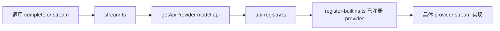

# 教程 01：整体架构与主调用链

这一章只做一件事：回答“用户调用 `complete()` 之后，代码到底怎么走”。先把主链路搞清楚，再看细节，不然很容易迷失在某个 provider 文件里。

## 先建立整体心智模型

`packages/ai` 的核心不是某个单独的 SDK 封装，而是一个统一分发框架。它把不同厂商的模型能力压缩成一套稳定的调用面。

最值得先记住的 4 个角色：

1. `index.ts` 是对外导出层。
2. `stream.ts` 是统一入口层。
3. `api-registry.ts` 是按 `api` 分发的注册表。
4. `providers/register-builtins.ts` 是内置 provider 的装配与懒加载层。

## 推荐阅读文件

按这个顺序读：

1. `packages/ai/src/index.ts`
2. `packages/ai/src/stream.ts`
3. `packages/ai/src/api-registry.ts`
4. `packages/ai/src/providers/register-builtins.ts`

## 主调用链怎么走

你可以把主链路理解成下面 4 步：

1. 调用方先拿到一个 `Model`。
2. `stream()` 或 `complete()` 根据 `model.api` 查找对应 API provider。
3. registry 返回对应的 `stream` / `streamSimple` 实现。
4. 真正的 provider 实现再把上游 SDK 或 HTTP 流转换成统一事件流。

对应结构如下：

## 为什么 `complete()` 很重要但并不复杂

`complete()` 的职责其实很轻。它不是另一套独立机制，而是对 `stream()` 的包装：

1. 先拿到统一的 `AssistantMessageEventStream`。
2. 再等待这个流结束。
3. 最终返回 `AssistantMessage`。

也就是说，这个包真正的核心接口其实是流式协议。`complete()` 只是把“事件过程”压成了“最终结果”。

## 为什么这里按 `api` 分发，而不是按 `provider` 分发

这是整套设计里最关键的一个判断。

- `provider` 更接近用户认知，比如 `openai`、`anthropic`、`google`。
- `api` 更接近真正的协议和实现边界，比如 `openai-responses`、`anthropic-messages`、`google-generative-ai`。

同一个 provider 可能暴露多套 API 风格，同一种 API 风格也可能被不同 provider 复用。真正决定“怎么请求、怎么解析、怎么产出事件”的，是 `api`，不是用户看到的品牌名。

## `api-registry.ts` 在架构中的职责

这个文件只做注册、包装和查找，不负责业务细节。

重点看这些点：

1. 它把 provider 能力统一成 `ApiProvider` 结构。
2. 它会在注册时校验 `model.api` 与 provider 的 `api` 是否匹配。
3. 它通过 Map 按字符串键维护注册表。
4. 它提供清理、反注册等辅助能力，便于测试和扩展。

这里的关键不是逻辑复杂，而是边界划分干净。主链路的可扩展性主要靠它保证。

## `register-builtins.ts` 为什么要懒加载

第一次读到这里时，建议不要把懒加载当成小优化。它是架构层面的运行时隔离策略。

它主要解决三类问题：

1. 减少初始加载成本，不必一启动就装入所有 provider 依赖。
2. 避免 Node-only provider 污染浏览器打包结果。
3. 让不同 provider 的 SDK 依赖和运行时限制彼此隔离。

例如 Bedrock 明显更偏 Node 运行时，而某些通用 provider 可能需要兼容浏览器。懒加载把这些差异从主入口上隔离开了。

## 这一章读完后你应该回答的问题

1. `index.ts`、`stream.ts`、`api-registry.ts`、`register-builtins.ts` 各自负责什么。
2. 为什么 `complete()` 本质上依赖 `stream()`。
3. 为什么分发键是 `model.api`。
4. 为什么内置 provider 不直接全量静态 import。

## 建议的动手练习

你可以自己画一张调用链图，只标 6 个节点：

1. `getModel()`
2. `stream()`
3. `getApiProvider()`
4. `registerBuiltInApiProviders()`
5. 某个具体 provider 的 `streamXxx()`
6. 最终 `AssistantMessage`

如果这张图你能不用看代码就讲清楚，后面再读类型系统和 provider 适配会轻松很多。