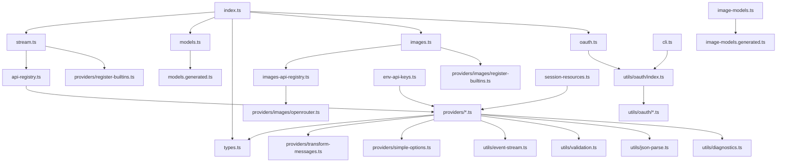
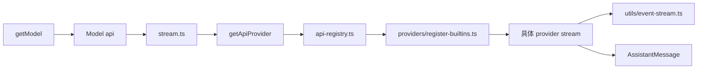
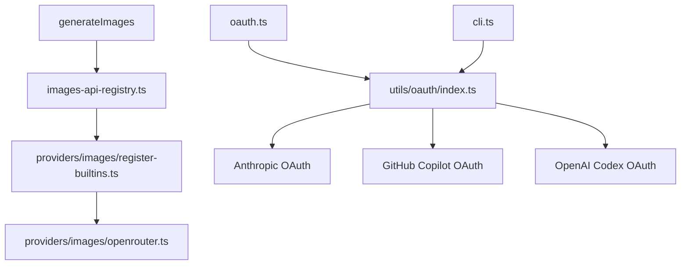

# packages/ai 文件作用与关系图

这份文档的目标不是替代前面的教程，而是给你一张“源码地图”：

1. `packages/ai/src` 下每个文件主要做什么。
2. 它和哪些文件构成直接关系。
3. 哪些文件是主干，哪些是适配层，哪些是辅助层。
4. 几段最关键的源码片段到底在表达什么。

如果你已经读过前面的教程，这一篇适合当作索引和回查手册。如果你还没开始读源码，也可以先看这一篇建立全局地图。

## 1. 总体关系图

先看全局，再看单文件。



可以把 `packages/ai/src` 理解成 6 个区域：

1. 对外入口：`index.ts`
2. 文本主链路：`stream.ts`、`api-registry.ts`、`providers/register-builtins.ts`
3. 模型目录：`models.ts`、`models.generated.ts`、`image-models.ts`、`image-models.generated.ts`
4. 图片链路：`images.ts`、`images-api-registry.ts`、`providers/images/*`
5. 认证与运行时：`env-api-keys.ts`、`oauth.ts`、`utils/oauth/*`、`cli.ts`
6. 通用辅助：`types.ts`、`utils/*`、`providers/*-shared.ts`、`transform-messages.ts`

## 2. 顶层文件地图

### `index.ts`

作用：整个包的公共出口，把类型、主链路、模型目录、OAuth 和辅助工具统一导出。

直接关系：

1. 导出 `stream.ts`、`models.ts`、`images.ts`、`types.ts`
2. 透出各 provider 的 options 类型
3. 透出 `providers/register-builtins.ts` 和 `providers/images/register-builtins.ts`

阅读意义：这是“这个包打算让外部看到什么”的最佳入口。

### `stream.ts`

作用：文本生成的统一入口，负责根据 `model.api` 找 provider，并调用 `stream` / `complete` / `streamSimple` / `completeSimple`。

直接关系：

1. 依赖 `api-registry.ts` 查 provider
2. 通过副作用 import `providers/register-builtins.ts`，确保内置 provider 在模块加载时完成注册
3. 依赖 `types.ts` 中的 `Model`、`Context`、`AssistantMessageEventStream`

### `api-registry.ts`

作用：文本 provider 注册表。把每个 provider 统一包装成同一接口，并按 `api` 存取。

直接关系：

1. 被 `stream.ts` 调用
2. 被 `providers/register-builtins.ts` 填充
3. 被 `providers/faux.ts` 用于测试型 provider 注册

### `models.ts`

作用：从 `models.generated.ts` 初始化模型目录，并提供查询、计费、thinking level 兼容能力。

直接关系：

1. 依赖 `models.generated.ts`
2. 为外部调用者和 provider 侧提供统一 `Model`
3. 被 `openai-responses-shared.ts` 等文件用于 `calculateCost`

### `models.generated.ts`

作用：文本模型元数据快照，主要是数据文件，不是手写业务逻辑。

直接关系：

1. 被 `models.ts` 消费
2. 由 `scripts/generate-models.ts` 生成

### `images.ts`

作用：图片生成统一入口，相当于文本侧 `stream.ts` 的图片版本。

直接关系：

1. 依赖 `images-api-registry.ts`
2. 通过副作用 import `providers/images/register-builtins.ts` 注册图片 provider

### `images-api-registry.ts`

作用：图片 provider 注册表，和 `api-registry.ts` 的结构基本平行。

### `image-models.ts`

作用：图片模型目录，和 `models.ts` 平行，负责 `getImageModel()`、`getImageModels()`、`getImageProviders()`。

### `image-models.generated.ts`

作用：图片模型元数据快照。

### `env-api-keys.ts`

作用：环境变量和运行时认证探测层。除了普通 API key，还处理 Vertex ADC、Bedrock 多来源凭据、Bun 特殊环境变量回退。

直接关系：

1. 被主链路导出
2. 供 provider 或上层宿主查询认证可用性
3. 与 OAuth 路径平行，不直接取代 OAuth

### `oauth.ts`

作用：OAuth 入口转发层，简单地把实现暴露为 `./utils/oauth/index.ts` 的公共出口。

### `session-resources.ts`

作用：会话级资源清理注册表，用于清理 session 绑定的 socket、缓存或 provider 资源。

### `cli.ts`

作用：这个包自带的命令行入口，主要用来触发 OAuth 登录和凭据保存。

### `types.ts`

作用：全包最核心的公共协议文件。定义：

1. `Api` / `Provider`
2. `Model` / `ImagesModel`
3. `Context` / `ImagesContext`
4. `Message` / `AssistantMessage`
5. `ToolCall`
6. `StreamOptions` / `SimpleStreamOptions`
7. `Usage` / `StopReason`

### `bedrock-provider.ts`

作用：一个非常薄的桥接文件，单纯把 `amazon-bedrock.ts` 中的 `streamBedrock` / `streamSimpleBedrock` 打包成模块对象。

它更像一个对外兼容入口，而不是独立业务层。

## 3. `providers/` 目录文件地图

这一层可以分成 4 类：真实 provider、provider 共享 helper、测试/适配辅助、图片 provider。

### 3.1 文本 provider 实现文件

#### `providers/anthropic.ts`

作用：Anthropic Messages API 适配器，处理 thinking、tool use、streaming 和 Anthropic 特有选项。

#### `providers/azure-openai-responses.ts`

作用：Azure OpenAI Responses API 适配器，本质是 OpenAI Responses 协议在 Azure 上的落地层。

#### `providers/google.ts`

作用：Google Generative AI 适配器，依赖 `google-shared.ts` 处理消息和工具映射。

#### `providers/google-vertex.ts`

作用：Vertex AI 版 Google 适配器，和 `google.ts` 共享一部分协议处理，但认证与 endpoint 语义不同。

#### `providers/mistral.ts`

作用：Mistral Conversations API 适配器。

#### `providers/openai-completions.ts`

作用：OpenAI Chat Completions 风格适配器，内部还承担一部分 message 转换逻辑。

#### `providers/openai-responses.ts`

作用：OpenAI Responses API 适配器，很多核心转换逻辑下沉到 `openai-responses-shared.ts`。

#### `providers/openai-codex-responses.ts`

作用：OpenAI Codex / ChatGPT OAuth 相关的 Responses 适配器，额外处理 websocket、debug stats、session 清理等能力。

#### `providers/amazon-bedrock.ts`

作用：Amazon Bedrock Converse Stream 适配器，偏 Node 运行时，和 `bedrock-provider.ts`、`register-builtins.ts` 的 Node-only lazy import 配合使用。

### 3.2 provider 共享辅助文件

#### `providers/register-builtins.ts`

作用：文本 provider 的总装配文件。负责懒加载每个 provider 模块，生成 lazy stream，并把它们注册到 `api-registry.ts`。

#### `providers/simple-options.ts`

作用：把 `SimpleStreamOptions` 压到 provider 可消费的基础选项，处理 reasoning、max tokens 等统一入口。

#### `providers/transform-messages.ts`

作用：跨 provider 的消息归一化层，负责：

1. 非视觉模型的图片降级
2. cross-provider tool call id 归一化
3. orphaned tool call 的 synthetic tool result 补齐
4. cross-model thinking 内容裁剪

这是 provider 共享逻辑中最关键的一个文件。

#### `providers/google-shared.ts`

作用：Google 系列 provider 的共享协议层，处理 message/tool/stop reason/thinking signature 映射。

#### `providers/openai-responses-shared.ts`

作用：OpenAI Responses 协议族共享逻辑，负责消息转换、工具转换、stream 处理、usage/cost 归并。

#### `providers/openai-prompt-cache.ts`

作用：OpenAI prompt cache key 的约束和裁剪。

#### `providers/github-copilot-headers.ts`

作用：为 GitHub Copilot 相关请求推断动态 headers，比如 initiator 和视觉输入标记。

#### `providers/cloudflare.ts`

作用：Cloudflare base URL 规则和变量替换工具，不是独立 provider 本体。

### 3.3 测试与注入辅助

#### `providers/faux.ts`

作用：测试型假 provider。能快速构造 message、thinking、tool call，以及注册一个可控的 faux provider，供测试和 harness 使用。

### 3.4 图片 provider 文件

#### `providers/images/register-builtins.ts`

作用：图片 provider 的总装配文件，目前负责 OpenRouter 图片能力的懒加载与注册。

#### `providers/images/openrouter.ts`

作用：OpenRouter 图片生成的具体实现。

## 4. `utils/` 目录文件地图

### `utils/event-stream.ts`

作用：统一事件流容器，是文本 provider 输出的公共承载物。`AssistantMessageEventStream` 把异步事件和最终 `AssistantMessage` 结果统一起来。

### `utils/diagnostics.ts`

作用：错误和诊断辅助，把运行时错误编码进 assistant message diagnostics，而不只是抛异常。

### `utils/json-parse.ts`

作用：JSON 修复与流式 JSON 解析，常用于工具调用参数的 partial JSON 流处理。

### `utils/validation.ts`

作用：工具调用校验，包括 `validateToolCall()` 和 `validateToolArguments()`。

### `utils/overflow.ts`

作用：上下文溢出检测，帮助统一识别 provider 返回的“超上下文窗口”错误模式。

### `utils/typebox-helpers.ts`

作用：TypeBox 便捷封装，最典型的是 `StringEnum()`，用于兼容某些 provider 对 schema 的限制。

### `utils/hash.ts`

作用：短哈希工具，常用于构造长度受限但稳定的 id。

### `utils/headers.ts`

作用：把 `Headers` 对象转成普通记录对象。

### `utils/sanitize-unicode.ts`

作用：Unicode 清洗，重点处理 surrogate 等兼容性问题。

### `utils/node-http-proxy.ts`

作用：Node 侧代理解析与代理 agent 创建工具。

## 5. `utils/oauth/` 目录文件地图

### `utils/oauth/index.ts`

作用：OAuth 总入口和 provider registry。内置 Anthropic、GitHub Copilot、OpenAI Codex 三套 OAuth provider，并提供 refresh/getApiKey 等高层 API。

### `utils/oauth/types.ts`

作用：OAuth 公共类型定义，包括 credentials、prompt、provider interface、device code info。

### `utils/oauth/device-code.ts`

作用：设备码轮询流程封装。

### `utils/oauth/pkce.ts`

作用：生成 PKCE verifier/challenge。

### `utils/oauth/oauth-page.ts`

作用：生成 OAuth 成功/失败回调页面的 HTML。

### `utils/oauth/anthropic.ts`

作用：Anthropic OAuth 登录和 refresh 实现。

### `utils/oauth/github-copilot.ts`

作用：GitHub Copilot OAuth 登录、refresh、企业域名处理和 base URL 推断。

### `utils/oauth/openai-codex.ts`

作用：OpenAI Codex / ChatGPT OAuth 登录与 refresh 实现。

## 6. 两张关键关系图

### 6.1 文本主链路



### 6.2 图片与 OAuth 支线



## 7. 关键源码片段解释

下面这几段源码很值得精读，因为它们分别代表了主链路最核心的设计判断。

### 片段 1：`stream.ts` 只是统一分发入口

```ts
export function stream<TApi extends Api>(
	model: Model<TApi>,
	context: Context,
	options?: ProviderStreamOptions,
): AssistantMessageEventStream {
	const provider = resolveApiProvider(model.api);
	return provider.stream(model, context, options as StreamOptions);
}

export async function complete<TApi extends Api>(
	model: Model<TApi>,
	context: Context,
	options?: ProviderStreamOptions,
): Promise<AssistantMessage> {
	const s = stream(model, context, options);
	return s.result();
}
```

这段代码说明两件事：

1. 真正决定实现分发的是 `model.api`。
2. `complete()` 不是独立机制，只是等待 `stream()` 的最终结果。

也就是说，整个库的核心协议其实是事件流，不是一次性返回值。

### 片段 2：`api-registry.ts` 用包装保证类型和运行时一致

```ts
function wrapStream<TApi extends Api, TOptions extends StreamOptions>(
	api: TApi,
	stream: StreamFunction<TApi, TOptions>,
): ApiStreamFunction {
	return (model, context, options) => {
		if (model.api !== api) {
			throw new Error(`Mismatched api: ${model.api} expected ${api}`);
		}
		return stream(model as Model<TApi>, context, options as TOptions);
	};
}
```

这段的重点不是泛型，而是“注册表在入口处做了一层契约保护”。

含义是：

1. provider 虽然以统一接口存进 Map，但仍保留自己的具体 `api` 约束。
2. 一旦调用时 `model.api` 和 provider 声明不匹配，系统会立即失败，而不是让错误流到更深层。

### 片段 3：`register-builtins.ts` 的懒加载是架构选择

```ts
function createLazyStream<TApi extends Api, TOptions extends StreamOptions, TSimpleOptions extends SimpleStreamOptions>(
	loadModule: () => Promise<LazyProviderModule<TApi, TOptions, TSimpleOptions>>,
): StreamFunction<TApi, TOptions> {
	return (model, context, options) => {
		const outer = new AssistantMessageEventStream();

		loadModule()
			.then((module) => {
				const inner = module.stream(model, context, options);
				forwardStream(outer, inner);
			})
			.catch((error) => {
				const message = createLazyLoadErrorMessage(model, error);
				outer.push({ type: "error", reason: "error", error: message });
				outer.end(message);
			});

		return outer;
	};
}
```

这里表达的是：

1. provider 不必在主入口时全量加载。
2. 懒加载失败也会被编码成统一事件流错误，而不是突然抛出不受控异常。
3. `register-builtins.ts` 不是简单的 import 列表，而是运行时装配层。

### 片段 4：`transform-messages.ts` 在做真正的跨 provider 兼容

```ts
if (msg.role === "toolResult") {
	const normalizedId = toolCallIdMap.get(msg.toolCallId);
	if (normalizedId && normalizedId !== msg.toolCallId) {
		return { ...msg, toolCallId: normalizedId };
	}
	return msg;
}
```

以及：

```ts
if (!existingToolResultIds.has(tc.id)) {
	result.push({
		role: "toolResult",
		toolCallId: tc.id,
		toolName: tc.name,
		content: [{ type: "text", text: "No result provided" }],
		isError: true,
		timestamp: Date.now(),
	} as ToolResultMessage);
}
```

这里非常关键，因为它说明这个库不是把 provider 原样透传，而是在主动修复和归一化会话历史。

它做的事情包括：

1. 归一化跨 provider tool call id。
2. 给 orphaned tool call 自动补 synthetic tool result。
3. 让后续 provider 更容易接受统一上下文。

这正是“适配层”真正的价值所在。

### 片段 5：`event-stream.ts` 把“边流边读”和“最终结果”统一起来

```ts
export class AssistantMessageEventStream extends EventStream<AssistantMessageEvent, AssistantMessage> {
	constructor() {
		super(
			(event) => event.type === "done" || event.type === "error",
			(event) => {
				if (event.type === "done") {
					return event.message;
				} else if (event.type === "error") {
					return event.error;
				}
				throw new Error("Unexpected event type for final result");
			},
		);
	}
}
```

这里把两个使用方式合并到同一容器里：

1. 你可以 `for await` 逐条消费事件。
2. 你也可以直接 `result()` 拿最终 `AssistantMessage`。

这也是为什么 `stream()` 和 `complete()` 能共用同一条内部链路。

### 片段 6：`env-api-keys.ts` 不只是读环境变量

```ts
if (provider === "google-vertex") {
	const hasCredentials = hasVertexAdcCredentials();
	const hasProject = !!(
		process.env.GOOGLE_CLOUD_PROJECT ||
		process.env.GCLOUD_PROJECT ||
		getProcEnv("GOOGLE_CLOUD_PROJECT") ||
		getProcEnv("GCLOUD_PROJECT")
	);
	const hasLocation = !!(process.env.GOOGLE_CLOUD_LOCATION || getProcEnv("GOOGLE_CLOUD_LOCATION"));

	if (hasCredentials && hasProject && hasLocation) {
		return "<authenticated>";
	}
}
```

这说明它不是单纯把 `OPENAI_API_KEY` 之类读出来，而是在做“认证可用性探测”。

对 Vertex 和 Bedrock 这类 provider，认证不只是一个字符串 key，而是一个运行时条件集合。

## 8. 你可以按什么顺序利用这份文件地图

### 路线 A：从主干入手

1. `index.ts`
2. `stream.ts`
3. `api-registry.ts`
4. `providers/register-builtins.ts`
5. `types.ts`

### 路线 B：从 provider 入手

1. `providers/openai-responses.ts`
2. `providers/openai-responses-shared.ts`
3. `providers/transform-messages.ts`
4. `utils/event-stream.ts`

### 路线 C：从运行时问题入手

1. `env-api-keys.ts`
2. `oauth.ts`
3. `utils/oauth/index.ts`
4. `session-resources.ts`
5. `cli.ts`

## 9. 最后总结

如果只用一句话概括 `packages/ai/src` 的结构：

它的中心不是某个厂商 SDK，而是 `types.ts` + registry + event stream 组成的统一协议层；其余文件都是围绕这层协议做模型目录、provider 翻译、图片支线、认证和运行时兼容。

你在阅读时如果一直把注意力放在“这个文件是在定义协议、做分发、翻译差异，还是补运行时约束”，就不会被目录规模带偏。