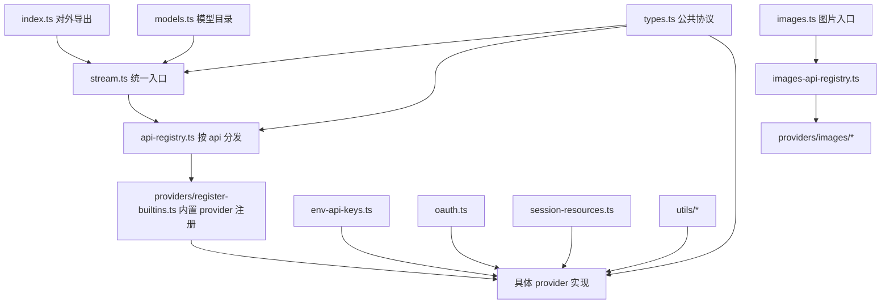

# packages/ai 教程索引

这套教程面向“读源码理解设计”的目标，不是使用手册。建议按顺序阅读，先建立主链路和统一抽象，再进入 provider 细节，最后用测试闭环理解。

## 阅读顺序

1. [01-overview-and-call-flow.md](01-overview-and-call-flow.md)
   先建立整体架构图，搞清楚 `complete()`、`stream()`、registry、lazy load 之间的关系。
2. [02-types-and-event-protocol.md](02-types-and-event-protocol.md)
   理解 `Context`、`Message`、`ToolCall`、事件流协议这些 provider 无关的核心抽象。
3. [03-model-registry-and-generated-data.md](03-model-registry-and-generated-data.md)
   理解模型目录、计费、thinking level，以及 generated 文件在整个系统中的角色。
4. [04-provider-adapter-pattern.md](04-provider-adapter-pattern.md)
   进入 provider 实现，理解不同上游 API 如何被压成统一事件流。
5. [05-images-oauth-and-runtime.md](05-images-oauth-and-runtime.md)
   理解图片生成支线、OAuth、环境变量与运行时兼容层。
6. [06-tests-notes-and-study-plan.md](06-tests-notes-and-study-plan.md)
   用测试文件反推实现，并按 5 天路线安排学习节奏。
7. [07-file-map-and-relationships.md](07-file-map-and-relationships.md)
   按文件整理 `packages/ai/src` 的职责、依赖关系和关键源码片段。

## 先记住 5 层结构

`packages/ai` 的源码大体可以分成 5 层：

1. 类型与统一抽象层：定义模型、消息、流事件、图片生成、OAuth 等公共协议。
2. 注册与分发层：根据 `api` 找到对应 provider，并把统一上下文分发给具体实现。
3. 模型目录层：维护 provider/model 到统一 `Model` 结构的映射，以及计费、thinking level 等模型能力信息。
4. provider 适配层：把 OpenAI、Anthropic、Google、Bedrock 等不同上游 API 统一到同一套流事件协议。
5. 辅助能力层：环境变量解析、会话资源清理、OAuth、工具参数校验、事件流封装、上下文溢出处理等。

## 一张总图

## 这套教程的目标

读完之后，你应该能回答：

1. 用户调用 `complete()` 后，代码是如何分发到具体 provider 的。
2. 为什么这个包的核心价值是统一消息协议和事件流协议，而不是“支持很多厂商”。
3. 一个新的 provider 接入时，最少要补哪些实现。
4. 文本生成、图片生成、OAuth、运行时兼容为什么拆成现在这个结构。
5. 如何从测试文件快速定位一个行为背后的实现。

## 建议用法

如果你是第一次读这部分代码，按章节顺序读。

如果你已经熟悉主链路，只想进入实现，可以直接从 [04-provider-adapter-pattern.md](04-provider-adapter-pattern.md) 开始，再回头补 [02-types-and-event-protocol.md](02-types-and-event-protocol.md)。
