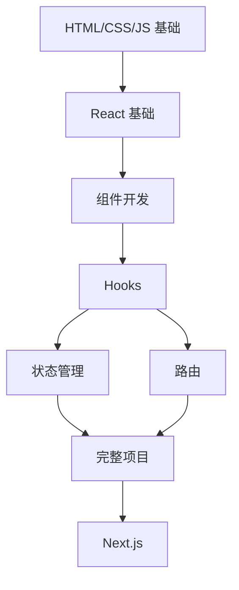

# React MOC

React 前端开发知识索引页面。

## 基础概念 (待创建)

- [[React Introduction]] - React 入门与核心理念
- [[JSX]] - JSX 语法
- [[React Components]] - 组件开发
- [[React Props]] - 属性传递
- [[React State]] - 状态管理基础

## Hooks (待创建)

- [[useState]] - 状态 Hook
- [[useEffect]] - 副作用 Hook
- [[useContext]] - 上下文 Hook
- [[useRef]] - 引用 Hook
- [[useMemo & useCallback]] - 性能优化 Hooks
- [[Custom Hooks]] - 自定义 Hooks

## 状态管理 (待创建)

- [[React Context]] - Context API
- [[Redux]] - Redux 状态管理
- [[Zustand]] - 轻量级状态管理
- [[React Query]] - 服务端状态管理

## 路由 (待创建)

- [[React Router]] - 路由配置与导航

## 样式方案 (待创建)

- [[CSS Modules]] - CSS 模块化
- [[Styled Components]] - CSS-in-JS
- [[Tailwind CSS]] - 原子化 CSS

## 进阶主题 (待创建)

- [[React Performance]] - 性能优化
- [[React Testing]] - 测试策略
- [[Next.js]] - React 全栈框架
- [[React Native]] - 移动端开发

## 学习路线

## 常用资源

- [React 官方文档](https://react.dev)
- [React Router 文档](https://reactrouter.com)
- [Redux 官方文档](https://redux.js.org)
