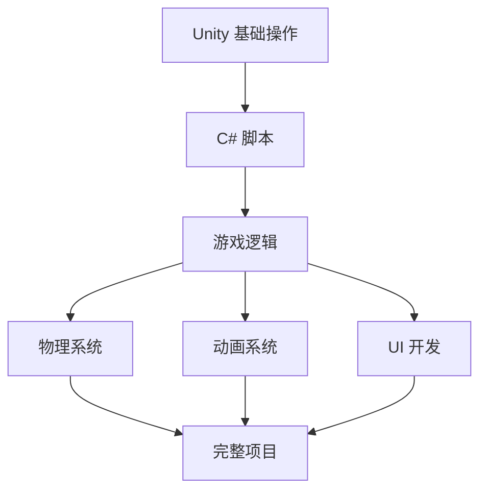

# Unity MOC

Unity 游戏开发知识索引页面。

## 入门基础

- [[Unity 5 简介]] - Unity 5 核心特性与历史背景

## 核心系统 (待创建)

### 渲染与图形
- [[Unity Rendering Pipeline]] - 渲染管线
- [[Unity Shaders]] - 着色器编程
- [[Unity Lighting]] - 光照系统
- [[Unity Post Processing]] - 后期处理

### 游戏逻辑
- [[Unity Scripting]] - C# 脚本基础
- [[Unity Input System]] - 输入系统
- [[Unity Physics]] - 物理引擎
- [[Unity Animation]] - 动画系统

### 音频
- [[Unity Audio System]] - 音频与混音器

### UI 系统
- [[Unity UI]] - UGUI 界面开发
- [[Unity UI Toolkit]] - 新一代 UI 系统

## 进阶主题 (待创建)

- [[Unity Performance Optimization]] - 性能优化
- [[Unity Addressables]] - 资源管理
- [[Unity Multiplayer]] - 网络多人游戏
- [[Unity Mobile Development]] - 移动端开发

## 学习路线

## 常用资源

- [Unity 官方文档](https://docs.unity3d.com)
- [Unity Learn](https://learn.unity.com)
- [Unity Asset Store](https://assetstore.unity.com)
