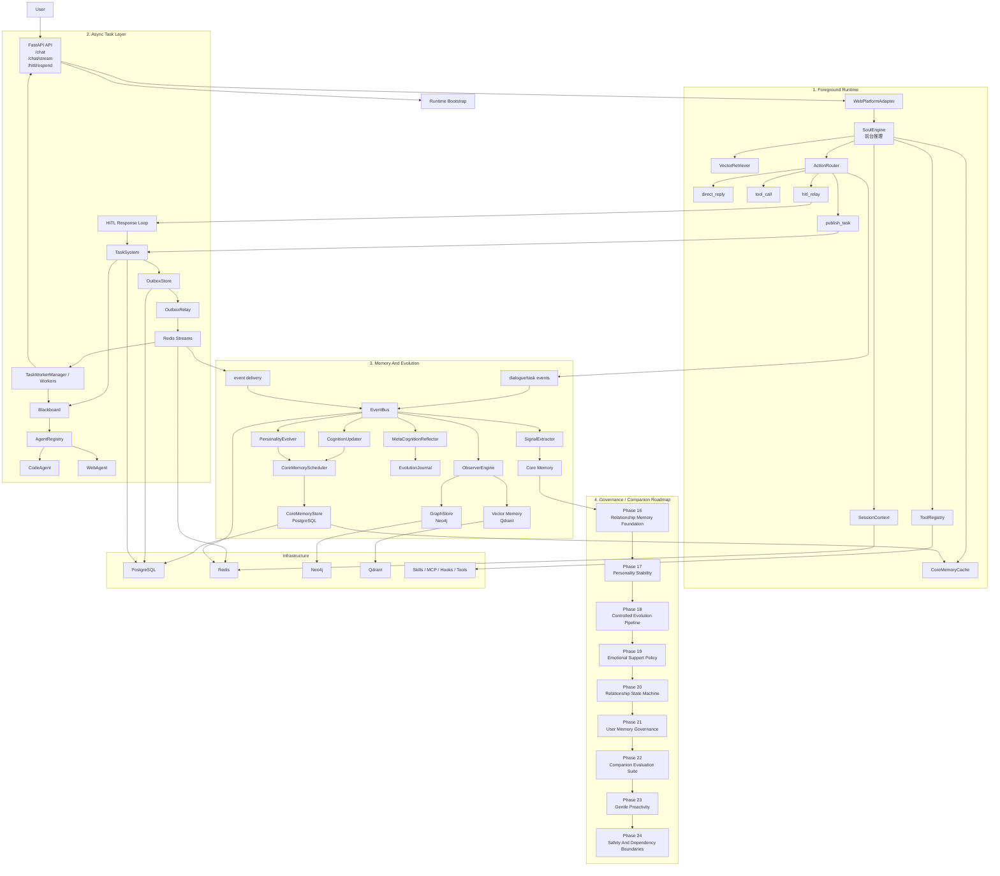

```mermaid
flowchart TB
    U["User"] --> API["FastAPI API\n/chat\n/chat/stream\n/hitl/respond"]
    API --> WP["WebPlatformAdapter"]
    API --> RT["Runtime Bootstrap"]

    subgraph L1["1. Foreground Runtime"]
        WP --> SE["SoulEngine\n前台推理"]
        SE --> CM["CoreMemoryCache"]
        SE --> SC["SessionContext"]
        SE --> VR["VectorRetriever"]
        SE --> TR["ToolRegistry"]
        SE --> AR["ActionRouter"]

        AR --> DR["direct_reply"]
        AR --> TC["tool_call"]
        AR --> PT["publish_task"]
        AR --> HR["hitl_relay"]
    end

    subgraph L2["2. Async Task Layer"]
        PT --> TS["TaskSystem"]
        TS --> BB["Blackboard"]
        BB --> AGR["AgentRegistry"]
        AGR --> CA["CodeAgent"]
        AGR --> WA["WebAgent"]
        TS --> OB["OutboxStore"]
        OB --> OR["OutboxRelay"]
        OR --> RS["Redis Streams"]
        RS --> WM["TaskWorkerManager / Workers"]
        WM --> BB
        WM --> API
        HR --> HITL["HITL Response Loop"]
        HITL --> TS
    end

    subgraph L3["3. Memory And Evolution"]
        AR --> EV1["dialogue/task events"]
        RS --> EV2["event delivery"]

        EV1 --> EB["EventBus"]
        EV2 --> EB

        EB --> SX["SignalExtractor"]
        EB --> OE["ObserverEngine"]
        EB --> MR["MetaCognitionReflector"]
        EB --> CU["CognitionUpdater"]
        EB --> PE["PersonalityEvolver"]

        SX --> CMEM["Core Memory"]
        OE --> GS["GraphStore\nNeo4j"]
        OE --> QD["Vector Memory\nQdrant"]
        MR --> EJ["EvolutionJournal"]
        CU --> CMS["CoreMemoryScheduler"]
        PE --> CMS
        CMS --> CMSTORE["CoreMemoryStore\nPostgreSQL"]
        CMSTORE --> CM
    end

    subgraph L4["4. Governance / Companion Roadmap"]
        CMEM --> RMF["Phase 16\nRelationship Memory Foundation"]
        RMF --> PS["Phase 17\nPersonality Stability"]
        PS --> CEP["Phase 18\nControlled Evolution Pipeline"]
        CEP --> ESP["Phase 19\nEmotional Support Policy"]
        ESP --> RSM["Phase 20\nRelationship State Machine"]
        RSM --> UMG["Phase 21\nUser Memory Governance"]
        UMG --> CES["Phase 22\nCompanion Evaluation Suite"]
        CES --> GP["Phase 23\nGentle Proactivity"]
        GP --> SDB["Phase 24\nSafety And Dependency Boundaries"]
    end

    subgraph Infra["Infrastructure"]
        PG["PostgreSQL"]
        RD["Redis"]
        N4["Neo4j"]
        QR["Qdrant"]
        MCP["Skills / MCP / Hooks / Tools"]
    end

    CMSTORE --> PG
    OB --> PG
    TS --> PG
    SC --> RD
    RS --> RD
    EB --> RD
    GS --> N4
    QD --> QR
    TR --> MCP

```
